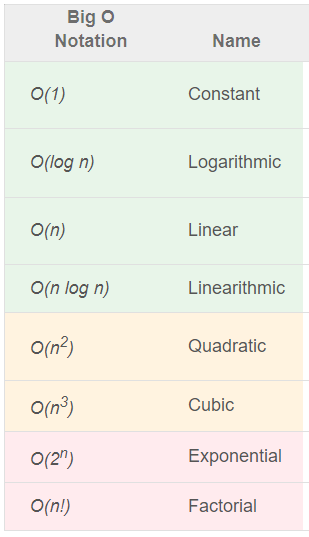
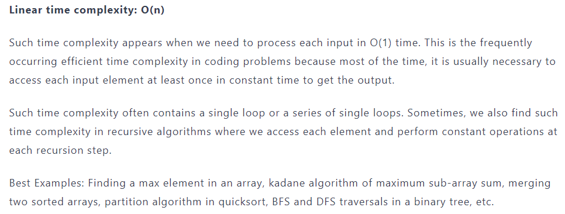

DS&A: Time Complexity - O(n) vs. O(log n)

## What are Data Structures?

-   Data structure is a storage that is used to store and organize data. It is a way of arranging data on a computer so that it can be accessed and updated efficiently.

# What is an Algorithm?

-   In computer programming terms, an algorithm is a set of well-defined instructions to solve a particular problem. It takes a set of input(s) and produces the desired output. For example,

An algorithm to add two numbers:

1.  Take two number inputs
2.  Add numbers using the + operator
3.  Display the result

## Algorithm Analysis

-   Analysis of an algorithm can be performed at two different stages, before implementation and after implementation, as
-   A **priori analysis** − This is defined as theoretical analysis of an algorithm. Efficiency of algorithm is measured by assuming that all factors e.g. speed of processor, are constant and have no effect on implementation.
-   A **posterior analysis** − This is defined as empirical analysis of an algorithm. The chosen algorithm is implemented using programming language. The chosen algorithm is executed on target computer machine. In this analysis, actual statistics like running time and space needed are collected.
-   Algorithm analysis is deals with the execution or running time of various operations involved. Running time of an operation can be defined as number of computer instructions executed per operation.

## Why do we anlyze algorithms?

-   Deciding the efficient algorithm among more than one algorithm.
-   Estimating algorithm performance for different size of the input.
-   Understanding the nature of the code and finding scope for further optimization.

## Algorithm Complexity

-   Suppose X is treated as an algorithm and N is treated as the size of input data, the time and space implemented by the Algorithm X are the two main factors which determine the efficiency of X.
-   Time Factor − The time is calculated or measured by counting the number of key operations such as comparisons in sorting algorithm.
-   Space Factor − The space is calculated or measured by counting the maximum memory space required by the algorithm.
-   The complexity of an algorithm f(N) provides the running time and / or storage space needed by the algorithm with respect of N as the size of input data.

## Space Complexity

-   Space complexity of an algorithm represents the amount of memory space needed the algorithm in its life cycle.
-   Space needed by an algorithm is equal to the sum of the following two components
-   A **fixed part** that is a space required to store certain data and variables (i.e. simple variables and constants, program size etc.), that are not dependent of the size of the problem.
-   A **variable part** is a space required by variables, whose size is totally dependent on the size of the problem. For example, recursion stack space, dynamic memory allocation etc.
-   Space complexity S(p) of any algorithm p is **S(p) = A + Sp(I)**

Where A is treated as the fixed part

S(I) is treated as the variable part of the algorithm which depends on instance characteristic I.

Following is a simple example that tries to explain the concept

**Algorithm**

SUM(P, Q)

Step 1 - START

Step 2 - R ← P + Q + 10

Step 3 - Stop

-   Here we have three variables P, Q and R and one constant. Hence S(p) = 1+3. Now space is dependent on data types of given constant types and variables and it will be multiplied accordingly.

## Time Complexity

-   Time Complexity of an algorithm is the representation of the amount of time required by the algorithm to execute to completion.

## Asymptotic Notations

Asymptotic notations are the mathematical notations used to describe the running time of an algorithm when the input tends towards a particular value or a limiting value.

There are mainly three asymptotic notations:

-   Big-O notation
-   Omega notation
-   Theta notation

## Big-O Notation (O-notation)

Big-O notation represents the upper bound of the running time of an algorithm. Thus, it gives the worst-case complexity of an algorithm.

This time complexity is defined as a function of the input size ‘n’ using Big-O notation. ‘n’ indicates the input size, while O is the worst-case scenario growth rate function.

# 8 time complexities that every programmer should know

**Logarithmic time complexity: O(log n)**

A logarithm is the inverse of exponentiation.for example, logn with base 2 means the number of times n must be divided by 2 to get 1.such time complexity appears when input size decreases by some constant factor ( mostly by half) at each step.in such scenario, the algorithm will execute the O(log n) number of operations for the input size n.

Best examples: Binary search, divide and conquer solutions similar to binary search, Euclid algorithm of finding GCD etc.

To know more information about Big-O notation [clickhere](https://www.enjoyalgorithms.com/blog/time-complexity-analysis-in-data-structure-and-algorithms)

## Omega Notation (Ω-notation)

Omega notation represents the lower bound of the running time of an algorithm. Thus, it provides the best case complexity of an algorithm.

## Theta Notation (Θ-notation)

It represents the upper and the lower bound of the running time of an algorithm, it is used for analyzing the average-case complexity of an algorithm.

References

<https://www.tutorialspoint.com/time-and-space-complexity-in-data-structure>

https://www.enjoyalgorithms.com/blog/time-complexity-analysis-in-data-structure-and-algorithms
