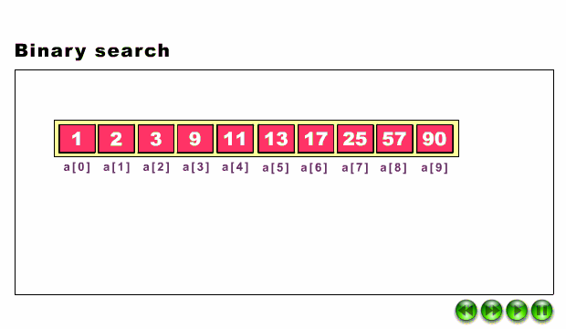
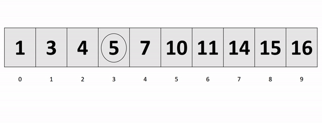

# Binary Search

-   **Binary Search** is a searching algorithm used in a sorted array by **repeatedly dividing the search interval in half** and the key element is searched in the left or right half of the collection depending on whether the key is less than or greater than the mid element of the collection.

Binary search is the most frequently used technique as it is much faster than a linear search.

# Working Binary Search

# Binary Search Algorithm

The basic steps to perform Binary Search are:

-   Begin with the mid element of the whole array as a search key.
-   If the value of the search key is equal to the item then return an index of the search key.
-   Or if the value of the search key is less than the item in the middle of the interval, narrow the interval to the lower half.
-   Otherwise, narrow it to the upper half.
-   Repeatedly check from the second point until the value is found or the interval is empty.

Binary Search Algorithm can be implemented in the following two ways

1.  Iterative Method
2.  Recursive Method

# Iteration Method

binarySearch(arr, x, low, high)

repeat till low = high

mid = (low + high)/2

if (x == arr[mid])

return mid

else if (x \> arr[mid]) // x is on the right side

low = mid + 1

else // x is on the left side

high = mid – 1

**Time Complexity:** O (log n)  
**Auxiliary Space:** O (1)

# Recursive Method (The recursive method follows the divide and conquers approach)

binarySearch(arr, x, low, high)

if low \> high

return False

else

mid = (low + high) / 2

if x == arr[mid]

return mid

else if x \> arr[mid] // x is on the right side

return binarySearch(arr, x, mid + 1, high)

else // x is on the left side

return binarySearch(arr, x, low, mid - 1)

**Time Complexity:** O(log n)  
**Auxiliary Space:** O(log n)

https://www.geeksforgeeks.org/binary-search/
