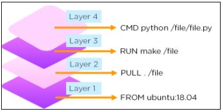
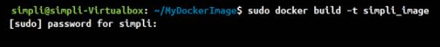

# DockerFile

## Docker Image:

-   A Docker Image is a read-only file with a bunch of instructions.
-   When these instructions are executed, it creates a Docker container.

## Dockerfile:

-   Dockerfile is a simple text file that consists of instructions to build Docker images.

**Syntax**

*\# comments*

*command argument argument1...*

**Example**

*\# Print "Get Certified. Get Ahead"*

*Run echo "Get Certified. Get Ahead"*

Now, let's have a look at how to build a Docker image using a dockerfile.

## List of Docker Commands for Creating a Dockerfile with example

Before we create our first Dockerfile, it is important to understand what makes up the file.

Dockerfile consists of specific [commands](https://www.simplilearn.com/tutorials/docker-tutorial/docker-commands) that guide you on how to build a specific Docker image.

The specific commands you can use in a dockerfile are:

FROM, PULL, RUN, and CMD

-   FROM - Creates a layer from the ubuntu:18.04
-   PULL - Adds files from your Docker repository
-   RUN - Builds your container
-   CMD - Specifies what command to run within the container

Mentioned below is an example of the dockerfile with the important commands

*FROM ubuntu:18.04*

*PULL. /file*

*RUN make /file*

*CMD python /file/file.py*

Have a look at the diagrammatic representation of how a dockerfile looks in a docker image:

Moving forward, let’s go through some of the most common Docker commands used while creating dockerfiles. Along with the syntax, we are explaining the commands with examples, so you can start experimenting with them right away.

-   ENTRYPOINT allows specifying a command along with the parameters

Syntax

*ENTRYPOINT application "arg, arg1".*

Example

*ENTRYPOINT echo "Hello, \$name".*

-   ADD command helps in copying data into a Docker image

Syntax

*ADD /[source]/[destination]*

Example

*ADD /root_folder/test_folder*

-   ENV provides default values for variables that can be accessed within the container

Syntax

*ENV* *key value*

Example

ENV *value_1*

-   MAINTAINER declares the author field of the images

Syntax

*MAINTAINER [name]*

Example

*MAINTAINER author_name*

## How to Build a Docker Image and Docker Container Using Dockerfile?

First of all, you should create a directory in order to store all the Docker images you build.

**Step1:** Now, we will create a directory named ‘simplidocker’ with the command:

*mkdir samplidocker*

**Step2:** Move Docker image into that directory and create a new empty file (Dockerfile) in it:

*cd samplidocker*

*touch Dockerfile*

**Step3:** Open the file with the editor. In this example, we opened the file using vi:

*vi Dockerfile*

**Step 4:** Then, add the following content:

*FROM ubuntu*

*MAINTAINER sampli*

*RUN apt-get update*

*CMD ["echo", "Welcome to Samplilearn"]*

**Step 5:** Save and exit the file.

## Build a Docker Image with Dockerfile

-   Now, let’s build a basic image using a Dockerfile:

*docker build [location of your dockerfile]*

-   Now, by adding -t flag, the new image can be tagged with a name:

*docker build -t sampli_image*

-   Once the Docker image is created, you can verify by executing the command:

*docker images*

The output should show sampli_docker available in the repository.

References

1.  https://www.simplilearn.com/tutorials/docker-tutorial/what-is-dockerfile
