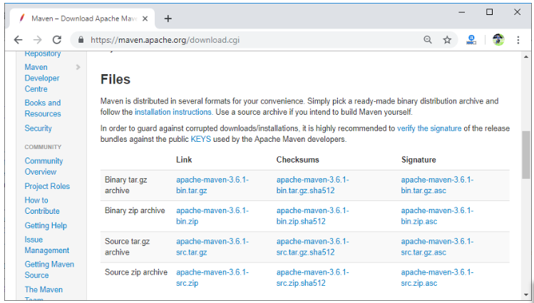
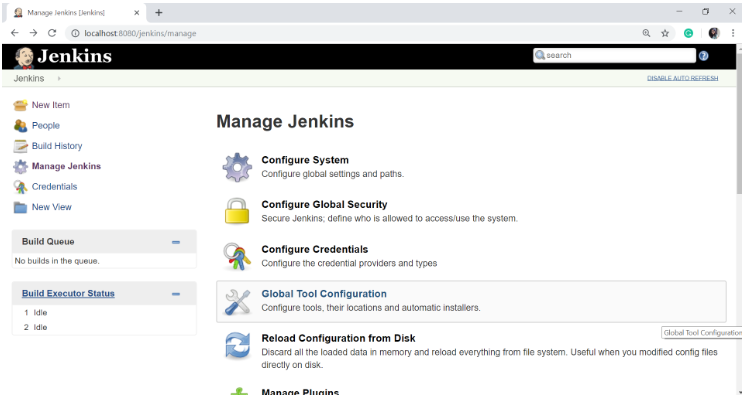
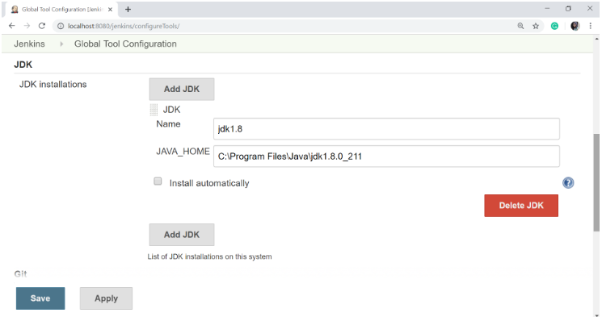
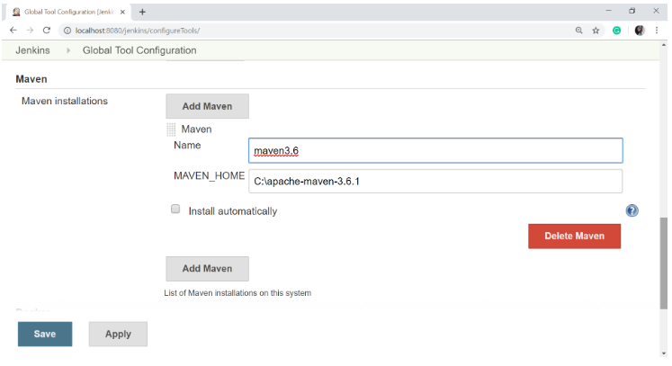
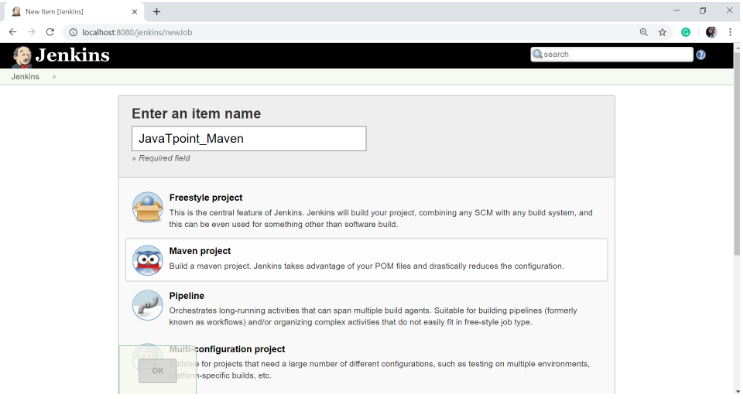
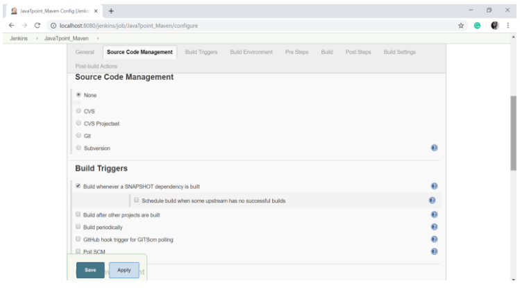
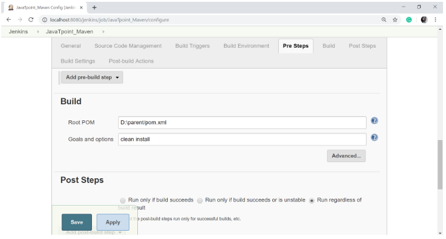

Maven Setup

**Maven** is a powerful project management and comprehension tool that provides complete build life cycle framework to assist developers. It is based on the concept of a POM (Project Object Model) that includes project information and configuration information for Maven such as construction directory, source directory, test source directory, dependency, Goals, plugins etc.

Maven is build automation tool used basically for Java projects, though it can also be used to build and manage projects written in C\#, Scala, Ruby, and other languages. Maven addresses two aspects of building software: 1st it describes how software is build and 2nd it describes its dependencies.

## **Downloading Maven**

The official website for Apache Maven is <https://maven.apache.org/download.cgi>. Click on the given link to download the Maven. When you click on the given link, you will get the home page of the official Maven website as given below:

Go to the files section and download the Maven by the given link for Binary zip archive file.

Once the file is downloaded, extract the file into your system.

## **Setting Up Java and Maven in Jenkins**

-   First of all, you have to set the JAVA_HOME and MAVEN_HOME environment variable in your system.

To set the JAVA_HOME and MAVEN_HOME path, [**click here**](https://www.mkyong.com/maven/how-to-install-maven-in-windows/).

You can verify that the JAVA_HOME environment variable is properly configured or not by using the following command:

Similarly, you can verify that the JAVA_HOME environment variable is properly configured or not by using the following command:

-   Now, in the Jenkins dashboard (Home screen) click on manage Jenkins from the left-hand side menu.

Click on "Global Tool Configuration" option.

To configure Java, click on "**Add JDK**" button in the JDK section.

Give a **Name** and **JAVA_HOME** path, or check on **install automatically** checkbox.

And now, to configure Maven, click on "Add Maven" button in the Maven section, give any **Name** and **MAVEN_HOME** path or check to install automatically checkbox.

Then, click on the "**Save**" button at the end of the screen.

Now, you can create a job with the Maven project. To do that, click on the **New Item** option or **create a new job** option.

Enter the **Item Name** and select the **Maven Project**.

Click OK.

Now configure the job. Give the description and in the **Source Code Management** section, select the required option.

In the Build Triggers section, there are multiple options, select the required one.

Add the pom.xml file's path in the **Root POM** option.

Configure the other fields as per your requirement and then click on the **Save** button.

References

1.  https://www.javatpoint.com/jenkins-maven-setup
