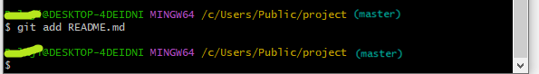
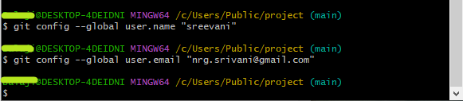

## Git Initializing and Pushing Files Into Remote Repository

## Contents

**1. Initializing a Local and Remote Repository**

1.1 Creating a Remote Repository

1.2 Creating a new local repository using Git Bash command line

**2. Pushing Files into Remote Repository**

## 1. Initializing a Local and Remote Repository

You have two repositories

1.  Local Repository
2.  2\. Remote Repository

## 1.1 Creating a Remote Repository

Follow the steps given below to initialize your remote Repository with Github.

## Step 1:

-   Signin with your GitHub account

****

## Step 2:

-   Make Remote Repository on Github. Top left side ,click on the new button to create remote repo

    ****

## Step 3:

-   Give a suitable name of your repository and click on create repository

****

Note: You can choose to initialize your git repository with a README file, and further, you can mention your project details in it. It helps people know what this repository is about. However, it’s absolutely not necessary. But if you do initialize your remote repo with a README file using interface provided by GitHub, then your local repository won’t have this README file. So add README.md file in local repo

## Step 4:

-   Remote repository looks as shown in below diagram.

****

## 1.2 Creating a new local repository using Git Bash command line

-   They are 2 methods to open git bash for creating local repo

## Method 1:

-   Go to your working directory. Click right-click and choose Git Bash Here option.

****

-   The Git Bash is opened with your current working Directory.

****

## Method 2:

-   Open Git Bash and change the current working directory to your local project by use of cd command.

    **Syntax:** cd \<directory_name\>

    **Output:**

****

**Now run the commands in the following sequence.**

## Step 1:

-   Initialize the local directory as a Git repository in the working directory.

**Syntax:**

git init

**Output:**

****

-   Now go to your working directory, the hidden .git folder can be viewed.

    ****

-   The .git folder contains all information that is necessary for the project and all information relating commits, remote repository address, etc. It also contains a log that stores the commit history. This log can help you to roll back to the desired version of the code.

## Step 2:

****

-   Add an empty README.md file in the working directory because the remote repository has a README.md file

    ****

-   In readme.md add any instructions that you want to share with others. Use Markdown to format headings, lists, links, etc. Here are some guides for the Markdown syntax:

[guides.github.com/features/mastering-markdown](https://guides.github.com/features/mastering-markdown/)

-   When updations done, commit the changes and push them to the remote repo. GitHub will display the nicely formatting ReadMe on the project page for the repo.

## Step 3:

-   Rename the master branch of local repo to main

    **Synatax:**

    git branch -M main

    **Output:**

    ****

## Step 4:

-   By “git status” you can see the staged files.

****

## Step 5:

-   Add all the files of current folder(.) to staging

    **Syntax:**

    git add .

    **Output:**

    ****

## Step 6:

-   commit all the files from staging to local repo with a commit message

**Syntax:**

git commit -m "lambda demo completed"

**output:**

****

## Step 7:

-   Configure local git with user name and email so we will know who pushed the code to github

**Syntax:**

git config --global user.name “[name]”

git config --global user.email “[email address]”

**Output:**

****

## 2. Pushing Local Repository Files into Remote Repository

## Step 8:

-   Specify the remote Github repo to which we would want to push the files

**How to get the Remote repo URL?**

-   Go to your remote repo on Github, Click on code****
-   you will get the remote repo URL

****

Copy the URL and paste in command line

**syntax:**

git remote add origin remote_repo_URL

**Output:**

****

**Step 9:**

-   push the files to the remote repo

**syntax:**

git push --set-upstream origin main

## 

**References:**

[**https://phoenixnap.com/kb/what-is-git-bash**](https://phoenixnap.com/kb/what-is-git-bash)

[**https://dev.classmethod.jp/articles/git-bash-commands/**](https://dev.classmethod.jp/articles/git-bash-commands/)

**https://www.geeksforgeeks.org/working-on-git-bash/**

## 
