## Git Initializing and Pushing Files Into Remote Repository

## Contents

**1. To get Started**

    1.1  How to Open GitBash

    1.2 How to Work with Git Config

**2. Initializing a Local and Remote Repository**

    2.1 Creating a Remote Repository

    2.2 Creating a Local Repository Using Git Bash Command Line

    2.3 Checking the Status of Files

    2.4 Adding Files to Staging Area

    2.5 Committing Files to Local Repository

**3. Pushing Files from Local Repository into Remote Repository**

**4. Pulling Files from Remote Repository to Local Repository**

## 1.To get Started

## 1.1 How to Open GitBash

-   They are 2 methods to open git bash

**Method 1:**

-   Go to your working directory. Right-click and choose Git Bash Here option.

**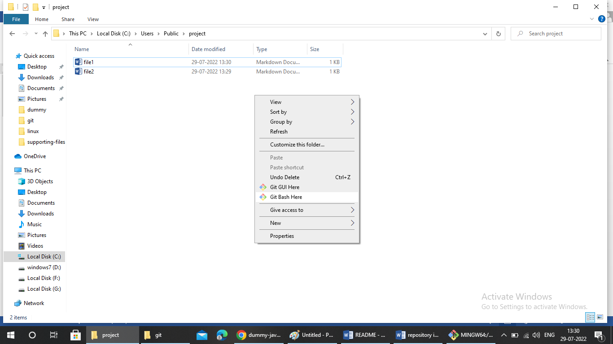**

-   The Git Bash opens up and points to your current working Directory.

**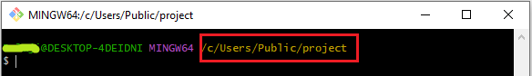**

**Method 2:**

-   Open Git Bash and change the current working directory to your local project by using cd command.

    **Syntax:** cd \<directory_name\>

    **Output:**

**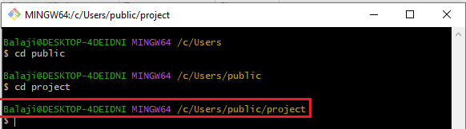**

## How to Work with Git Config

-   Configure local git with user name and email so we will know who pushed the code to github

**Syntax:** git config –global user.name “[name]”

git config –global user.email “[email address]”

**Output:**

## 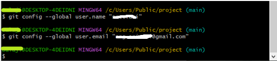

## 2.Initializing a Local and Remote Repository

You have two repositories

1.  Remote Repository
2.  Local Repository

## 2.1 Creating a Remote Repository

Follow the steps given below to initialize your remote Repository with Github.

**Step 1:**

-   First step, Sign into Github with your GitHub account. The below diagram shows a Githhub account.

**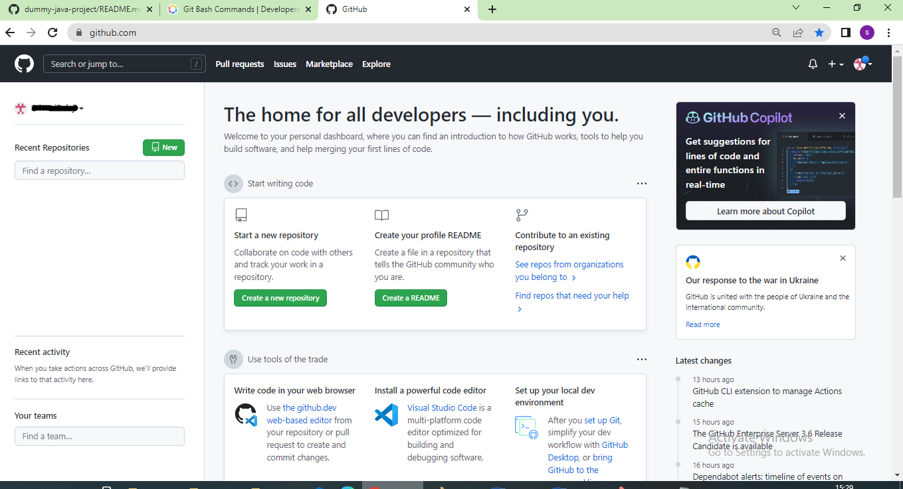**

**Step 2:**

-   To create a new remote repository on Github, click on the new button on the top left side.

    **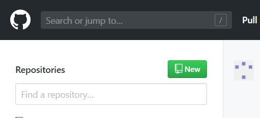**

**Step 3:**

-   Give a suitable name for your repository and click on create repository

**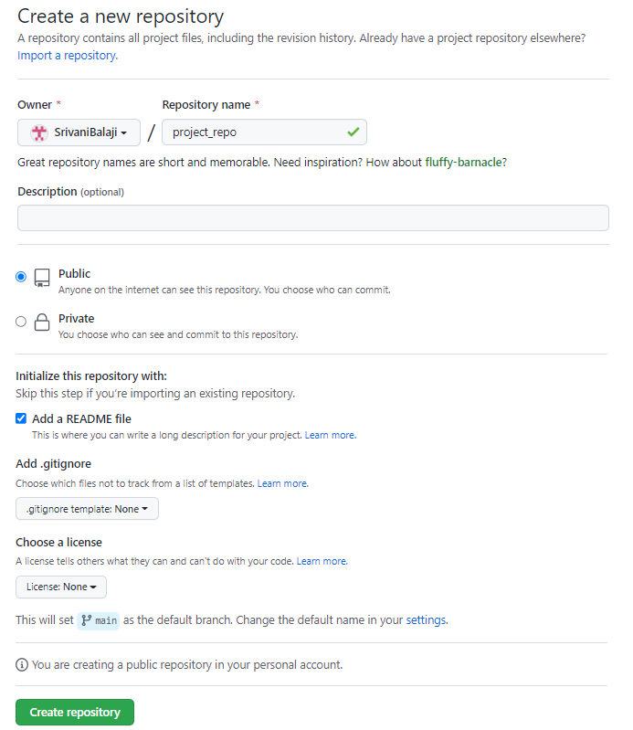**

**Note:** You can choose to initialize your git repository with a README file, and further, you can mention your project details in it. It helps people to know what this repository is about. However, it is optional. 

**Step 4:**

-   Remote repository looks as shown in below diagram.

**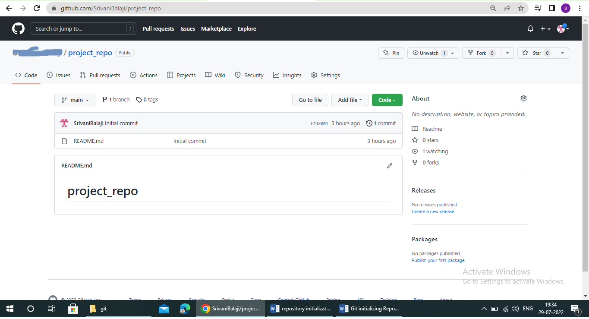**

## 2.2 Creating a Local Repository using GitBash Command Line

-   They are two ways to create a local repository using Gitbash command line.
-   Now run the commands in the following sequence.

**Method 1:**

**Git clone**:

-   Clones a remote repository into a new directory in the local computer.
-   Be sure to clone the project in a working directory that makes sense so you can easily remember where your local project lives.
-   This will automatically initialize a local repository in the working directory and can be verified by checking the presence of a hidden .git folder in the working directory.

**Syntax:** git clone [remote-repository-url]

**How to get the remote repository URL?**

-   Go to your remote repo on Github, Click on the green code button.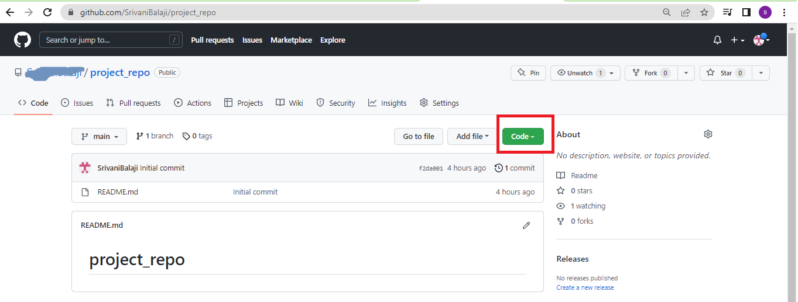
-   You can copy the remote repository url from there.

**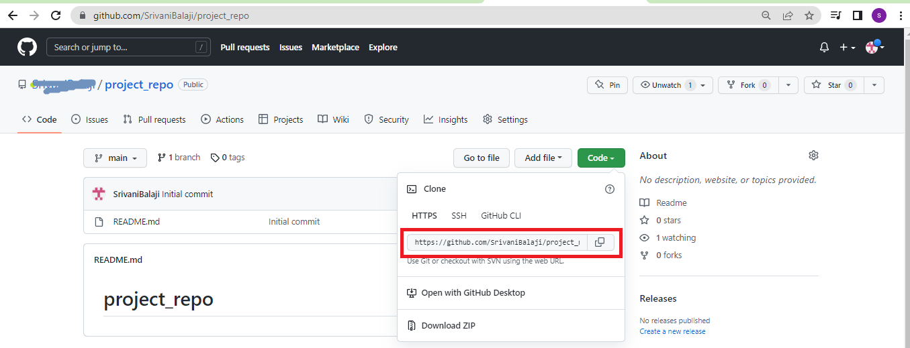**

**Note:** Clone (download) a repository that already exists on GitHub, including all of the files, branches, and commits.

-   Before running git clone, you can see that there is no repository with name **project_repo**

    

**Output:**

-   Now go to your working directory, you can see that **project_repo** (local) repository is created with remote repository name.

-   Open repository, it contains .git hidden folder and README.md file

-   The **.git folder** contains all information that is necessary for the project and all information relating commits, remote repository address, etc. It also contains a log that stores the commit history. This log can help you to roll back to the desired version of the code.
-   In README.md file, add any instructions that you want to share with others. Use Markdown to format headings, lists, links, etc. Here are some guides for the Markdown syntax:

[guides.github.com/features/mastering-markdown](https://guides.github.com/features/mastering-markdown/)

-   When updations done, commit the changes and push them to the remote repo. GitHub will display the nicely formatting ReadMe on the project page for the repo.

**Method 2:**

**Step 1:**

-   Initialize the local directory as a Git repository in the working directory.

**Syntax:** git init

**Output:**

**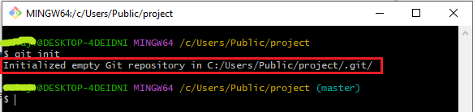**

-   Now go to your working directory, the hidden .git folder can be viewed.

    **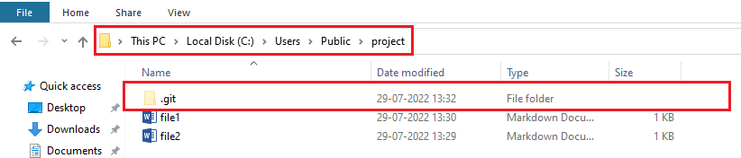**

**Step 2:**

-   Add an empty README.md file in the working directory because the remote repository has a README.md file

    **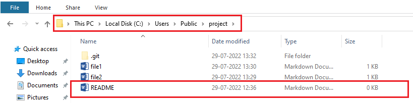**

**Step 3:**

-   Rename the master branch of local repo to main

    **Synatax:** git branch -m main

    **Output:**

    **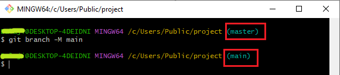**

## 2.3 Checking the Status of Files

-   By “git status” you can see the staged files.

**Syntax :** git status

**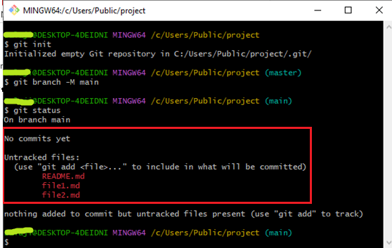**

## 2.4 Adding Files to Staging Area

-   Add all the files of current folder(.) to staging

    **Syntax:** git add .

    **Output:**

    **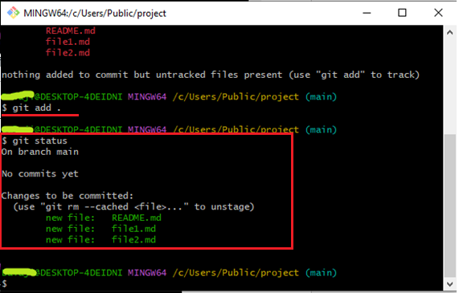**

## 2.5 Committing Files to Local Repository

-   commit all the files from staging to local repo with a commit message

**Syntax:** git commit -m " file1 completed"

**output:**

**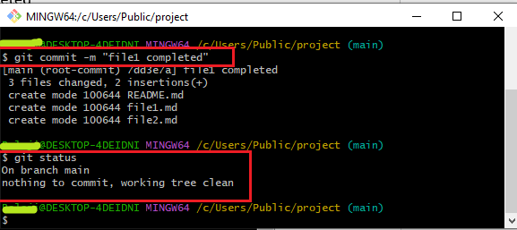**

## 3. Pushing Files from Local Repository into Remote Repository

**Step 1:**

-   In the Command line prompt, add the URL to specify the remote Github repo to which we would want to push the files.

**syntax:** git remote add origin remote_repo_URL

**Output:**

**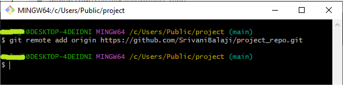**

**Step 2:**

-   push the files from your local repo to the remote repo.
-   Now, am going to push two files i.e., file1.md and file2.md from local reo to remote repo.

    

**syntax:** git push

**Output:**

-   Here the files have been pushed to the main branch of your repository.
-   Now in the GitHub repository, the pushed files can be seen.

    

**4. Pulling Files from Remote Repository to Local Repository**

**References:**

[**https://phoenixnap.com/kb/what-is-git-bash**](https://phoenixnap.com/kb/what-is-git-bash)

**https://dev.classmethod.jp/articles/git-bash-commands/**

**https://www.geeksforgeeks.org/working-on-git-bash/**

## 
