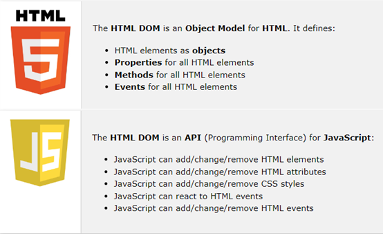
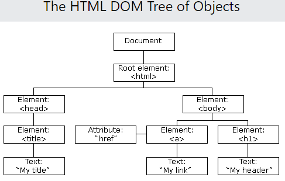
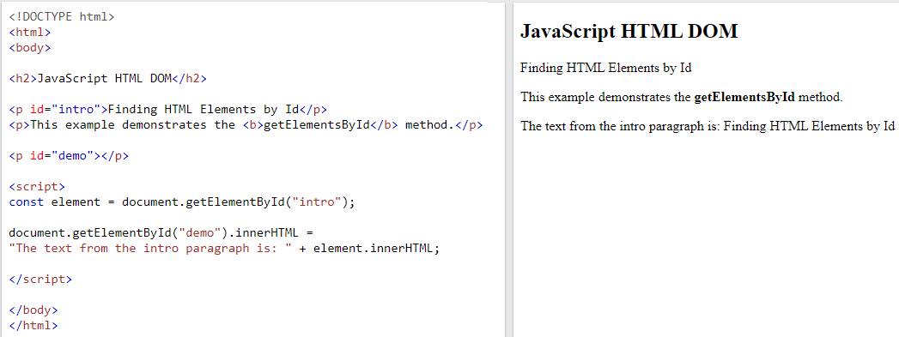
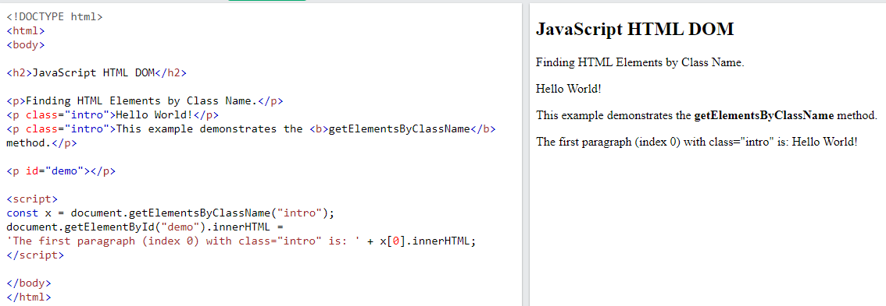
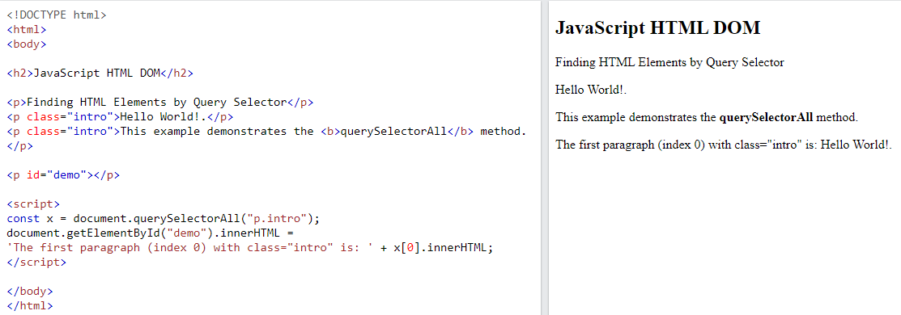

## HTML DOM

Content

1\. What is the HTML DOM?

2\. The HTML DOM (Document Object Model) Structure

3\. Finding HTML Elements

3.1 Finding HTML elements by id

3.2 Finding HTML elements by tag name

3.3 Finding HTML elements by class name

3.4 Finding HTML elements by CSS selectors

3.5 Finding HTML elements by HTML object collections

4\. References

## 1. What is the HTML DOM?

## 2.The HTML DOM (Document Object Model) Structure

-   When a web page is loaded, the browser creates a **D**ocument **O**bject **M**odel of the page.
-   The **HTML DOM** model is constructed as a tree of **Objects**:

## 3.Finding HTML Elements

-   When you want to access HTML elements with JavaScript, you have to find the elements first.
-   There are a couple of ways to do this:
1.  Finding HTML elements by id
2.  Finding HTML elements by tag name
3.  Finding HTML elements by class name
4.  Finding HTML elements by CSS selectors
5.  Finding HTML elements by HTML object collections

## 3.1 Finding HTML Element by Id

-   The easiest way to find an HTML element in the DOM, is by using the element id.
-   This example finds the element with id="intro":

**Example**

-   If the element is found, the method will return the element as an object (in myElement).
-   If the element is not found, myElement will contain null.

## 3.2 Finding HTML Elements by Tag Name

-   This example finds all \<p\> elements:

-   This example finds the element with id="main", and then finds all \<p\> elements inside "main":

## 3.3 Finding HTML Elements by Class Name

-   If you want to find all HTML elements with the same class name, use getElementsByClassName().
-   This example returns a list of all elements with class="intro".

    

-   Finding elements by class name does not work in Internet Explorer 8 and earlier versions.

## 3.4 Finding HTML Elements by CSS Selectors

-   If you want to find all HTML elements that matches a specified CSS selector (id, class names, types, attributes, values of attributes, etc), use the querySelectorAll() method.
-   This example returns a list of all \<p\> elements with class="intro".

-   The querySelectorAll() method does not work in Internet Explorer 8 and earlier versions.

## 3.5 Finding HTML Elements by HTML Object Collections

-   HTML object collections are also accessible:
1.  document.anchors
2.  document.forms
3.  document.images
4.  document.links
5.  document.scripts

To know more details about DOM [click here](https://www.w3schools.com/js/js_htmldom.asp)

## 4.References

1\. https://www.w3schools.com/whatis/whatis_htmldom.asp
