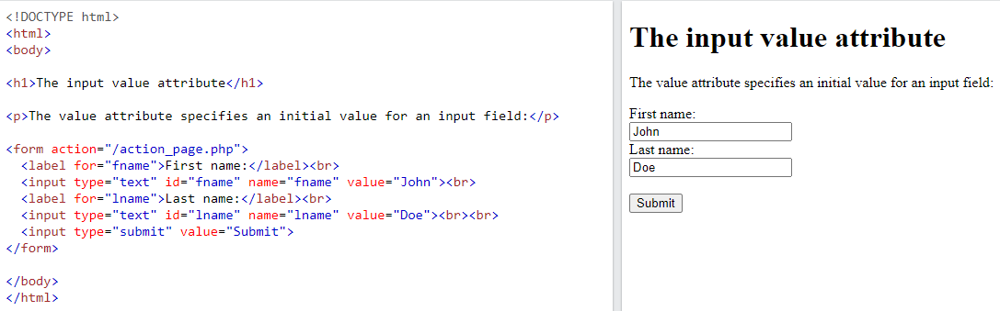
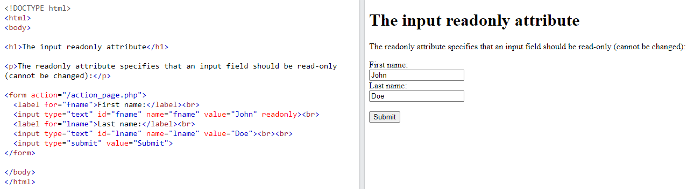
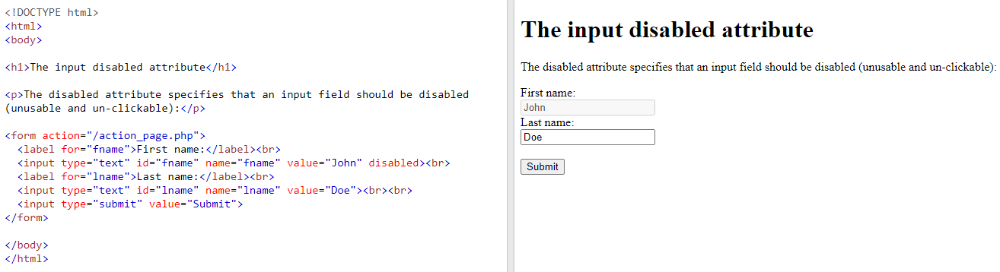
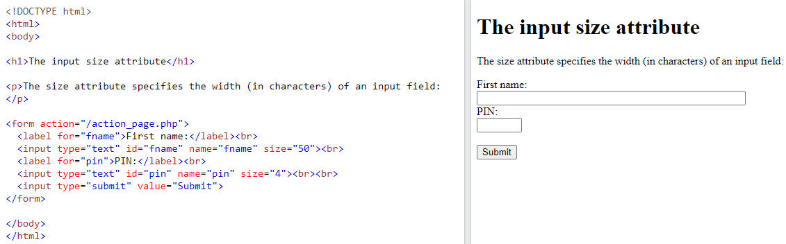
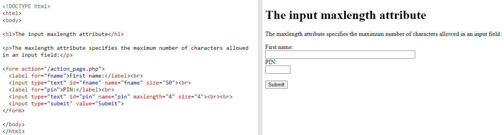
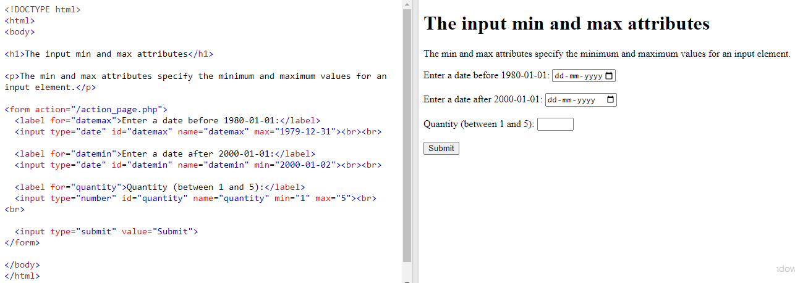
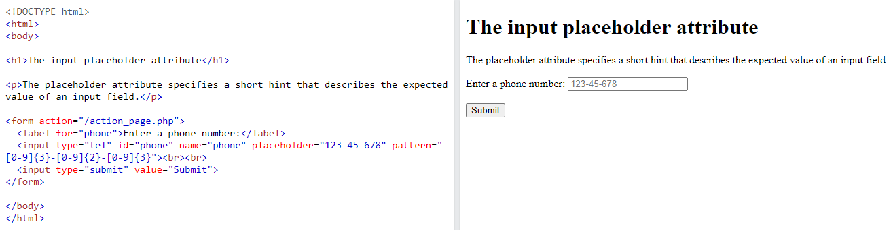
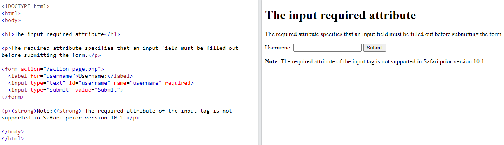
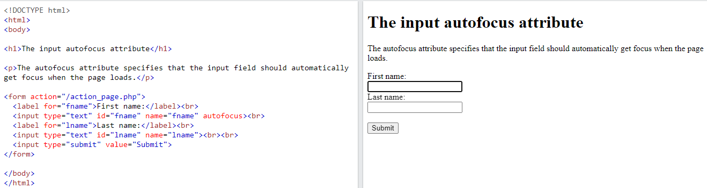
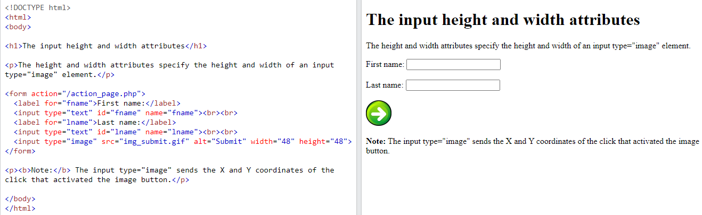

HTML Input Attributes

## **The value Attribute**

The input value attribute specifies an initial value for an input field:

## **The readonly Attribute**

The input readonly attribute specifies that an input field is read-only.

A read-only input field cannot be modified (however, a user can tab to it, highlight it, and copy the text from it).

The value of a read-only input field will be sent when submitting the form!

## **The disabled Attribute**

The input disabled attribute specifies that an input field should be disabled.

A disabled input field is unusable and un-clickable.

The value of a disabled input field will not be sent when submitting the form!

## **The size Attribute**

The input size attribute specifies the visible width, in characters, of an input field.

The default value for size is 20.

**Note:** The size attribute works with the following input types: text, search, tel, url, email, and password.

## **The maxlength Attribute**

The input maxlength attribute specifies the maximum number of characters allowed in an input field.

**Note:** When a maxlength is set, the input field will not accept more than the specified number of characters. However, this attribute does not provide any feedback. So, if you want to alert the user, you must write JavaScript code.

## **The min and max Attributes**

The input min and max attributes specify the minimum and maximum values for an input field.

The min and max attributes work with the following input types: number, range, date, datetime-local, month, time and week.

**Tip:** Use the max and min attributes together to create a range of legal values.

## **The placeholder Attribute**

The input placeholder attribute specifies a short hint that describes the expected value of an input field (a sample value or a short description of the expected format).

The short hint is displayed in the input field before the user enters a value.

The placeholder attribute works with the following input types: text, search, url, tel, email, and password.

## **The required Attribute**

The input required attribute specifies that an input field must be filled out before submitting the form.

The required attribute works with the following input types: text, search, url, tel, email, password, date pickers, number, checkbox, radio, and file.

## **The autofocus Attribute**

The input autofocus attribute specifies that an input field should automatically get focus when the page loads.

## **The height and width Attributes**

The input height and width attributes specify the height and width of an \<input type="image"\> element.

**Tip:** Always specify both the height and width attributes for images. If height and width are set, the space required for the image is reserved when the page is loaded. Without these attributes, the browser does not know the size of the image, and cannot reserve the appropriate space to it. The effect will be that the page layout will change during loading (while the images load).

References

1\. https://www.w3schools.com/html/html_form_attributes.asp
