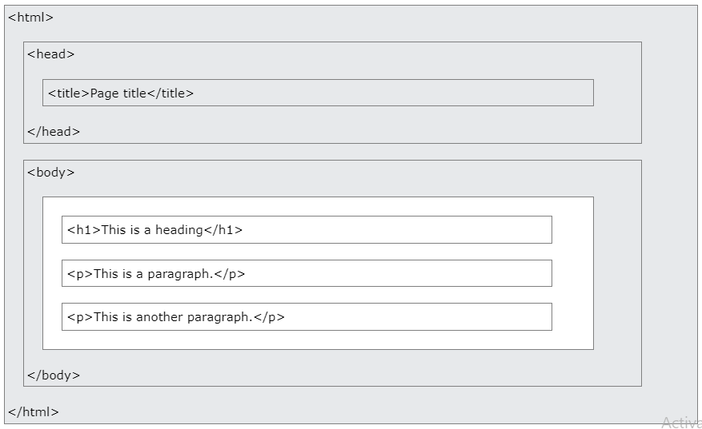
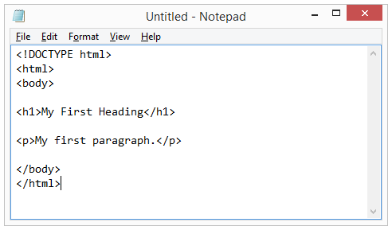

\#\# HTML

\*\*Contents\*\*

\#\# What is HTML?

\- HTML stands for Hyper Text Markup Language

\- HTML is the standard markup language for creating Web pages

\- HTML describes the structure of a Web page

\- HTML consists of a series of elements

\- HTML elements tell the browser how to display the content

\- HTML elements label pieces of content such as "this is a heading", "this is a paragraph", "this is a link", etc.

\#\# What is an HTML Element?

\- An HTML element is defined by a start tag, some content, and an end tag.

\*\*Example:\*\*

\\\<tagname\\\> Content goes here... \\\</tagname\\\>

\\\<h1\\\>My First Heading\\\</h1\\\>

\\\<p\\\>My first paragraph.\\\</p\\\>

\*\*Note:\*\* Some HTML elements have no content (like the \\\<br\\\> element). These elements are called empty elements. Empty elements do not have an end tag!

\#\# Web Browsers

The purpose of a web browser (Chrome, Edge, Firefox, Safari) is to read HTML documents and display them correctly.

A browser does not display the HTML tags, but uses them to determine how to display the document:

\#\# HTML Page Structure

Below is a visualization of an HTML page structure:

\*\*Note:\*\* The content inside the \\\<body\\\> section (the white area above) will be displayed in a browser. The content inside the \\\<title\\\> element will be shown in the browser's title bar or in the page's tab.

\# HTML Editors

A simple text editor is need to learn HTML.

\#\# Learn HTML Using Notepad or TextEdit

\- Web pages can be created and modified by using professional HTML editors.

\- However, for learning HTML we recommend a simple text editor like Notepad (PC) or TextEdit (Mac).

\- A simple text editor is a good way to learn HTML.

\- Follow the steps below to create your first web page with Notepad or TextEdit.

\#\# Step 1: Open Notepad (PC)

\*\*Windows 8 or later:\*\*

Open the \*\*Start Screen\*\* (the window symbol at the bottom left on your screen). Type \*\*Notepad\*\*.

\*\*Windows 7 or earlier:\*\*

Open \*\*Start\*\* \\\> \*\*Programs \\\>\*\* \*\*Accessories \\\>\*\* \*\*Notepad\*\*

\#\# Step 2: Write Some HTML

Write the following HTML code into Notepad.

\#\# Step 3: Save the HTML Page

\- Save the file on your computer.

\- Select \*\*File \\\> Save as\*\* in the Notepad menu.

\- Name the file \*\*"index.htm"\*\* and set the encoding to \*\*UTF-8\*\* (which is the preferred encoding for HTML files).

\*\*Tip:\*\* You can use either .htm or .html as file extension. There is no difference, it is up to you.

\#\# Step 4: View the HTML Page in Your Browser

Open the saved HTML file in your favorite browser (double click on the file, or right-click - and choose "Open with").

The result will look much like this:

