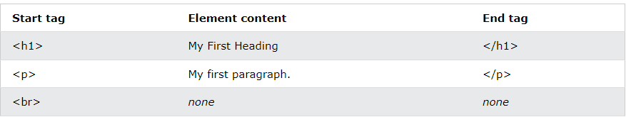
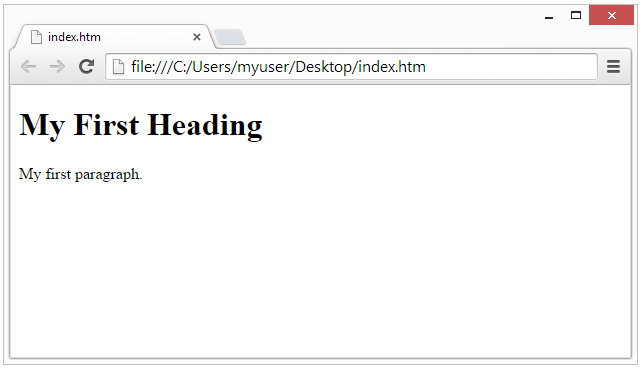
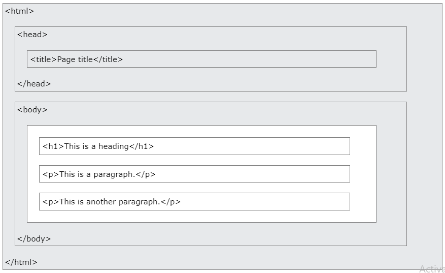
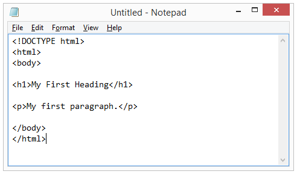
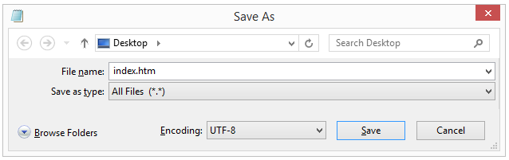

\#\# HTML \*\*Contents\*\* \#\# What is HTML? - HTML stands for Hyper Text Markup Language - HTML is the standard markup language for creating Web pages - HTML describes the structure of a Web page - HTML consists of a series of elements - HTML elements tell the browser how to display the content - HTML elements label pieces of content such as "this is a heading", "this is a paragraph", "this is a link", etc. \#\# What is an HTML Element? - An HTML element is defined by a start tag, some content, and an end tag. \*\*Example:\*\* \\ Content goes here... \\ \\My First Heading\\ \\My first paragraph.\\  \*\*Note:\*\* Some HTML elements have no content (like the \\ element). These elements are called empty elements. Empty elements do not have an end tag! \#\# Web Browsers The purpose of a web browser (Chrome, Edge, Firefox, Safari) is to read HTML documents and display them correctly. A browser does not display the HTML tags, but uses them to determine how to display the document:  \#\# HTML Page Structure Below is a visualization of an HTML page structure:  \*\*Note:\*\* The content inside the \\ section (the white area above) will be displayed in a browser. The content inside the \\ element will be shown in the browser's title bar or in the page's tab. \# HTML Editors A simple text editor is need to learn HTML. \#\# Learn HTML Using Notepad or TextEdit - Web pages can be created and modified by using professional HTML editors. - However, for learning HTML we recommend a simple text editor like Notepad (PC) or TextEdit (Mac). - A simple text editor is a good way to learn HTML. - Follow the steps below to create your first web page with Notepad or TextEdit. \#\# Step 1: Open Notepad (PC) \*\*Windows 8 or later:\*\* Open the \*\*Start Screen\*\* (the window symbol at the bottom left on your screen). Type \*\*Notepad\*\*. \*\*Windows 7 or earlier:\*\* Open \*\*Start\*\* \\\> \*\*Programs \\\>\*\* \*\*Accessories \\\>\*\* \*\*Notepad\*\* \#\# Step 2: Write Some HTML Write the following HTML code into Notepad.  \#\# Step 3: Save the HTML Page - Save the file on your computer. - Select \*\*File \\\> Save as\*\* in the Notepad menu. - Name the file \*\*"index.htm"\*\* and set the encoding to \*\*UTF-8\*\* (which is the preferred encoding for HTML files).  \*\*Tip:\*\* You can use either .htm or .html as file extension. There is no difference, it is up to you. \#\# Step 4: View the HTML Page in Your Browser Open the saved HTML file in your favorite browser (double click on the file, or right-click - and choose "Open with"). The result will look much like this: 
