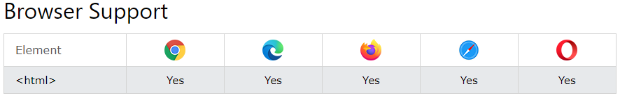

HTML \\ Tag \#\# \*\*Definition and Usage\*\* The \\ tag represents the root of an HTML document. The \\ tag is the container for all other HTML elements (except for the [\\](https://www.w3schools.com/tags/tag_doctype.asp) tag). \*\*Note:\*\* You should always include the lang attribute inside the \\ tag, to declare the language of the Web page. This is meant to assist search engines and browsers. \#\# \*\*Browser Support\*\*  \# HTML DOM Documents \#\# \*\*The Document Object\*\* When an HTML document is loaded into a web browser, it becomes a \*\*document object\*\*. The \*\*document object\*\* is the root node of the HTML document. The \*\*document object\*\* is a property of the \*\*window object\*\*. The \*\*document object\*\* is accessed with: window.document or just document \#\#\# \*\*Examples\*\* let url = window.document.URL; [Try it Yourself »](https://www.w3schools.com/jsref/tryit.asp?filename=tryjsref_doc_url1) let url = document.URL; [Try it Yourself »](https://www.w3schools.com/jsref/tryit.asp?filename=tryjsref_doc_url)
