## Common HTML Tags

-   The table below lists all HTML tags.
-   Types of HTML tags are
1.  Basic HTML,
2.  Formatting
3.  Forms and Input
4.  Frames
5.  Images
6.  Audio / Video
7.  Links
8.  Lists
9.  Tables
10. Styles and Semantics
11. Meta Info
12. Programming

## 1.Basic HTML

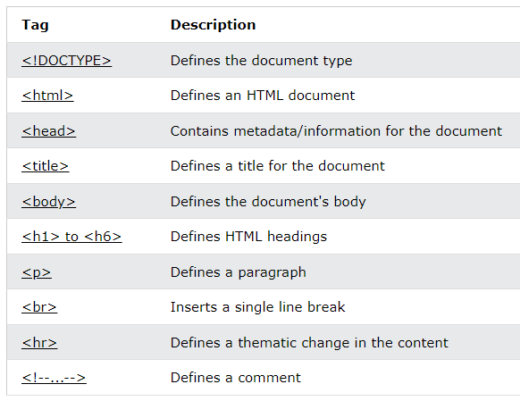

## 2.Formatting

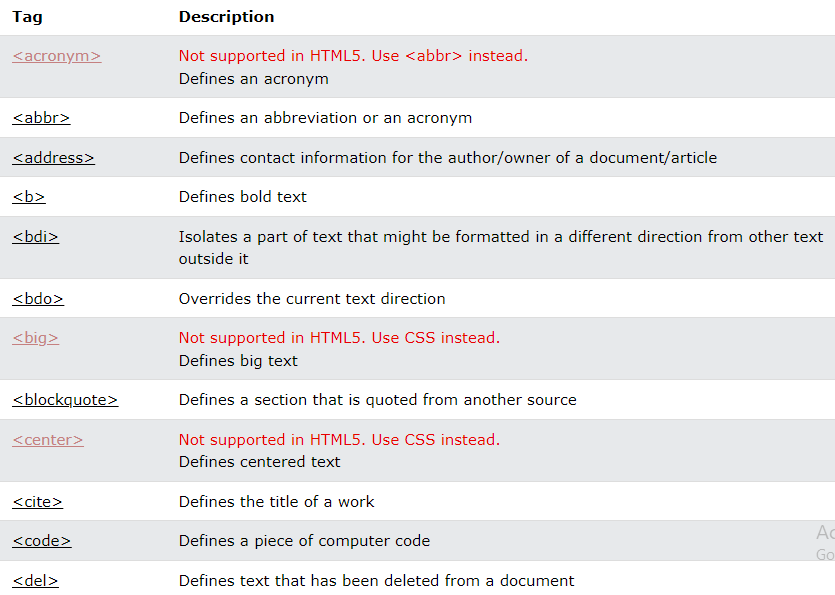

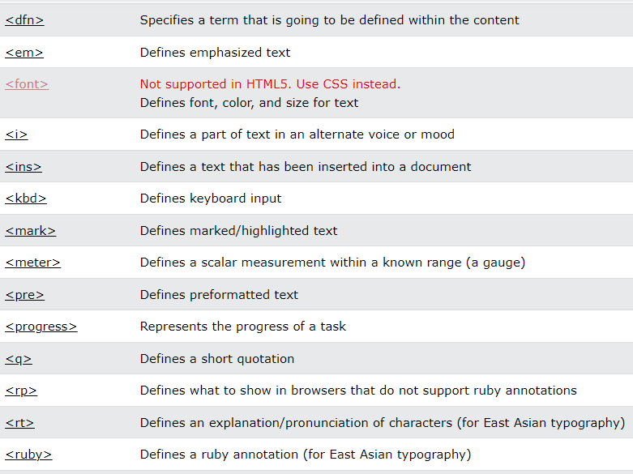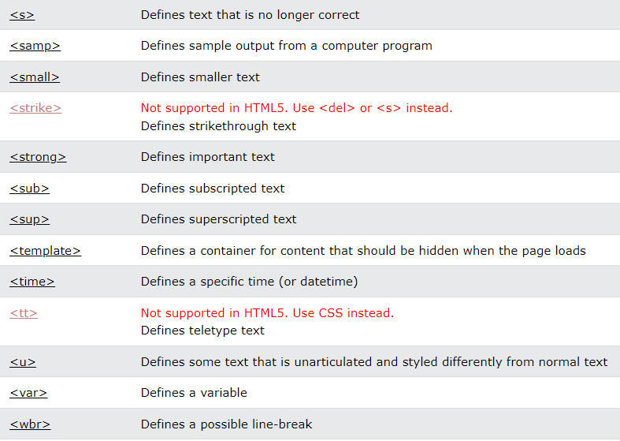

## 3.Forms and Input

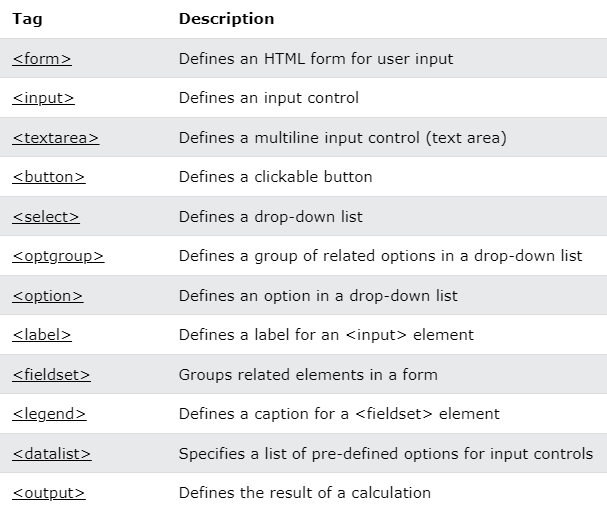

## 4.Frames

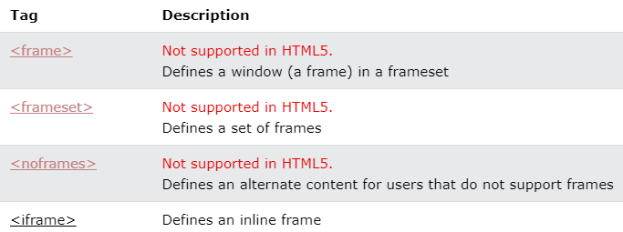

## 5.Images

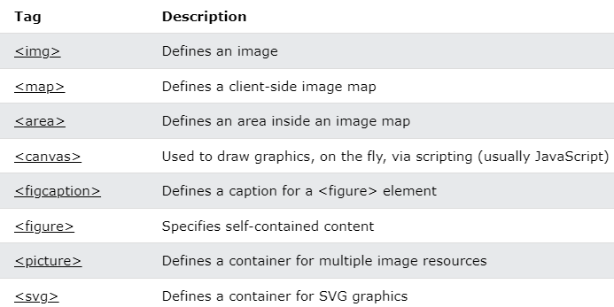

## 6.Audio / Video

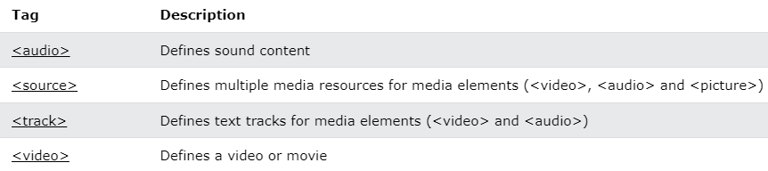

## 7.Links

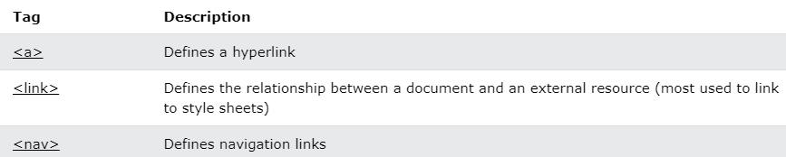

## 8.Lists

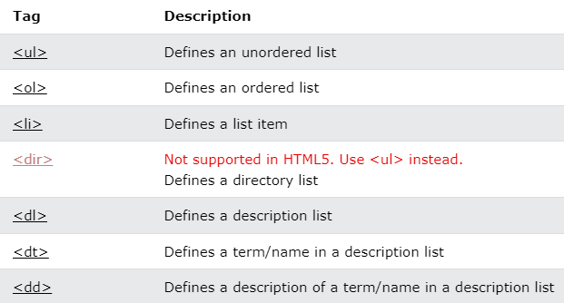

## 9.Tables

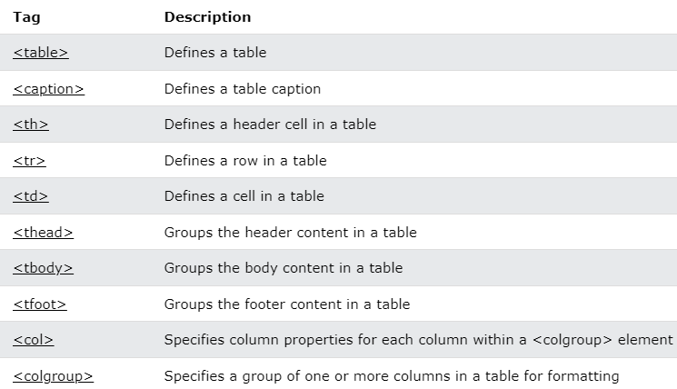

## 10.Styles and Semantics

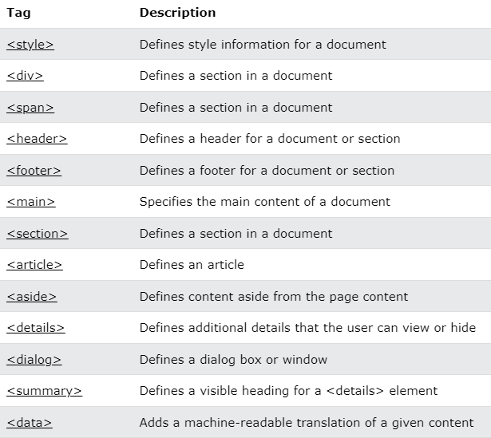

## 11.Meta Info

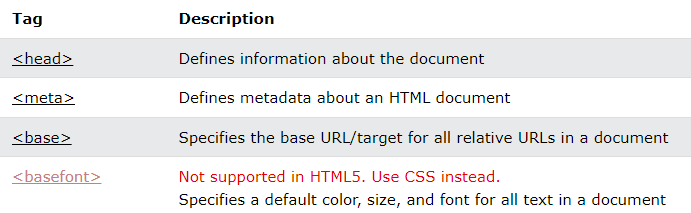

## 12.Programming

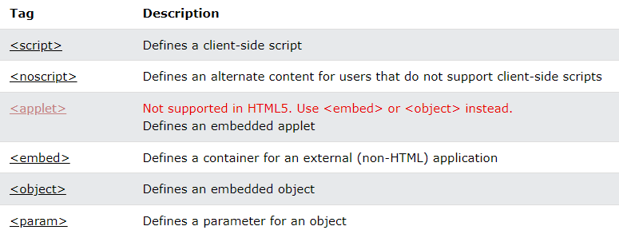

-   To know more details about each and every tag [click here](https://www.w3schools.com/tags/ref_byfunc.asp)

## References

1\. https://www.w3schools.com/tags/ref_byfunc.asp
