## The HTML \<form\> Elements

-   The HTML \<form\> element can contain one or more of the following form elements:

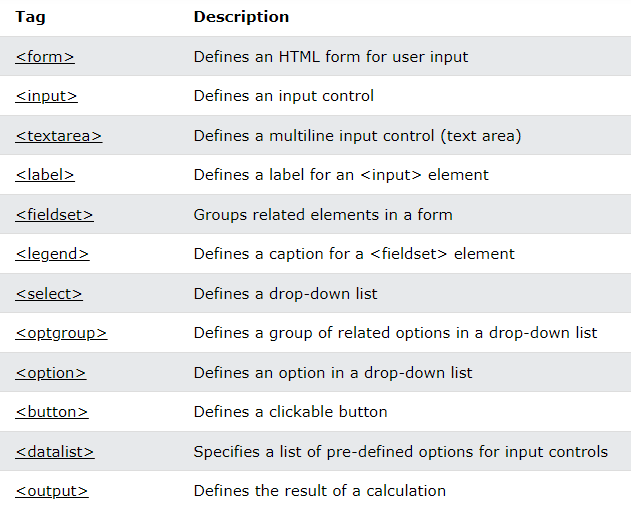

## 1.The \<input\> Element

-   One of the most used form element is the \<input\> element.
-   The \<input\> element can be displayed in several ways, depending on the type attribute.

**Example**

\<label for="fname"\>First name:\</label\>  
\<input type="text" id="fname" name="fname"\>

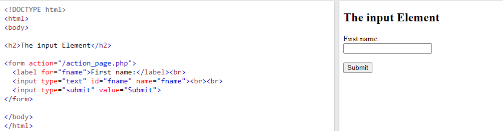

-   To know more details about the different values of input type attribute [click here](https://www.w3schools.com/html/html_form_input_types.asp).

## 2.The \<label\> Element

-   The \<label\> element defines a label for several form elements.
-   The \<label\> element is useful for screen-reader users, because the screen-reader will read out loud the label when the user focus on the input element.
-   The \<label\> element also help users who have difficulty clicking on very small regions (such as radio buttons or checkboxes) - because when the user clicks the text within the \<label\> element, it toggles the radio button/checkbox.
-   The for attribute of the \<label\> tag should be equal to the id attribute of the \<input\> element to bind them together.

## 3.The \<select\> Element

-   The \<select\> element defines a drop-down list:

**Example**

\<label for="cars"\>Choose a car:\</label\>  
\<select id="cars" name="cars"\>  
\<option value="volvo"\>Volvo\</option\>  
\<option value="saab"\>Saab\</option\>  
\<option value="fiat"\>Fiat\</option\>  
\<option value="audi"\>Audi\</option\>  
\</select\>

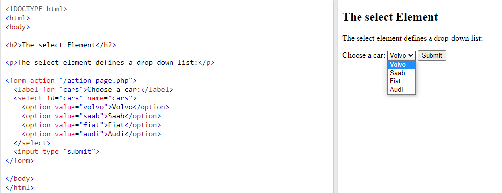

-   The \<option\> elements defines an option that can be selected.
-   By default, the first item in the drop-down list is selected.
-   To define a pre-selected option, add the selected attribute to the option:

**Example**

\<option value="fiat" selected\>Fiat\</option\>

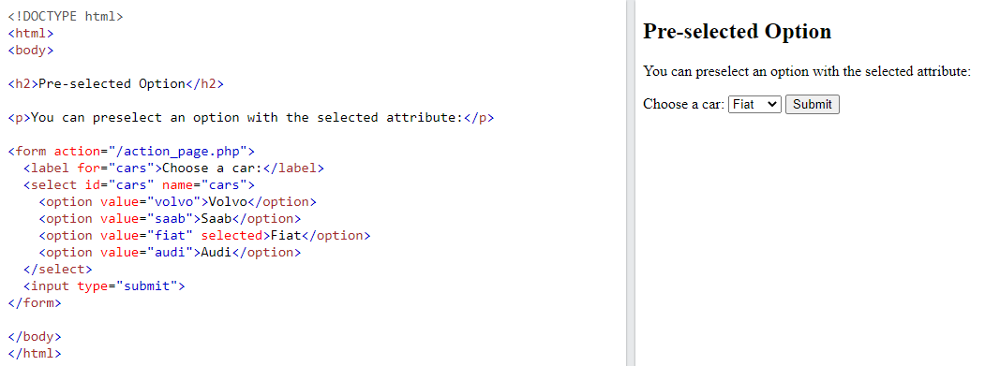

**Visible Values:**

-   Use the size attribute to specify the number of visible values:

\<label for="cars"\>Choose a car:\</label\>  
\<select id="cars" name="cars" size="3"\>  
\<option value="volvo"\>Volvo\</option\>  
\<option value="saab"\>Saab\</option\>  
\<option value="fiat"\>Fiat\</option\>  
\<option value="audi"\>Audi\</option\>  
\</select\>

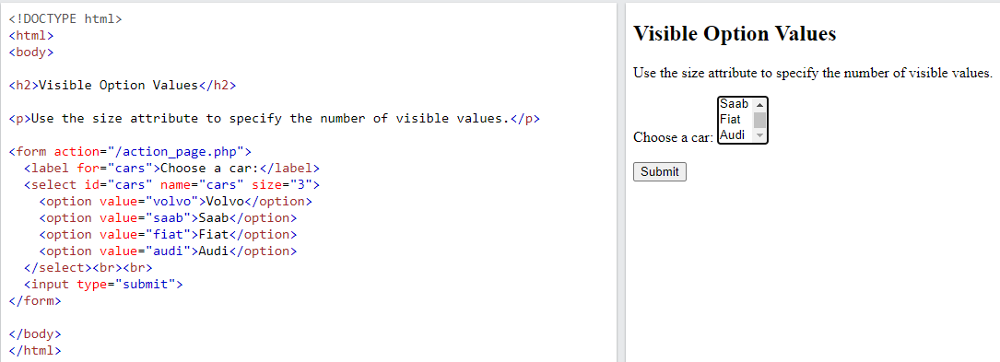

### Allow Multiple Selections:

-   Use the multiple attribute to allow the user to select more than one value:

\<label for="cars"\>Choose a car:\</label\>  
\<select id="cars" name="cars" size="4" multiple\>  
\<option value="volvo"\>Volvo\</option\>  
\<option value="saab"\>Saab\</option\>  
\<option value="fiat"\>Fiat\</option\>  
\<option value="audi"\>Audi\</option\>  
\</select\>

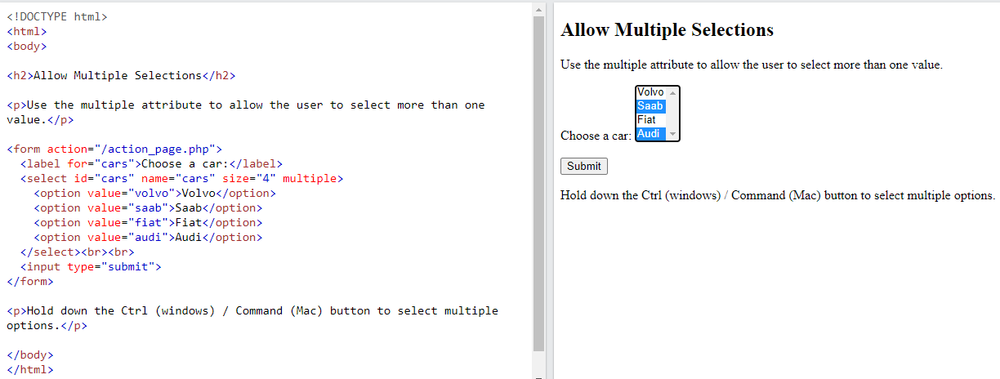

## 4.The \<textarea\> Element

-   The \<textarea\> element defines a multi-line input field (a text area):

**Example**

\<textarea name="message" rows="10" cols="30"\>  
The cat was playing in the garden.  
\</textarea\>

-   The rows attribute specifies the visible number of lines in a text area.
-   The cols attribute specifies the visible width of a text area.
-   This is how the HTML code above will be displayed in a browser:

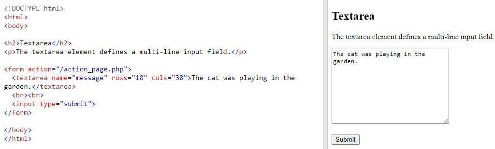

-   You can also define the size of the text area by using CSS:

**Example**

\<textarea name="message" style="width:200px; height:600px;"\>  
The cat was playing in the garden.  
\</textarea\>

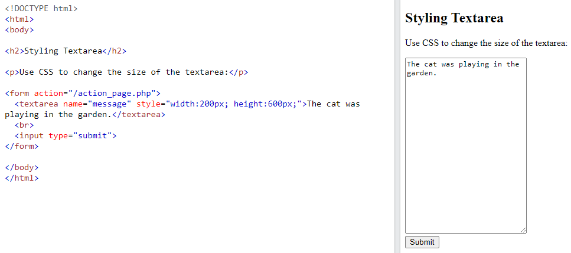

## 5.The \<button\> Element

-   The \<button\> element defines a clickable button:

**Example**

\<button type="button" onclick="alert('Hello World!')"\>Click Me!\</button\>

-   This is how the HTML code above will be displayed in a browser:

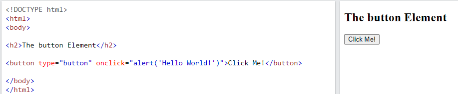

**Note:**

-   Always specify the type attribute for the button element.
-   Different browsers may use different default types for the button element.

## 6.The \<fieldset\> and \<legend\> Elements

-   The \<fieldset\> element is used to group related data in a form.
-   The \<legend\> element defines a caption for the \<fieldset\> element.

**Example**

\<form action="/action_page.php"\>  
\<fieldset\>  
\<legend\>Personalia:\</legend\>  
\<label for="fname"\>First name:\</label\>\<br\>  
\<input type="text" id="fname" name="fname" value="John"\>\<br\>  
\<label for="lname"\>Last name:\</label\>\<br\>  
\<input type="text" id="lname" name="lname" value="Doe"\>\<br\>\<br\>  
\<input type="submit" value="Submit"\>  
\</fieldset\>  
\</form\>

This is how the HTML code above will be displayed in a browser:

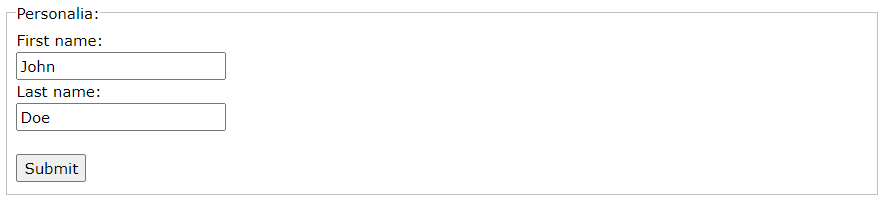

## 7.The \<datalist\> Element

-   The \<datalist\> element specifies a list of pre-defined options for an \<input\> element.
-   Users will see a drop-down list of the pre-defined options as they input data.
-   The list attribute of the \<input\> element, must refer to the id attribute of the \<datalist\> element.

**Example**

\<form action="/action_page.php"\>  
\<input list="browsers"\>  
\<datalist id="browsers"\>  
\<option value="Internet Explorer"\>  
\<option value="Firefox"\>  
\<option value="Chrome"\>  
\<option value="Opera"\>  
\<option value="Safari"\>  
\</datalist\>  
\</form\>

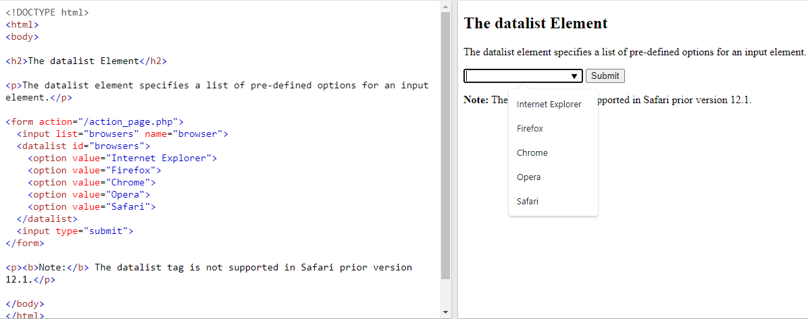

## 8.The \<output\> Element

-   The \<output\> element represents the result of a calculation (like one performed by a script).

**Example**

-   Perform a calculation and show the result in an \<output\> element:

\<form action="/action_page.php"  
oninput="x.value=parseInt(a.value)+parseInt(b.value)"\>  
0  
\<input type="range" id="a" name="a" value="50"\>  
100 +  
\<input type="number" id="b" name="b" value="50"\>

\<output name="x" for="a b"\>\</output\>  
\<br\>\<br\>  
\<input type="submit"\>  
\</form\>

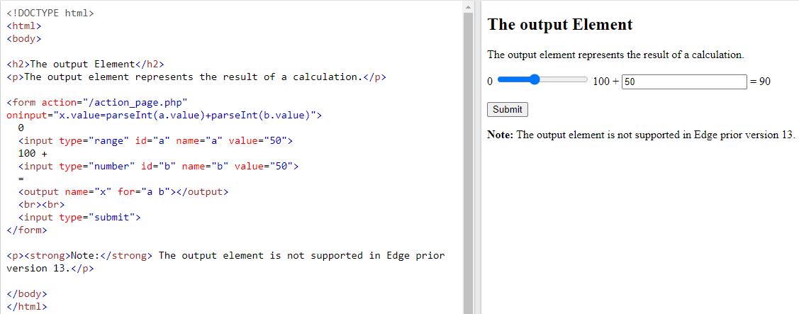

## Reference

1.https://www.w3schools.com/html/html_form_elements.asp
