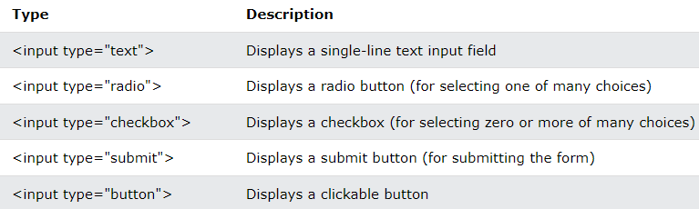
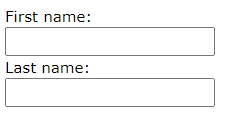
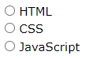
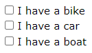
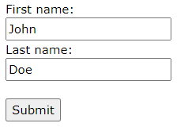
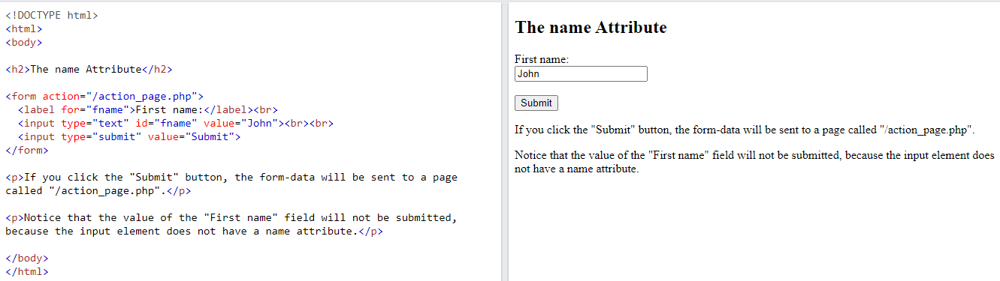

## HTML Forms

-   An HTML form is used to collect user input.
-   The user input is most often sent to a server for processing.

## The \<form\> Element

The HTML \<form\> element is used to create an HTML form for user input.

**Syntax**

\<form\>  
.  
*form elements*  
.  
\</form\>

-   The \<form\> element is a container for different types of input elements, such as
1.  text fields
2.  checkboxes
3.  radio buttons
4.  submit buttons, etc.
-   To know more details about the different form elements [click here](https://www.w3schools.com/html/html_form_elements.asp).

## The \<input\> Element

-   The HTML \<input\> element is the most used form element.
-   An \<input\> element can be displayed in many ways, depending on the type attribute.

Here are some examples:

-   To know more details about the different input types click here.

## Text Fields

-   The \<input type="text"\> defines a single-line input field for text input.

**Example**

-   A form with input fields for text:

\<form\>  
\<label for="fname"\>First name:\</label\>\<br\>  
\<input type="text" id="fname" name="fname"\>\<br\>  
\<label for="lname"\>Last name:\</label\>\<br\>  
\<input type="text" id="lname" name="lname"\>  
\</form\>

-   This is how the HTML code above will be displayed in a browser:

**Note:**

-   The form itself is not visible. Also note that the default width of an input field is 20 characters.

## The \<label\> Element

-   Notice the use of the \<label\> element in the example above.
-   The \<label\> tag defines a label for many form elements.
-   The \<label\> element is useful for screen-reader users, because the screen-reader will read out loud the label when the user focus on the input element.
-   The \<label\> element also help users who have difficulty clicking on very small regions (such as radio buttons or checkboxes) - because when the user clicks the text within the \<label\> element, it toggles the radio button/checkbox.
-   The for attribute of the \<label\> tag should be equal to the id attribute of the \<input\> element to bind them together.

## Radio Buttons

-   Radio buttons let a user select ONE of a limited number of choices.
-   The \<input type="radio"\> defines a radio button.

**Example**

-   A form with radio buttons:

\<p\>Choose your favorite Web language:\</p\>

\<form\>  
\<input type="radio" id="html" name="fav_language" value="HTML"\>  
\<label for="html"\>HTML\</label\>\<br\>  
\<input type="radio" id="css" name="fav_language" value="CSS"\>  
\<label for="css"\>CSS\</label\>\<br\>  
\<input type="radio" id="javascript" name="fav_language" value="JavaScript"\>  
\<label for="javascript"\>JavaScript\</label\>  
\</form\>

-   This is how the HTML code above will be displayed in a browser:

Choose your favorite Web language:

## Checkboxes

-   Checkboxes let a user select ZERO or MORE options of a limited number of choices.
-   The \<input type="checkbox"\> defines a **checkbox**.

**Example**

-   A form with checkboxes:

\<form\>  
\<input type="checkbox" id="vehicle1" name="vehicle1" value="Bike"\>  
\<label for="vehicle1"\> I have a bike\</label\>\<br\>  
\<input type="checkbox" id="vehicle2" name="vehicle2" value="Car"\>  
\<label for="vehicle2"\> I have a car\</label\>\<br\>  
\<input type="checkbox" id="vehicle3" name="vehicle3" value="Boat"\>  
\<label for="vehicle3"\> I have a boat\</label\>  
\</form\>

-   This is how the HTML code above will be displayed in a browser:

## The Submit Button

-   The \<input type="submit"\> defines a button for submitting the form data to a form-handler.
-   The form-handler is specified in the form's action attribute.

**Example**

-   A form with a submit button:

\<form action="/action_page.php"\>  
\<label for="fname"\>First name:\</label\>\<br\>  
\<input type="text" id="fname" name="fname" value="John"\>\<br\>  
\<label for="lname"\>Last name:\</label\>\<br\>  
\<input type="text" id="lname" name="lname" value="Doe"\>\<br\>\<br\>  
\<input type="submit" value="Submit"\>  
\</form\>

-   This is how the HTML code above will be displayed in a browser:

## The Name Attribute for \<input\>

-   Notice that each input field must have a name attribute to be submitted.
-   If the name attribute is omitted, the value of the input field will not be sent at all.

### Example

This example will not submit the value of the "First name" input field:

\<form action="/action_page.php"\>  
\<label for="fname"\>First name:\</label\>\<br\>  
\<input type="text" id="fname" value="John"\>\<br\>\<br\>  
\<input type="submit" value="Submit"\>  
\</form\>

## References

1\. https://www.w3schools.com/html/html_forms.asp
