# Java Operators

**Content**

1\. Java Operators

1.1 Unary Operator

1.2 Arithmetic Operators

1.3 Assignment Operators

1.4 Comparison Operators

1.5 Logical Operators

1.6 Bitwise Operator

1.6.1 Bitwise AND (&)

1.6.2 Bitwise exclusive OR (\^)

1.6.3 Bitwise inclusive OR (\|)

1.6.4 Bitwise Complement (\~)

1.6.5 Bit Shift Operators

2\. References

## 1. Java Operators

-   Operators are used to perform operations on variables and values.

**Java divides the operators into the following groups:**

-   Unary Operator
-   Arithmetic operators
-   Assignment operators
-   Comparison operators
-   Logical operators
-   Bitwise operators

## 1.1 Unary Operator

-   The Java unary operators require only one operand.
-   Unary operators are used to perform various operations i.e.
1.  incrementing/decrementing a value by one
2.  negating an expression
3.  inverting the value of a Boolean

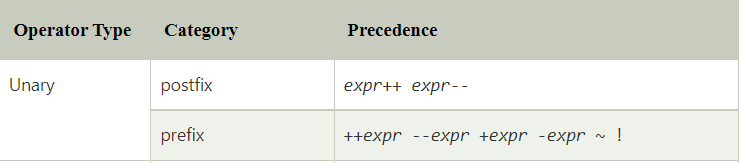

## 1.2 Arithmetic Operators

-   Arithmetic operators are used to perform common mathematical operations.

**A list of all Arithmetic operators:**

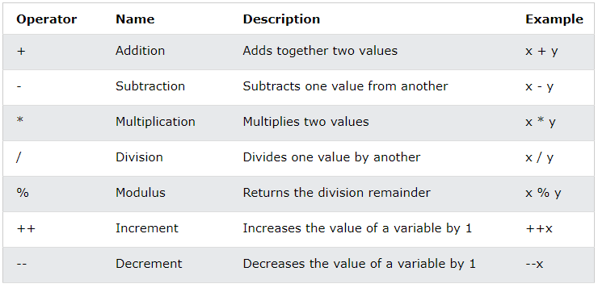

## 1.3 Assignment Operators

-   Assignment operators are used to assign values to variables.

**A list of all assignment operators:**

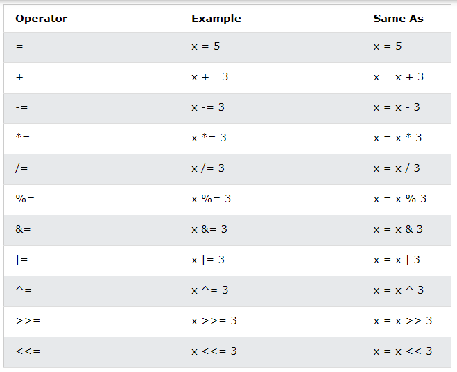

## 1.4 Comparison Operators

-   Comparison operators are used to compare two values.

**A list of all Comparison operators:**

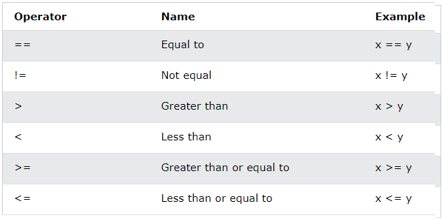

## 1.5 Logical Operators

-   Logical operators are used to determine the logic between variables or values.

**A list of all Comparison operators:**

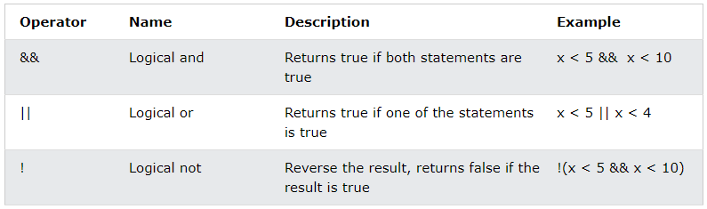

## 1.6 Bitwise Operator

-   Bitwise operators are used on (binary) numbers.

**There are five types of the bitwise operator in Java:**

-   Bitwise AND
-   Bitwise exclusive OR
-   Bitwise inclusive OR
-   Bitwise Compliment
-   Bit Shift Operators

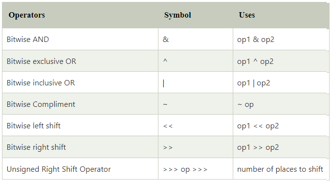

## 1.6.1 Bitwise AND (&)

-   It is a binary operator denoted by the symbol **&**.
-   It returns 1 if and only if both bits are 1, else returns 0.

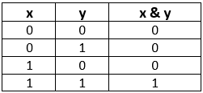

## 1.6.2 Bitwise exclusive OR (\^)

-   It is a binary operator denoted by the symbol **\^** (pronounced as caret).
-   It returns 0 if both bits are the same, else returns 1.

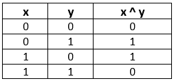

## 1.6.3 Bitwise inclusive OR (\|)

It is a binary operator denoted by the symbol **\|** (pronounced as a pipe). It returns 1 if either of the bit is 1, else returns 0.

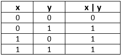

## 1.6.4 Bitwise Complement (\~)

-   It is a unary operator denoted by the symbol **\~** (pronounced as the tilde).
-   It returns the inverse or complement of the bit.
-   It makes every 0 a 1 and every 1 a 0.

## 1.6.5 Bit Shift Operators

-   Shift operator is used in shifting the bits either right or left.
-   We can use shift operators if we divide or multiply any number by 2.
-   The general format to shift the bit is as follows:

**Syntax**

**Example**

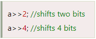

**Java provides the following types of shift operators:**

-   Signed Right Shift Operator or Bitwise Right Shift Operator
-   Unsigned Right Shift Operator
-   Signed Left Shift Operator or Bitwise Left Shift Operator

**1) Signed Right Shift Operator (\>\>)**

-   The signed right shift operator shifts a bit pattern of a number towards the **right** with a specified number of positions and fills 0.
-   The operator is denoted by the symbol **\>\>.**
-   It also preserves the leftmost bit (sign bit).
-   If **0** is presented at the leftmost bit, it means the number is **positive**.
-   If **1** is presented at the leftmost bit, it means the number is **negative**.
-   In general, if we write **a\>\>n**, it means to shift the bits of a number toward the right with a specified position (n).
-   In the terms of mathematics, we can represent the signed right shift operator as follows:

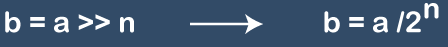

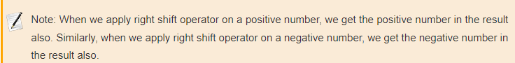

**2) Signed Left Shift Operator (\<\<)**

-   The signed left shift operator shifts a bit pattern to the **left**.
-   It is represented by the symbol **\<\<.**
-   It also preserves the leftmost bit (sign bit).
-   In general, if we write **a\<\<n**, it means to shift the bits of a number toward the left with specified position (n).
-   In the terms of mathematics, we can represent the signed right shift operator as follows:

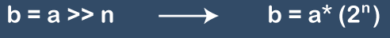

**3) Unsigned Right Shift Operator (\>\>\>)**

-   The left operand value is moved right by the number of bits specified by the right operand and the shifted bits are filled up with **zeros**.
-   Excess bits shifted off to the right are discarded.
-   It is denoted by the symbol **\>\>\>.**
-   Note that the leftmost position after \>\> depends on the sign bit. It does not preserve the sign bit.

## 2. References

1.  https://www.w3schools.com/java/java_operators.asp
2.  https://www.javatpoint.com/bitwise-operator-in-java
