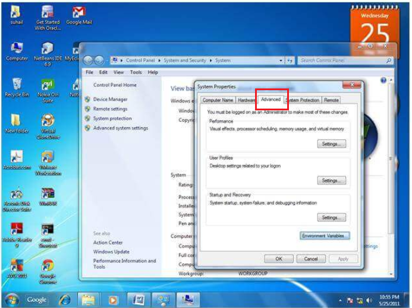
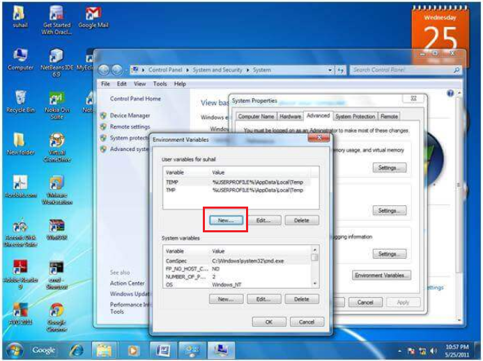
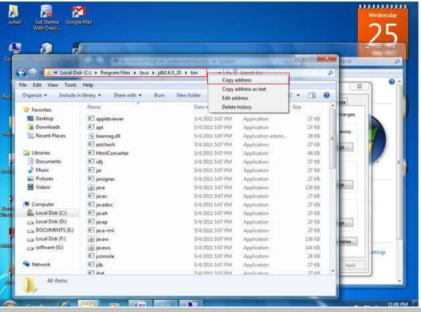
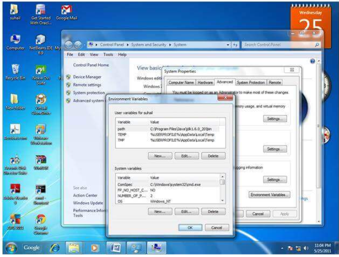
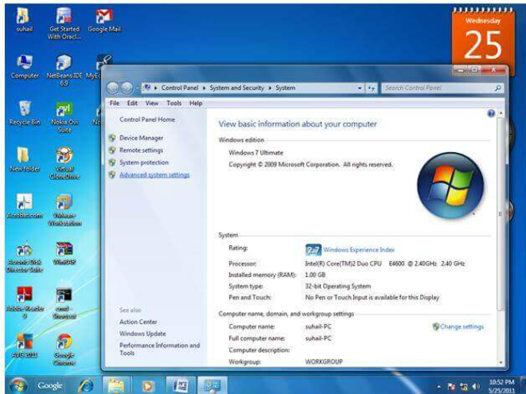

# How to set path in Java

**Content**

1\. How to set path in Java

1.1 How to set the Temporary Path of JDK in Windows

1.2 How to set the Permanent Path of JDK in Windows

2\. References

## 1. How to set path in Java

-   The path is required to be set for using tools such as javac, java, etc.
-   If you are saving the Java source file inside the JDK/bin directory, the path is not required to be set because all the tools will be available in the current directory.
-   However, if you have your Java file outside the JDK/bin folder, it is necessary to set the path of JDK.
-   There are two ways to set the path in Java:
1.  Temporary
2.  Permanent

## 1.1 How to set the Temporary Path of JDK in Windows

To set the temporary path of JDK, you need to follow the following steps:

-   Open the command prompt
-   Copy the path of the JDK/bin directory
-   Write in command prompt: **set path=copied_path**

**Example**

-   Let's see it in the figure given below:

## 1.2 How to set the Permanent Path of JDK in Windows

For setting the permanent path of JDK, you need to follow these steps:

-   Go to **MyComputer -\> properties -\> advances system settings -\> advanced tab -\> environment variables -\> new tab of user variable -\>** write path in **variable name -\>** write path of bin folder in **variable value -\> ok -\> ok -\> ok**

**Example**

**Step1:** Go to MyComputer and right click on **mycomputer. Click on properties.**

**Step2:** Click on the **advanced system settings.**

**Step3:** Click on the **advanced tab.**

**Step4:** Click on **environment variables.**

**Step5:** Click on the **new** button of **user variables.**

**Step6:** Write the **path** in the **variable name.**

**Step7:** Copy the path of **bin folder.**

**Step8:**  Paste **path of bin folder** in the **variable value.**

**Step9:** Click on **ok** button.

**Step10:** Click on **ok** button.

**Step11:** Click on **ok** button.

-   Now your permanent path is set.
-   You can now execute any program of java from any drive.

## 2. References

1.  https://www.javatpoint.com/how-to-set-path-in-java
