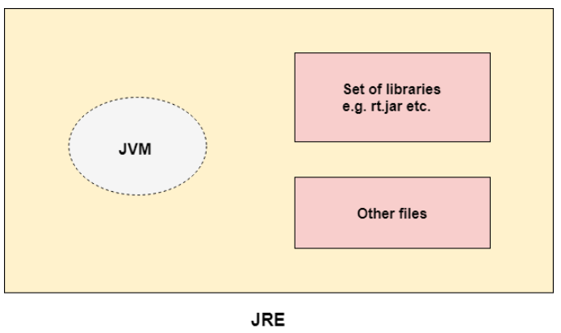
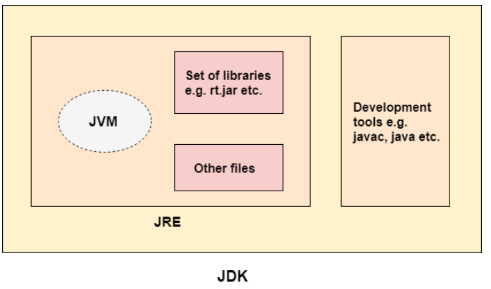

# JDK, JRE, and JVM

**Content**

1\. JVM

2\. JRE

3\. JDK

4\. References

## 1. JVM

-   JVM (Java Virtual Machine) is an abstract machine.
-   It is called a virtual machine because it doesn't physically exist.
-   It is a specification that provides a runtime environment in which Java bytecode can be executed.
-   It can also run those programs which are written in other languages and compiled to Java bytecode.
-   JVMs are available for many hardware and software platforms.
-   JVM, JRE, and JDK are platform dependent because the configuration of each OS is different from each other.
-   However, Java is platform independent.
-   There are three notions of the JVM: *specification*, *implementation*, and *instance*.

**The JVM performs the following main tasks:**

-   Loads code
-   Verifies code
-   Executes code
-   Provides runtime environment

## 2. JRE

-   JRE is an acronym for Java Runtime Environment.
-   It is also written as Java RTE.
-   The Java Runtime Environment is a set of software tools which are used for developing Java applications.
-   It is used to provide the runtime environment.
-   It is the implementation of JVM.
-   It physically exists.
-   It contains a set of libraries + other files that JVM uses at runtime.
-   The implementation of JVM is also actively released by other companies besides Sun Micro Systems.

## 3. JDK

-   JDK is an acronym for Java Development Kit.
-   The Java Development Kit (JDK) is a software development environment which is used to develop Java applications and applets.
-   It physically exists. It contains JRE + development tools.

**JDK is an implementation of any one of the below given Java Platforms released by Oracle Corporation:**

1.  Standard Edition Java Platform
2.  Enterprise Edition Java Platform
3.  Micro Edition Java Platform
-   The JDK contains a private Java Virtual Machine (JVM) and a few other resources such as an interpreter/loader (java), a compiler (javac), an archiver (jar), a documentation generator (Javadoc), etc. to complete the development of a Java Application.

## 4. References

1.  https://www.javatpoint.com/difference-between-jdk-jre-and-jvm
