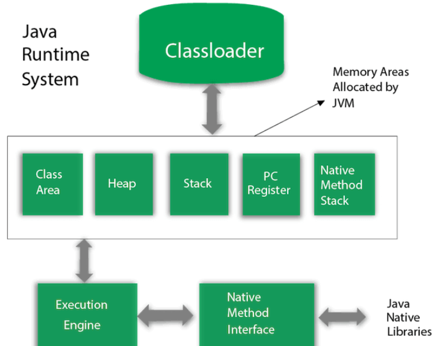
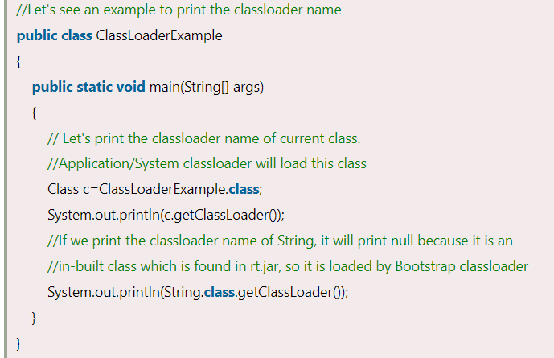

JVM (Java Virtual Machine) Architecture

JVM (Java Virtual Machine) is an abstract machine. It is a specification that provides runtime environment in which java bytecode can be executed.

JVMs are available for many hardware and software platforms (i.e. JVM is platform dependent).

### **What is JVM**

It is:

1.  **A specification** where working of Java Virtual Machine is specified. But implementation provider is independent to choose the algorithm. Its implementation has been provided by Oracle and other companies.
2.  **An implementation** Its implementation is known as JRE (Java Runtime Environment).
3.  **Runtime Instance** Whenever you write java command on the command prompt to run the java class, an instance of JVM is created.

### **What it does**

The JVM performs following operation:

-   Loads code
-   Verifies code
-   Executes code
-   Provides runtime environment

JVM provides definitions for the:

-   Memory area
-   Class file format
-   Register set
-   Garbage-collected heap
-   Fatal error reporting etc.

## **JVM Architecture**

Let's understand the internal architecture of JVM. It contains classloader, memory area, execution engine etc.

### **1) Classloader**

Classloader is a subsystem of JVM which is used to load class files. Whenever we run the java program, it is loaded first by the classloader. There are three built-in classloaders in Java.

1.  **Bootstrap ClassLoader**: This is the first classloader which is the super class of Extension classloader. It loads the *rt.jar* file which contains all class files of Java Standard Edition like java.lang package classes, java.net package classes, java.util package classes, java.io package classes, java.sql package classes etc.
2.  **Extension ClassLoader**: This is the child classloader of Bootstrap and parent classloader of System classloader. It loades the jar files located inside *\$JAVA_HOME/jre/lib/ext* directory.
3.  **System/Application ClassLoader**: This is the child classloader of Extension classloader. It loads the classfiles from classpath. By default, classpath is set to current directory. You can change the classpath using "-cp" or "-classpath" switch. It is also known as Application classloader.

Output:

These are the internal classloaders provided by Java. If you want to create your own classloader, you need to extend the ClassLoader class.

### **2) Class(Method) Area**

Class(Method) Area stores per-class structures such as the runtime constant pool, field and method data, the code for methods.

### **3) Heap**

It is the runtime data area in which objects are allocated.

### **4) Stack**

Java Stack stores frames. It holds local variables and partial results, and plays a part in method invocation and return.

Each thread has a private JVM stack, created at the same time as thread.

A new frame is created each time a method is invoked. A frame is destroyed when its method invocation completes.

### **5) Program Counter Register**

PC (program counter) register contains the address of the Java virtual machine instruction currently being executed.

### **6) Native Method Stack**

It contains all the native methods used in the application.

### **7) Execution Engine**

It contains:

1.  **A virtual processor**
2.  **Interpreter:** Read bytecode stream then execute the instructions.
3.  **Just-In-Time(JIT) compiler:** It is used to improve the performance. JIT compiles parts of the byte code that have similar functionality at the same time, and hence reduces the amount of time needed for compilation. Here, the term "compiler" refers to a translator from the instruction set of a Java virtual machine (JVM) to the instruction set of a specific CPU.

### **8) Java Native Interface**

Java Native Interface (JNI) is a framework which provides an interface to communicate with another application written in another language like C, C++, Assembly etc. Java uses JNI framework to send output to the Console or interact with OS libraries.
