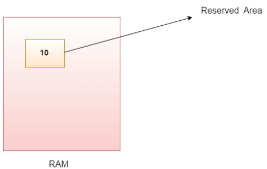

# Java Variables

**Content**

1\. Java Variables

2\. Types of Variables

2.1 Local Variable

2.2 Instance Variable

2.3 Static variable

2.4 Example to understand the three types of variables in java

3\. References

## 1. Java Variables

-   A variable is the name of a reserved area allocated in memory.
-   In other words, it is a name of the memory location.
-   It is a combination of "vary + able" which means its value can be changed.
-   A variable is a container which holds the value while the Java program is executed.
-   A variable is assigned with a data type.

**Syntax:**

datatype variable_name=value;

**Example**

## 2. Types of Variables

-   There are three types of variables in Java

## 2.1 Local Variable

-   A variable declared inside the body of the method is called local variable.
-   You can use this variable only within that method and the other methods in the class aren't even aware that the variable exists.
-   A local variable cannot be defined with "static" keyword.

## 2.2 Instance Variable

-   A variable declared inside the class but outside the body of the method, is called an instance variable.
-   It is not declared as static.
-   It is called an instance variable because its value is instance-specific and is not shared among instances.

## 2.3 Static variable

-   A variable that is declared as static is called a static variable.
-   It cannot be local.
-   You can create a single copy of the static variable and share it among all the instances of the class.
-   Memory allocation for static variables happens only once when the class is loaded in the memory.

## 2.4 Example to understand the three types of variables in java

## 3. References

1.  https://www.javatpoint.com/java-variables
