# Java Flow Control Statements

**Content**

**1. Java Flow Control Statements**

**1.1 Decision-Making Statements**

1.1.1 If Statement

1.1.2 Switch Statement

**1.2 Loop Statements**

1.2.1 for Loop

1.2.2 for-each Loop

1.2.3 while Loop

1.2.4 do-while Loop

**1.3 Jump Statements**

1.3.1 break Statement

1.3.2 continue Statement

**2. References**

## 1. Java Flow Control Statements

-   Java compiler executes the code from top to bottom.
-   The statements in the code are executed according to the order in which they appear.
-   However, Java provides statements that can be used to control the flow of Java code. Such statements are called **control flow statements**.
-   It is one of the fundamental features of Java, which provides a smooth flow of program.
-   Java provides **three** types of control flow statements.

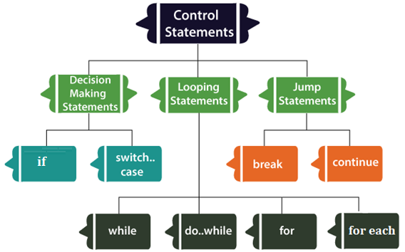

## 1.1 Decision-Making Statements

-   As the name suggests, decision-making statements decide which statement to execute and when.
-   Decision-making statements evaluate the Boolean expression and control the program flow depending upon the result of the condition provided.
-   There are **two types** of **decision-making statements** in Java, i.e., **If** statement and **switch** statement.

## 1.1.1 If Statement

-   In Java, the "if" statement is used to evaluate a condition.
-   The control of the program is diverted depending upon the specific condition.
-   The condition of the If statement gives a Boolean value, either true or false.
-   In Java, there are **four types** of **if-statements** given below.
1.  Simple if statement
2.  if-else statement
3.  if-else-if ladder
4.  Nested if-statement

Let's understand the if-statements one by one.

## 1) Simple if Statement

-   It is the most basic statement among all control flow statements in Java.
-   It evaluates a Boolean expression and enables the program to enter a block of code if the expression evaluates to true.

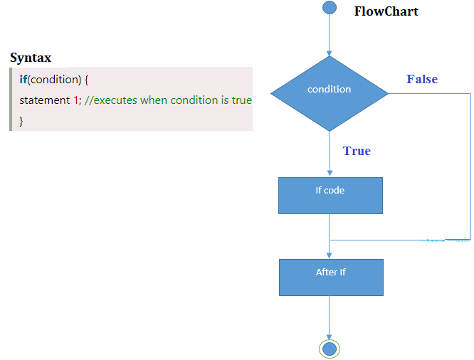

**Example**

**Output**

****

## 2) if-else Statement

-   The if-else statement is an extension to the if-statement, which uses another block of code, i.e., else block.
-   The else block is executed if the condition of the if-block is evaluated as false.

**Example**

**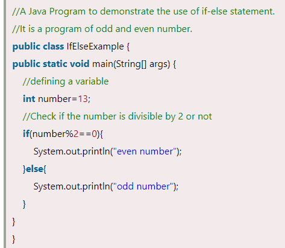**

**Output**

## 3) if-else-if ladder Statement

-   The if-else-if statement contains the if-statement followed by multiple else-if statements.
-   In other words, we can say that it is the chain of if-else statements that create a decision tree where the program may enter in the block of code where the condition is true.
-   We can also define an else statement at the end of the chain.

**Example**

**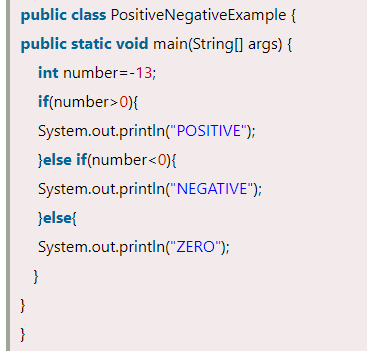**

**Output**

## 4) Nested if-statement

-   In nested if-statements, the **if statement** can **contains** an **if** or **if-else** statement **inside another** **if or else-if** statement.

**Example**

****

**Output**

## 1.1.2 Switch Statement

-   In Java, Switch statements are similar to if-else-if statements.
-   The switch statement contains multiple blocks of code called cases and a single case is executed based on the variable which is being switched.
-   The switch statement is easier to use instead of if-else-if statements.
-   It also enhances the readability of the program.

**Important Points to be noted about switch statement:**

-   The case variables can be int, short, byte, char, or enumeration. String type is also supported since version 7 of Java.
-   Cases cannot be duplicate.
-   Default statement is executed when any of the case doesn't match the value of expression. It is optional.
-   Break statement terminates the switch block when the condition is satisfied.  
    It is optional, if not used, next case is executed.
-   While using switch statements, we must notice that the case expression will be of the same type as the variable. However, it will also be a constant value.

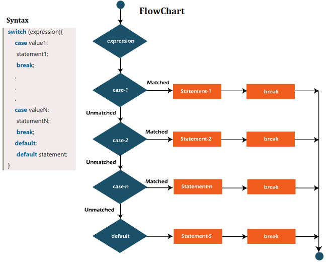

**Example**

**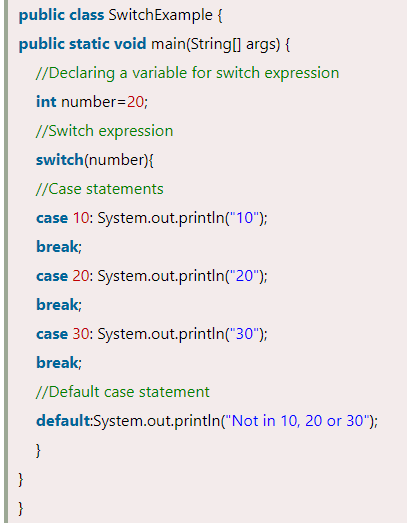**

**Output**

## 1.2 Loop Statements

-   In programming, sometimes we need to execute the block of code repeatedly while some condition evaluates to true.
-   However, loop statements are used to execute the set of instructions depends upon a particular condition.
-   In Java, we have **three types of loops** that execute similarly. However, there are differences in their syntax and condition checking time.

Let's understand the loop statements one by one.

## 1.2.1 for Loop

-   The Java *for loop* is used to iterate a part of the program several times.
-   If the number of iteration is **fixed**, it is recommended to use for loop.
-   There are three types of for loops in Java.
1.  Simple for Loop
2.  For-each or Enhanced for Loop
3.  Labeled for Loop

## 1) Simple for Loop

-   A simple for loop is the same as [C](https://www.javatpoint.com/c-programming-language-tutorial)/C++.
-   We can initialize the variable, check condition and increment/decrement value.
-   It consists of **four parts**:
1.  **Initialization**: Which is executed once when the loop starts. Here, we can initialize the variable, or we can use an already initialized variable.
2.  **Condition**: Which is executed each time to test the condition of the loop. It continues execution until the condition is false. It must return boolean value either true or false.
3.  **Increment/Decrement**: It increments or decrements the variable value.
4.  **Statement**: The statement of the loop is executed each time until the second condition is false.

    

**Example**

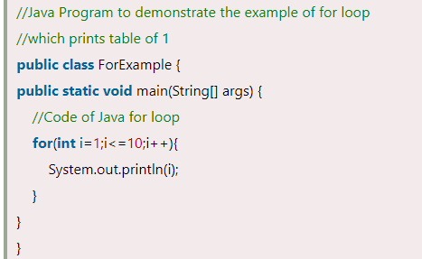

**Output**

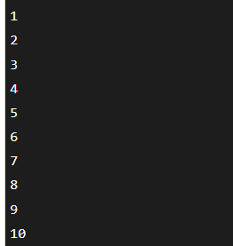

## 2) for-each Loop

-   Java provides an enhanced for loop to traverse the data structures like array or collection.
-   It is easier to use than simple for loop because we don't need to increment value and use subscript notation.
-   It works on the basis of elements and not the index.
-   It returns element one by one in the defined variable.
-   In the for-each loop, we don't need to update the loop variable.

**Syntax**

**Example**

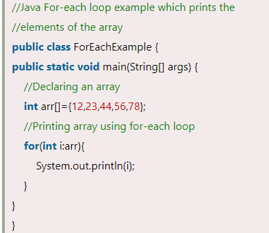

**Output**

**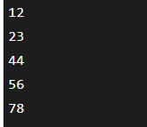**

## 3) Labeled For Loop

-   We use label before the for loop. It is useful while using the nested for loop as we can break/continue specific for loop.

****

**Syntax**

**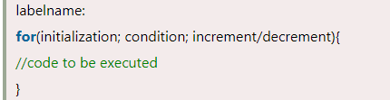**

**Example**

**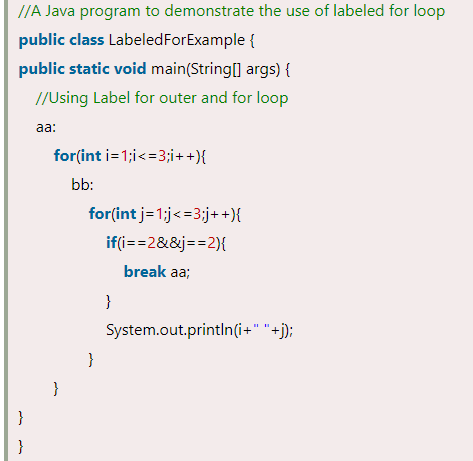**

**Output**

**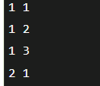**

-   If you use **break bb;**, it will break inner loop only which is the default behaviour of any loop.

## Infinitive for Loop

-   If you use two semicolons ;; in the for loop, it will be infinitive for loop.

**Syntax:**

**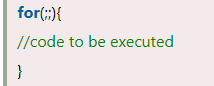**

**Example**

**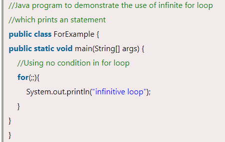**

**Output**

**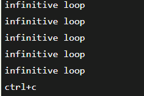**

-   Now, you need to press ctrl+c to exit from the program.

## 1.2.2 while Loop

-   The while loop is also used to iterate over the number of statements multiple times.
-   However, if we don't know the number of iterations in advance, it is recommended to use a while loop.
-   Unlike for loop, the initialization and increment/decrement doesn't take place inside the loop statement in while loop.
-   It is also known as the **entry-controlled loop** since the condition is checked at the start of the loop.
-   If the condition is true, then the loop body will be executed; otherwise, the statements after the loop will be executed.

**Example**

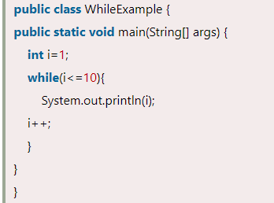

**Output**

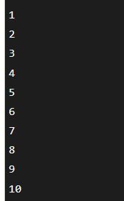

## 1.2.3 do-while Loop

-   The do-while loop checks the condition at the end of the loop after executing the loop statements.
-   When the number of iteration is not known and we have to execute the loop at least once, we can use do-while loop.
-   It is also known as the **exit-controlled loop** since the condition is not checked in advance.

## 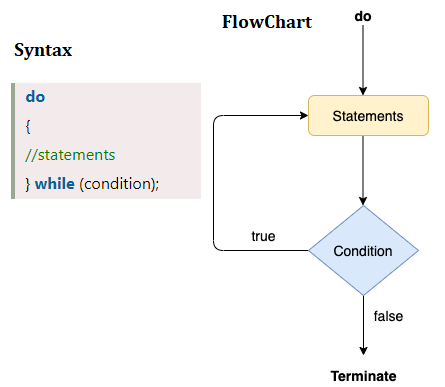

**Example**

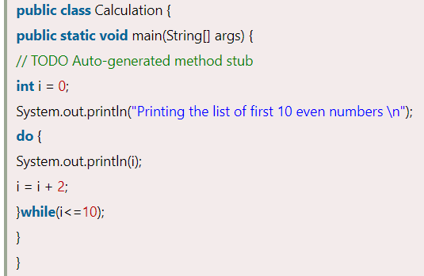

**Output**

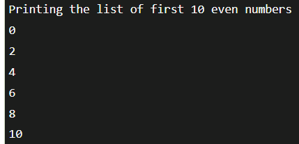

## Java for Loop Vs while Loop Vs do-while Loop

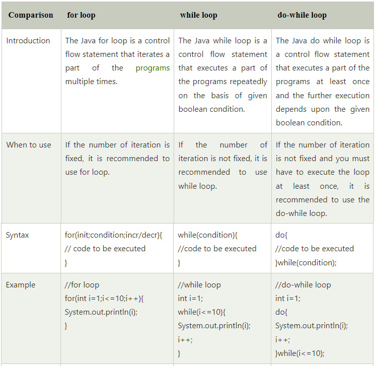

## 1.3 Jump Statements

-   Jump statements are used to transfer the control of the program to the specific statements.
-   In other words, jump statements transfer the execution control to the other part of the program.
-   There are **two types** of **jump** statements in Java.
1.  break
2.  continue

## 1.3.1 break Statement

-   As the name suggests, the break statement is used to break the current flow of the program and transfer the control to the next statement outside a loop or switch statement.
-   However, it breaks only the inner loop in the case of the nested loop.
-   We can use Java break statement in all types of loops such as for loop, while loop and do-while loop.
-   The break statement cannot be used independently in the Java program, i.e., it can only be written inside the loop or switch statement.

    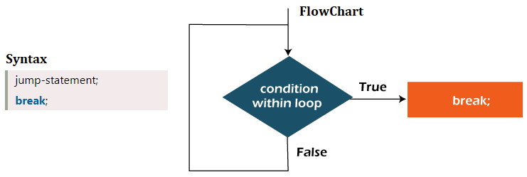

**Example**

**Output**

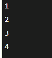

## 1.3.2 continue Statement

-   Unlike break statement, the continue statement doesn't break the loop, whereas, it skips the specific part of the loop and jumps to the next iteration of the loop immediately.
-   The Java *continue statement* is used to continue the loop.
-   It continues the current flow of the program and skips the remaining code at the specified condition.
-   In case of an inner loop, it continues the inner loop only.
-   We can use Java continue statement in all types of loops such as for loop, while loop and do-while loop.

**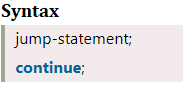**

**Example**

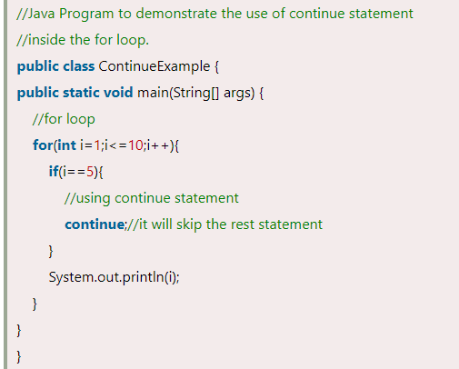

**Output**

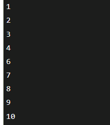

-   As you can see in the above output, 5 is not printed on the console. It is because the loop is continued when it reaches to 5.

## 2. References

1.  https://www.javatpoint.com/control-flow-in-java
