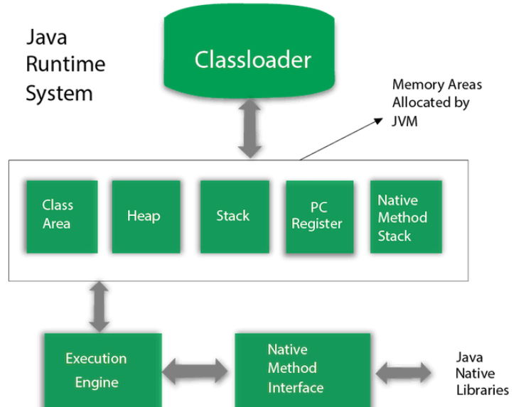

# JVM Architecture

**Content**

1\. What is JVM (Java Virtual Machine)

1.1 What it does

2\. JVM Architecture

3\. References

## 1. What is JVM (Java Virtual Machine)

It is:

1.  **A specification** where working of Java Virtual Machine is specified. But implementation provider is independent to choose the algorithm. Its implementation has been provided by Oracle and other companies.
2.  **An implementation** Its implementation is known as JRE (Java Runtime Environment).
3.  **Runtime Instance** Whenever you write java command on the command prompt to run the java class, an instance of JVM is created.

## 1.1 What it does

The JVM performs following operation:

-   Loads code
-   Verifies code
-   Executes code
-   Provides runtime environment

JVM provides definitions for the:

-   Memory area
-   Class file format
-   Register set
-   Garbage-collected heap
-   Fatal error reporting etc.

## 2. JVM Architecture

-   JVM (Java Virtual Machine) is an abstract machine.
-   It is a specification that provides runtime environment in which java bytecode can be executed.
-   JVMs are available for many hardware and software platforms (i.e. JVM is platform dependent).
-   Let's understand the internal architecture of JVM.
-   It contains classloader, memory area, execution engine etc.

## 1) Classloader

-   Classloader is a subsystem of JVM which is used to load class files.
-   Whenever we run the java program, it is loaded first by the classloader.
-   There are three built-in classloaders in Java.
1.  **Bootstrap ClassLoader**:
-   This is the first classloader which is the super class of Extension classloader.
-   It loads the *rt.jar* file which contains all class files of Java Standard Edition like java.lang package classes, java.net package classes, java.util package classes, java.io package classes, java.sql package classes etc.
1.  **Extension ClassLoader**:
-   This is the child classloader of Bootstrap and parent classloader of System classloader.
-   It loades the jar files located inside *\$JAVA_HOME/jre/lib/ext* directory.
1.  **System/Application ClassLoader**:
-   This is the child classloader of Extension classloader.
-   It loads the classfiles from classpath.
-   By default, classpath is set to current directory.
-   You can change the classpath using "-cp" or "-classpath" switch.
-   It is also known as Application classloader.

## 2) Class(Method) Area

-   Class(Method) Area stores per-class structures such as the runtime constant pool, field and method data, the code for methods.

## 3) Heap

-   It is the runtime data area in which objects are allocated.

## 4) Stack

-   Java Stack stores frames.
-   It holds local variables and partial results, and plays a part in method invocation and return.
-   Each thread has a private JVM stack, created at the same time as thread.
-   A new frame is created each time a method is invoked.
-   A frame is destroyed when its method invocation completes.

## 5) Program Counter Register

-   PC (program counter) register contains the address of the Java virtual machine instruction currently being executed.

## 6) Native Method Stack

-   It contains all the native methods used in the application.

## 7) Execution Engine

-   It contains:

**1. A virtual processor**

**2. Interpreter:**

-   Read bytecode stream then execute the instructions.

**3. Just-In-Time(JIT) compiler:**

-   It is used to improve the performance.
-   JIT compiles parts of the byte code that have similar functionality at the same time, and hence reduces the amount of time needed for compilation.
-   Here, the term "compiler" refers to a translator from the instruction set of a Java virtual machine (JVM) to the instruction set of a specific CPU.

## 8) Java Native Interface

-   Java Native Interface (JNI) is a framework which provides an interface to communicate with another application written in another language like C, C++, Assembly etc.
-   Java uses JNI framework to send output to the Console or interact with OS libraries.

## 3. References

1.  https://www.javatpoint.com/jvm-java-virtual-machine
