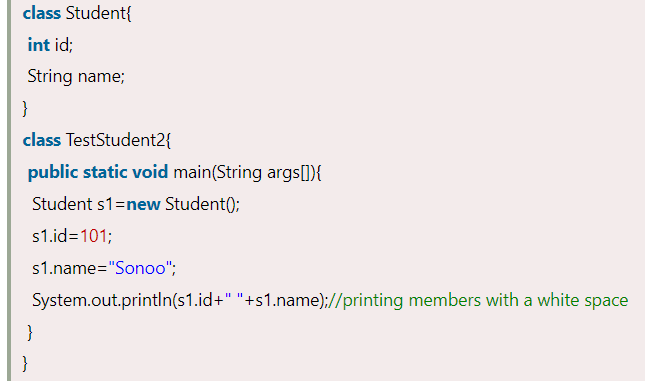
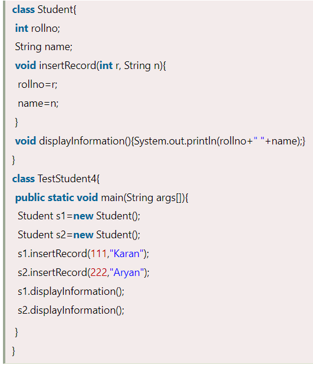
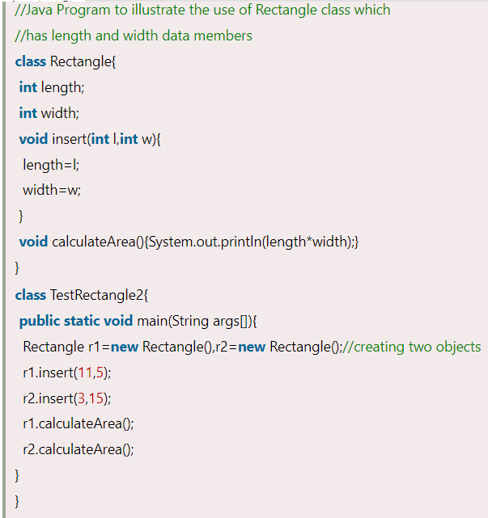

Objects and Classes in Java

In this page, we will learn about Java objects and classes. In object-oriented programming technique, we design a program using objects and classes.

An object in Java is the physical as well as a logical entity, whereas, a class in Java is a logical entity only.

### What is an object in Java

An entity that has state and behavior is known as an object e.g., chair, bike, marker, pen, table, car, etc. It can be physical or logical (tangible and intangible). The example of an intangible object is the banking system.

An object has three characteristics:

-   **State:** represents the data (value) of an object.
-   **Behavior:** represents the behavior (functionality) of an object such as deposit, withdraw, etc.
-   **Identity:** An object identity is typically implemented via a unique ID. The value of the ID is not visible to the external user. However, it is used internally by the JVM to identify each object uniquely.

For Example, Pen is an object. Its name is Reynolds; color is white, known as its state. It is used to write, so writing is its behavior.

**An object is an instance of a class.** A class is a template or blueprint from which objects are created. So, an object is the instance(result) of a class.

**Object Definitions:**

-   An object is *a real-world entity*.
-   An object is *a runtime entity*.
-   The object is *an entity which has state and behavior*.
-   The object is *an instance of a class*.

## What is a class in Java

A class is a group of objects which have common properties. It is a template or blueprint from which objects are created. It is a logical entity. It can't be physical.

A class in Java can contain:

-   **Fields**
-   **Methods**
-   **Constructors**
-   **Blocks**
-   **Nested class and interface**

### Syntax to declare a class:

### Instance variable in Java

A variable which is created inside the class but outside the method is known as an instance variable. Instance variable doesn't get memory at compile time. It gets memory at runtime when an object or instance is created. That is why it is known as an instance variable.

### Method in Java

In Java, a method is like a function which is used to expose the behavior of an object.

#### **Advantage of Method**

-   Code Reusability
-   Code Optimization

### new keyword in Java

The new keyword is used to allocate memory at runtime. All objects get memory in Heap memory area.

### Object and Class Example: main within the class

In this example, we have created a Student class which has two data members id and name. We are creating the object of the Student class by new keyword and printing the object's value.

Here, we are creating a main() method inside the class.

*File: Student.java*

Output:

### Object and Class Example: main outside the class

In real time development, we create classes and use it from another class. It is a better approach than previous one. Let's see a simple example, where we are having main() method in another class.

We can have multiple classes in different Java files or single Java file. If you define multiple classes in a single Java source file, it is a good idea to save the file name with the class name which has main() method.

*File: TestStudent1.java*

Output:

## 3 Ways to initialize object

There are 3 ways to initialize object in Java.

1.  By reference variable
2.  By method
3.  By constructor

### 1) Object and Class Example: Initialization through reference

Initializing an object means storing data into the object. Let's see a simple example where we are going to initialize the object through a reference variable.

*File: TestStudent2.java*

Output:

We can also create multiple objects and store information in it through reference variable.

*File: TestStudent3.java*

Output:

### 2) Object and Class Example: Initialization through method

In this example, we are creating the two objects of Student class and initializing the value to these objects by invoking the insertRecord method. Here, we are displaying the state (data) of the objects by invoking the displayInformation() method.

*File: TestStudent4.java*

**

**

As you can see in the above figure, object gets the memory in heap memory area. The reference variable refers to the object allocated in the heap memory area. Here, s1 and s2 both are reference variables that refer to the objects allocated in memory.

### 3) Object and Class Example: Initialization through a constructor

We will learn about constructors in Java later.

### Object and Class Example: Employee

Let's see an example where we are maintaining records of employees.

*File: TestEmployee.java*

**

Output:

**

## What are the different ways to create an object in Java?

There are many ways to create an object in java. They are:

We will learn these ways to create object later.

## Anonymous object

Anonymous simply means nameless. An object which has no reference is known as an anonymous object. It can be used at the time of object creation only.

If you have to use an object only once, an anonymous object is a good approach. For example:

**

Calling method through a reference:

**

Calling method through an anonymous object

**

Let's see the full example of an anonymous object in Java.

**

Output:

**

### Creating multiple objects by one type only

We can create multiple objects by one type only as we do in case of primitives.

Initialization of primitive variables:

**

Initialization of refernce variables:

**

Let's see the example:

**

Output:

**

References

1.  https://www.javatpoint.com/object-and-class-in-java
