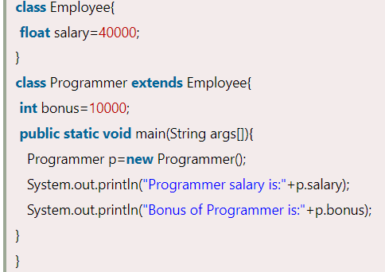
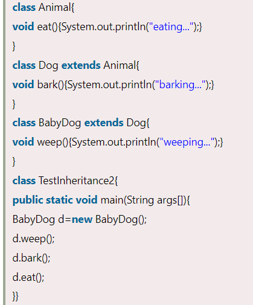
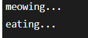

Inheritance in Java

**Inheritance in Java** is a mechanism in which one object acquires all the properties and behaviors of a parent object. It is an important part of [OOPs](https://www.javatpoint.com/java-oops-concepts) (Object Oriented programming system).

The idea behind inheritance in Java is that you can create new [classes](https://www.javatpoint.com/object-and-class-in-java) that are built upon existing classes. When you inherit from an existing class, you can reuse methods and fields of the parent class. Moreover, you can add new methods and fields in your current class also.

Inheritance represents the **IS-A relationship** which is also known as a *parent-child* relationship.

### Why use inheritance in java

-   For [Method Overriding](https://www.javatpoint.com/method-overriding-in-java) (so [runtime polymorphism](https://www.javatpoint.com/runtime-polymorphism-in-java) can be achieved).
-   For Code Reusability.

### Terms used in Inheritance

-   **Class:** A class is a group of objects which have common properties. It is a template or blueprint from which objects are created.
-   **Sub Class/Child Class:** Subclass is a class which inherits the other class. It is also called a derived class, extended class, or child class.
-   **Super Class/Parent Class:** Superclass is the class from where a subclass inherits the features. It is also called a base class or a parent class.
-   **Reusability:** As the name specifies, reusability is a mechanism which facilitates you to reuse the fields and methods of the existing class when you create a new class. You can use the same fields and methods already defined in the previous class.

### The syntax of Java Inheritance

The **extends keyword** indicates that you are making a new class that derives from an existing class. The meaning of "extends" is to increase the functionality.

In the terminology of Java, a class which is inherited is called a parent or superclass, and the new class is called child or subclass.

### Java Inheritance Example

As displayed in the above figure, Programmer is the subclass and Employee is the superclass. The relationship between the two classes is **Programmer IS-A Employee**. It means that Programmer is a type of Employee.

Output

In the above example, Programmer object can access the field of own class as well as of Employee class i.e. code reusability.

## Types of inheritance in java

On the basis of class, there can be three types of inheritance in java: single, multilevel and hierarchical.

In java programming, multiple and hybrid inheritance is supported through interface only. We will learn about interfaces later.

When one class inherits multiple classes, it is known as multiple inheritance. For Example:

## Single Inheritance Example

When a class inherits another class, it is known as a *single inheritance*. In the example given below, Dog class inherits the Animal class, so there is the single inheritance.

*File: TestInheritance.java*

Output:

## Multilevel Inheritance Example

When there is a chain of inheritance, it is known as *multilevel inheritance*. As you can see in the example given below, BabyDog class inherits the Dog class which again inherits the Animal class, so there is a multilevel inheritance.

*File: TestInheritance2.java*

Output:

## Hierarchical Inheritance Example

When two or more classes inherits a single class, it is known as *hierarchical inheritance*. In the example given below, Dog and Cat classes inherits the Animal class, so there is hierarchical inheritance.

*File: TestInheritance3.java*

Output:

## Q) Why multiple inheritance is not supported in java?

To reduce the complexity and simplify the language, multiple inheritance is not supported in java.

Consider a scenario where A, B, and C are three classes. The C class inherits A and B classes. If A and B classes have the same method and you call it from child class object, there will be ambiguity to call the method of A or B class.

Since compile-time errors are better than runtime errors, Java renders compile-time error if you inherit 2 classes. So whether you have same method or different, there will be compile time error.

Output:

References

1.  https://www.javatpoint.com/inheritance-in-java
