# Java Constructors

**Content**

1\. Java Constructors

1.1 Rules for creating Java constructor

2\. Types of Java constructors

2.1 Java Default Constructor

2.2 Java Parameterized Constructor

3\. Constructor Overloading in Java

4\. Difference between constructor and method in Java

5\. Java Copy Constructor

5.1 Copying values with constructor

5.2 Copying values without constructor

6\. References

## 1. Java Constructors

-   In Java, a constructor is a block of codes similar to the method.
-   Constructor is called when an instance of the class is created.
-   At the time of calling constructor, memory for the object is allocated in the memory.
-   It is a special type of method which is used to initialize the object.
-   Every time an object is created using the new() keyword, at least one constructor is called.
-   It calls a default constructor if there is no constructor available in the class. In such case, Java compiler provides a default constructor by default.

## 1.1 Rules for creating Java constructor

1.  Constructor name must be the same as its class name
2.  A Constructor must have no explicit return type
3.  A Java constructor cannot be abstract, static, final, and synchronized

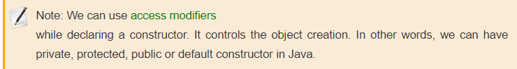

## 2. Types of Java constructors

-   There are two types of constructors in Java:

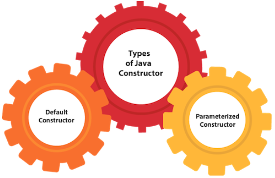

## 2.1 Java Default Constructor

-   A constructor is called "Default Constructor" when it doesn't have any parameter.

**Syntax:**

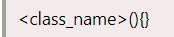

**Example**:

-   In this example, we are creating the no-arg constructor in the Bike class.
-   It will be invoked at the time of object creation.

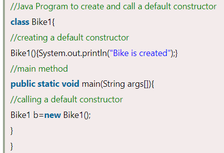

**Output:**

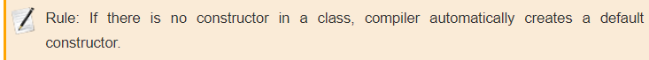

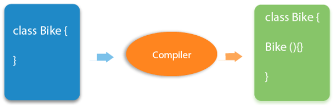

**Q) What is the purpose of a default constructor?**

-   The default constructor is used to provide the default values to the object like 0, null, etc., depending on the type.

**Example of default constructor that displays the default values**

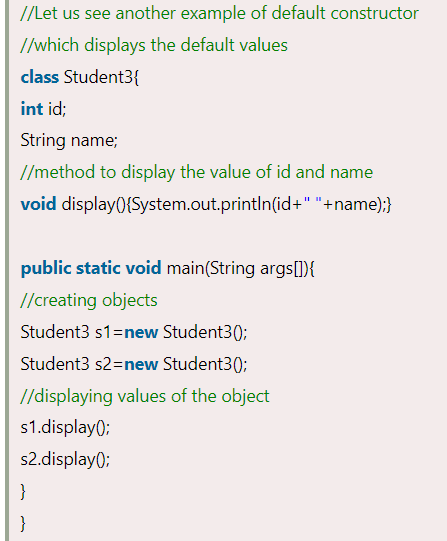

**Output:**

**Explanation:**

-   In the above class, you are not creating any constructor so compiler provides you a default constructor.
-   Here 0 and null values are provided by default constructor.

## 2.2 Java Parameterized Constructor

-   A constructor which has a specific number of parameters is called a parameterized constructor.

**Why use the parameterized constructor?**

-   The parameterized constructor is used to provide different values to distinct objects.
-   However, you can provide the same values also.

**Example:**

-   In this example, we have created the constructor of Student class that have two parameters.
-   We can have any number of parameters in the constructor.

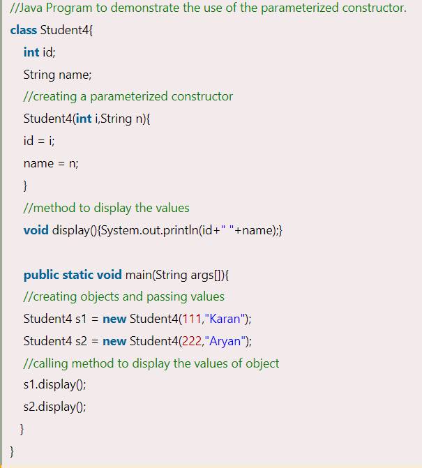

**Output:**

## 3. Constructor Overloading in Java

-   In Java, a constructor is just like a method but without return type. It can also be overloaded like Java methods.
-   Constructor overloading in Java is a technique of having more than one constructor with different parameter lists.
-   They are arranged in a way that each constructor performs a different task.
-   They are differentiated by the compiler by the number of parameters in the list and their types.

**Example:**

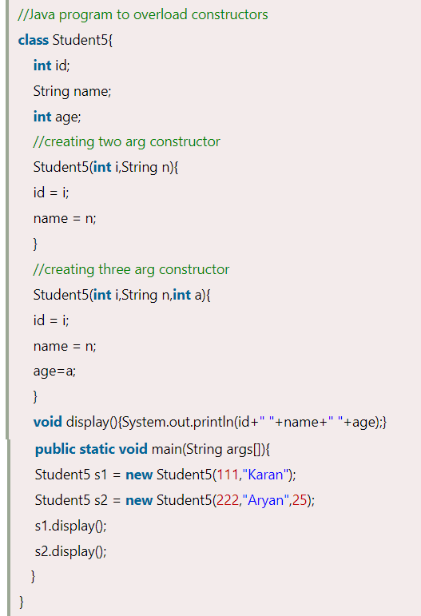

**Output:**

## 4. Difference between constructor and method in Java

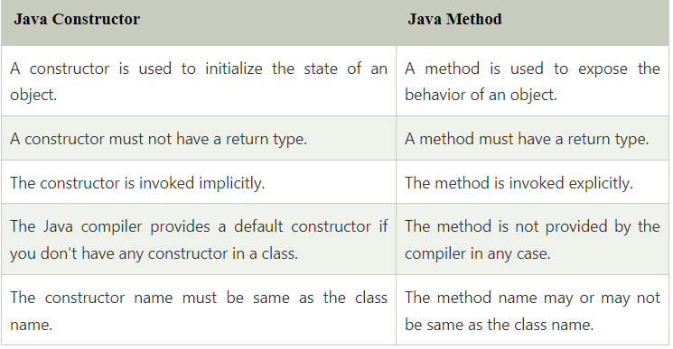

## 5. Java Copy Constructor

-   There is no copy constructor in Java. However, we can copy the values from one object to another like copy constructor in C++.
-   There are many ways to copy the values of one object into another in Java. They are:
1.  Copying values with constructor.
2.  By assigning the values of one object into another without constructor.

## 5.1 Copying values with constructor

-   We are going to copy the values of one object into another using Java constructor.

**Example:**

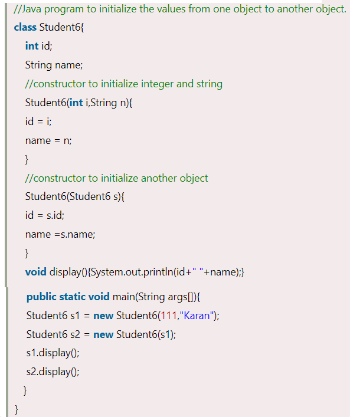

**Output:**

****

## 5.2 Copying values without constructor

-   We can copy the values of one object into another by assigning the objects values to another object.
-   In this case, there is no need to create the constructor.

**Example:**

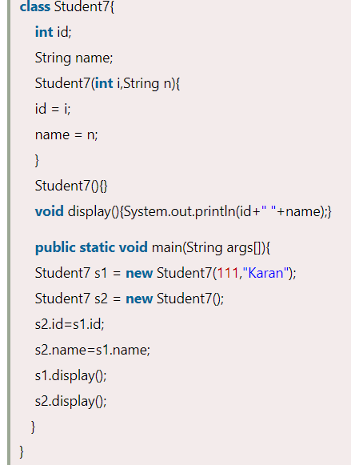

**Output:**

## 6. References

1.  https://www.javatpoint.com/java-constructor
