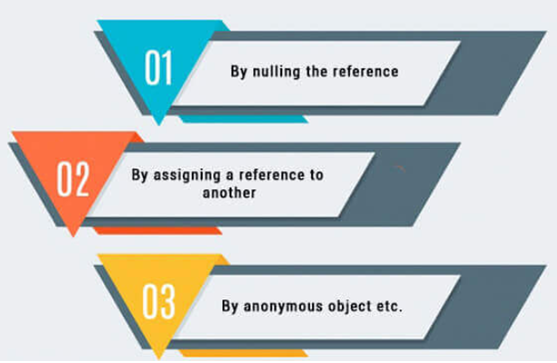
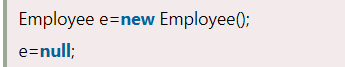
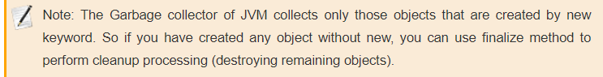
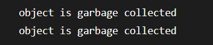

# Java Garbage Collection

**Content**

1\. Java Garbage Collection

1.1 Advantage of Garbage Collection

1.2 How can an object be unreferenced?

2\. References

## 1. Java Garbage Collection

-   When JVM starts up, it creates a **heap area** which is known as **runtime data area.**
-   This area is used to store all the objects (instances of class).
-   Since this area is limited, it is required to manage this area efficiently by removing the objects that are no longer in use.
-   The process of removing unused objects from heap memory is known as **Garbage collection** and this is a part of memory management in Java.
-   Languages like C/C++ **don’t** support automatic garbage collection, however in java, the garbage collection is automatic.
-   In java, garbage means unreferenced objects.

## 1.1 Advantage of Garbage Collection

-   It makes java **memory efficient** because garbage collector removes the unreferenced objects from heap memory.
-   It is **automatically done** by the garbage collector(a part of JVM) so we don't need to make extra efforts.

## 1.2 How can an object be unreferenced?

**1) By nulling a reference:**

**2) By assigning a reference to another:**

**3) By anonymous object:**

## finalize() method

-   The finalize() method is invoked each time before the object is garbage collected.
-   This method can be used to perform cleanup processing.
-   This method is defined in Object class as:

## gc() method

-   The gc() method is used to invoke the garbage collector to perform cleanup processing.
-   The gc() is found in System and Runtime classes.

**Simple Example of garbage collection in java**

## 2. References

1.  https://www.javatpoint.com/Garbage-Collection
2.  https://beginnersbook.com/2013/04/java-garbage-collection/
