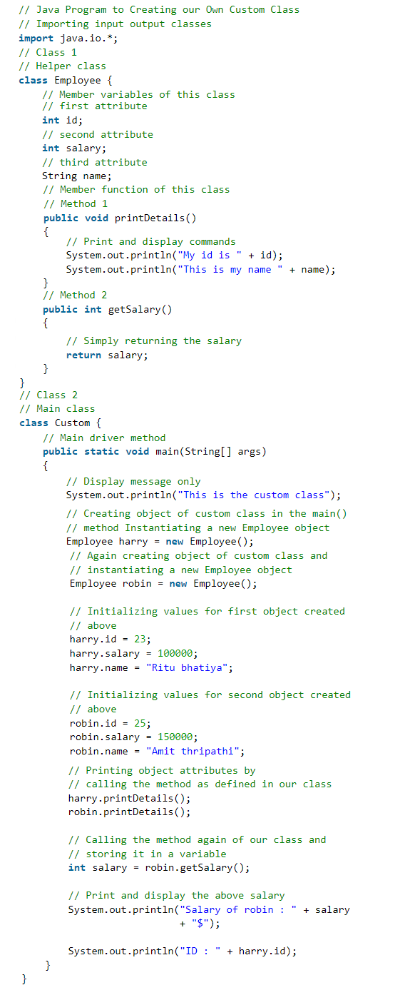
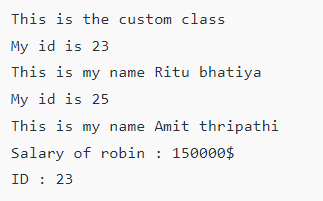

**Create a Custom Class in Java**

-   Class is a templates and prototypes or blueprints.
-   Class does not occupy memory.
-   We can write a custom class as per our choice for an illustration purpose a sample is shown in the program below as a helper class.

**Example:**

**Output:**

References

https://www.geeksforgeeks.org/how-to-create-custom-class-in-java/
