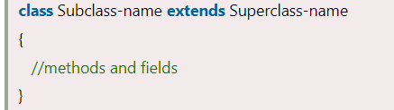
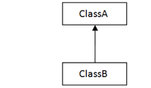
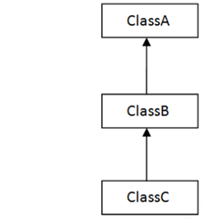
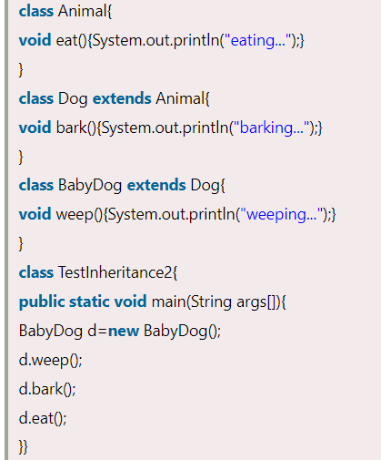
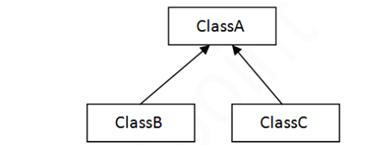
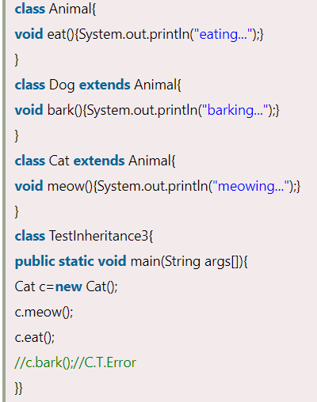
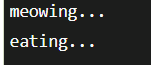
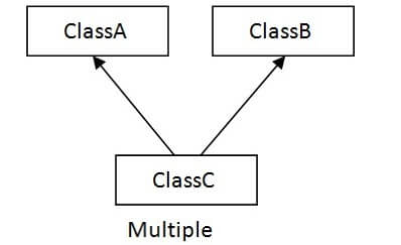
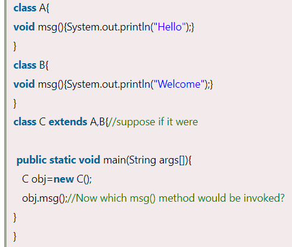

# Inheritance

**Content**

1\. Inheritance in java

1.1 Why use inheritance in java

1.2 Terms used in inheritance

2\. Types of inheritance in java

2.1 Single inheritance

2.2 Multilevel inheritance

2.3 Hierarchical inheritance

3\. References

## 1. Inheritance in java

-   Inheritance is a mechanism in which child object acquires all the properties and behaviors of a parent object.
-   It is an important part of OOPs (Object Oriented programming system).
-   The idea behind inheritance is that you can create new classes that are built upon existing classes.
-   When you inherit from an existing class, you can reuse methods and fields of the parent class.
-   Moreover, you can add new methods and fields in your current class also.
-   Inheritance represents the **IS-A relationship** which is also known as a **parent-child** relationship.

## 1.1 Why use inheritance in java

-   For Method Overriding (so runtime polymorphism can be achieved).
-   For Code Reusability.

## 1.2 Terms used in inheritance

**Class:**

-   It is a template or blueprint from which objects are created.

**Sub Class/Child Class:**

-   Subclass is a class which inherits the other class.
-   It is also called a derived class, extended class, or child class.

**Super Class/Parent Class:**

-   Superclass is the class from where a subclass inherits the features.
-   It is also called a base class or a parent class.

**Reusability:**

-   As the name specifies, reusability is a mechanism which facilitates you to reuse the fields and methods of the existing class when you create a new class.
-   You can use the same fields and methods already defined in the previous class.

**Syntax:**

**extends keyword:**

-   It indicates that you are making a new class that derives from an existing class.
-   The meaning of "extends" is to increase the functionality.

## 2. Types of inheritance in java

-   There can be three types of inheritance in java:
1.  Single inheritance
2.  Multilevel inheritance
3.  Hierarchical inheritance
-   In java programming, multiple and hybrid inheritance is supported through interface only.

## 2.1 Single inheritance

-   When a class inherits another class, it is known as a *single inheritance*.

**Example: TestInheritance.java**

**Output:**

## 2.2 Multilevel inheritance

-   When there is a chain of inheritance, it is known as *multilevel inheritance*.

    

-   As you can see in the example given below, BabyDog class inherits the Dog class which again inherits the Animal class, so there is a multilevel inheritance.

**Example: TestInheritance2.java**

**Output:**

## 2.3 Hierarchical inheritance

-   When two or more classes inherits a single class, it is known as *hierarchical inheritance*.

    

-   In the example given below, Dog and Cat classes inherits the Animal class, so there is hierarchical inheritance.

**Example: TestInheritance3.java**

**Output:**

## Q) Why multiple inheritance is not supported in java?

-   multiple inheritance is not supported in java.

-   Consider a scenario where A, B, and C are three classes.
-   The C class inherits A and B classes.
-   If A and B classes have the same method and you call it from child class object, there will be ambiguity to call the method of A or B class.
-   Since compile-time errors are better than runtime errors, Java renders compile-time error if you inherit 2 classes.
-   So whether you have same method or different, there will be compile time error.

**Example:**

**Output:**

## 3. References

1.  https://www.javatpoint.com/inheritance-in-java
