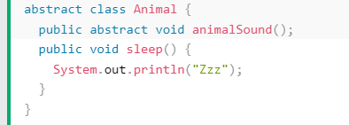
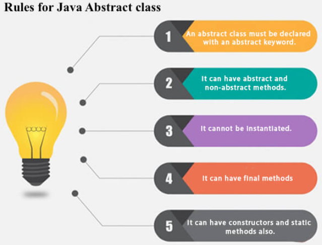
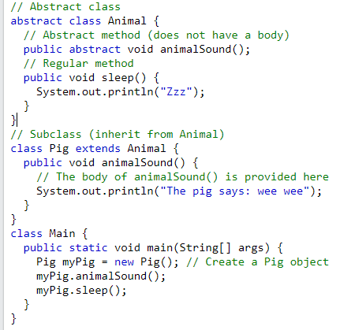
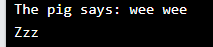

# Abstraction in Java

**Content**

1\. Abstraction in Java

1.1 Abstract class in Java

1.2 Abstract Method in Java

2\. References

## 1. Abstraction in Java

-   **Abstraction** is a process of hiding the implementation details and showing only functionality to the user.
-   Another way, it shows only essential things to the user and hides the internal details.
-   For example, sending SMS where you type the text and send the message. You don't know the internal processing about the message delivery.
-   Abstraction lets you focus on what the object does instead of how it does it.

**Ways to achieve Abstraction**

There are two ways to achieve abstraction in java

1.  Abstract class (0 to 100%)
2.  Interface (100%)

## 1.1 Abstract class in Java

-   A class which is declared with the abstract keyword is known as an abstract class in Java.
-   It can have abstract and non-abstract methods (method with the body).
-   **Abstract class:** is a restricted class that cannot be used to create objects (to access it, it must be inherited from another class).
-   An abstract class can have both abstract and regular methods.

-   From the example above, it is not possible to create an object of the Animal class:

-   To access the abstract class, it must be inherited from another class.

## 1.2 Abstract Method in Java

-   A method which is declared as abstract and it does not have a body is known as an abstract method.
-   The body is provided by the subclass (inherited from).

**Example of abstract method**

**Example for abstract class and abstract method**

Output:

**Why and when to use abstract classes and methods?**

-   To achieve security - hide certain details and only show the important details of an object.

## 2. References

https://www.w3schools.com/java/java_abstract.asp
