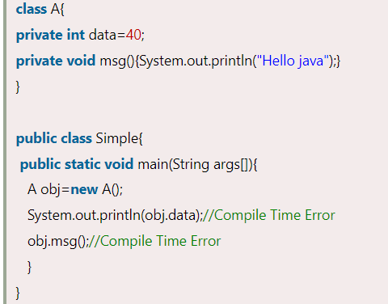
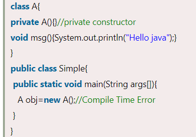
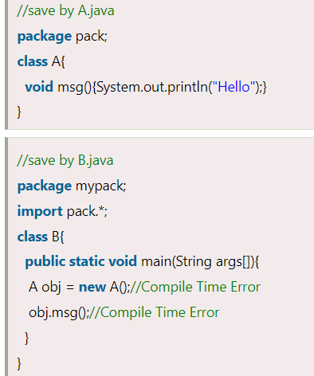
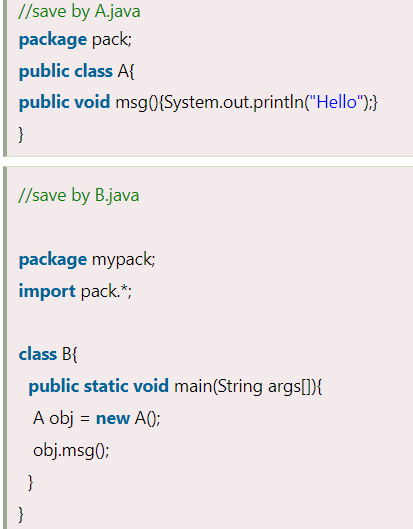
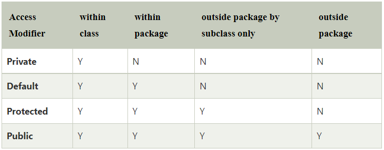

# Modifiers

**Content**

1\. Modifiers

1.1 Access Modifiers

1.2 Non-access Modifiers

2\. References

## 1. Modifiers

-   There are two types of modifiers in Java.
1.  **access modifiers**
2.  **non-access modifiers**.

## 1.1 Access Modifiers

-   The access modifiers in Java specifies the accessibility or scope of a field, method, constructor, or class.
-   We can change the access level of fields, constructors, methods, and class by applying the access modifier on it.
-   There are four types of Java access modifiers:
1.  Private
2.  default
3.  Public
4.  Protected

## 1) Private:

-   The access level of a private modifier is only within the class.
-   It cannot be accessed from outside the class.

**Simple example of private access modifier**

-   In this example, we have created two classes A and Simple.
-   A class contains private data member and private method.
-   We are accessing these private members from outside the class, so there is a compile-time error.

    

### Role of Private Constructor

-   If you make any constructor as private, you cannot create the instance of that class from outside the class.

**Example:**

## 2) Default:

-   The access level of a default modifier is only within the package.
-   It cannot be accessed from outside the package.
-   If you do not specify any access level, it will be the default.

**Example of default access modifier**

-   In this example, we have created two packages pack and mypack.
-   We are accessing the A class from outside its package, since A class is not public, so it cannot be accessed from outside the package.

-   In the above example, the scope of class A and its method msg() is default so it cannot be accessed from outside the package.

## 3) Protected:

-   The protected access modifier is accessible within package and outside the package but through inheritance only.
-   The protected access modifier can be applied on the data member, method and constructor. It can't be applied on the class.
-   It provides more accessibility than the default modifer.

**Example of protected access modifier**

-   In this example, we have created the two packages pack and mypack.
-   The A class of pack package is public, so can be accessed from outside the package. But msg method of this package is declared as protected, so it can be accessed from outside the class only through inheritance.

## 4) Public:

-   The access level of a public modifier is everywhere.
-   It has the widest scope among all other modifiers.
-   It can be accessed from within the class, outside the class, within the package and outside the package.

**Example of public access modifier**

-   Let's understand the access modifiers in Java by a simple table.

## 1.2 Non-access Modifiers

-   There are many non-access modifiers, such as static, abstract, synchronized, native, volatile, transient, etc.

## 2. References

1.  https://www.javatpoint.com/access-modifiers
