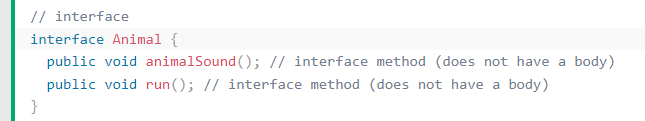
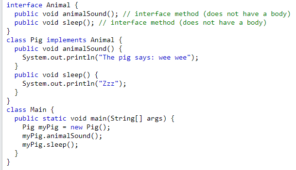
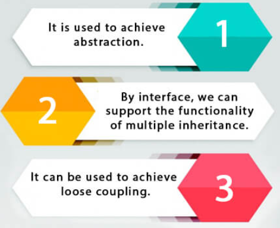
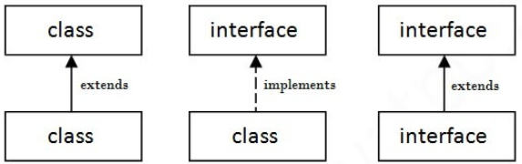
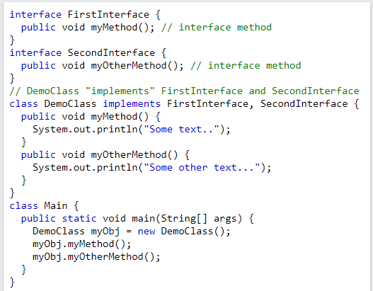
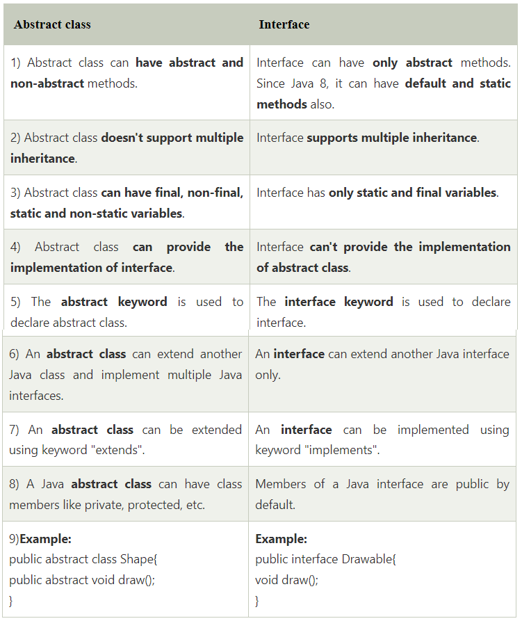

# Java Interface

**Content**

1\. Interfaces

1.1 Multiple Interfaces

1.2 Difference between abstract class and interface

2\. References

## 1. Interfaces

-   Another way to achieve abstraction in Java, is with interfaces.
-   An interface is a completely "**abstract class**" that is used to group related methods with empty bodies:

**Example-1:**

-   To access the interface methods, the interface must be "implemented" by another class with the **implements** keyword (instead of extends).
-   The body of the interface method is provided by the "implement" class.

**Example-2:**

**Output:**

**Notes on Interfaces:**

-   Like **abstract classes**, interfaces **cannot** be used to create objects (in the example above, it is not possible to create an "Animal" object in the Main Class)
-   Interface methods do not have a body - the body is provided by the "implement" class
-   On implementation of an interface, you must override all of its methods
-   Interface methods are by default abstract and public
-   Interface attributes are by default public, static and final
-   An interface cannot contain a constructor (as it cannot be used to create objects)

**Why use java interfaces?**

**The relationship between classes and interfaces**

-   As shown in the figure given below, a class extends another class, an interface extends another interface, but a **class implements an interface**.

## 1.1 Multiple Interfaces

-   To implement multiple interfaces, separate them with a comma:

**Example:**

**Output:**

## 1.2 Difference between abstract class and interface

-   Abstract class and interface both are used to achieve abstraction.
-   But there are many differences between abstract class and interface that are given below.

Simply, abstract class achieves partial abstraction (0 to 100%) whereas interface achieves fully abstraction (100%).

## 2. References

1.  https://www.w3schools.com/java/java_interface.asp
2.  https://www.javatpoint.com/difference-between-abstract-class-and-interface
