# Java Packages

**Content**

1\. Package

1.1 Built-in Packages

1.1.1 Import a Class

1.1.2 Import a Package

1.2 User-defined Packages

1.3 Advantage of Java Package

2\. Modifiers

2.1 Access Modifiers

2.2 Non-access Modifiers

3\. What is encapsulation?

4\. References

## 1. Package

-   A package in java is used to group related classes.
-   Think of it as **a folder in a file directory**.
-   We use packages to avoid name conflicts, and to write a better maintainable code.
-   Packages are divided into two categories:
1.  Built-in Packages (packages from the Java API)
2.  User-defined Packages (create your own packages)

## 1.1 Built-in Packages

-   The Java API is a library of prewritten classes, that are free to use, included in the Java Development Environment.
-   The library contains components for managing input, database programming, and much much more.
-   The complete list can be found at Oracles website: <https://docs.oracle.com/javase/8/docs/api/>.
-   The library is divided into **packages** and **classes**.
-   Meaning you can either import a single class (along with its methods and attributes), or a whole package that contain all the classes that belong to the specified package.
-   There are many built-in packages such as java, lang, awt, javax, swing, net, io, util, sql etc.
-   To use a class or a package from the library, you need to use the **import** keyword:

**Syntax**

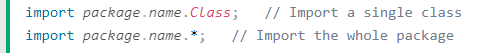

## 1.1.1 Import a Class

-   If you find a class you want to use, for example, the **Scanner** class, **which is used to get user input**, write the following code:

**Example-1**

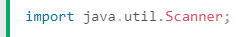

-   In the example above, **java.util** is a package, while **Scanner** is a class of the **java.util** package.
-   To use the **Scanner** class, create an object of the class and use any of the available methods found in the Scanner class documentation.
-   In the below example, we used the **nextLine()** method, which is used to read a complete line:

**Example-2**

-   Using the Scanner class to get user input:

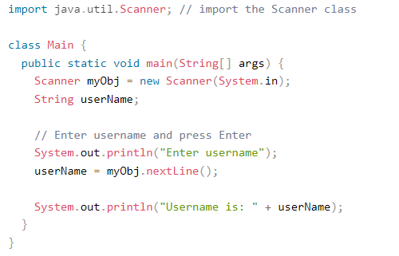

**Output:**

## 1.1.2 Import a Package

-   In the previous example, we used the Scanner class from the java.util package.
-   This package also contains date and time facilities, random-number generator and other utility classes.
-   To import a whole package, end the sentence with an asterisk sign (\*).
-   The following example will import ALL the classes in the java.util package:

**Example:**

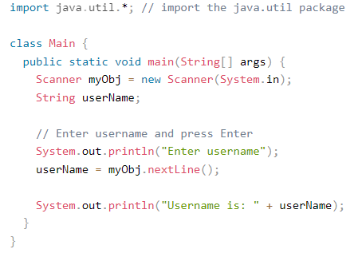

**Output:**

## 

## 1.2 User-defined Packages

-   To create your own package, you need to understand that java uses a file system directory to store them.
-   Just like folders on your computer:

**Example**

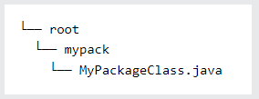

-   To create a package, use the package keyword:

**MyPackageClass.java**

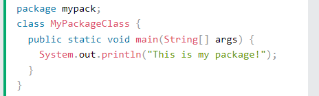

-   Save the file as **MyPackageClass.java**, and compile it:

-   Then compile the package:

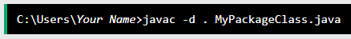

-   This forces the compiler to create the "mypack" package.
-   The -d keyword specifies the destination for where to save the class file.
-   You can use any directory name, like c:/user (windows), or, if you want to keep the package within the same directory, you can use the dot sign ".", like in the example above.

**Note:** The package name should be written in lower case to avoid conflict with class names.

-   When we compiled the package in the example above, a new folder was created, called "mypack".
-   To run the **MyPackageClass.java** file, write the following:

-   The output will be:

## 1.3 Advantage of Java Package

1.  Java package is used to categorize the classes and interfaces so that they can be easily maintained.
2.  Java package provides access protection.
3.  Java package removes naming collision.

## 2. Modifiers

-   There are two types of modifiers in Java.
1.  **access modifiers**
2.  **non-access modifiers**.

## 2.1 Access Modifiers

-   The access modifiers in Java specifies the accessibility or scope of a field, method, constructor, or class.
-   We can change the access level of fields, constructors, methods, and class by applying the access modifier on it.
-   There are four types of Java access modifiers:
1.  Private
2.  default
3.  Public
4.  Protected

## 1) Private:

-   The access level of a private modifier is only within the class.
-   It cannot be accessed from outside the class.

**Simple example of private access modifier**

-   In this example, we have created two classes A and Simple.
-   A class contains private data member and private method.
-   We are accessing these private members from outside the class, so there is a compile-time error.

    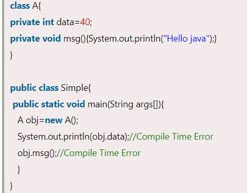

### Role of Private Constructor

-   If you make any constructor as private, you cannot create the instance of that class from outside the class.

**Example:**

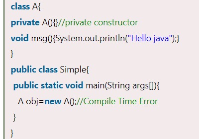

## 2) Default:

-   The access level of a default modifier is only within the package.
-   It cannot be accessed from outside the package.
-   If you do not specify any access level, it will be the default.

**Example of default access modifier**

-   In this example, we have created two packages pack and mypack.
-   We are accessing the A class from outside its package, since A class is not public, so it cannot be accessed from outside the package.

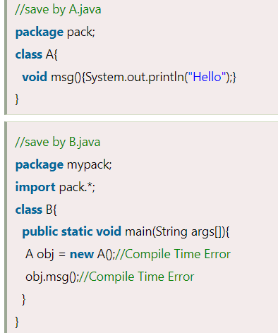

-   In the above example, the scope of class A and its method msg() is default so it cannot be accessed from outside the package.

## 3) Protected:

-   The protected access modifier is accessible within package and outside the package but through inheritance only.
-   The protected access modifier can be applied on the data member, method and constructor. It can't be applied on the class.
-   It provides more accessibility than the default modifer.

**Example of protected access modifier**

-   In this example, we have created the two packages pack and mypack.
-   The A class of pack package is public, so can be accessed from outside the package. But msg method of this package is declared as protected, so it can be accessed from outside the class only through inheritance.

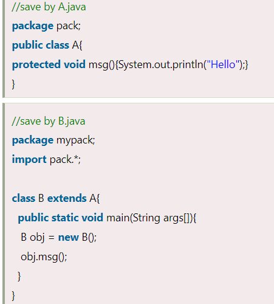

## 4) Public:

-   The access level of a public modifier is everywhere.
-   It has the widest scope among all other modifiers.
-   It can be accessed from within the class, outside the class, within the package and outside the package.

**Example of public access modifier**

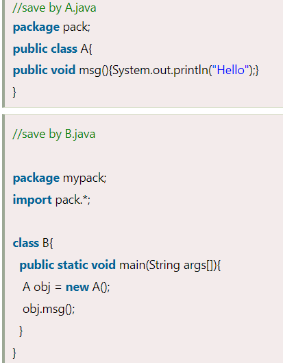

-   Let's understand the access modifiers in Java by a simple table.

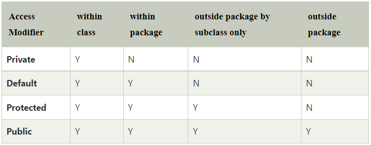

## 2.2 Non-access Modifiers

-   There are many non-access modifiers, such as static, abstract, synchronized, native, volatile, transient, etc.

## 3. What is encapsulation?

-   The whole idea behind encapsulation is to hide the implementation details from users.
-   If a data member is private it means it can only be accessed within the same class. No outside class can access private data member (variable) of other class.
-   However if we setup public getter and setter methods to update (for example void setSSN(int ssn))and read (for example int getSSN()) the private data fields then the outside class can access those private data fields via public methods.
-   This way data can only be accessed by public methods thus making the private fields and their implementation hidden for outside classes. That’s why encapsulation is known as **data hiding.**
-   Let’s see an example to understand this concept better.

**Example of Encapsulation in Java**

How to implement encapsulation in java:

1.  Make the instance variables private so that they cannot be accessed directly from outside the class. You can only set and get values of these variables through the methods of the class.
2.  Have getter and setter methods in the class to set and get the values of the fields.

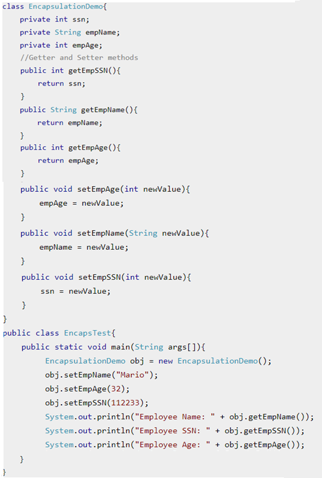

**Output:**

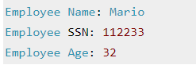

**Explaination:**

-   In above example all the three data members (or data fields) are private which cannot be accessed directly.
-   These fields can be accessed via public methods only.
-   Fields empName, ssn and empAge are made hidden data fields using encapsulation technique of OOPs.

## 4. References

1.  https://www.w3schools.com/java/java_packages.asp
2.  https://www.javatpoint.com/access-modifiers
3.  https://www.javatpoint.com/encapsulation
4.  https://beginnersbook.com/2013/05/encapsulation-in-java/
