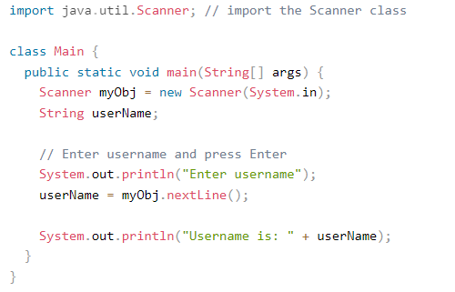
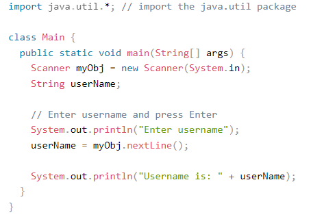
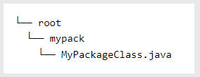
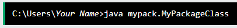

# Java Packages

**Content**

1\. Package

1.1 Built-in Packages

1.1.1 Import a Class

1.1.2 Import a Package

1.2 User-defined Packages

1.3 Advantage of Java Package

2\. References

## 1. Package

-   A package in java is used to group related classes.
-   Think of it as **a folder in a file directory**.
-   We use packages to avoid name conflicts, and to write a better maintainable code.
-   Packages are divided into two categories:
1.  Built-in Packages (packages from the Java API)
2.  User-defined Packages (create your own packages)

## 1.1 Built-in Packages

-   The Java API is a library of prewritten classes, that are free to use, included in the Java Development Environment.
-   The library contains components for managing input, database programming, and much much more.
-   The complete list can be found at Oracles website: <https://docs.oracle.com/javase/8/docs/api/>.
-   The library is divided into **packages** and **classes**.
-   Meaning you can either import a single class (along with its methods and attributes), or a whole package that contain all the classes that belong to the specified package.
-   There are many built-in packages such as java, lang, awt, javax, swing, net, io, util, sql etc.
-   To use a class or a package from the library, you need to use the **import** keyword:

**Syntax**

## 1.1.1 Import a Class

-   If you find a class you want to use, for example, the **Scanner** class, **which is used to get user input**, write the following code:

**Example**

-   In the example above, **java.util** is a package, while **Scanner** is a class of the **java.util** package.
-   To use the **Scanner** class, create an object of the class and use any of the available methods found in the Scanner class documentation.
-   In the below example, we used the **nextLine()** method, which is used to read a complete line:

**Example**

-   Using the Scanner class to get user input:

**Output:**

## 1.1.2 Import a Package

-   In the previous example, we used the Scanner class from the java.util package.
-   This package also contains date and time facilities, random-number generator and other utility classes.
-   To import a whole package, end the sentence with an asterisk sign (\*).
-   The following example will import ALL the classes in the java.util package:

### Example

Output:

## 

## 1.2 User-defined Packages

-   To create your own package, you need to understand that java uses a file system directory to store them.
-   Just like folders on your computer:

**Example**

-   To create a package, use the package keyword:

**MyPackageClass.java**

-   Save the file as **MyPackageClass.java**, and compile it:

-   Then compile the package:

-   This forces the compiler to create the "mypack" package.
-   The -d keyword specifies the destination for where to save the class file.
-   You can use any directory name, like c:/user (windows), or, if you want to keep the package within the same directory, you can use the dot sign ".", like in the example above.

**Note:** The package name should be written in lower case to avoid conflict with class names.

-   When we compiled the package in the example above, a new folder was created, called "mypack".
-   To run the **MyPackageClass.java** file, write the following:

-   The output will be:

## 1.3 Advantage of Java Package

1) Java package is used to categorize the classes and interfaces so that they can be easily maintained.

2) Java package provides access protection.

3) Java package removes naming collision.

## 2. References

1.  https://www.w3schools.com/java/java_packages.asp
