# Polymorphism

**Content**

1\. Polymorphism

2\. Types of Polymorphism

2.1 Compile-Time Polymorphism /Static/Method Overloading

2.1.1 Different ways to Overload the Methods

2.1.2 Operator overloading

2.1.3 Advantages of compile-time polymorphism:

2.2 Run-Time Polymorphism/Dynamic/Method Overriding

2.2.1 Rules for method overriding

2.2.2 Difference between Method Overloading and Method Overriding in Java

3\. References

## 1. Polymorphism

-   Polymorphism is one of the OOPs feature that allows us to perform a single action in different ways.
-   Polymorphism means "many forms", and it occurs when we have many classes that are related to each other by inheritance.
-   **For example**, think of a superclass called **Animal** that has a method called **animalSound().** Subclasses of Animals could be Pigs, Cats, Dogs, Birds - And they also have their own implementation of an animal sound (the pig oinks, and the cat meows, etc.).

    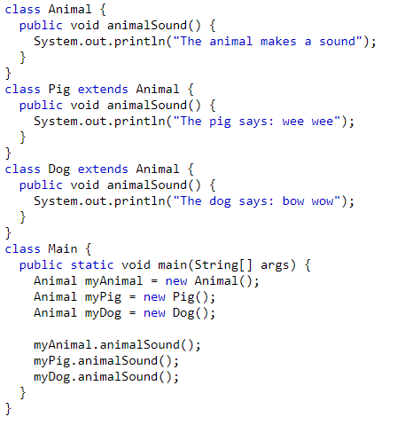

    **Output:**

    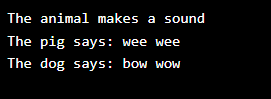

## 2. Types of Polymorphism

There are two types of polymorphism in java:

1.  **Static Polymorphism** also known as compile time polymorphism
2.  **Dynamic Polymorphism** also known as runtime polymorphism

**Note:** Run time polymorphism is implemented through Method overriding. Whereas, Compile Time polymorphism is implemented through Method overloading and Operator overloading.

## 2.1 Compile-Time Polymorphism /Static/Method Overloading

-   Compile-time polymorphism is a polymorphism that is resolved during the compilation process.
-   Overloading of methods is called through the reference variable of a class.
-   Compile-time polymorphism is achieved by **method overloading**
-   Method Overloading occurs when a class has many methods with the same name but different parameters.
-   Two or more methods may have the same name if they have other numbers of parameters, different data types, or different numbers of parameters and different data types.
-   Method overloading is also known as **Compile-time Polymorphism, Static Polymorphism, or** **Early binding** in Java.

**Example of Compile-Time Polymorphism in Java**

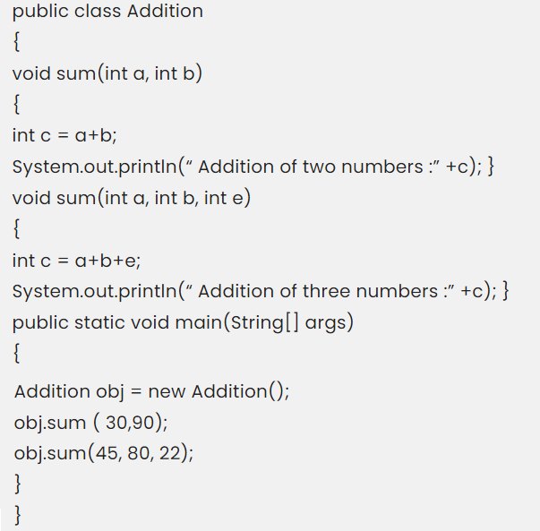

**Output:**

Sum of two numbers: 120

Sum of three numbers: 147

-   In this program, the sum() method overloads with two types via different parameters.
-   This is the basic concept of compile-time polymorphism in java where we can perform various operations by using multiple methods having the same name.

**Another Example:**

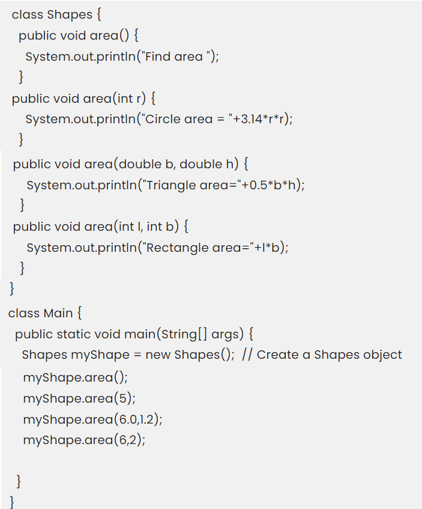

**Output:**

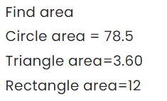

## 2.1.1 Different ways to Overload The Methods

**1). Method overloading by changing the number of parameters**

-   In this type, Method overloading is done by overloading methods in the function call with a varied number of parameters

**Example:**

-   In the given example, the first show method has one parameter, and the second show method has two methods.
-   When a function is called, the compiler looks at the number of parameters and decides how to resolve the method call.

**2). Method overloading by changing datatype of parameter**

-   In this type, Method overloading is done by overloading methods in the function call with different types of parameters

**Example:**

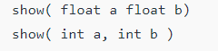

-   In the above example, the first show method has two float parameters, and the second show method has two int parameters.
-   When a function is called, the compiler looks at the data type of input parameters and decides how to resolve the method call.

**3). By changing the** **sequence of parameters**

-   In this type, overloading is dependent on the sequence of the parameters

**Example:**

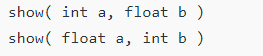

-   In this example, The parameters int and float are used in the first declaration.
-   The parameters are int and float in the second declaration, but their order in the parameter list is different.

## 2.1.1.2 Invalid cases of method overloading

-   Method overloading does not allow **changing the** **return type of method**( function ); it occurs ambiguity.

**Examples**

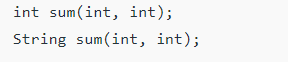

-   Because the arguments are matching, the code above will not compile.
-   Both methods have the same amount of data types and the same sequence of data types in the parameters.

## 2.1.2 Operator overloading

-   An operator is said to be overloaded if it can be used to perform more than one function.
-   Operator overloading is an overloading method in which an existing operator is given a new meaning.
-   In Java, the + operator is overloaded.
-   **Java, on the other hand, does not allow for user-defined operator overloading.**

**Example:**

-   In the above example, The ‘+’ operator has been overloaded.
-   When we send two numbers to the overloaded method, we get a sum of two integers, and when we pass two Strings, we get the concatenated text.

## 2.1.3 Advantages of compile-time polymorphism:

1.  It improves code clarity and allows for the use of a single name for similar procedures.
2.  It has a faster execution time since it is discovered early in the compilation process.

The only **disadvantage** of compile-time polymorphism is that it doesn’t include inheritance.

## 2.2 Run-Time Polymorphism/Dynamic/Method Overriding

-   Whenever an object is bound with the functionality at run time, this is known as runtime polymorphism.
-   Java virtual machine determines the proper method to call at the runtime, not at the compile time.
-   It is also called **dynamic or late binding**.
-   The runtime polymorphism can be achieved by **method overriding**.
-   In any object-oriented programming language, Overriding is a feature that allows a subclass or child class to provide a specific implementation of a method that is already provided by one of its super-classes or parent classes.
-   When a method in a subclass has the same name, same parameters or signature, and same return type(or sub-type) as a method in its super-class, then the method in the subclass is said to *override* the method in the super-class.

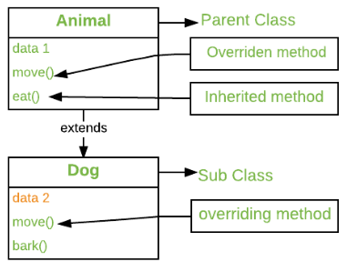

## 2.2.1 Rules for method overriding

1.  There must be an IS-A relationship (inheritance).
2.  The access modifier can only allow more access for the overridden method.
3.  A final method does not support method overriding.
4.  A static method cannot be overridden.
5.  Private methods cannot be overridden.
6.  The return type of the overriding method must be the same.
7.  We can call the parent class method in the overriding method using the super keyword.
8.  A constructor cannot be overridden because a child class and a parent class cannot have the constructor with the same name.

**Example:**

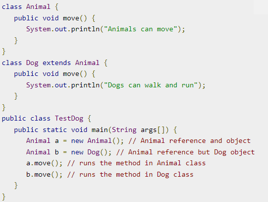

**Output:**

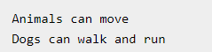

## 2.2.2 Difference between Method Overloading and Method Overriding in Java

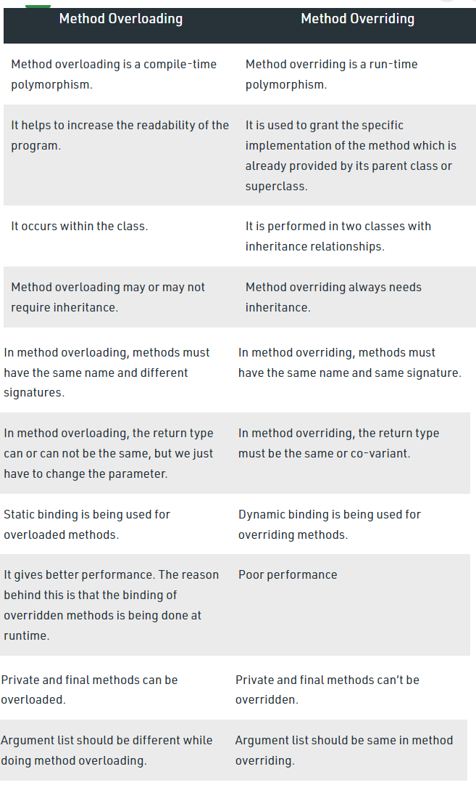

## 3. References

1.  https://www.mygreatlearning.com/blog/polymorphism-in-java/
2.  https://www.tutorialspoint.com/Runtime-Polymorphism-in-Java
