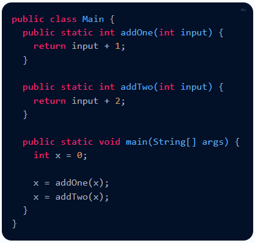
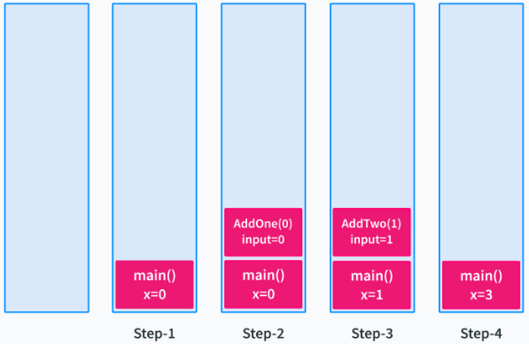
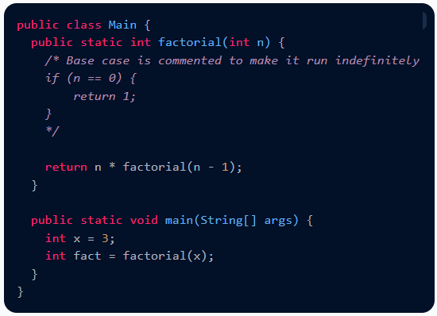
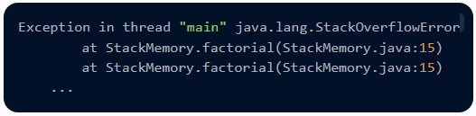
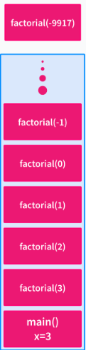
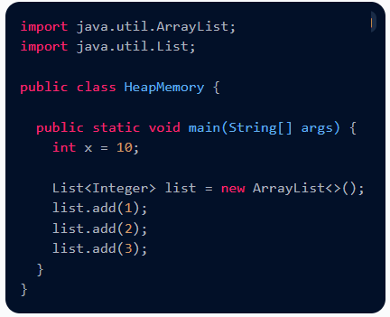
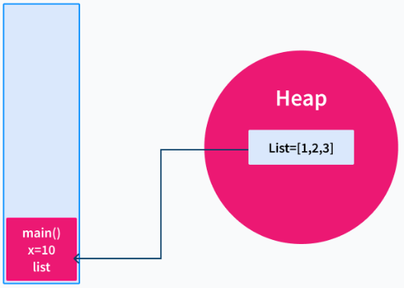
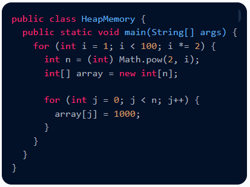
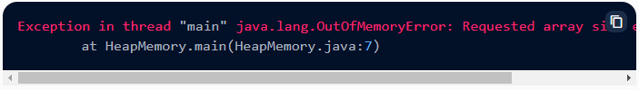
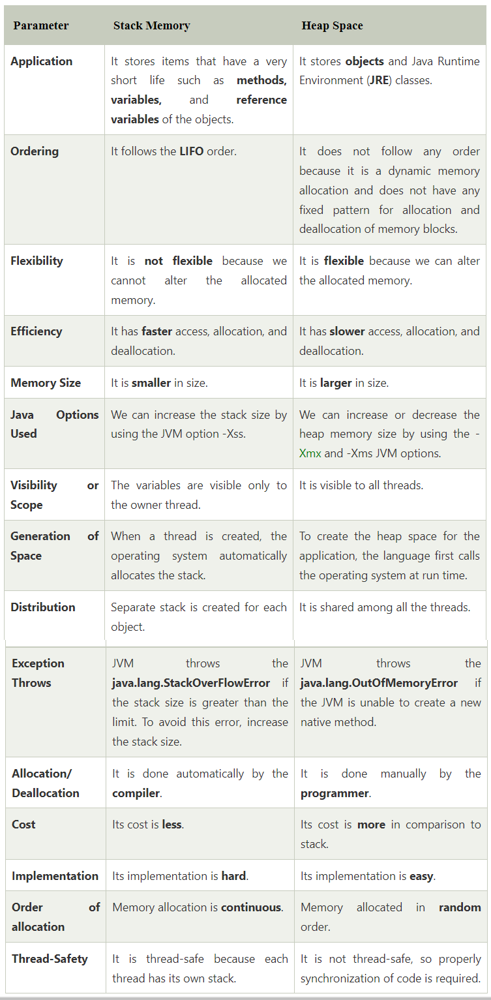

# Stack and Heap Java

**Content**

1\. Introduction of Stack and Heap in Java

2\. Stack Memory

3\. Heap Memory

4\. Difference between Stack and Heap Memory

5\. References

## 1. Introduction of Stack and Heap in Java

-   In Java, memory management is a vital process.
-   It is managed by Java automatically.
-   The JVM divides the memory into two parts: stack memory and heap memory.
-   From the perspective of Java, both are important memory areas but both are used for different purposes.
-   The **major difference between Stack memory and heap memory** is that the stack is used to store the order of method execution and local variables while the heap memory stores the objects and it uses dynamic memory allocation and deallocation.

## 2. Stack Memory

-   The stack memory is a physical space (in RAM) allocated to each thread at run time.
-   It is created when a thread creates.
-   Memory management in the stack follows LIFO (Last-In-First-Out) order because it is accessible globally.
-   It stores the variables, references to objects, and partial results.
-   Memory allocated to stack lives until the function returns.
-   If there is no space for creating the new objects, it throws the **java.lang.StackOverFlowError.**
-   The scope of the elements is limited to their threads.

**Example of Stack Memory in Java**

**Explanation:**

1.  When the program is executed, the main method is executed first by the JVM. When the main method is called, a block is allocated for it in the call stack.
2.  The main method contains one primitive value x. This primitive value is stored in the memory block allocated for the main method.
3.  When the addOne method is called from the main method, a new block for addOne method is allocated in the stack memory.
4.  The variables specific to the method are created and stored in the allocated memory block. Upon the completion of the execution of the method, the value is returned to the calling method(here it is the main method), and the block is removed from the call stack.
5.  Similarly, when the addTwo method is called, a new block is allocated for it, and the variables are created and stored. When the method finishes execution, the value is returned to the calling method, and the block is cleared.
6.  Finally, the main method completes its execution, and the memory block corresponding to main method is cleared from the stack.

**What is StackOverflowError in Java?**

-   Stack memory is limited in size and cannot be enlarged or shrunk once created.
-   Therefore, if we use all of the stack memory, there will be no space left for upcoming method calls, and we will get the StackOverflowError.

**Example:**

Error:

**Explanation:**

-   A new block on the stack is allocated for each call to the factorial method.
-   When the above program is executed, the factorial method will be called **indefinitely** because the base case is commented.
-   As the stack size is fixed, and the factorial method is called indefinitely and doesn't return any value, so the stack memory runs out, resulting in StackOverflowError.

## 3. Heap Memory

-   It is created when the JVM starts up and used by the application as long as the application runs.
-   It stores objects and JRE classes.
-   Whenever we create objects it occupies space in the heap memory while the reference of that object creates in the stack.
-   It does not follow any order like the stack.
-   It dynamically handles the memory blocks.
-   It means, we need not to handle the memory manually.
-   For managing the memory automatically, Java provides the garbage collector that deletes the objects which are no longer being used.
-   Memory allocated to heap lives until any one event, either program terminated or memory free does not occur.
-   The elements are globally accessible in the application.
-   It is a common memory space shared with all the threads.
-   If the heap space is full, it throws the java.lang.OutOfMemoryError.

**Example of Heap Memory in Java**

**Explanation:**

-   In the above example, the variable x is allocated in the stack, whereas the object list is allocated memory in the heap.
-   Only the reference to the list object is stored in the stack memory alongside x.

**Why OutOfMemoryError is thrown in Java?**

-   **OutOfMemoryError** is thrown when there is no more space left in the heap to create and store a new object.
-   This happens when the Garbage Collector could not freeup any space to store new objects.

**Error**

**Explanation:**

-   Consider the above program where we are repeatedly generating arrays of bigger sizes and storing values in them.
-   Once the space ran out in the heap, it threw OutOfMemoryError.

## 4. Difference between Stack and Heap Memory

The following table summarizes all the major differences between stack memory and heap space.

## 5. References

1.  https://www.javatpoint.com/stack-vs-heap-java
2.  https://www.scaler.com/topics/java/heap-memory-and-stack-memory-in-java/
