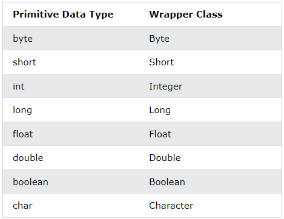
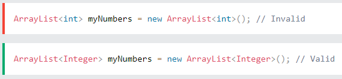
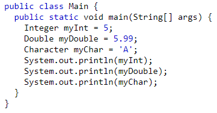
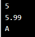
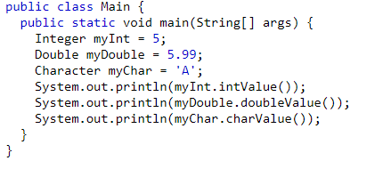
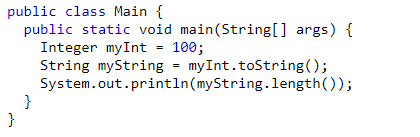

# Java Wrapper Classes

**Content**

1\. Wrapper Classes

1.1 Creating Wrapper Objects

2\. References

## 1. Wrapper Classes

-   The eight primitive data types byte, short, int, long, float, double, char and boolean are not objects, **Wrapper classes are used for converting primitive data types into objects.**
-   The table below shows the primitive type and the equivalent wrapper class:

-   Sometimes you must use wrapper classes, for example when working with Collection objects, such as ArrayList, where primitive types cannot be used (the list can only store objects):

**Example**

## 1.1 Creating Wrapper Objects

-   To create a wrapper object, use the wrapper class instead of the primitive type.
-   To get the value, you can just print the object:

**Example-1:**

**Output:**

-   Since you're now working with objects, you can use certain methods to get information about the specific object.
-   For example, the following methods are used to get the value associated with the corresponding wrapper object: intValue(), byteValue(), shortValue(), longValue(), floatValue(), doubleValue(), charValue(), booleanValue().
-   This example will output the same result as the example above:

**Example-2:**

**Output:**

-   Another useful method is the **toString()** method, which is used to convert wrapper objects to strings.
-   In the following example, we convert an Integer to a String, and use the length() method of the String class to output the length of the "string".

**Example-3:**

**Output:**

## 2. References

1\. https://www.w3schools.com/java/java_wrapper_classes.asp
