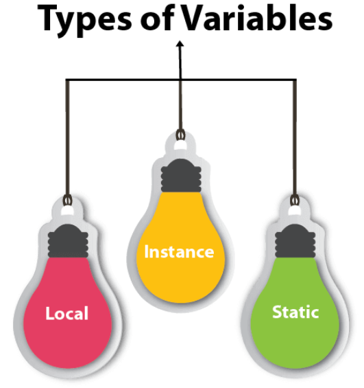
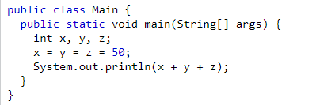

# Java Variables

**Content**

1\. Java Variables

2\. Types of Variables

2.1 Local Variable

2.2 Instance Variable

2.3 Static variable

2.4 Example to understand the three types of variables in java

3\. Display Variables

4\. Declare Multiple Variables

4.1 One Value to Multiple Variables

5\. References

## 1. Java Variables

-   A variable is the name of a reserved area allocated in memory.
-   In other words, it is a name of the memory location.
-   It is a combination of "vary + able" which means its value can be changed.
-   A variable is a container which holds the value while the Java program is executed.
-   A variable is assigned with a data type.

**The general rules for naming variables are:**

-   Names can contain letters, digits, underscores, and dollar signs.
-   Names must begin with a letter.
-   Names should start with a lowercase letter and it cannot contain whitespace.
-   Names can also begin with \$ and \_ .
-   Names are case sensitive ("myVar" and "myvar" are different variables)
-   Reserved words (like Java keywords, such as int or boolean) cannot be used as names

**Syntax:**

datatype variable_name=value;

**Example**

## 2. Types of Variables

-   There are three types of variables in Java

## 2.1 Local Variable

-   A variable declared inside the body of the method is called local variable.
-   You can use this variable only within that method and the other methods in the class aren't even aware that the variable exists.
-   A local variable cannot be defined with "static" keyword.

## 2.2 Instance Variable

-   A variable declared inside the class but outside the body of the method, is called an instance variable.
-   It is not declared as static.
-   It is called an instance variable because its value is instance-specific and is not shared among instances.

## 2.3 Static variable

-   A variable that is declared as static is called a static variable.
-   It cannot be local.
-   You can create a single copy of the static variable and share it among all the instances of the class.
-   Memory allocation for static variables happens only once when the class is loaded in the memory.

## 2.4 Example to understand the three types of variables in java

## 3. Display Variables

-   The **println()** method is often used to display variables.
-   To combine both text and a variable, use the **+** character.

**Example:**

**Output:**

## 4. Declare Multiple Variables

-   To declare more than one variable of the **same type**, you can use a comma-separated list.

**Example:**

**Output:**

## 4.1 One Value to Multiple Variables

-   You can also assign the **same value** to multiple variables in one line.

**Example:**

**Output:**

## 5. References

1.  https://www.javatpoint.com/java-variables
2.  https://www.w3schools.com/java/java_operators.asp
