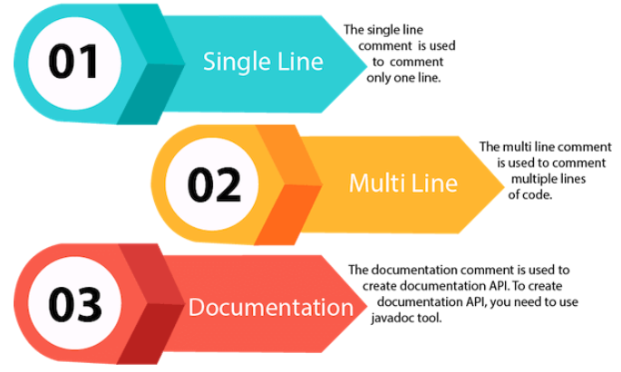
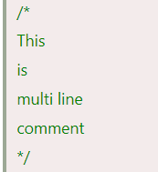
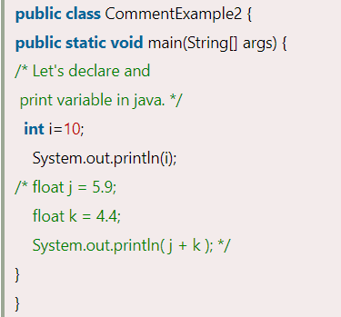
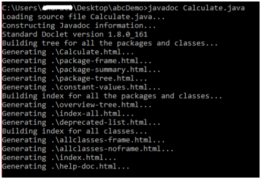

# Java Comments

**Content**

1\. Java Comments

1.1 Why do we use comments in a code?

2\. Types of Java Comments

2.1 Single Line Comment

2.2 Multi Line Comment

2.3 Documentation Comment

3\. Are Java comments executable?

4\. References

## 1. Java Comments

-   The Java comments are the statements in a program that are not executed by the compiler and interpreter.

## 1.1 Why do we use comments in a code?

-   Comments are used to make the program more readable by adding the details of the code.
-   It makes easy to maintain the code and to find the errors easily.
-   The comments can be used to provide information or explanation about the variable, method, class, or any statement.
-   It can also be used to prevent the execution of program code while testing the alternative code.

## 2. Types of Java Comments

**There are three types of comments in Java.**

## 2.1 Single Line Comment

-   The single-line comment is used to comment only one line of the code.
-   It is the widely used and easiest way of commenting the statements.
-   Single line comments starts with two forward slashes **(//)**.
-   Any text in front of // is not executed by Java.

**Syntax:**

**Example:**

**Output:**

## 2.2 Multi Line Comment

-   The multi-line comment is used to comment multiple lines of code.
-   It can be used to explain a complex code snippet or to comment multiple lines of code at a time (as it will be difficult to use single-line comments there).
-   Multi-line comments are placed between /\* and \*/. Any text between /\* and \*/ is not executed by Java.

**Syntax:**

**Example:**

**Output:**

## 2.3 Documentation Comment

-   Documentation comments are usually used to write large programs for a project or software application as it helps to create documentation API.
-   These APIs are needed for reference, i.e., which classes, methods, arguments, etc., are used in the code.
-   To create documentation API, we need to use the **javadoc tool**.
-   The documentation comments are placed between /\*\* and \*/.

**Syntax:**

**Example:**

**Output:**

-   Create documentation API by **javadoc** tool:

-   Now, the HTML files are created for the **Calculate** class in the current directory, i.e., **abcDemo**.
-   Open the HTML files, and we can see the explanation of Calculate class provided through the documentation comment.

## 3. Are Java comments executable?

-   Java comments are not executed by the compiler or interpreter, however, before the lexical transformation of code in compiler, contents of the code are encoded into ASCII in order to make the processing easy.

## 4. References

1.  https://www.javatpoint.com/java-comments
