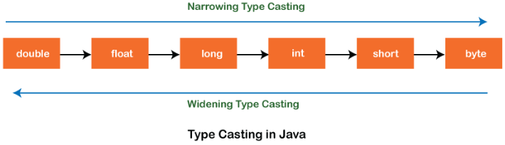
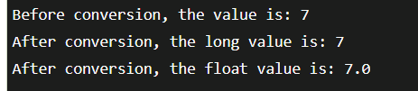

# Type Casting

**Content**

1\. Type Casting

2\. Types of Type Casting

2.1 Widening Type Casting

2.2 Narrowing Type Casting

3\. References

## 1. Type Casting

-   In Java, **type casting** is a method or process that converts one primitive data type into another data type in both ways manually and automatically.
-   The automatic conversion is done by the compiler and manual conversion performed by the programmer.
-   Convert a value from one data type to another data type is known as **type casting**.

## 2. Types of Type Casting

There are two types of type casting:

-   Widening Type Casting
-   Narrowing Type Casting

    

## 2.1 Widening Type Casting

-   Converting a lower data type into a higher one is called **widening** type casting.
-   It is also known as **implicit conversion** or **casting down**.
-   It is done automatically.
-   It is safe because there is no chance to lose data.
-   It takes place when:
1.  Both data types must be compatible with each other.
2.  The target type must be larger than the source type.

-   For example, the conversion between numeric data type to char or Boolean is not done automatically.
-   Also, the char and Boolean data types are not compatible with each other.

**Example:**

**Output**

-   In the above example, we have taken a variable x and converted it into a long type.
-   After that, the long type is converted into the float type.

## 2.2 Narrowing Type Casting

-   Converting a higher data type into a lower one is called **narrowing** type casting.
-   It is also known as **explicit conversion** or **casting up**.
-   It is done manually by the programmer.
-   If we do not perform casting then the compiler reports a compile-time error.

**Example:**

-   In the following example, we have performed the narrowing type casting two times.
-   First, we have converted the double type into long data type after that long data type is converted into int type.

**Output**

## 3. References

1.  https://www.javatpoint.com/type-casting-in-java
