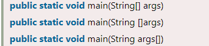

# Hello Java Program

**Content**

1\. First Java Program \| Hello Java Example

1.1 The requirement for Hello Java Example

1.2 Creating Hello java Example

1.3 Compilation Flow

1.4 Parameters used in Hello Java Program

1.5 In how many ways we can write a Java program?

2\. References

## 1. First Java Program \| Hello Java Example

-   In this document, we will learn how to write the simple program of Java.
-   We can write a simple hello Java program easily after installing the JDK.
-   Let's understand the requirement first.

## 1.1 The requirement for Hello Java Example

For executing any Java program, the following software or application must be properly installed.

-   Install the JDK if you don't have installed it, download the JDK and install it.
-   Set path of the jdk/bin directory.
-   Create the Java program
-   Compile and run the Java program

## 1.2 Creating Hello java Example

-   To write the simple program, you need to open notepad by **start menu -\> All Programs -\> Accessories -\> Notepad** and write a simple program as we have shown below:

-   Save the file with **classname.java**

    **Example:** Simple.java

-   In order to compile and run the above program, you need to open the command prompt by **start menu -\> All Programs -\> Accessories -\> command prompt**.

-   To compile and run the above program, go to your current directory first; my current directory is c:\\new.

Write here:

-   **To compile:** javac Simple.java
-   **To execute:** java Simple

**Output:**

## 1.3 Compilation Flow

-   When we compile Java program using javac tool, the Java compiler converts the source code into byte code.

## 1.4 Parameters used in Hello Java Program

-   Let's see what is the meaning of class, public, static, void, main, String[], System.out.println().

**class**

-   It is a keyword.
-   It is used to declare a class in Java.

**public**

-   It is a keyword.
-   It is an access modifier that represents visibility.
-   It means it is visible to all.

**static**

-   It is a keyword.
-   If we declare any method as static, it is known as the static method.
-   The core advantage of the static method is that there is no need to create an object to invoke the static method.
-   The main() method is executed by the JVM, so it doesn't require creating an object to invoke the main() method. So, it saves memory.

**void**

-   It is the return type of the method.
-   It means it doesn't return any value.

**main**

-   It represents the starting point of the program.

**String[] args** or **String args[]**

-   It is used for command line argument

**System.out.println()**

-   It is used to print statement.
-   Here, System is a class, out is an object of the PrintStream class, println() is a method of the PrintStream class.

## 1.5 In how many ways we can write a Java program?

-   There are many ways to write a Java program.
-   The modifications that can be done in a Java program are given below:

## 1) By changing the sequence of the modifiers, method prototype is not changed in Java.

-   Let's see the simple code of the main method.

## 2) The subscript notation in the Java array can be used after type, before the variable or after the variable.

-   Let's see the different codes to write the main method.

## 3) You can provide var-args support to the main() method by passing 3 ellipses (dots)

## 4) Having a semicolon at the end of class is optional in Java.

## 5) Valid Java main() method signature

## 6) Invalid Java main() method signature

## 2. References

1.  https://www.javatpoint.com/simple-program-of-java
