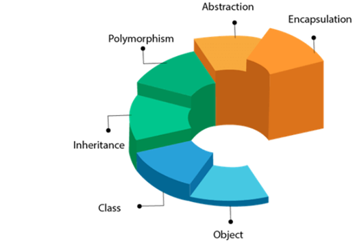
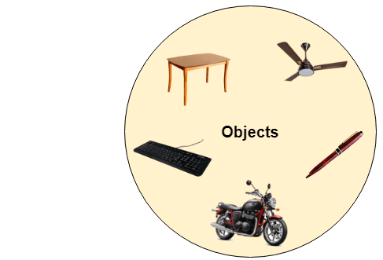
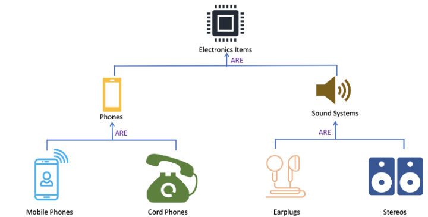
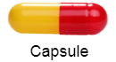

# Java OOPs Concepts

**Content**

1\. OOPs (Object-Oriented Programming System)

2\. References

## 1. OOPs (Object-Oriented Programming System)

-   **Object** means a real-world entity such as a pen, chair, table, computer, watch, etc.
-   **Object-Oriented Programming** is a methodology or paradigm to design a program using classes and objects.
-   The popular object-oriented languages are Java, C\#, PHP, Python, C++, etc.
-   It simplifies software development and maintenance by providing some concepts:

    

Apart from these concepts, there are some other terms which are used in Object-Oriented design:

-   Coupling
-   Cohesion
-   Association
-   Aggregation
-   Composition

## Object

-   Any entity that has state and behavior is known as an object.
-   For example, a chair, pen, table, keyboard, bike, etc. It can be physical or logical.

    

-   An Object can be defined as an instance of a class.
-   An object contains an address and takes up some space in memory.
-   Objects can communicate without knowing the details of each other's data or code.
-   The only necessary thing is the type of message accepted and the type of response returned by the objects.

**Example:** A dog is an object because it has states like color, name, breed, etc. as well as behaviors like wagging the tail, barking, eating, etc.

## Class

-   Collection of objects is called class.
-   It is a logical entity.
-   A class can also be defined as a blueprint from which you can create an individual object.
-   Class doesn't consume any space.

## Inheritance

-   When one object acquires all the properties and behaviors of a parent object, it is known as inheritance.
-   It provides code reusability.
-   It is used to achieve runtime polymorphism.

    

## Polymorphism

-   If one task is performed in different ways, it is known as polymorphism.
-   In Java, we use method overloading and method overriding to achieve polymorphism.
-   Example can be to speak something; for example, a cat speaks meow, dog barks woof, etc.

    

## Abstraction

-   Hiding internal details and showing functionality is known as abstraction.
-   For example phone call, we don't know the internal processing.
-   In Java, we use abstract class and interface to achieve abstraction.

    

## Encapsulation

-   Binding (or wrapping) code and data together into a single unit are known as encapsulation.
-   For example, a capsule, it is wrapped with different medicines.

    

## Coupling

-   Coupling refers to the knowledge or information or dependency of another class.
-   It arises when classes are aware of each other.
-   If a class has the details information of another class, there is strong coupling.
-   You can use interfaces for the weaker coupling because there is no concrete implementation.

## Cohesion

-   Cohesion refers to the level of a component which performs a single well-defined task.
-   A single well-defined task is done by a highly cohesive method.
-   The weakly cohesive method will split the task into separate parts.
-   The java.io package is a highly cohesive package because it has I/O related classes and interface.
-   However, the java.util package is a weakly cohesive package because it has unrelated classes and interfaces.

## Association

-   Association represents the relationship between the objects.
-   Here, one object can be associated with one object or many objects.
-   Association can be undirectional or bidirectional.
-   There can be four types of association between the objects:
1.  One to One
2.  One to Many
3.  Many to One, and
4.  Many to Many

**Real-Time Example:**

-   One country can have one prime minister (one to one), and a prime minister can have many ministers (one to many).
-   Also, many MP's can have one prime minister (many to one), and many ministers can have many departments (many to many).

## Aggregation

-   Aggregation is a way to achieve Association.
-   Aggregation represents the relationship where one object contains other objects as a part of its state.
-   It represents the weak relationship between objects.
-   It is also termed as a **has-a** relationship in Java. Like, inheritance represents the **is-a** relationship.
-   It is another way to reuse objects.

## Composition

-   The composition is also a way to achieve Association.
-   The composition represents the relationship where one object contains other objects as a part of its state.
-   There is a strong relationship between the containing object and the dependent object.
-   It is the state where containing objects do not have an independent existence.
-   If you delete the parent object, all the child objects will be deleted automatically.

## 2. References

1.  https://www.javatpoint.com/java-oops-concepts
