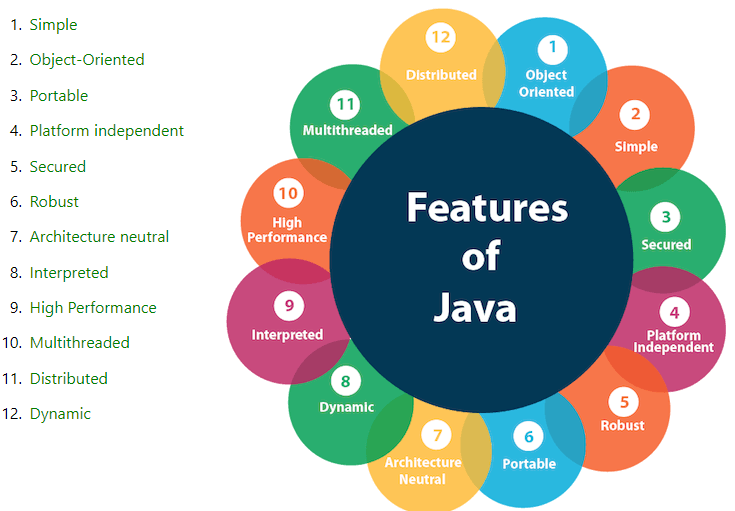
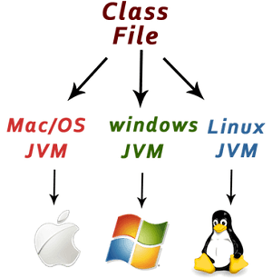
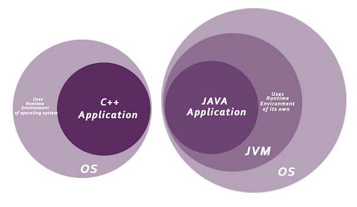

The primary objective of [Java programming](https://www.javatpoint.com/java-tutorial) language creation was to make it portable, simple and secure programming language. Apart from this, there are also some excellent features which play an important role in the popularity of this language. The features of Java are also known as Java buzzwords.

A list of the most important features of the Java language is given below.

Simple

Java is very easy to learn, and its syntax is simple, clean and easy to understand. According to Sun Microsystem, Java language is a simple programming language because:

-   Java syntax is based on C++ (so easier for programmers to learn it after C++).
-   Java has removed many complicated and rarely-used features, for example, explicit pointers, operator overloading, etc.
-   There is no need to remove unreferenced objects because there is an Automatic Garbage Collection in Java.

### Object-oriented

Java is an [object-oriented](https://www.javatpoint.com/java-oops-concepts) programming language. Everything in Java is an object. Object-oriented means we organize our software as a combination of different types of objects that incorporate both data and behavior.

Object-oriented programming (OOPs) is a methodology that simplifies software development and maintenance by providing some rules.

Basic concepts of OOPs are:

1.  [Object](https://www.javatpoint.com/object-and-class-in-java)
2.  [Class](https://www.javatpoint.com/object-and-class-in-java#class)
3.  [Inheritance](https://www.javatpoint.com/inheritance-in-java)
4.  [Polymorphism](https://www.javatpoint.com/runtime-polymorphism-in-java)
5.  [Abstraction](https://www.javatpoint.com/abstract-class-in-java)
6.  [Encapsulation](https://www.javatpoint.com/encapsulation)

Platform Independent

Java is platform independent because it is different from other languages like [C](https://www.javatpoint.com/c-programming-language-tutorial), [C++](https://www.javatpoint.com/cpp-tutorial), etc. which are compiled into platform specific machines while Java is a write once, run anywhere language. A platform is the hardware or software environment in which a program runs.

There are two types of platforms software-based and hardware-based. Java provides a software-based platform.

The Java platform differs from most other platforms in the sense that it is a software-based platform that runs on top of other hardware-based platforms. It has two components:

1.  Runtime Environment
2.  API(Application Programming Interface)

Java code can be executed on multiple platforms, for example, Windows, Linux, Sun Solaris, Mac/OS, etc. Java code is compiled by the compiler and converted into bytecode. This bytecode is a platform-independent code because it can be run on multiple platforms, i.e., Write Once and Run Anywhere (WORA).

Secured

Java is best known for its security. With Java, we can develop virus-free systems. Java is secured because:

-   **No explicit pointer**
-   **Java Programs run inside a virtual machine sandbox**

-   **Classloader:** Classloader in Java is a part of the Java Runtime Environment (JRE) which is used to load Java classes into the Java Virtual Machine dynamically. It adds security by separating the package for the classes of the local file system from those that are imported from network sources.
-   **Bytecode Verifier:** It checks the code fragments for illegal code that can violate access rights to objects.
-   **Security Manager:** It determines what resources a class can access such as reading and writing to the local disk.

Java language provides these securities by default. Some security can also be provided by an application developer explicitly through SSL, JAAS, Cryptography, etc.

Robust

The English mining of Robust is strong. Java is robust because:

-   It uses strong memory management.
-   There is a lack of pointers that avoids security problems.
-   Java provides automatic garbage collection which runs on the Java Virtual Machine to get rid of objects which are not being used by a Java application anymore.
-   There are exception handling and the type checking mechanism in Java. All these points make Java robust.

### Architecture-neutral

Java is architecture neutral because there are no implementation dependent features, for example, the size of primitive types is fixed.

In C programming, int data type occupies 2 bytes of memory for 32-bit architecture and 4 bytes of memory for 64-bit architecture. However, it occupies 4 bytes of memory for both 32 and 64-bit architectures in Java.

### Portable

Java is portable because it facilitates you to carry the Java bytecode to any platform. It doesn't require any implementation.

### High-performance

Java is faster than other traditional interpreted programming languages because Java bytecode is "close" to native code. It is still a little bit slower than a compiled language (e.g., C++). Java is an interpreted language that is why it is slower than compiled languages, e.g., C, C++, etc.

### Distributed

Java is distributed because it facilitates users to create distributed applications in Java. RMI and EJB are used for creating distributed applications. This feature of Java makes us able to access files by calling the methods from any machine on the internet.

### Multi-threaded

A thread is like a separate program, executing concurrently. We can write Java programs that deal with many tasks at once by defining multiple threads. The main advantage of multi-threading is that it doesn't occupy memory for each thread. It shares a common memory area. Threads are important for multi-media, Web applications, etc.

### Dynamic

Java is a dynamic language. It supports the dynamic loading of classes. It means classes are loaded on demand. It also supports functions from its native languages, i.e., C and C++.

Java supports dynamic compilation and automatic memory management (garbage collection).

References

1.  https://www.javatpoint.com/features-of-java
