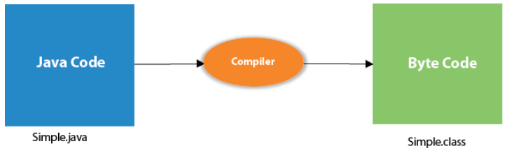
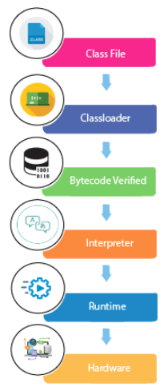

# Program Internal Details

**Content**

1\. Internal Details of Program

1.1 What happens at compile time?

1.2 What happens at run time?

2\. References

## 1. Internal Details of Program

In this document, we are going to learn, what happens while we compile and run the Java program.

## 1.1 What happens at compile time?

-   At compile time, the Java file is compiled by Java Compiler (It does not interact with OS) and converts the Java code into bytecode.

## 1.2 What happens at run time?

-   At runtime, the following steps are performed:

**Classloader:**

-   It is the subsystem of JVM that is used to load class files.

**Bytecode Verifier:**

-   Checks the code fragments for illegal code that can violate access rights to objects.

**Interpreter:**

-   Read bytecode stream then execute the instructions.

## 2. References

1.  https://www.javatpoint.com/internal-details-of-hello-java-program
