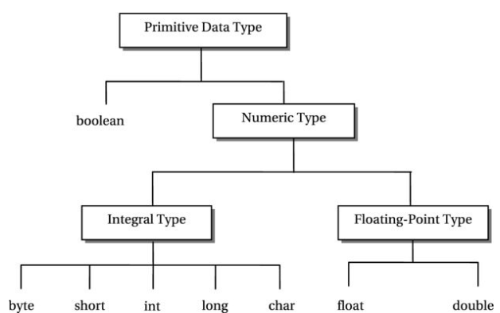
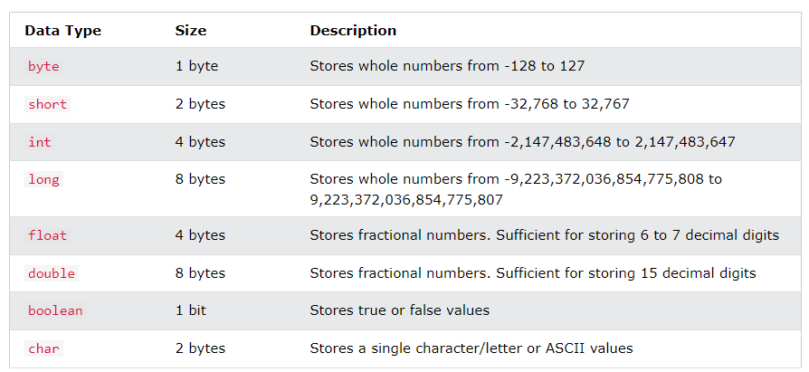

## 1. Data Types in Java

-   Data types specify the different sizes and values that can be stored in the variable.

**There are two types of data types in Java**

1.  **Primitive data types:** The primitive data types include Boolean, char, byte, short, int, long, float and double.
2.  **Non-primitive data types:** The non-primitive data types include Classes, Interfaces, and Arrays.

## 2. Primitive Data Types

-   In Java language, primitive data types are the building blocks of data manipulation.
-   A primitive data type specifies the size and type of variable values, and it has no additional methods.
-   There are eight primitive data types in Java:

## 2.1 Boolean Data Type

-   The Boolean data type is used to store only two possible values: **true and false**.
-   This data type is used for simple flags that track true/false conditions.
-   The Boolean data type specifies one bit of information, but its "size" can't be defined precisely.

**Example:**

boolean a = false;

boolean b=true;

## 2.2 Numeric Data Types

-   Primitive numeric data types are divided into two groups: **integral and floating point** types.

## 2.2.1 Integral types

-   An integral data type is a numeric data type whose values are of **integer** type.
-   Java offers **five integral data types**:
1.  byte
2.  short
3.  int
4.  long
5.  char

## 2.2.2 Floating point types

-   It represent numbers with a fractional part, containing one or more decimals.
-   There are two types: **float and double**.

## 1) Byte Data Type

-   The byte data type is an 8-bit signed two's complement integer.
-   Its value lies between -128 to 127 (inclusive).
-   Its default value is 0.
-   The byte data type is used to save memory in large arrays where the memory savings is most required.
-   It saves space because a byte is 4 times smaller than an integer. It can also be used in place of "int" data type.

**Example:**

**byte** a = 10;

**byte** b = -20;

## 2) Short Data Type

-   The short data type is a 16-bit signed two's complement integer.
-   Its value lies between -32,768 to 32,767 (inclusive).
-   Its default value is 0.
-   The short data type can also be used to save memory just like byte data type.
-   A short data type is 2 times smaller than an integer.

**Example:**

**short** s = 10100;

**short** r = -6000;

## 3) Int Data Type

-   The int data type is a 32-bit signed two's complement integer.
-   Its value lies between - 2,147,483,648 (-2\^31) to 2,147,483,647 (2\^31 -1) (inclusive).
-   Its default value is 0.
-   The int data type is generally used as a default data type for integral values unless if there is no problem about memory.

**Example:**

**int** a = 100000;

**int** b = -200000 ;

## 4) Long Data Type

-   The long data type is a 64-bit two's complement integer.
-   Its value lies between -9,223,372,036,854,775,808(-2\^63) to 9,223,372,036,854,775,807(2\^63 -1)(inclusive).
-   Its default value is 0.
-   The long data type is used when you need a range of values more than those provided by int.

**Example:**

long a = 1500009900L;

long b = -1508909900L;

## 5) Char Data Type

-   The char data type is a single 16-bit Unicode character.
-   Its value lies between '\\u0000' (or 0) to '\\uffff' (or 65,535 inclusive).
-   The char data type is used to store characters.

**Example:**

**char** letter= 'A' ;

## 6) Float Data Type

-   The float data type is a single-precision 32-bit IEEE 754 floating point.
-   Its value is unlimited.
-   It is recommended to use a float (instead of double) if you need to save memory in large arrays of floating point numbers. The float data type should never be used for precise values, such as currency.
-   Its default value is 0.0F.

**Example:**

**float** f1 = 234.5;

## 7) Double Data Type

-   The double data type is a double-precision 64-bit IEEE 754 floating point.
-   Its value range is unlimited.
-   The double data type is generally used for decimal values just like float.
-   The double data type also should never be used for precise values, such as currency. Its default value is 0.0d.

**Example:**

**double** d1 = 12.3;

## References

1.  https://www.javatpoint.com/java-data-types
2.  https://www.w3schools.com/java/java_data_types.asp
