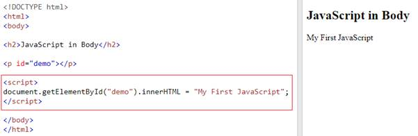
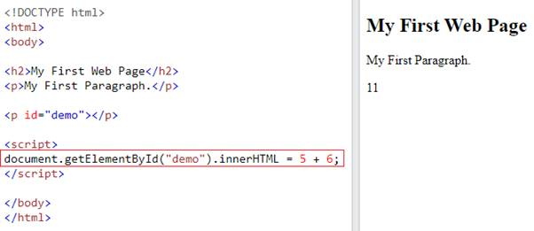
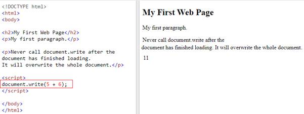
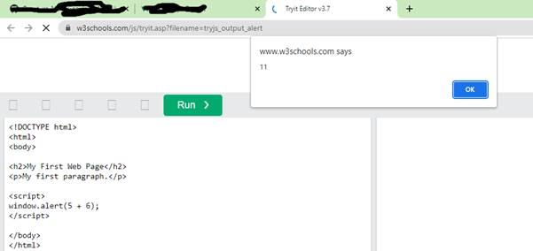
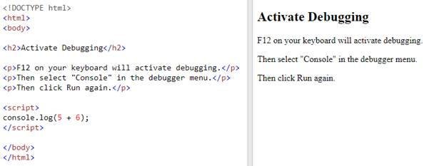
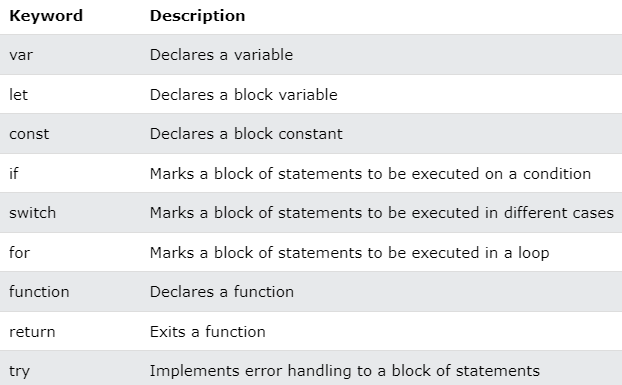

<html xmlns:v="urn:schemas-microsoft-com:vml"
xmlns:o="urn:schemas-microsoft-com:office:office"
xmlns:w="urn:schemas-microsoft-com:office:word"
xmlns:m="http://schemas.microsoft.com/office/2004/12/omml"
xmlns="http://www.w3.org/TR/REC-html40">

<head>
<meta http-equiv=Content-Type content="text/html; charset=us-ascii">
<meta name=ProgId content=Word.Document>
<meta name=Generator content="Microsoft Word 15">
<meta name=Originator content="Microsoft Word 15">
<link rel=File-List
href="1-javascript-introduction-and-basics_files/filelist.xml">
<link rel=Edit-Time-Data
href="1-javascript-introduction-and-basics_files/editdata.mso">
<!--[if !mso]>

<![endif]--><!--[if gte mso 9]><xml>
 <o:DocumentProperties>
  <o:Author>Balaji</o:Author>
  <o:Template>Normal</o:Template>
  <o:LastAuthor>Balaji</o:LastAuthor>
  <o:Revision>30</o:Revision>
  <o:TotalTime>90</o:TotalTime>
  <o:Created>2022-08-12T01:06:00Z</o:Created>
  <o:LastSaved>2022-08-12T05:31:00Z</o:LastSaved>
  <o:Pages>11</o:Pages>
  <o:Words>1371</o:Words>
  <o:Characters>7819</o:Characters>
  <o:Lines>65</o:Lines>
  <o:Paragraphs>18</o:Paragraphs>
  <o:CharactersWithSpaces>9172</o:CharactersWithSpaces>
  <o:Version>15.00</o:Version>
 </o:DocumentProperties>
 <o:OfficeDocumentSettings>
  <o:AllowPNG/>
 </o:OfficeDocumentSettings>
</xml><![endif]-->
<link rel=themeData
href="1-javascript-introduction-and-basics_files/themedata.thmx">
<link rel=colorSchemeMapping
href="1-javascript-introduction-and-basics_files/colorschememapping.xml">
<!--[if gte mso 9]><xml>
 <w:WordDocument>
  <w:View>Print</w:View>
  <w:Zoom>96</w:Zoom>
  <w:SpellingState>Clean</w:SpellingState>
  <w:GrammarState>Clean</w:GrammarState>
  <w:TrackMoves>false</w:TrackMoves>
  <w:TrackFormatting/>
  <w:ValidateAgainstSchemas/>
  <w:SaveIfXMLInvalid>false</w:SaveIfXMLInvalid>
  <w:IgnoreMixedContent>false</w:IgnoreMixedContent>
  <w:AlwaysShowPlaceholderText>false</w:AlwaysShowPlaceholderText>
  <w:DoNotPromoteQF/>
  <w:LidThemeOther>EN-IN</w:LidThemeOther>
  <w:LidThemeAsian>X-NONE</w:LidThemeAsian>
  <w:LidThemeComplexScript>X-NONE</w:LidThemeComplexScript>
  <w:Compatibility>
   <w:BreakWrappedTables/>
   <w:SplitPgBreakAndParaMark/>
  </w:Compatibility>
  <w:BrowserLevel>MicrosoftInternetExplorer4</w:BrowserLevel>
  <m:mathPr>
   <m:mathFont m:val="Cambria Math"/>
   <m:brkBin m:val="before"/>
   <m:brkBinSub m:val="&#45;-"/>
   <m:smallFrac m:val="off"/>
   <m:dispDef/>
   <m:lMargin m:val="0"/>
   <m:rMargin m:val="0"/>
   <m:defJc m:val="centerGroup"/>
   <m:wrapIndent m:val="1440"/>
   <m:intLim m:val="subSup"/>
   <m:naryLim m:val="undOvr"/>
  </m:mathPr></w:WordDocument>
</xml><![endif]--><!--[if gte mso 9]><xml>
 <w:LatentStyles DefLockedState="false" DefUnhideWhenUsed="false"
  DefSemiHidden="false" DefQFormat="false" DefPriority="99"
  LatentStyleCount="371">
  <w:LsdException Locked="false" Priority="0" QFormat="true" Name="Normal"/>
  <w:LsdException Locked="false" Priority="9" QFormat="true" Name="heading 1"/>
  <w:LsdException Locked="false" Priority="9" SemiHidden="true"
   UnhideWhenUsed="true" QFormat="true" Name="heading 2"/>
  <w:LsdException Locked="false" Priority="9" SemiHidden="true"
   UnhideWhenUsed="true" QFormat="true" Name="heading 3"/>
  <w:LsdException Locked="false" Priority="9" SemiHidden="true"
   UnhideWhenUsed="true" QFormat="true" Name="heading 4"/>
  <w:LsdException Locked="false" Priority="9" SemiHidden="true"
   UnhideWhenUsed="true" QFormat="true" Name="heading 5"/>
  <w:LsdException Locked="false" Priority="9" SemiHidden="true"
   UnhideWhenUsed="true" QFormat="true" Name="heading 6"/>
  <w:LsdException Locked="false" Priority="9" SemiHidden="true"
   UnhideWhenUsed="true" QFormat="true" Name="heading 7"/>
  <w:LsdException Locked="false" Priority="9" SemiHidden="true"
   UnhideWhenUsed="true" QFormat="true" Name="heading 8"/>
  <w:LsdException Locked="false" Priority="9" SemiHidden="true"
   UnhideWhenUsed="true" QFormat="true" Name="heading 9"/>
  <w:LsdException Locked="false" SemiHidden="true" UnhideWhenUsed="true"
   Name="index 1"/>
  <w:LsdException Locked="false" SemiHidden="true" UnhideWhenUsed="true"
   Name="index 2"/>
  <w:LsdException Locked="false" SemiHidden="true" UnhideWhenUsed="true"
   Name="index 3"/>
  <w:LsdException Locked="false" SemiHidden="true" UnhideWhenUsed="true"
   Name="index 4"/>
  <w:LsdException Locked="false" SemiHidden="true" UnhideWhenUsed="true"
   Name="index 5"/>
  <w:LsdException Locked="false" SemiHidden="true" UnhideWhenUsed="true"
   Name="index 6"/>
  <w:LsdException Locked="false" SemiHidden="true" UnhideWhenUsed="true"
   Name="index 7"/>
  <w:LsdException Locked="false" SemiHidden="true" UnhideWhenUsed="true"
   Name="index 8"/>
  <w:LsdException Locked="false" SemiHidden="true" UnhideWhenUsed="true"
   Name="index 9"/>
  <w:LsdException Locked="false" Priority="39" SemiHidden="true"
   UnhideWhenUsed="true" Name="toc 1"/>
  <w:LsdException Locked="false" Priority="39" SemiHidden="true"
   UnhideWhenUsed="true" Name="toc 2"/>
  <w:LsdException Locked="false" Priority="39" SemiHidden="true"
   UnhideWhenUsed="true" Name="toc 3"/>
  <w:LsdException Locked="false" Priority="39" SemiHidden="true"
   UnhideWhenUsed="true" Name="toc 4"/>
  <w:LsdException Locked="false" Priority="39" SemiHidden="true"
   UnhideWhenUsed="true" Name="toc 5"/>
  <w:LsdException Locked="false" Priority="39" SemiHidden="true"
   UnhideWhenUsed="true" Name="toc 6"/>
  <w:LsdException Locked="false" Priority="39" SemiHidden="true"
   UnhideWhenUsed="true" Name="toc 7"/>
  <w:LsdException Locked="false" Priority="39" SemiHidden="true"
   UnhideWhenUsed="true" Name="toc 8"/>
  <w:LsdException Locked="false" Priority="39" SemiHidden="true"
   UnhideWhenUsed="true" Name="toc 9"/>
  <w:LsdException Locked="false" SemiHidden="true" UnhideWhenUsed="true"
   Name="Normal Indent"/>
  <w:LsdException Locked="false" SemiHidden="true" UnhideWhenUsed="true"
   Name="footnote text"/>
  <w:LsdException Locked="false" SemiHidden="true" UnhideWhenUsed="true"
   Name="annotation text"/>
  <w:LsdException Locked="false" SemiHidden="true" UnhideWhenUsed="true"
   Name="header"/>
  <w:LsdException Locked="false" SemiHidden="true" UnhideWhenUsed="true"
   Name="footer"/>
  <w:LsdException Locked="false" SemiHidden="true" UnhideWhenUsed="true"
   Name="index heading"/>
  <w:LsdException Locked="false" Priority="35" SemiHidden="true"
   UnhideWhenUsed="true" QFormat="true" Name="caption"/>
  <w:LsdException Locked="false" SemiHidden="true" UnhideWhenUsed="true"
   Name="table of figures"/>
  <w:LsdException Locked="false" SemiHidden="true" UnhideWhenUsed="true"
   Name="envelope address"/>
  <w:LsdException Locked="false" SemiHidden="true" UnhideWhenUsed="true"
   Name="envelope return"/>
  <w:LsdException Locked="false" SemiHidden="true" UnhideWhenUsed="true"
   Name="footnote reference"/>
  <w:LsdException Locked="false" SemiHidden="true" UnhideWhenUsed="true"
   Name="annotation reference"/>
  <w:LsdException Locked="false" SemiHidden="true" UnhideWhenUsed="true"
   Name="line number"/>
  <w:LsdException Locked="false" SemiHidden="true" UnhideWhenUsed="true"
   Name="page number"/>
  <w:LsdException Locked="false" SemiHidden="true" UnhideWhenUsed="true"
   Name="endnote reference"/>
  <w:LsdException Locked="false" SemiHidden="true" UnhideWhenUsed="true"
   Name="endnote text"/>
  <w:LsdException Locked="false" SemiHidden="true" UnhideWhenUsed="true"
   Name="table of authorities"/>
  <w:LsdException Locked="false" SemiHidden="true" UnhideWhenUsed="true"
   Name="macro"/>
  <w:LsdException Locked="false" SemiHidden="true" UnhideWhenUsed="true"
   Name="toa heading"/>
  <w:LsdException Locked="false" SemiHidden="true" UnhideWhenUsed="true"
   Name="List"/>
  <w:LsdException Locked="false" SemiHidden="true" UnhideWhenUsed="true"
   Name="List Bullet"/>
  <w:LsdException Locked="false" SemiHidden="true" UnhideWhenUsed="true"
   Name="List Number"/>
  <w:LsdException Locked="false" SemiHidden="true" UnhideWhenUsed="true"
   Name="List 2"/>
  <w:LsdException Locked="false" SemiHidden="true" UnhideWhenUsed="true"
   Name="List 3"/>
  <w:LsdException Locked="false" SemiHidden="true" UnhideWhenUsed="true"
   Name="List 4"/>
  <w:LsdException Locked="false" SemiHidden="true" UnhideWhenUsed="true"
   Name="List 5"/>
  <w:LsdException Locked="false" SemiHidden="true" UnhideWhenUsed="true"
   Name="List Bullet 2"/>
  <w:LsdException Locked="false" SemiHidden="true" UnhideWhenUsed="true"
   Name="List Bullet 3"/>
  <w:LsdException Locked="false" SemiHidden="true" UnhideWhenUsed="true"
   Name="List Bullet 4"/>
  <w:LsdException Locked="false" SemiHidden="true" UnhideWhenUsed="true"
   Name="List Bullet 5"/>
  <w:LsdException Locked="false" SemiHidden="true" UnhideWhenUsed="true"
   Name="List Number 2"/>
  <w:LsdException Locked="false" SemiHidden="true" UnhideWhenUsed="true"
   Name="List Number 3"/>
  <w:LsdException Locked="false" SemiHidden="true" UnhideWhenUsed="true"
   Name="List Number 4"/>
  <w:LsdException Locked="false" SemiHidden="true" UnhideWhenUsed="true"
   Name="List Number 5"/>
  <w:LsdException Locked="false" Priority="10" QFormat="true" Name="Title"/>
  <w:LsdException Locked="false" SemiHidden="true" UnhideWhenUsed="true"
   Name="Closing"/>
  <w:LsdException Locked="false" SemiHidden="true" UnhideWhenUsed="true"
   Name="Signature"/>
  <w:LsdException Locked="false" Priority="1" SemiHidden="true"
   UnhideWhenUsed="true" Name="Default Paragraph Font"/>
  <w:LsdException Locked="false" SemiHidden="true" UnhideWhenUsed="true"
   Name="Body Text"/>
  <w:LsdException Locked="false" SemiHidden="true" UnhideWhenUsed="true"
   Name="Body Text Indent"/>
  <w:LsdException Locked="false" SemiHidden="true" UnhideWhenUsed="true"
   Name="List Continue"/>
  <w:LsdException Locked="false" SemiHidden="true" UnhideWhenUsed="true"
   Name="List Continue 2"/>
  <w:LsdException Locked="false" SemiHidden="true" UnhideWhenUsed="true"
   Name="List Continue 3"/>
  <w:LsdException Locked="false" SemiHidden="true" UnhideWhenUsed="true"
   Name="List Continue 4"/>
  <w:LsdException Locked="false" SemiHidden="true" UnhideWhenUsed="true"
   Name="List Continue 5"/>
  <w:LsdException Locked="false" SemiHidden="true" UnhideWhenUsed="true"
   Name="Message Header"/>
  <w:LsdException Locked="false" Priority="11" QFormat="true" Name="Subtitle"/>
  <w:LsdException Locked="false" SemiHidden="true" UnhideWhenUsed="true"
   Name="Salutation"/>
  <w:LsdException Locked="false" SemiHidden="true" UnhideWhenUsed="true"
   Name="Date"/>
  <w:LsdException Locked="false" SemiHidden="true" UnhideWhenUsed="true"
   Name="Body Text First Indent"/>
  <w:LsdException Locked="false" SemiHidden="true" UnhideWhenUsed="true"
   Name="Body Text First Indent 2"/>
  <w:LsdException Locked="false" SemiHidden="true" UnhideWhenUsed="true"
   Name="Note Heading"/>
  <w:LsdException Locked="false" SemiHidden="true" UnhideWhenUsed="true"
   Name="Body Text 2"/>
  <w:LsdException Locked="false" SemiHidden="true" UnhideWhenUsed="true"
   Name="Body Text 3"/>
  <w:LsdException Locked="false" SemiHidden="true" UnhideWhenUsed="true"
   Name="Body Text Indent 2"/>
  <w:LsdException Locked="false" SemiHidden="true" UnhideWhenUsed="true"
   Name="Body Text Indent 3"/>
  <w:LsdException Locked="false" SemiHidden="true" UnhideWhenUsed="true"
   Name="Block Text"/>
  <w:LsdException Locked="false" SemiHidden="true" UnhideWhenUsed="true"
   Name="Hyperlink"/>
  <w:LsdException Locked="false" SemiHidden="true" UnhideWhenUsed="true"
   Name="FollowedHyperlink"/>
  <w:LsdException Locked="false" Priority="22" QFormat="true" Name="Strong"/>
  <w:LsdException Locked="false" Priority="20" QFormat="true" Name="Emphasis"/>
  <w:LsdException Locked="false" SemiHidden="true" UnhideWhenUsed="true"
   Name="Document Map"/>
  <w:LsdException Locked="false" SemiHidden="true" UnhideWhenUsed="true"
   Name="Plain Text"/>
  <w:LsdException Locked="false" SemiHidden="true" UnhideWhenUsed="true"
   Name="E-mail Signature"/>
  <w:LsdException Locked="false" SemiHidden="true" UnhideWhenUsed="true"
   Name="HTML Top of Form"/>
  <w:LsdException Locked="false" SemiHidden="true" UnhideWhenUsed="true"
   Name="HTML Bottom of Form"/>
  <w:LsdException Locked="false" SemiHidden="true" UnhideWhenUsed="true"
   Name="Normal (Web)"/>
  <w:LsdException Locked="false" SemiHidden="true" UnhideWhenUsed="true"
   Name="HTML Acronym"/>
  <w:LsdException Locked="false" SemiHidden="true" UnhideWhenUsed="true"
   Name="HTML Address"/>
  <w:LsdException Locked="false" SemiHidden="true" UnhideWhenUsed="true"
   Name="HTML Cite"/>
  <w:LsdException Locked="false" SemiHidden="true" UnhideWhenUsed="true"
   Name="HTML Code"/>
  <w:LsdException Locked="false" SemiHidden="true" UnhideWhenUsed="true"
   Name="HTML Definition"/>
  <w:LsdException Locked="false" SemiHidden="true" UnhideWhenUsed="true"
   Name="HTML Keyboard"/>
  <w:LsdException Locked="false" SemiHidden="true" UnhideWhenUsed="true"
   Name="HTML Preformatted"/>
  <w:LsdException Locked="false" SemiHidden="true" UnhideWhenUsed="true"
   Name="HTML Sample"/>
  <w:LsdException Locked="false" SemiHidden="true" UnhideWhenUsed="true"
   Name="HTML Typewriter"/>
  <w:LsdException Locked="false" SemiHidden="true" UnhideWhenUsed="true"
   Name="HTML Variable"/>
  <w:LsdException Locked="false" SemiHidden="true" UnhideWhenUsed="true"
   Name="Normal Table"/>
  <w:LsdException Locked="false" SemiHidden="true" UnhideWhenUsed="true"
   Name="annotation subject"/>
  <w:LsdException Locked="false" SemiHidden="true" UnhideWhenUsed="true"
   Name="No List"/>
  <w:LsdException Locked="false" SemiHidden="true" UnhideWhenUsed="true"
   Name="Outline List 1"/>
  <w:LsdException Locked="false" SemiHidden="true" UnhideWhenUsed="true"
   Name="Outline List 2"/>
  <w:LsdException Locked="false" SemiHidden="true" UnhideWhenUsed="true"
   Name="Outline List 3"/>
  <w:LsdException Locked="false" SemiHidden="true" UnhideWhenUsed="true"
   Name="Table Simple 1"/>
  <w:LsdException Locked="false" SemiHidden="true" UnhideWhenUsed="true"
   Name="Table Simple 2"/>
  <w:LsdException Locked="false" SemiHidden="true" UnhideWhenUsed="true"
   Name="Table Simple 3"/>
  <w:LsdException Locked="false" SemiHidden="true" UnhideWhenUsed="true"
   Name="Table Classic 1"/>
  <w:LsdException Locked="false" SemiHidden="true" UnhideWhenUsed="true"
   Name="Table Classic 2"/>
  <w:LsdException Locked="false" SemiHidden="true" UnhideWhenUsed="true"
   Name="Table Classic 3"/>
  <w:LsdException Locked="false" SemiHidden="true" UnhideWhenUsed="true"
   Name="Table Classic 4"/>
  <w:LsdException Locked="false" SemiHidden="true" UnhideWhenUsed="true"
   Name="Table Colorful 1"/>
  <w:LsdException Locked="false" SemiHidden="true" UnhideWhenUsed="true"
   Name="Table Colorful 2"/>
  <w:LsdException Locked="false" SemiHidden="true" UnhideWhenUsed="true"
   Name="Table Colorful 3"/>
  <w:LsdException Locked="false" SemiHidden="true" UnhideWhenUsed="true"
   Name="Table Columns 1"/>
  <w:LsdException Locked="false" SemiHidden="true" UnhideWhenUsed="true"
   Name="Table Columns 2"/>
  <w:LsdException Locked="false" SemiHidden="true" UnhideWhenUsed="true"
   Name="Table Columns 3"/>
  <w:LsdException Locked="false" SemiHidden="true" UnhideWhenUsed="true"
   Name="Table Columns 4"/>
  <w:LsdException Locked="false" SemiHidden="true" UnhideWhenUsed="true"
   Name="Table Columns 5"/>
  <w:LsdException Locked="false" SemiHidden="true" UnhideWhenUsed="true"
   Name="Table Grid 1"/>
  <w:LsdException Locked="false" SemiHidden="true" UnhideWhenUsed="true"
   Name="Table Grid 2"/>
  <w:LsdException Locked="false" SemiHidden="true" UnhideWhenUsed="true"
   Name="Table Grid 3"/>
  <w:LsdException Locked="false" SemiHidden="true" UnhideWhenUsed="true"
   Name="Table Grid 4"/>
  <w:LsdException Locked="false" SemiHidden="true" UnhideWhenUsed="true"
   Name="Table Grid 5"/>
  <w:LsdException Locked="false" SemiHidden="true" UnhideWhenUsed="true"
   Name="Table Grid 6"/>
  <w:LsdException Locked="false" SemiHidden="true" UnhideWhenUsed="true"
   Name="Table Grid 7"/>
  <w:LsdException Locked="false" SemiHidden="true" UnhideWhenUsed="true"
   Name="Table Grid 8"/>
  <w:LsdException Locked="false" SemiHidden="true" UnhideWhenUsed="true"
   Name="Table List 1"/>
  <w:LsdException Locked="false" SemiHidden="true" UnhideWhenUsed="true"
   Name="Table List 2"/>
  <w:LsdException Locked="false" SemiHidden="true" UnhideWhenUsed="true"
   Name="Table List 3"/>
  <w:LsdException Locked="false" SemiHidden="true" UnhideWhenUsed="true"
   Name="Table List 4"/>
  <w:LsdException Locked="false" SemiHidden="true" UnhideWhenUsed="true"
   Name="Table List 5"/>
  <w:LsdException Locked="false" SemiHidden="true" UnhideWhenUsed="true"
   Name="Table List 6"/>
  <w:LsdException Locked="false" SemiHidden="true" UnhideWhenUsed="true"
   Name="Table List 7"/>
  <w:LsdException Locked="false" SemiHidden="true" UnhideWhenUsed="true"
   Name="Table List 8"/>
  <w:LsdException Locked="false" SemiHidden="true" UnhideWhenUsed="true"
   Name="Table 3D effects 1"/>
  <w:LsdException Locked="false" SemiHidden="true" UnhideWhenUsed="true"
   Name="Table 3D effects 2"/>
  <w:LsdException Locked="false" SemiHidden="true" UnhideWhenUsed="true"
   Name="Table 3D effects 3"/>
  <w:LsdException Locked="false" SemiHidden="true" UnhideWhenUsed="true"
   Name="Table Contemporary"/>
  <w:LsdException Locked="false" SemiHidden="true" UnhideWhenUsed="true"
   Name="Table Elegant"/>
  <w:LsdException Locked="false" SemiHidden="true" UnhideWhenUsed="true"
   Name="Table Professional"/>
  <w:LsdException Locked="false" SemiHidden="true" UnhideWhenUsed="true"
   Name="Table Subtle 1"/>
  <w:LsdException Locked="false" SemiHidden="true" UnhideWhenUsed="true"
   Name="Table Subtle 2"/>
  <w:LsdException Locked="false" SemiHidden="true" UnhideWhenUsed="true"
   Name="Table Web 1"/>
  <w:LsdException Locked="false" SemiHidden="true" UnhideWhenUsed="true"
   Name="Table Web 2"/>
  <w:LsdException Locked="false" SemiHidden="true" UnhideWhenUsed="true"
   Name="Table Web 3"/>
  <w:LsdException Locked="false" SemiHidden="true" UnhideWhenUsed="true"
   Name="Balloon Text"/>
  <w:LsdException Locked="false" Priority="39" Name="Table Grid"/>
  <w:LsdException Locked="false" SemiHidden="true" UnhideWhenUsed="true"
   Name="Table Theme"/>
  <w:LsdException Locked="false" SemiHidden="true" Name="Placeholder Text"/>
  <w:LsdException Locked="false" Priority="1" QFormat="true" Name="No Spacing"/>
  <w:LsdException Locked="false" Priority="60" Name="Light Shading"/>
  <w:LsdException Locked="false" Priority="61" Name="Light List"/>
  <w:LsdException Locked="false" Priority="62" Name="Light Grid"/>
  <w:LsdException Locked="false" Priority="63" Name="Medium Shading 1"/>
  <w:LsdException Locked="false" Priority="64" Name="Medium Shading 2"/>
  <w:LsdException Locked="false" Priority="65" Name="Medium List 1"/>
  <w:LsdException Locked="false" Priority="66" Name="Medium List 2"/>
  <w:LsdException Locked="false" Priority="67" Name="Medium Grid 1"/>
  <w:LsdException Locked="false" Priority="68" Name="Medium Grid 2"/>
  <w:LsdException Locked="false" Priority="69" Name="Medium Grid 3"/>
  <w:LsdException Locked="false" Priority="70" Name="Dark List"/>
  <w:LsdException Locked="false" Priority="71" Name="Colorful Shading"/>
  <w:LsdException Locked="false" Priority="72" Name="Colorful List"/>
  <w:LsdException Locked="false" Priority="73" Name="Colorful Grid"/>
  <w:LsdException Locked="false" Priority="60" Name="Light Shading Accent 1"/>
  <w:LsdException Locked="false" Priority="61" Name="Light List Accent 1"/>
  <w:LsdException Locked="false" Priority="62" Name="Light Grid Accent 1"/>
  <w:LsdException Locked="false" Priority="63" Name="Medium Shading 1 Accent 1"/>
  <w:LsdException Locked="false" Priority="64" Name="Medium Shading 2 Accent 1"/>
  <w:LsdException Locked="false" Priority="65" Name="Medium List 1 Accent 1"/>
  <w:LsdException Locked="false" SemiHidden="true" Name="Revision"/>
  <w:LsdException Locked="false" Priority="34" QFormat="true"
   Name="List Paragraph"/>
  <w:LsdException Locked="false" Priority="29" QFormat="true" Name="Quote"/>
  <w:LsdException Locked="false" Priority="30" QFormat="true"
   Name="Intense Quote"/>
  <w:LsdException Locked="false" Priority="66" Name="Medium List 2 Accent 1"/>
  <w:LsdException Locked="false" Priority="67" Name="Medium Grid 1 Accent 1"/>
  <w:LsdException Locked="false" Priority="68" Name="Medium Grid 2 Accent 1"/>
  <w:LsdException Locked="false" Priority="69" Name="Medium Grid 3 Accent 1"/>
  <w:LsdException Locked="false" Priority="70" Name="Dark List Accent 1"/>
  <w:LsdException Locked="false" Priority="71" Name="Colorful Shading Accent 1"/>
  <w:LsdException Locked="false" Priority="72" Name="Colorful List Accent 1"/>
  <w:LsdException Locked="false" Priority="73" Name="Colorful Grid Accent 1"/>
  <w:LsdException Locked="false" Priority="60" Name="Light Shading Accent 2"/>
  <w:LsdException Locked="false" Priority="61" Name="Light List Accent 2"/>
  <w:LsdException Locked="false" Priority="62" Name="Light Grid Accent 2"/>
  <w:LsdException Locked="false" Priority="63" Name="Medium Shading 1 Accent 2"/>
  <w:LsdException Locked="false" Priority="64" Name="Medium Shading 2 Accent 2"/>
  <w:LsdException Locked="false" Priority="65" Name="Medium List 1 Accent 2"/>
  <w:LsdException Locked="false" Priority="66" Name="Medium List 2 Accent 2"/>
  <w:LsdException Locked="false" Priority="67" Name="Medium Grid 1 Accent 2"/>
  <w:LsdException Locked="false" Priority="68" Name="Medium Grid 2 Accent 2"/>
  <w:LsdException Locked="false" Priority="69" Name="Medium Grid 3 Accent 2"/>
  <w:LsdException Locked="false" Priority="70" Name="Dark List Accent 2"/>
  <w:LsdException Locked="false" Priority="71" Name="Colorful Shading Accent 2"/>
  <w:LsdException Locked="false" Priority="72" Name="Colorful List Accent 2"/>
  <w:LsdException Locked="false" Priority="73" Name="Colorful Grid Accent 2"/>
  <w:LsdException Locked="false" Priority="60" Name="Light Shading Accent 3"/>
  <w:LsdException Locked="false" Priority="61" Name="Light List Accent 3"/>
  <w:LsdException Locked="false" Priority="62" Name="Light Grid Accent 3"/>
  <w:LsdException Locked="false" Priority="63" Name="Medium Shading 1 Accent 3"/>
  <w:LsdException Locked="false" Priority="64" Name="Medium Shading 2 Accent 3"/>
  <w:LsdException Locked="false" Priority="65" Name="Medium List 1 Accent 3"/>
  <w:LsdException Locked="false" Priority="66" Name="Medium List 2 Accent 3"/>
  <w:LsdException Locked="false" Priority="67" Name="Medium Grid 1 Accent 3"/>
  <w:LsdException Locked="false" Priority="68" Name="Medium Grid 2 Accent 3"/>
  <w:LsdException Locked="false" Priority="69" Name="Medium Grid 3 Accent 3"/>
  <w:LsdException Locked="false" Priority="70" Name="Dark List Accent 3"/>
  <w:LsdException Locked="false" Priority="71" Name="Colorful Shading Accent 3"/>
  <w:LsdException Locked="false" Priority="72" Name="Colorful List Accent 3"/>
  <w:LsdException Locked="false" Priority="73" Name="Colorful Grid Accent 3"/>
  <w:LsdException Locked="false" Priority="60" Name="Light Shading Accent 4"/>
  <w:LsdException Locked="false" Priority="61" Name="Light List Accent 4"/>
  <w:LsdException Locked="false" Priority="62" Name="Light Grid Accent 4"/>
  <w:LsdException Locked="false" Priority="63" Name="Medium Shading 1 Accent 4"/>
  <w:LsdException Locked="false" Priority="64" Name="Medium Shading 2 Accent 4"/>
  <w:LsdException Locked="false" Priority="65" Name="Medium List 1 Accent 4"/>
  <w:LsdException Locked="false" Priority="66" Name="Medium List 2 Accent 4"/>
  <w:LsdException Locked="false" Priority="67" Name="Medium Grid 1 Accent 4"/>
  <w:LsdException Locked="false" Priority="68" Name="Medium Grid 2 Accent 4"/>
  <w:LsdException Locked="false" Priority="69" Name="Medium Grid 3 Accent 4"/>
  <w:LsdException Locked="false" Priority="70" Name="Dark List Accent 4"/>
  <w:LsdException Locked="false" Priority="71" Name="Colorful Shading Accent 4"/>
  <w:LsdException Locked="false" Priority="72" Name="Colorful List Accent 4"/>
  <w:LsdException Locked="false" Priority="73" Name="Colorful Grid Accent 4"/>
  <w:LsdException Locked="false" Priority="60" Name="Light Shading Accent 5"/>
  <w:LsdException Locked="false" Priority="61" Name="Light List Accent 5"/>
  <w:LsdException Locked="false" Priority="62" Name="Light Grid Accent 5"/>
  <w:LsdException Locked="false" Priority="63" Name="Medium Shading 1 Accent 5"/>
  <w:LsdException Locked="false" Priority="64" Name="Medium Shading 2 Accent 5"/>
  <w:LsdException Locked="false" Priority="65" Name="Medium List 1 Accent 5"/>
  <w:LsdException Locked="false" Priority="66" Name="Medium List 2 Accent 5"/>
  <w:LsdException Locked="false" Priority="67" Name="Medium Grid 1 Accent 5"/>
  <w:LsdException Locked="false" Priority="68" Name="Medium Grid 2 Accent 5"/>
  <w:LsdException Locked="false" Priority="69" Name="Medium Grid 3 Accent 5"/>
  <w:LsdException Locked="false" Priority="70" Name="Dark List Accent 5"/>
  <w:LsdException Locked="false" Priority="71" Name="Colorful Shading Accent 5"/>
  <w:LsdException Locked="false" Priority="72" Name="Colorful List Accent 5"/>
  <w:LsdException Locked="false" Priority="73" Name="Colorful Grid Accent 5"/>
  <w:LsdException Locked="false" Priority="60" Name="Light Shading Accent 6"/>
  <w:LsdException Locked="false" Priority="61" Name="Light List Accent 6"/>
  <w:LsdException Locked="false" Priority="62" Name="Light Grid Accent 6"/>
  <w:LsdException Locked="false" Priority="63" Name="Medium Shading 1 Accent 6"/>
  <w:LsdException Locked="false" Priority="64" Name="Medium Shading 2 Accent 6"/>
  <w:LsdException Locked="false" Priority="65" Name="Medium List 1 Accent 6"/>
  <w:LsdException Locked="false" Priority="66" Name="Medium List 2 Accent 6"/>
  <w:LsdException Locked="false" Priority="67" Name="Medium Grid 1 Accent 6"/>
  <w:LsdException Locked="false" Priority="68" Name="Medium Grid 2 Accent 6"/>
  <w:LsdException Locked="false" Priority="69" Name="Medium Grid 3 Accent 6"/>
  <w:LsdException Locked="false" Priority="70" Name="Dark List Accent 6"/>
  <w:LsdException Locked="false" Priority="71" Name="Colorful Shading Accent 6"/>
  <w:LsdException Locked="false" Priority="72" Name="Colorful List Accent 6"/>
  <w:LsdException Locked="false" Priority="73" Name="Colorful Grid Accent 6"/>
  <w:LsdException Locked="false" Priority="19" QFormat="true"
   Name="Subtle Emphasis"/>
  <w:LsdException Locked="false" Priority="21" QFormat="true"
   Name="Intense Emphasis"/>
  <w:LsdException Locked="false" Priority="31" QFormat="true"
   Name="Subtle Reference"/>
  <w:LsdException Locked="false" Priority="32" QFormat="true"
   Name="Intense Reference"/>
  <w:LsdException Locked="false" Priority="33" QFormat="true" Name="Book Title"/>
  <w:LsdException Locked="false" Priority="37" SemiHidden="true"
   UnhideWhenUsed="true" Name="Bibliography"/>
  <w:LsdException Locked="false" Priority="39" SemiHidden="true"
   UnhideWhenUsed="true" QFormat="true" Name="TOC Heading"/>
  <w:LsdException Locked="false" Priority="41" Name="Plain Table 1"/>
  <w:LsdException Locked="false" Priority="42" Name="Plain Table 2"/>
  <w:LsdException Locked="false" Priority="43" Name="Plain Table 3"/>
  <w:LsdException Locked="false" Priority="44" Name="Plain Table 4"/>
  <w:LsdException Locked="false" Priority="45" Name="Plain Table 5"/>
  <w:LsdException Locked="false" Priority="40" Name="Grid Table Light"/>
  <w:LsdException Locked="false" Priority="46" Name="Grid Table 1 Light"/>
  <w:LsdException Locked="false" Priority="47" Name="Grid Table 2"/>
  <w:LsdException Locked="false" Priority="48" Name="Grid Table 3"/>
  <w:LsdException Locked="false" Priority="49" Name="Grid Table 4"/>
  <w:LsdException Locked="false" Priority="50" Name="Grid Table 5 Dark"/>
  <w:LsdException Locked="false" Priority="51" Name="Grid Table 6 Colorful"/>
  <w:LsdException Locked="false" Priority="52" Name="Grid Table 7 Colorful"/>
  <w:LsdException Locked="false" Priority="46"
   Name="Grid Table 1 Light Accent 1"/>
  <w:LsdException Locked="false" Priority="47" Name="Grid Table 2 Accent 1"/>
  <w:LsdException Locked="false" Priority="48" Name="Grid Table 3 Accent 1"/>
  <w:LsdException Locked="false" Priority="49" Name="Grid Table 4 Accent 1"/>
  <w:LsdException Locked="false" Priority="50" Name="Grid Table 5 Dark Accent 1"/>
  <w:LsdException Locked="false" Priority="51"
   Name="Grid Table 6 Colorful Accent 1"/>
  <w:LsdException Locked="false" Priority="52"
   Name="Grid Table 7 Colorful Accent 1"/>
  <w:LsdException Locked="false" Priority="46"
   Name="Grid Table 1 Light Accent 2"/>
  <w:LsdException Locked="false" Priority="47" Name="Grid Table 2 Accent 2"/>
  <w:LsdException Locked="false" Priority="48" Name="Grid Table 3 Accent 2"/>
  <w:LsdException Locked="false" Priority="49" Name="Grid Table 4 Accent 2"/>
  <w:LsdException Locked="false" Priority="50" Name="Grid Table 5 Dark Accent 2"/>
  <w:LsdException Locked="false" Priority="51"
   Name="Grid Table 6 Colorful Accent 2"/>
  <w:LsdException Locked="false" Priority="52"
   Name="Grid Table 7 Colorful Accent 2"/>
  <w:LsdException Locked="false" Priority="46"
   Name="Grid Table 1 Light Accent 3"/>
  <w:LsdException Locked="false" Priority="47" Name="Grid Table 2 Accent 3"/>
  <w:LsdException Locked="false" Priority="48" Name="Grid Table 3 Accent 3"/>
  <w:LsdException Locked="false" Priority="49" Name="Grid Table 4 Accent 3"/>
  <w:LsdException Locked="false" Priority="50" Name="Grid Table 5 Dark Accent 3"/>
  <w:LsdException Locked="false" Priority="51"
   Name="Grid Table 6 Colorful Accent 3"/>
  <w:LsdException Locked="false" Priority="52"
   Name="Grid Table 7 Colorful Accent 3"/>
  <w:LsdException Locked="false" Priority="46"
   Name="Grid Table 1 Light Accent 4"/>
  <w:LsdException Locked="false" Priority="47" Name="Grid Table 2 Accent 4"/>
  <w:LsdException Locked="false" Priority="48" Name="Grid Table 3 Accent 4"/>
  <w:LsdException Locked="false" Priority="49" Name="Grid Table 4 Accent 4"/>
  <w:LsdException Locked="false" Priority="50" Name="Grid Table 5 Dark Accent 4"/>
  <w:LsdException Locked="false" Priority="51"
   Name="Grid Table 6 Colorful Accent 4"/>
  <w:LsdException Locked="false" Priority="52"
   Name="Grid Table 7 Colorful Accent 4"/>
  <w:LsdException Locked="false" Priority="46"
   Name="Grid Table 1 Light Accent 5"/>
  <w:LsdException Locked="false" Priority="47" Name="Grid Table 2 Accent 5"/>
  <w:LsdException Locked="false" Priority="48" Name="Grid Table 3 Accent 5"/>
  <w:LsdException Locked="false" Priority="49" Name="Grid Table 4 Accent 5"/>
  <w:LsdException Locked="false" Priority="50" Name="Grid Table 5 Dark Accent 5"/>
  <w:LsdException Locked="false" Priority="51"
   Name="Grid Table 6 Colorful Accent 5"/>
  <w:LsdException Locked="false" Priority="52"
   Name="Grid Table 7 Colorful Accent 5"/>
  <w:LsdException Locked="false" Priority="46"
   Name="Grid Table 1 Light Accent 6"/>
  <w:LsdException Locked="false" Priority="47" Name="Grid Table 2 Accent 6"/>
  <w:LsdException Locked="false" Priority="48" Name="Grid Table 3 Accent 6"/>
  <w:LsdException Locked="false" Priority="49" Name="Grid Table 4 Accent 6"/>
  <w:LsdException Locked="false" Priority="50" Name="Grid Table 5 Dark Accent 6"/>
  <w:LsdException Locked="false" Priority="51"
   Name="Grid Table 6 Colorful Accent 6"/>
  <w:LsdException Locked="false" Priority="52"
   Name="Grid Table 7 Colorful Accent 6"/>
  <w:LsdException Locked="false" Priority="46" Name="List Table 1 Light"/>
  <w:LsdException Locked="false" Priority="47" Name="List Table 2"/>
  <w:LsdException Locked="false" Priority="48" Name="List Table 3"/>
  <w:LsdException Locked="false" Priority="49" Name="List Table 4"/>
  <w:LsdException Locked="false" Priority="50" Name="List Table 5 Dark"/>
  <w:LsdException Locked="false" Priority="51" Name="List Table 6 Colorful"/>
  <w:LsdException Locked="false" Priority="52" Name="List Table 7 Colorful"/>
  <w:LsdException Locked="false" Priority="46"
   Name="List Table 1 Light Accent 1"/>
  <w:LsdException Locked="false" Priority="47" Name="List Table 2 Accent 1"/>
  <w:LsdException Locked="false" Priority="48" Name="List Table 3 Accent 1"/>
  <w:LsdException Locked="false" Priority="49" Name="List Table 4 Accent 1"/>
  <w:LsdException Locked="false" Priority="50" Name="List Table 5 Dark Accent 1"/>
  <w:LsdException Locked="false" Priority="51"
   Name="List Table 6 Colorful Accent 1"/>
  <w:LsdException Locked="false" Priority="52"
   Name="List Table 7 Colorful Accent 1"/>
  <w:LsdException Locked="false" Priority="46"
   Name="List Table 1 Light Accent 2"/>
  <w:LsdException Locked="false" Priority="47" Name="List Table 2 Accent 2"/>
  <w:LsdException Locked="false" Priority="48" Name="List Table 3 Accent 2"/>
  <w:LsdException Locked="false" Priority="49" Name="List Table 4 Accent 2"/>
  <w:LsdException Locked="false" Priority="50" Name="List Table 5 Dark Accent 2"/>
  <w:LsdException Locked="false" Priority="51"
   Name="List Table 6 Colorful Accent 2"/>
  <w:LsdException Locked="false" Priority="52"
   Name="List Table 7 Colorful Accent 2"/>
  <w:LsdException Locked="false" Priority="46"
   Name="List Table 1 Light Accent 3"/>
  <w:LsdException Locked="false" Priority="47" Name="List Table 2 Accent 3"/>
  <w:LsdException Locked="false" Priority="48" Name="List Table 3 Accent 3"/>
  <w:LsdException Locked="false" Priority="49" Name="List Table 4 Accent 3"/>
  <w:LsdException Locked="false" Priority="50" Name="List Table 5 Dark Accent 3"/>
  <w:LsdException Locked="false" Priority="51"
   Name="List Table 6 Colorful Accent 3"/>
  <w:LsdException Locked="false" Priority="52"
   Name="List Table 7 Colorful Accent 3"/>
  <w:LsdException Locked="false" Priority="46"
   Name="List Table 1 Light Accent 4"/>
  <w:LsdException Locked="false" Priority="47" Name="List Table 2 Accent 4"/>
  <w:LsdException Locked="false" Priority="48" Name="List Table 3 Accent 4"/>
  <w:LsdException Locked="false" Priority="49" Name="List Table 4 Accent 4"/>
  <w:LsdException Locked="false" Priority="50" Name="List Table 5 Dark Accent 4"/>
  <w:LsdException Locked="false" Priority="51"
   Name="List Table 6 Colorful Accent 4"/>
  <w:LsdException Locked="false" Priority="52"
   Name="List Table 7 Colorful Accent 4"/>
  <w:LsdException Locked="false" Priority="46"
   Name="List Table 1 Light Accent 5"/>
  <w:LsdException Locked="false" Priority="47" Name="List Table 2 Accent 5"/>
  <w:LsdException Locked="false" Priority="48" Name="List Table 3 Accent 5"/>
  <w:LsdException Locked="false" Priority="49" Name="List Table 4 Accent 5"/>
  <w:LsdException Locked="false" Priority="50" Name="List Table 5 Dark Accent 5"/>
  <w:LsdException Locked="false" Priority="51"
   Name="List Table 6 Colorful Accent 5"/>
  <w:LsdException Locked="false" Priority="52"
   Name="List Table 7 Colorful Accent 5"/>
  <w:LsdException Locked="false" Priority="46"
   Name="List Table 1 Light Accent 6"/>
  <w:LsdException Locked="false" Priority="47" Name="List Table 2 Accent 6"/>
  <w:LsdException Locked="false" Priority="48" Name="List Table 3 Accent 6"/>
  <w:LsdException Locked="false" Priority="49" Name="List Table 4 Accent 6"/>
  <w:LsdException Locked="false" Priority="50" Name="List Table 5 Dark Accent 6"/>
  <w:LsdException Locked="false" Priority="51"
   Name="List Table 6 Colorful Accent 6"/>
  <w:LsdException Locked="false" Priority="52"
   Name="List Table 7 Colorful Accent 6"/>
 </w:LatentStyles>
</xml><![endif]-->
<style>
<!--
 /* Font Definitions */
 @font-face
	{font-family:Wingdings;
	panose-1:5 0 0 0 0 0 0 0 0 0;
	mso-font-charset:2;
	mso-generic-font-family:auto;
	mso-font-pitch:variable;
	mso-font-signature:0 268435456 0 0 -2147483648 0;}
@font-face
	{font-family:"Cambria Math";
	panose-1:2 4 5 3 5 4 6 3 2 4;
	mso-font-charset:0;
	mso-generic-font-family:roman;
	mso-font-pitch:variable;
	mso-font-signature:-536869121 1107305727 33554432 0 415 0;}
@font-face
	{font-family:"Calibri Light";
	panose-1:2 15 3 2 2 2 4 3 2 4;
	mso-font-charset:0;
	mso-generic-font-family:swiss;
	mso-font-pitch:variable;
	mso-font-signature:-469750017 -1073732485 9 0 511 0;}
@font-face
	{font-family:Calibri;
	panose-1:2 15 5 2 2 2 4 3 2 4;
	mso-font-charset:0;
	mso-generic-font-family:swiss;
	mso-font-pitch:variable;
	mso-font-signature:-469750017 -1073732485 9 0 511 0;}
 /* Style Definitions */
 p.MsoNormal, li.MsoNormal, div.MsoNormal
	{mso-style-unhide:no;
	mso-style-qformat:yes;
	mso-style-parent:"";
	margin:0cm;
	margin-bottom:.0001pt;
	mso-pagination:widow-orphan;
	font-size:12.0pt;
	font-family:"Times New Roman","serif";
	mso-fareast-font-family:"Times New Roman";
	mso-fareast-theme-font:minor-fareast;}
h1
	{mso-style-priority:9;
	mso-style-unhide:no;
	mso-style-qformat:yes;
	mso-style-link:"Heading 1 Char";
	mso-style-next:Normal;
	margin-top:12.0pt;
	margin-right:0cm;
	margin-bottom:0cm;
	margin-left:0cm;
	margin-bottom:.0001pt;
	mso-pagination:widow-orphan lines-together;
	page-break-after:avoid;
	mso-outline-level:1;
	font-size:16.0pt;
	font-family:"Calibri Light","sans-serif";
	mso-ascii-font-family:"Calibri Light";
	mso-ascii-theme-font:major-latin;
	mso-fareast-font-family:"Times New Roman";
	mso-fareast-theme-font:major-fareast;
	mso-hansi-font-family:"Calibri Light";
	mso-hansi-theme-font:major-latin;
	mso-bidi-font-family:"Times New Roman";
	mso-bidi-theme-font:major-bidi;
	color:#2E74B5;
	mso-themecolor:accent1;
	mso-themeshade:191;
	mso-font-kerning:0pt;
	font-weight:normal;}
h2
	{mso-style-noshow:yes;
	mso-style-priority:9;
	mso-style-qformat:yes;
	mso-style-link:"Heading 2 Char";
	mso-style-next:Normal;
	margin-top:2.0pt;
	margin-right:0cm;
	margin-bottom:0cm;
	margin-left:0cm;
	margin-bottom:.0001pt;
	line-height:105%;
	mso-pagination:widow-orphan lines-together;
	page-break-after:avoid;
	mso-outline-level:2;
	font-size:13.0pt;
	font-family:"Calibri Light","sans-serif";
	mso-ascii-font-family:"Calibri Light";
	mso-ascii-theme-font:major-latin;
	mso-fareast-font-family:"Times New Roman";
	mso-fareast-theme-font:major-fareast;
	mso-hansi-font-family:"Calibri Light";
	mso-hansi-theme-font:major-latin;
	mso-bidi-font-family:"Times New Roman";
	mso-bidi-theme-font:major-bidi;
	color:#2E74B5;
	mso-themecolor:accent1;
	mso-themeshade:191;
	mso-fareast-language:EN-US;
	font-weight:normal;}
h3
	{mso-style-noshow:yes;
	mso-style-priority:9;
	mso-style-qformat:yes;
	mso-style-link:"Heading 3 Char";
	mso-style-next:Normal;
	margin-top:2.0pt;
	margin-right:0cm;
	margin-bottom:0cm;
	margin-left:0cm;
	margin-bottom:.0001pt;
	line-height:105%;
	mso-pagination:widow-orphan lines-together;
	page-break-after:avoid;
	mso-outline-level:3;
	font-size:12.0pt;
	font-family:"Calibri Light","sans-serif";
	mso-ascii-font-family:"Calibri Light";
	mso-ascii-theme-font:major-latin;
	mso-fareast-font-family:"Times New Roman";
	mso-fareast-theme-font:major-fareast;
	mso-hansi-font-family:"Calibri Light";
	mso-hansi-theme-font:major-latin;
	mso-bidi-font-family:"Times New Roman";
	mso-bidi-theme-font:major-bidi;
	color:#1F4D78;
	mso-themecolor:accent1;
	mso-themeshade:127;
	mso-fareast-language:EN-US;
	font-weight:normal;}
a:link, span.MsoHyperlink
	{mso-style-priority:99;
	color:#0563C1;
	mso-themecolor:hyperlink;
	text-decoration:underline;
	text-underline:single;}
a:visited, span.MsoHyperlinkFollowed
	{mso-style-noshow:yes;
	mso-style-priority:99;
	color:#954F72;
	mso-themecolor:followedhyperlink;
	text-decoration:underline;
	text-underline:single;}
p
	{mso-style-priority:99;
	mso-margin-top-alt:auto;
	margin-right:0cm;
	mso-margin-bottom-alt:auto;
	margin-left:0cm;
	mso-pagination:widow-orphan;
	font-size:12.0pt;
	font-family:"Times New Roman","serif";
	mso-fareast-font-family:"Times New Roman";}
code
	{mso-style-noshow:yes;
	mso-style-priority:99;
	font-family:"Courier New";
	mso-ascii-font-family:"Courier New";
	mso-fareast-font-family:"Times New Roman";
	mso-hansi-font-family:"Courier New";
	mso-bidi-font-family:"Courier New";}
p.MsoListParagraph, li.MsoListParagraph, div.MsoListParagraph
	{mso-style-noshow:yes;
	mso-style-priority:34;
	mso-style-unhide:no;
	mso-style-qformat:yes;
	margin-top:0cm;
	margin-right:0cm;
	margin-bottom:0cm;
	margin-left:36.0pt;
	margin-bottom:.0001pt;
	mso-add-space:auto;
	mso-pagination:widow-orphan;
	font-size:12.0pt;
	font-family:"Times New Roman","serif";
	mso-fareast-font-family:"Times New Roman";
	mso-fareast-theme-font:minor-fareast;}
p.MsoListParagraphCxSpFirst, li.MsoListParagraphCxSpFirst, div.MsoListParagraphCxSpFirst
	{mso-style-noshow:yes;
	mso-style-priority:34;
	mso-style-unhide:no;
	mso-style-qformat:yes;
	mso-style-type:export-only;
	margin-top:0cm;
	margin-right:0cm;
	margin-bottom:0cm;
	margin-left:36.0pt;
	margin-bottom:.0001pt;
	mso-add-space:auto;
	mso-pagination:widow-orphan;
	font-size:12.0pt;
	font-family:"Times New Roman","serif";
	mso-fareast-font-family:"Times New Roman";
	mso-fareast-theme-font:minor-fareast;}
p.MsoListParagraphCxSpMiddle, li.MsoListParagraphCxSpMiddle, div.MsoListParagraphCxSpMiddle
	{mso-style-noshow:yes;
	mso-style-priority:34;
	mso-style-unhide:no;
	mso-style-qformat:yes;
	mso-style-type:export-only;
	margin-top:0cm;
	margin-right:0cm;
	margin-bottom:0cm;
	margin-left:36.0pt;
	margin-bottom:.0001pt;
	mso-add-space:auto;
	mso-pagination:widow-orphan;
	font-size:12.0pt;
	font-family:"Times New Roman","serif";
	mso-fareast-font-family:"Times New Roman";
	mso-fareast-theme-font:minor-fareast;}
p.MsoListParagraphCxSpLast, li.MsoListParagraphCxSpLast, div.MsoListParagraphCxSpLast
	{mso-style-noshow:yes;
	mso-style-priority:34;
	mso-style-unhide:no;
	mso-style-qformat:yes;
	mso-style-type:export-only;
	margin-top:0cm;
	margin-right:0cm;
	margin-bottom:0cm;
	margin-left:36.0pt;
	margin-bottom:.0001pt;
	mso-add-space:auto;
	mso-pagination:widow-orphan;
	font-size:12.0pt;
	font-family:"Times New Roman","serif";
	mso-fareast-font-family:"Times New Roman";
	mso-fareast-theme-font:minor-fareast;}
span.Heading1Char
	{mso-style-name:"Heading 1 Char";
	mso-style-priority:9;
	mso-style-unhide:no;
	mso-style-locked:yes;
	mso-style-link:"Heading 1";
	mso-ansi-font-size:16.0pt;
	mso-bidi-font-size:16.0pt;
	font-family:"Calibri Light","sans-serif";
	mso-ascii-font-family:"Calibri Light";
	mso-ascii-theme-font:major-latin;
	mso-fareast-font-family:"Times New Roman";
	mso-fareast-theme-font:major-fareast;
	mso-hansi-font-family:"Calibri Light";
	mso-hansi-theme-font:major-latin;
	mso-bidi-font-family:"Times New Roman";
	mso-bidi-theme-font:major-bidi;
	color:#2E74B5;
	mso-themecolor:accent1;
	mso-themeshade:191;}
span.Heading2Char
	{mso-style-name:"Heading 2 Char";
	mso-style-noshow:yes;
	mso-style-priority:9;
	mso-style-unhide:no;
	mso-style-locked:yes;
	mso-style-link:"Heading 2";
	mso-ansi-font-size:13.0pt;
	mso-bidi-font-size:13.0pt;
	font-family:"Calibri Light","sans-serif";
	mso-ascii-font-family:"Calibri Light";
	mso-ascii-theme-font:major-latin;
	mso-fareast-font-family:"Times New Roman";
	mso-fareast-theme-font:major-fareast;
	mso-hansi-font-family:"Calibri Light";
	mso-hansi-theme-font:major-latin;
	mso-bidi-font-family:"Times New Roman";
	mso-bidi-theme-font:major-bidi;
	color:#2E74B5;
	mso-themecolor:accent1;
	mso-themeshade:191;
	mso-fareast-language:EN-US;}
span.Heading3Char
	{mso-style-name:"Heading 3 Char";
	mso-style-noshow:yes;
	mso-style-priority:9;
	mso-style-unhide:no;
	mso-style-locked:yes;
	mso-style-link:"Heading 3";
	mso-ansi-font-size:12.0pt;
	mso-bidi-font-size:12.0pt;
	font-family:"Calibri Light","sans-serif";
	mso-ascii-font-family:"Calibri Light";
	mso-ascii-theme-font:major-latin;
	mso-fareast-font-family:"Times New Roman";
	mso-fareast-theme-font:major-fareast;
	mso-hansi-font-family:"Calibri Light";
	mso-hansi-theme-font:major-latin;
	mso-bidi-font-family:"Times New Roman";
	mso-bidi-theme-font:major-bidi;
	color:#1F4D78;
	mso-themecolor:accent1;
	mso-themeshade:127;
	mso-fareast-language:EN-US;}
span.jscolor
	{mso-style-name:jscolor;
	mso-style-unhide:no;}
span.jskeywordcolor
	{mso-style-name:jskeywordcolor;
	mso-style-unhide:no;}
span.jspropertycolor
	{mso-style-name:jspropertycolor;
	mso-style-unhide:no;}
span.jsstringcolor
	{mso-style-name:jsstringcolor;
	mso-style-unhide:no;}
span.tagnamecolor
	{mso-style-name:tagnamecolor;
	mso-style-unhide:no;}
span.tagcolor
	{mso-style-name:tagcolor;
	mso-style-unhide:no;}
span.attributecolor
	{mso-style-name:attributecolor;
	mso-style-unhide:no;}
span.attributevaluecolor
	{mso-style-name:attributevaluecolor;
	mso-style-unhide:no;}
span.colorh1
	{mso-style-name:color_h1;
	mso-style-unhide:no;}
span.commentcolor
	{mso-style-name:commentcolor;
	mso-style-unhide:no;}
span.jsnumbercolor
	{mso-style-name:jsnumbercolor;
	mso-style-unhide:no;}
p.intro, li.intro, div.intro
	{mso-style-name:intro;
	mso-style-unhide:no;
	mso-margin-top-alt:auto;
	margin-right:0cm;
	mso-margin-bottom-alt:auto;
	margin-left:0cm;
	mso-pagination:widow-orphan;
	font-size:12.0pt;
	font-family:"Times New Roman","serif";
	mso-fareast-font-family:"Times New Roman";}
span.SpellE
	{mso-style-name:"";
	mso-spl-e:yes;}
span.GramE
	{mso-style-name:"";
	mso-gram-e:yes;}
.MsoChpDefault
	{mso-style-type:export-only;
	mso-default-props:yes;
	font-size:10.0pt;
	mso-ansi-font-size:10.0pt;
	mso-bidi-font-size:10.0pt;}
@page WordSection1
	{size:595.3pt 841.9pt;
	margin:72.0pt 72.0pt 72.0pt 72.0pt;
	mso-header-margin:35.4pt;
	mso-footer-margin:35.4pt;
	mso-paper-source:0;}
div.WordSection1
	{page:WordSection1;}
 /* List Definitions */
 @list l0
	{mso-list-id:215972522;
	mso-list-type:hybrid;
	mso-list-template-ids:1921532004 1074331649 1074331651 1074331653 1074331649 1074331651 1074331653 1074331649 1074331651 1074331653;}
@list l0:level1
	{mso-level-number-format:bullet;
	mso-level-text:\F0B7;
	mso-level-tab-stop:none;
	mso-level-number-position:left;
	text-indent:-18.0pt;
	font-family:Symbol;}
@list l0:level2
	{mso-level-number-format:bullet;
	mso-level-text:o;
	mso-level-tab-stop:none;
	mso-level-number-position:left;
	text-indent:-18.0pt;
	font-family:"Courier New";}
@list l0:level3
	{mso-level-number-format:bullet;
	mso-level-text:\F0A7;
	mso-level-tab-stop:none;
	mso-level-number-position:left;
	text-indent:-18.0pt;
	font-family:Wingdings;}
@list l0:level4
	{mso-level-number-format:bullet;
	mso-level-text:\F0B7;
	mso-level-tab-stop:none;
	mso-level-number-position:left;
	text-indent:-18.0pt;
	font-family:Symbol;}
@list l0:level5
	{mso-level-number-format:bullet;
	mso-level-text:o;
	mso-level-tab-stop:none;
	mso-level-number-position:left;
	text-indent:-18.0pt;
	font-family:"Courier New";}
@list l0:level6
	{mso-level-number-format:bullet;
	mso-level-text:\F0A7;
	mso-level-tab-stop:none;
	mso-level-number-position:left;
	text-indent:-18.0pt;
	font-family:Wingdings;}
@list l0:level7
	{mso-level-number-format:bullet;
	mso-level-text:\F0B7;
	mso-level-tab-stop:none;
	mso-level-number-position:left;
	text-indent:-18.0pt;
	font-family:Symbol;}
@list l0:level8
	{mso-level-number-format:bullet;
	mso-level-text:o;
	mso-level-tab-stop:none;
	mso-level-number-position:left;
	text-indent:-18.0pt;
	font-family:"Courier New";}
@list l0:level9
	{mso-level-number-format:bullet;
	mso-level-text:\F0A7;
	mso-level-tab-stop:none;
	mso-level-number-position:left;
	text-indent:-18.0pt;
	font-family:Wingdings;}
@list l1
	{mso-list-id:225577533;
	mso-list-template-ids:-1513971166;}
@list l1:level1
	{mso-level-number-format:bullet;
	mso-level-text:\F0B7;
	mso-level-tab-stop:36.0pt;
	mso-level-number-position:left;
	text-indent:-18.0pt;
	mso-ansi-font-size:10.0pt;
	font-family:Symbol;}
@list l1:level2
	{mso-level-number-format:bullet;
	mso-level-text:o;
	mso-level-tab-stop:72.0pt;
	mso-level-number-position:left;
	text-indent:-18.0pt;
	mso-ansi-font-size:10.0pt;
	font-family:"Courier New";
	mso-bidi-font-family:"Times New Roman";}
@list l1:level3
	{mso-level-number-format:bullet;
	mso-level-text:\F0A7;
	mso-level-tab-stop:108.0pt;
	mso-level-number-position:left;
	text-indent:-18.0pt;
	mso-ansi-font-size:10.0pt;
	font-family:Wingdings;}
@list l1:level4
	{mso-level-number-format:bullet;
	mso-level-text:\F0A7;
	mso-level-tab-stop:144.0pt;
	mso-level-number-position:left;
	text-indent:-18.0pt;
	mso-ansi-font-size:10.0pt;
	font-family:Wingdings;}
@list l1:level5
	{mso-level-number-format:bullet;
	mso-level-text:\F0A7;
	mso-level-tab-stop:180.0pt;
	mso-level-number-position:left;
	text-indent:-18.0pt;
	mso-ansi-font-size:10.0pt;
	font-family:Wingdings;}
@list l1:level6
	{mso-level-number-format:bullet;
	mso-level-text:\F0A7;
	mso-level-tab-stop:216.0pt;
	mso-level-number-position:left;
	text-indent:-18.0pt;
	mso-ansi-font-size:10.0pt;
	font-family:Wingdings;}
@list l1:level7
	{mso-level-number-format:bullet;
	mso-level-text:\F0A7;
	mso-level-tab-stop:252.0pt;
	mso-level-number-position:left;
	text-indent:-18.0pt;
	mso-ansi-font-size:10.0pt;
	font-family:Wingdings;}
@list l1:level8
	{mso-level-number-format:bullet;
	mso-level-text:\F0A7;
	mso-level-tab-stop:288.0pt;
	mso-level-number-position:left;
	text-indent:-18.0pt;
	mso-ansi-font-size:10.0pt;
	font-family:Wingdings;}
@list l1:level9
	{mso-level-number-format:bullet;
	mso-level-text:\F0A7;
	mso-level-tab-stop:324.0pt;
	mso-level-number-position:left;
	text-indent:-18.0pt;
	mso-ansi-font-size:10.0pt;
	font-family:Wingdings;}
@list l2
	{mso-list-id:228272517;
	mso-list-template-ids:-1513971166;}
@list l2:level1
	{mso-level-number-format:bullet;
	mso-level-text:\F0B7;
	mso-level-tab-stop:36.0pt;
	mso-level-number-position:left;
	text-indent:-18.0pt;
	mso-ansi-font-size:10.0pt;
	font-family:Symbol;}
@list l2:level2
	{mso-level-number-format:bullet;
	mso-level-text:o;
	mso-level-tab-stop:72.0pt;
	mso-level-number-position:left;
	text-indent:-18.0pt;
	mso-ansi-font-size:10.0pt;
	font-family:"Courier New";
	mso-bidi-font-family:"Times New Roman";}
@list l2:level3
	{mso-level-number-format:bullet;
	mso-level-text:\F0A7;
	mso-level-tab-stop:108.0pt;
	mso-level-number-position:left;
	text-indent:-18.0pt;
	mso-ansi-font-size:10.0pt;
	font-family:Wingdings;}
@list l2:level4
	{mso-level-number-format:bullet;
	mso-level-text:\F0A7;
	mso-level-tab-stop:144.0pt;
	mso-level-number-position:left;
	text-indent:-18.0pt;
	mso-ansi-font-size:10.0pt;
	font-family:Wingdings;}
@list l2:level5
	{mso-level-number-format:bullet;
	mso-level-text:\F0A7;
	mso-level-tab-stop:180.0pt;
	mso-level-number-position:left;
	text-indent:-18.0pt;
	mso-ansi-font-size:10.0pt;
	font-family:Wingdings;}
@list l2:level6
	{mso-level-number-format:bullet;
	mso-level-text:\F0A7;
	mso-level-tab-stop:216.0pt;
	mso-level-number-position:left;
	text-indent:-18.0pt;
	mso-ansi-font-size:10.0pt;
	font-family:Wingdings;}
@list l2:level7
	{mso-level-number-format:bullet;
	mso-level-text:\F0A7;
	mso-level-tab-stop:252.0pt;
	mso-level-number-position:left;
	text-indent:-18.0pt;
	mso-ansi-font-size:10.0pt;
	font-family:Wingdings;}
@list l2:level8
	{mso-level-number-format:bullet;
	mso-level-text:\F0A7;
	mso-level-tab-stop:288.0pt;
	mso-level-number-position:left;
	text-indent:-18.0pt;
	mso-ansi-font-size:10.0pt;
	font-family:Wingdings;}
@list l2:level9
	{mso-level-number-format:bullet;
	mso-level-text:\F0A7;
	mso-level-tab-stop:324.0pt;
	mso-level-number-position:left;
	text-indent:-18.0pt;
	mso-ansi-font-size:10.0pt;
	font-family:Wingdings;}
@list l3
	{mso-list-id:239021632;
	mso-list-template-ids:-1513971166;}
@list l3:level1
	{mso-level-number-format:bullet;
	mso-level-text:\F0B7;
	mso-level-tab-stop:36.0pt;
	mso-level-number-position:left;
	text-indent:-18.0pt;
	mso-ansi-font-size:10.0pt;
	font-family:Symbol;}
@list l3:level2
	{mso-level-number-format:bullet;
	mso-level-text:o;
	mso-level-tab-stop:72.0pt;
	mso-level-number-position:left;
	text-indent:-18.0pt;
	mso-ansi-font-size:10.0pt;
	font-family:"Courier New";
	mso-bidi-font-family:"Times New Roman";}
@list l3:level3
	{mso-level-number-format:bullet;
	mso-level-text:\F0A7;
	mso-level-tab-stop:108.0pt;
	mso-level-number-position:left;
	text-indent:-18.0pt;
	mso-ansi-font-size:10.0pt;
	font-family:Wingdings;}
@list l3:level4
	{mso-level-number-format:bullet;
	mso-level-text:\F0A7;
	mso-level-tab-stop:144.0pt;
	mso-level-number-position:left;
	text-indent:-18.0pt;
	mso-ansi-font-size:10.0pt;
	font-family:Wingdings;}
@list l3:level5
	{mso-level-number-format:bullet;
	mso-level-text:\F0A7;
	mso-level-tab-stop:180.0pt;
	mso-level-number-position:left;
	text-indent:-18.0pt;
	mso-ansi-font-size:10.0pt;
	font-family:Wingdings;}
@list l3:level6
	{mso-level-number-format:bullet;
	mso-level-text:\F0A7;
	mso-level-tab-stop:216.0pt;
	mso-level-number-position:left;
	text-indent:-18.0pt;
	mso-ansi-font-size:10.0pt;
	font-family:Wingdings;}
@list l3:level7
	{mso-level-number-format:bullet;
	mso-level-text:\F0A7;
	mso-level-tab-stop:252.0pt;
	mso-level-number-position:left;
	text-indent:-18.0pt;
	mso-ansi-font-size:10.0pt;
	font-family:Wingdings;}
@list l3:level8
	{mso-level-number-format:bullet;
	mso-level-text:\F0A7;
	mso-level-tab-stop:288.0pt;
	mso-level-number-position:left;
	text-indent:-18.0pt;
	mso-ansi-font-size:10.0pt;
	font-family:Wingdings;}
@list l3:level9
	{mso-level-number-format:bullet;
	mso-level-text:\F0A7;
	mso-level-tab-stop:324.0pt;
	mso-level-number-position:left;
	text-indent:-18.0pt;
	mso-ansi-font-size:10.0pt;
	font-family:Wingdings;}
@list l4
	{mso-list-id:351421502;
	mso-list-template-ids:-1513971166;}
@list l4:level1
	{mso-level-number-format:bullet;
	mso-level-text:\F0B7;
	mso-level-tab-stop:36.0pt;
	mso-level-number-position:left;
	text-indent:-18.0pt;
	mso-ansi-font-size:10.0pt;
	font-family:Symbol;}
@list l4:level2
	{mso-level-number-format:bullet;
	mso-level-text:o;
	mso-level-tab-stop:72.0pt;
	mso-level-number-position:left;
	text-indent:-18.0pt;
	mso-ansi-font-size:10.0pt;
	font-family:"Courier New";
	mso-bidi-font-family:"Times New Roman";}
@list l4:level3
	{mso-level-number-format:bullet;
	mso-level-text:\F0A7;
	mso-level-tab-stop:108.0pt;
	mso-level-number-position:left;
	text-indent:-18.0pt;
	mso-ansi-font-size:10.0pt;
	font-family:Wingdings;}
@list l4:level4
	{mso-level-number-format:bullet;
	mso-level-text:\F0A7;
	mso-level-tab-stop:144.0pt;
	mso-level-number-position:left;
	text-indent:-18.0pt;
	mso-ansi-font-size:10.0pt;
	font-family:Wingdings;}
@list l4:level5
	{mso-level-number-format:bullet;
	mso-level-text:\F0A7;
	mso-level-tab-stop:180.0pt;
	mso-level-number-position:left;
	text-indent:-18.0pt;
	mso-ansi-font-size:10.0pt;
	font-family:Wingdings;}
@list l4:level6
	{mso-level-number-format:bullet;
	mso-level-text:\F0A7;
	mso-level-tab-stop:216.0pt;
	mso-level-number-position:left;
	text-indent:-18.0pt;
	mso-ansi-font-size:10.0pt;
	font-family:Wingdings;}
@list l4:level7
	{mso-level-number-format:bullet;
	mso-level-text:\F0A7;
	mso-level-tab-stop:252.0pt;
	mso-level-number-position:left;
	text-indent:-18.0pt;
	mso-ansi-font-size:10.0pt;
	font-family:Wingdings;}
@list l4:level8
	{mso-level-number-format:bullet;
	mso-level-text:\F0A7;
	mso-level-tab-stop:288.0pt;
	mso-level-number-position:left;
	text-indent:-18.0pt;
	mso-ansi-font-size:10.0pt;
	font-family:Wingdings;}
@list l4:level9
	{mso-level-number-format:bullet;
	mso-level-text:\F0A7;
	mso-level-tab-stop:324.0pt;
	mso-level-number-position:left;
	text-indent:-18.0pt;
	mso-ansi-font-size:10.0pt;
	font-family:Wingdings;}
@list l5
	{mso-list-id:508835800;
	mso-list-template-ids:-1513971166;}
@list l5:level1
	{mso-level-number-format:bullet;
	mso-level-text:\F0B7;
	mso-level-tab-stop:36.0pt;
	mso-level-number-position:left;
	text-indent:-18.0pt;
	mso-ansi-font-size:10.0pt;
	font-family:Symbol;}
@list l5:level2
	{mso-level-number-format:bullet;
	mso-level-text:o;
	mso-level-tab-stop:72.0pt;
	mso-level-number-position:left;
	text-indent:-18.0pt;
	mso-ansi-font-size:10.0pt;
	font-family:"Courier New";
	mso-bidi-font-family:"Times New Roman";}
@list l5:level3
	{mso-level-number-format:bullet;
	mso-level-text:\F0A7;
	mso-level-tab-stop:108.0pt;
	mso-level-number-position:left;
	text-indent:-18.0pt;
	mso-ansi-font-size:10.0pt;
	font-family:Wingdings;}
@list l5:level4
	{mso-level-number-format:bullet;
	mso-level-text:\F0A7;
	mso-level-tab-stop:144.0pt;
	mso-level-number-position:left;
	text-indent:-18.0pt;
	mso-ansi-font-size:10.0pt;
	font-family:Wingdings;}
@list l5:level5
	{mso-level-number-format:bullet;
	mso-level-text:\F0A7;
	mso-level-tab-stop:180.0pt;
	mso-level-number-position:left;
	text-indent:-18.0pt;
	mso-ansi-font-size:10.0pt;
	font-family:Wingdings;}
@list l5:level6
	{mso-level-number-format:bullet;
	mso-level-text:\F0A7;
	mso-level-tab-stop:216.0pt;
	mso-level-number-position:left;
	text-indent:-18.0pt;
	mso-ansi-font-size:10.0pt;
	font-family:Wingdings;}
@list l5:level7
	{mso-level-number-format:bullet;
	mso-level-text:\F0A7;
	mso-level-tab-stop:252.0pt;
	mso-level-number-position:left;
	text-indent:-18.0pt;
	mso-ansi-font-size:10.0pt;
	font-family:Wingdings;}
@list l5:level8
	{mso-level-number-format:bullet;
	mso-level-text:\F0A7;
	mso-level-tab-stop:288.0pt;
	mso-level-number-position:left;
	text-indent:-18.0pt;
	mso-ansi-font-size:10.0pt;
	font-family:Wingdings;}
@list l5:level9
	{mso-level-number-format:bullet;
	mso-level-text:\F0A7;
	mso-level-tab-stop:324.0pt;
	mso-level-number-position:left;
	text-indent:-18.0pt;
	mso-ansi-font-size:10.0pt;
	font-family:Wingdings;}
@list l6
	{mso-list-id:558636463;
	mso-list-template-ids:113424722;}
@list l6:level1
	{mso-level-start-at:4;
	mso-level-text:%1;
	mso-level-tab-stop:none;
	mso-level-number-position:left;
	margin-left:18.75pt;
	text-indent:-18.75pt;
	mso-fareast-font-family:"Times New Roman";
	mso-fareast-theme-font:major-fareast;
	mso-ansi-font-weight:bold;}
@list l6:level2
	{mso-level-start-at:2;
	mso-level-text:"%1\.%2";
	mso-level-tab-stop:none;
	mso-level-number-position:left;
	margin-left:18.75pt;
	text-indent:-18.75pt;
	mso-fareast-font-family:"Times New Roman";
	mso-fareast-theme-font:major-fareast;
	mso-ansi-font-weight:bold;}
@list l6:level3
	{mso-level-text:"%1\.%2\.%3";
	mso-level-tab-stop:none;
	mso-level-number-position:left;
	margin-left:36.0pt;
	text-indent:-36.0pt;
	mso-fareast-font-family:"Times New Roman";
	mso-fareast-theme-font:major-fareast;
	mso-ansi-font-weight:bold;}
@list l6:level4
	{mso-level-text:"%1\.%2\.%3\.%4";
	mso-level-tab-stop:none;
	mso-level-number-position:left;
	margin-left:54.0pt;
	text-indent:-54.0pt;
	mso-fareast-font-family:"Times New Roman";
	mso-fareast-theme-font:major-fareast;
	mso-ansi-font-weight:bold;}
@list l6:level5
	{mso-level-text:"%1\.%2\.%3\.%4\.%5";
	mso-level-tab-stop:none;
	mso-level-number-position:left;
	margin-left:54.0pt;
	text-indent:-54.0pt;
	mso-fareast-font-family:"Times New Roman";
	mso-fareast-theme-font:major-fareast;
	mso-ansi-font-weight:bold;}
@list l6:level6
	{mso-level-text:"%1\.%2\.%3\.%4\.%5\.%6";
	mso-level-tab-stop:none;
	mso-level-number-position:left;
	margin-left:72.0pt;
	text-indent:-72.0pt;
	mso-fareast-font-family:"Times New Roman";
	mso-fareast-theme-font:major-fareast;
	mso-ansi-font-weight:bold;}
@list l6:level7
	{mso-level-text:"%1\.%2\.%3\.%4\.%5\.%6\.%7";
	mso-level-tab-stop:none;
	mso-level-number-position:left;
	margin-left:72.0pt;
	text-indent:-72.0pt;
	mso-fareast-font-family:"Times New Roman";
	mso-fareast-theme-font:major-fareast;
	mso-ansi-font-weight:bold;}
@list l6:level8
	{mso-level-text:"%1\.%2\.%3\.%4\.%5\.%6\.%7\.%8";
	mso-level-tab-stop:none;
	mso-level-number-position:left;
	margin-left:90.0pt;
	text-indent:-90.0pt;
	mso-fareast-font-family:"Times New Roman";
	mso-fareast-theme-font:major-fareast;
	mso-ansi-font-weight:bold;}
@list l6:level9
	{mso-level-text:"%1\.%2\.%3\.%4\.%5\.%6\.%7\.%8\.%9";
	mso-level-tab-stop:none;
	mso-level-number-position:left;
	margin-left:108.0pt;
	text-indent:-108.0pt;
	mso-fareast-font-family:"Times New Roman";
	mso-fareast-theme-font:major-fareast;
	mso-ansi-font-weight:bold;}
@list l7
	{mso-list-id:568348030;
	mso-list-type:hybrid;
	mso-list-template-ids:631535992 1074331649 1074331651 1074331653 1074331649 1074331651 1074331653 1074331649 1074331651 1074331653;}
@list l7:level1
	{mso-level-number-format:bullet;
	mso-level-text:\F0B7;
	mso-level-tab-stop:none;
	mso-level-number-position:left;
	text-indent:-18.0pt;
	font-family:Symbol;}
@list l7:level2
	{mso-level-number-format:bullet;
	mso-level-text:o;
	mso-level-tab-stop:none;
	mso-level-number-position:left;
	text-indent:-18.0pt;
	font-family:"Courier New";}
@list l7:level3
	{mso-level-number-format:bullet;
	mso-level-text:\F0A7;
	mso-level-tab-stop:none;
	mso-level-number-position:left;
	text-indent:-18.0pt;
	font-family:Wingdings;}
@list l7:level4
	{mso-level-number-format:bullet;
	mso-level-text:\F0B7;
	mso-level-tab-stop:none;
	mso-level-number-position:left;
	text-indent:-18.0pt;
	font-family:Symbol;}
@list l7:level5
	{mso-level-number-format:bullet;
	mso-level-text:o;
	mso-level-tab-stop:none;
	mso-level-number-position:left;
	text-indent:-18.0pt;
	font-family:"Courier New";}
@list l7:level6
	{mso-level-number-format:bullet;
	mso-level-text:\F0A7;
	mso-level-tab-stop:none;
	mso-level-number-position:left;
	text-indent:-18.0pt;
	font-family:Wingdings;}
@list l7:level7
	{mso-level-number-format:bullet;
	mso-level-text:\F0B7;
	mso-level-tab-stop:none;
	mso-level-number-position:left;
	text-indent:-18.0pt;
	font-family:Symbol;}
@list l7:level8
	{mso-level-number-format:bullet;
	mso-level-text:o;
	mso-level-tab-stop:none;
	mso-level-number-position:left;
	text-indent:-18.0pt;
	font-family:"Courier New";}
@list l7:level9
	{mso-level-number-format:bullet;
	mso-level-text:\F0A7;
	mso-level-tab-stop:none;
	mso-level-number-position:left;
	text-indent:-18.0pt;
	font-family:Wingdings;}
@list l8
	{mso-list-id:756291917;
	mso-list-type:hybrid;
	mso-list-template-ids:-1058084892 1074331649 1074331651 1074331653 1074331649 1074331651 1074331653 1074331649 1074331651 1074331653;}
@list l8:level1
	{mso-level-number-format:bullet;
	mso-level-text:\F0B7;
	mso-level-tab-stop:none;
	mso-level-number-position:left;
	text-indent:-18.0pt;
	font-family:Symbol;}
@list l8:level2
	{mso-level-number-format:bullet;
	mso-level-text:o;
	mso-level-tab-stop:none;
	mso-level-number-position:left;
	text-indent:-18.0pt;
	font-family:"Courier New";}
@list l8:level3
	{mso-level-number-format:bullet;
	mso-level-text:\F0A7;
	mso-level-tab-stop:none;
	mso-level-number-position:left;
	text-indent:-18.0pt;
	font-family:Wingdings;}
@list l8:level4
	{mso-level-number-format:bullet;
	mso-level-text:\F0B7;
	mso-level-tab-stop:none;
	mso-level-number-position:left;
	text-indent:-18.0pt;
	font-family:Symbol;}
@list l8:level5
	{mso-level-number-format:bullet;
	mso-level-text:o;
	mso-level-tab-stop:none;
	mso-level-number-position:left;
	text-indent:-18.0pt;
	font-family:"Courier New";}
@list l8:level6
	{mso-level-number-format:bullet;
	mso-level-text:\F0A7;
	mso-level-tab-stop:none;
	mso-level-number-position:left;
	text-indent:-18.0pt;
	font-family:Wingdings;}
@list l8:level7
	{mso-level-number-format:bullet;
	mso-level-text:\F0B7;
	mso-level-tab-stop:none;
	mso-level-number-position:left;
	text-indent:-18.0pt;
	font-family:Symbol;}
@list l8:level8
	{mso-level-number-format:bullet;
	mso-level-text:o;
	mso-level-tab-stop:none;
	mso-level-number-position:left;
	text-indent:-18.0pt;
	font-family:"Courier New";}
@list l8:level9
	{mso-level-number-format:bullet;
	mso-level-text:\F0A7;
	mso-level-tab-stop:none;
	mso-level-number-position:left;
	text-indent:-18.0pt;
	font-family:Wingdings;}
@list l9
	{mso-list-id:765342708;
	mso-list-type:hybrid;
	mso-list-template-ids:1113724572 1074331649 1074331651 1074331653 1074331649 1074331651 1074331653 1074331649 1074331651 1074331653;}
@list l9:level1
	{mso-level-number-format:bullet;
	mso-level-text:\F0B7;
	mso-level-tab-stop:none;
	mso-level-number-position:left;
	text-indent:-18.0pt;
	font-family:Symbol;}
@list l9:level2
	{mso-level-number-format:bullet;
	mso-level-text:o;
	mso-level-tab-stop:none;
	mso-level-number-position:left;
	text-indent:-18.0pt;
	font-family:"Courier New";}
@list l9:level3
	{mso-level-number-format:bullet;
	mso-level-text:\F0A7;
	mso-level-tab-stop:none;
	mso-level-number-position:left;
	text-indent:-18.0pt;
	font-family:Wingdings;}
@list l9:level4
	{mso-level-number-format:bullet;
	mso-level-text:\F0B7;
	mso-level-tab-stop:none;
	mso-level-number-position:left;
	text-indent:-18.0pt;
	font-family:Symbol;}
@list l9:level5
	{mso-level-number-format:bullet;
	mso-level-text:o;
	mso-level-tab-stop:none;
	mso-level-number-position:left;
	text-indent:-18.0pt;
	font-family:"Courier New";}
@list l9:level6
	{mso-level-number-format:bullet;
	mso-level-text:\F0A7;
	mso-level-tab-stop:none;
	mso-level-number-position:left;
	text-indent:-18.0pt;
	font-family:Wingdings;}
@list l9:level7
	{mso-level-number-format:bullet;
	mso-level-text:\F0B7;
	mso-level-tab-stop:none;
	mso-level-number-position:left;
	text-indent:-18.0pt;
	font-family:Symbol;}
@list l9:level8
	{mso-level-number-format:bullet;
	mso-level-text:o;
	mso-level-tab-stop:none;
	mso-level-number-position:left;
	text-indent:-18.0pt;
	font-family:"Courier New";}
@list l9:level9
	{mso-level-number-format:bullet;
	mso-level-text:\F0A7;
	mso-level-tab-stop:none;
	mso-level-number-position:left;
	text-indent:-18.0pt;
	font-family:Wingdings;}
@list l10
	{mso-list-id:920943447;
	mso-list-template-ids:795895296;}
@list l10:level1
	{mso-level-start-at:4;
	mso-level-text:%1;
	mso-level-tab-stop:none;
	mso-level-number-position:left;
	margin-left:18.0pt;
	text-indent:-18.0pt;
	mso-fareast-font-family:"Times New Roman";
	mso-fareast-theme-font:major-fareast;
	mso-ansi-font-weight:bold;}
@list l10:level2
	{mso-level-start-at:2;
	mso-level-text:"%1\.%2";
	mso-level-tab-stop:none;
	mso-level-number-position:left;
	margin-left:18.0pt;
	text-indent:-18.0pt;
	mso-fareast-font-family:"Times New Roman";
	mso-fareast-theme-font:major-fareast;
	mso-ansi-font-weight:bold;}
@list l10:level3
	{mso-level-text:"%1\.%2\.%3";
	mso-level-tab-stop:none;
	mso-level-number-position:left;
	margin-left:36.0pt;
	text-indent:-36.0pt;
	mso-fareast-font-family:"Times New Roman";
	mso-fareast-theme-font:major-fareast;
	mso-ansi-font-weight:bold;}
@list l10:level4
	{mso-level-text:"%1\.%2\.%3\.%4";
	mso-level-tab-stop:none;
	mso-level-number-position:left;
	margin-left:36.0pt;
	text-indent:-36.0pt;
	mso-fareast-font-family:"Times New Roman";
	mso-fareast-theme-font:major-fareast;
	mso-ansi-font-weight:bold;}
@list l10:level5
	{mso-level-text:"%1\.%2\.%3\.%4\.%5";
	mso-level-tab-stop:none;
	mso-level-number-position:left;
	margin-left:54.0pt;
	text-indent:-54.0pt;
	mso-fareast-font-family:"Times New Roman";
	mso-fareast-theme-font:major-fareast;
	mso-ansi-font-weight:bold;}
@list l10:level6
	{mso-level-text:"%1\.%2\.%3\.%4\.%5\.%6";
	mso-level-tab-stop:none;
	mso-level-number-position:left;
	margin-left:54.0pt;
	text-indent:-54.0pt;
	mso-fareast-font-family:"Times New Roman";
	mso-fareast-theme-font:major-fareast;
	mso-ansi-font-weight:bold;}
@list l10:level7
	{mso-level-text:"%1\.%2\.%3\.%4\.%5\.%6\.%7";
	mso-level-tab-stop:none;
	mso-level-number-position:left;
	margin-left:72.0pt;
	text-indent:-72.0pt;
	mso-fareast-font-family:"Times New Roman";
	mso-fareast-theme-font:major-fareast;
	mso-ansi-font-weight:bold;}
@list l10:level8
	{mso-level-text:"%1\.%2\.%3\.%4\.%5\.%6\.%7\.%8";
	mso-level-tab-stop:none;
	mso-level-number-position:left;
	margin-left:72.0pt;
	text-indent:-72.0pt;
	mso-fareast-font-family:"Times New Roman";
	mso-fareast-theme-font:major-fareast;
	mso-ansi-font-weight:bold;}
@list l10:level9
	{mso-level-text:"%1\.%2\.%3\.%4\.%5\.%6\.%7\.%8\.%9";
	mso-level-tab-stop:none;
	mso-level-number-position:left;
	margin-left:90.0pt;
	text-indent:-90.0pt;
	mso-fareast-font-family:"Times New Roman";
	mso-fareast-theme-font:major-fareast;
	mso-ansi-font-weight:bold;}
@list l11
	{mso-list-id:975641472;
	mso-list-type:hybrid;
	mso-list-template-ids:1717480872 1074331649 1074331651 1074331653 1074331649 1074331651 1074331653 1074331649 1074331651 1074331653;}
@list l11:level1
	{mso-level-number-format:bullet;
	mso-level-text:\F0B7;
	mso-level-tab-stop:none;
	mso-level-number-position:left;
	text-indent:-18.0pt;
	font-family:Symbol;}
@list l11:level2
	{mso-level-number-format:bullet;
	mso-level-text:o;
	mso-level-tab-stop:none;
	mso-level-number-position:left;
	text-indent:-18.0pt;
	font-family:"Courier New";}
@list l11:level3
	{mso-level-number-format:bullet;
	mso-level-text:\F0A7;
	mso-level-tab-stop:none;
	mso-level-number-position:left;
	text-indent:-18.0pt;
	font-family:Wingdings;}
@list l11:level4
	{mso-level-number-format:bullet;
	mso-level-text:\F0B7;
	mso-level-tab-stop:none;
	mso-level-number-position:left;
	text-indent:-18.0pt;
	font-family:Symbol;}
@list l11:level5
	{mso-level-number-format:bullet;
	mso-level-text:o;
	mso-level-tab-stop:none;
	mso-level-number-position:left;
	text-indent:-18.0pt;
	font-family:"Courier New";}
@list l11:level6
	{mso-level-number-format:bullet;
	mso-level-text:\F0A7;
	mso-level-tab-stop:none;
	mso-level-number-position:left;
	text-indent:-18.0pt;
	font-family:Wingdings;}
@list l11:level7
	{mso-level-number-format:bullet;
	mso-level-text:\F0B7;
	mso-level-tab-stop:none;
	mso-level-number-position:left;
	text-indent:-18.0pt;
	font-family:Symbol;}
@list l11:level8
	{mso-level-number-format:bullet;
	mso-level-text:o;
	mso-level-tab-stop:none;
	mso-level-number-position:left;
	text-indent:-18.0pt;
	font-family:"Courier New";}
@list l11:level9
	{mso-level-number-format:bullet;
	mso-level-text:\F0A7;
	mso-level-tab-stop:none;
	mso-level-number-position:left;
	text-indent:-18.0pt;
	font-family:Wingdings;}
@list l12
	{mso-list-id:980960502;
	mso-list-type:hybrid;
	mso-list-template-ids:1726110324 1074331663 1074331673 1074331675 1074331663 1074331673 1074331675 1074331663 1074331673 1074331675;}
@list l12:level1
	{mso-level-start-at:2;
	mso-level-tab-stop:none;
	mso-level-number-position:left;
	text-indent:-18.0pt;}
@list l12:level2
	{mso-level-number-format:alpha-lower;
	mso-level-tab-stop:none;
	mso-level-number-position:left;
	text-indent:-18.0pt;}
@list l12:level3
	{mso-level-number-format:roman-lower;
	mso-level-tab-stop:none;
	mso-level-number-position:right;
	text-indent:-9.0pt;}
@list l12:level4
	{mso-level-tab-stop:none;
	mso-level-number-position:left;
	text-indent:-18.0pt;}
@list l12:level5
	{mso-level-number-format:alpha-lower;
	mso-level-tab-stop:none;
	mso-level-number-position:left;
	text-indent:-18.0pt;}
@list l12:level6
	{mso-level-number-format:roman-lower;
	mso-level-tab-stop:none;
	mso-level-number-position:right;
	text-indent:-9.0pt;}
@list l12:level7
	{mso-level-tab-stop:none;
	mso-level-number-position:left;
	text-indent:-18.0pt;}
@list l12:level8
	{mso-level-number-format:alpha-lower;
	mso-level-tab-stop:none;
	mso-level-number-position:left;
	text-indent:-18.0pt;}
@list l12:level9
	{mso-level-number-format:roman-lower;
	mso-level-tab-stop:none;
	mso-level-number-position:right;
	text-indent:-9.0pt;}
@list l13
	{mso-list-id:1049456463;
	mso-list-type:hybrid;
	mso-list-template-ids:-1037117542 1074331649 1074331651 1074331653 1074331649 1074331651 1074331653 1074331649 1074331651 1074331653;}
@list l13:level1
	{mso-level-number-format:bullet;
	mso-level-text:\F0B7;
	mso-level-tab-stop:none;
	mso-level-number-position:left;
	text-indent:-18.0pt;
	font-family:Symbol;}
@list l13:level2
	{mso-level-number-format:bullet;
	mso-level-text:o;
	mso-level-tab-stop:none;
	mso-level-number-position:left;
	text-indent:-18.0pt;
	font-family:"Courier New";}
@list l13:level3
	{mso-level-number-format:bullet;
	mso-level-text:\F0A7;
	mso-level-tab-stop:none;
	mso-level-number-position:left;
	text-indent:-18.0pt;
	font-family:Wingdings;}
@list l13:level4
	{mso-level-number-format:bullet;
	mso-level-text:\F0B7;
	mso-level-tab-stop:none;
	mso-level-number-position:left;
	text-indent:-18.0pt;
	font-family:Symbol;}
@list l13:level5
	{mso-level-number-format:bullet;
	mso-level-text:o;
	mso-level-tab-stop:none;
	mso-level-number-position:left;
	text-indent:-18.0pt;
	font-family:"Courier New";}
@list l13:level6
	{mso-level-number-format:bullet;
	mso-level-text:\F0A7;
	mso-level-tab-stop:none;
	mso-level-number-position:left;
	text-indent:-18.0pt;
	font-family:Wingdings;}
@list l13:level7
	{mso-level-number-format:bullet;
	mso-level-text:\F0B7;
	mso-level-tab-stop:none;
	mso-level-number-position:left;
	text-indent:-18.0pt;
	font-family:Symbol;}
@list l13:level8
	{mso-level-number-format:bullet;
	mso-level-text:o;
	mso-level-tab-stop:none;
	mso-level-number-position:left;
	text-indent:-18.0pt;
	font-family:"Courier New";}
@list l13:level9
	{mso-level-number-format:bullet;
	mso-level-text:\F0A7;
	mso-level-tab-stop:none;
	mso-level-number-position:left;
	text-indent:-18.0pt;
	font-family:Wingdings;}
@list l14
	{mso-list-id:1090346930;
	mso-list-type:hybrid;
	mso-list-template-ids:-2062619668 1074331649 1074331651 1074331653 1074331649 1074331651 1074331653 1074331649 1074331651 1074331653;}
@list l14:level1
	{mso-level-number-format:bullet;
	mso-level-text:\F0B7;
	mso-level-tab-stop:none;
	mso-level-number-position:left;
	text-indent:-18.0pt;
	font-family:Symbol;}
@list l14:level2
	{mso-level-number-format:bullet;
	mso-level-text:o;
	mso-level-tab-stop:none;
	mso-level-number-position:left;
	text-indent:-18.0pt;
	font-family:"Courier New";}
@list l14:level3
	{mso-level-number-format:bullet;
	mso-level-text:\F0A7;
	mso-level-tab-stop:none;
	mso-level-number-position:left;
	text-indent:-18.0pt;
	font-family:Wingdings;}
@list l14:level4
	{mso-level-number-format:bullet;
	mso-level-text:\F0B7;
	mso-level-tab-stop:none;
	mso-level-number-position:left;
	text-indent:-18.0pt;
	font-family:Symbol;}
@list l14:level5
	{mso-level-number-format:bullet;
	mso-level-text:o;
	mso-level-tab-stop:none;
	mso-level-number-position:left;
	text-indent:-18.0pt;
	font-family:"Courier New";}
@list l14:level6
	{mso-level-number-format:bullet;
	mso-level-text:\F0A7;
	mso-level-tab-stop:none;
	mso-level-number-position:left;
	text-indent:-18.0pt;
	font-family:Wingdings;}
@list l14:level7
	{mso-level-number-format:bullet;
	mso-level-text:\F0B7;
	mso-level-tab-stop:none;
	mso-level-number-position:left;
	text-indent:-18.0pt;
	font-family:Symbol;}
@list l14:level8
	{mso-level-number-format:bullet;
	mso-level-text:o;
	mso-level-tab-stop:none;
	mso-level-number-position:left;
	text-indent:-18.0pt;
	font-family:"Courier New";}
@list l14:level9
	{mso-level-number-format:bullet;
	mso-level-text:\F0A7;
	mso-level-tab-stop:none;
	mso-level-number-position:left;
	text-indent:-18.0pt;
	font-family:Wingdings;}
@list l15
	{mso-list-id:1114011440;
	mso-list-type:hybrid;
	mso-list-template-ids:-1919376854 1074331649 1074331651 1074331653 1074331649 1074331651 1074331653 1074331649 1074331651 1074331653;}
@list l15:level1
	{mso-level-number-format:bullet;
	mso-level-text:\F0B7;
	mso-level-tab-stop:none;
	mso-level-number-position:left;
	text-indent:-18.0pt;
	font-family:Symbol;}
@list l15:level2
	{mso-level-number-format:bullet;
	mso-level-text:o;
	mso-level-tab-stop:none;
	mso-level-number-position:left;
	text-indent:-18.0pt;
	font-family:"Courier New";}
@list l15:level3
	{mso-level-number-format:bullet;
	mso-level-text:\F0A7;
	mso-level-tab-stop:none;
	mso-level-number-position:left;
	text-indent:-18.0pt;
	font-family:Wingdings;}
@list l15:level4
	{mso-level-number-format:bullet;
	mso-level-text:\F0B7;
	mso-level-tab-stop:none;
	mso-level-number-position:left;
	text-indent:-18.0pt;
	font-family:Symbol;}
@list l15:level5
	{mso-level-number-format:bullet;
	mso-level-text:o;
	mso-level-tab-stop:none;
	mso-level-number-position:left;
	text-indent:-18.0pt;
	font-family:"Courier New";}
@list l15:level6
	{mso-level-number-format:bullet;
	mso-level-text:\F0A7;
	mso-level-tab-stop:none;
	mso-level-number-position:left;
	text-indent:-18.0pt;
	font-family:Wingdings;}
@list l15:level7
	{mso-level-number-format:bullet;
	mso-level-text:\F0B7;
	mso-level-tab-stop:none;
	mso-level-number-position:left;
	text-indent:-18.0pt;
	font-family:Symbol;}
@list l15:level8
	{mso-level-number-format:bullet;
	mso-level-text:o;
	mso-level-tab-stop:none;
	mso-level-number-position:left;
	text-indent:-18.0pt;
	font-family:"Courier New";}
@list l15:level9
	{mso-level-number-format:bullet;
	mso-level-text:\F0A7;
	mso-level-tab-stop:none;
	mso-level-number-position:left;
	text-indent:-18.0pt;
	font-family:Wingdings;}
@list l16
	{mso-list-id:1129476111;
	mso-list-type:hybrid;
	mso-list-template-ids:1806214778 1074331649 1074331651 1074331653 1074331649 1074331651 1074331653 1074331649 1074331651 1074331653;}
@list l16:level1
	{mso-level-number-format:bullet;
	mso-level-text:\F0B7;
	mso-level-tab-stop:none;
	mso-level-number-position:left;
	text-indent:-18.0pt;
	font-family:Symbol;}
@list l16:level2
	{mso-level-number-format:bullet;
	mso-level-text:o;
	mso-level-tab-stop:none;
	mso-level-number-position:left;
	text-indent:-18.0pt;
	font-family:"Courier New";}
@list l16:level3
	{mso-level-number-format:bullet;
	mso-level-text:\F0A7;
	mso-level-tab-stop:none;
	mso-level-number-position:left;
	text-indent:-18.0pt;
	font-family:Wingdings;}
@list l16:level4
	{mso-level-number-format:bullet;
	mso-level-text:\F0B7;
	mso-level-tab-stop:none;
	mso-level-number-position:left;
	text-indent:-18.0pt;
	font-family:Symbol;}
@list l16:level5
	{mso-level-number-format:bullet;
	mso-level-text:o;
	mso-level-tab-stop:none;
	mso-level-number-position:left;
	text-indent:-18.0pt;
	font-family:"Courier New";}
@list l16:level6
	{mso-level-number-format:bullet;
	mso-level-text:\F0A7;
	mso-level-tab-stop:none;
	mso-level-number-position:left;
	text-indent:-18.0pt;
	font-family:Wingdings;}
@list l16:level7
	{mso-level-number-format:bullet;
	mso-level-text:\F0B7;
	mso-level-tab-stop:none;
	mso-level-number-position:left;
	text-indent:-18.0pt;
	font-family:Symbol;}
@list l16:level8
	{mso-level-number-format:bullet;
	mso-level-text:o;
	mso-level-tab-stop:none;
	mso-level-number-position:left;
	text-indent:-18.0pt;
	font-family:"Courier New";}
@list l16:level9
	{mso-level-number-format:bullet;
	mso-level-text:\F0A7;
	mso-level-tab-stop:none;
	mso-level-number-position:left;
	text-indent:-18.0pt;
	font-family:Wingdings;}
@list l17
	{mso-list-id:1196767399;
	mso-list-type:hybrid;
	mso-list-template-ids:-358864084 1074331649 1074331651 1074331653 1074331649 1074331651 1074331653 1074331649 1074331651 1074331653;}
@list l17:level1
	{mso-level-number-format:bullet;
	mso-level-text:\F0B7;
	mso-level-tab-stop:none;
	mso-level-number-position:left;
	text-indent:-18.0pt;
	font-family:Symbol;}
@list l17:level2
	{mso-level-number-format:bullet;
	mso-level-text:o;
	mso-level-tab-stop:none;
	mso-level-number-position:left;
	text-indent:-18.0pt;
	font-family:"Courier New";}
@list l17:level3
	{mso-level-number-format:bullet;
	mso-level-text:\F0A7;
	mso-level-tab-stop:none;
	mso-level-number-position:left;
	text-indent:-18.0pt;
	font-family:Wingdings;}
@list l17:level4
	{mso-level-number-format:bullet;
	mso-level-text:\F0B7;
	mso-level-tab-stop:none;
	mso-level-number-position:left;
	text-indent:-18.0pt;
	font-family:Symbol;}
@list l17:level5
	{mso-level-number-format:bullet;
	mso-level-text:o;
	mso-level-tab-stop:none;
	mso-level-number-position:left;
	text-indent:-18.0pt;
	font-family:"Courier New";}
@list l17:level6
	{mso-level-number-format:bullet;
	mso-level-text:\F0A7;
	mso-level-tab-stop:none;
	mso-level-number-position:left;
	text-indent:-18.0pt;
	font-family:Wingdings;}
@list l17:level7
	{mso-level-number-format:bullet;
	mso-level-text:\F0B7;
	mso-level-tab-stop:none;
	mso-level-number-position:left;
	text-indent:-18.0pt;
	font-family:Symbol;}
@list l17:level8
	{mso-level-number-format:bullet;
	mso-level-text:o;
	mso-level-tab-stop:none;
	mso-level-number-position:left;
	text-indent:-18.0pt;
	font-family:"Courier New";}
@list l17:level9
	{mso-level-number-format:bullet;
	mso-level-text:\F0A7;
	mso-level-tab-stop:none;
	mso-level-number-position:left;
	text-indent:-18.0pt;
	font-family:Wingdings;}
@list l18
	{mso-list-id:1197886169;
	mso-list-type:hybrid;
	mso-list-template-ids:1005726868 1074331649 1074331651 1074331653 1074331649 1074331651 1074331653 1074331649 1074331651 1074331653;}
@list l18:level1
	{mso-level-number-format:bullet;
	mso-level-text:\F0B7;
	mso-level-tab-stop:none;
	mso-level-number-position:left;
	text-indent:-18.0pt;
	font-family:Symbol;}
@list l18:level2
	{mso-level-number-format:bullet;
	mso-level-text:o;
	mso-level-tab-stop:none;
	mso-level-number-position:left;
	text-indent:-18.0pt;
	font-family:"Courier New";}
@list l18:level3
	{mso-level-number-format:bullet;
	mso-level-text:\F0A7;
	mso-level-tab-stop:none;
	mso-level-number-position:left;
	text-indent:-18.0pt;
	font-family:Wingdings;}
@list l18:level4
	{mso-level-number-format:bullet;
	mso-level-text:\F0B7;
	mso-level-tab-stop:none;
	mso-level-number-position:left;
	text-indent:-18.0pt;
	font-family:Symbol;}
@list l18:level5
	{mso-level-number-format:bullet;
	mso-level-text:o;
	mso-level-tab-stop:none;
	mso-level-number-position:left;
	text-indent:-18.0pt;
	font-family:"Courier New";}
@list l18:level6
	{mso-level-number-format:bullet;
	mso-level-text:\F0A7;
	mso-level-tab-stop:none;
	mso-level-number-position:left;
	text-indent:-18.0pt;
	font-family:Wingdings;}
@list l18:level7
	{mso-level-number-format:bullet;
	mso-level-text:\F0B7;
	mso-level-tab-stop:none;
	mso-level-number-position:left;
	text-indent:-18.0pt;
	font-family:Symbol;}
@list l18:level8
	{mso-level-number-format:bullet;
	mso-level-text:o;
	mso-level-tab-stop:none;
	mso-level-number-position:left;
	text-indent:-18.0pt;
	font-family:"Courier New";}
@list l18:level9
	{mso-level-number-format:bullet;
	mso-level-text:\F0A7;
	mso-level-tab-stop:none;
	mso-level-number-position:left;
	text-indent:-18.0pt;
	font-family:Wingdings;}
@list l19
	{mso-list-id:1251425791;
	mso-list-type:hybrid;
	mso-list-template-ids:763126130 1074331649 1074331651 1074331653 1074331649 1074331651 1074331653 1074331649 1074331651 1074331653;}
@list l19:level1
	{mso-level-number-format:bullet;
	mso-level-text:\F0B7;
	mso-level-tab-stop:none;
	mso-level-number-position:left;
	text-indent:-18.0pt;
	font-family:Symbol;}
@list l19:level2
	{mso-level-number-format:bullet;
	mso-level-text:o;
	mso-level-tab-stop:none;
	mso-level-number-position:left;
	text-indent:-18.0pt;
	font-family:"Courier New";}
@list l19:level3
	{mso-level-number-format:bullet;
	mso-level-text:\F0A7;
	mso-level-tab-stop:none;
	mso-level-number-position:left;
	text-indent:-18.0pt;
	font-family:Wingdings;}
@list l19:level4
	{mso-level-number-format:bullet;
	mso-level-text:\F0B7;
	mso-level-tab-stop:none;
	mso-level-number-position:left;
	text-indent:-18.0pt;
	font-family:Symbol;}
@list l19:level5
	{mso-level-number-format:bullet;
	mso-level-text:o;
	mso-level-tab-stop:none;
	mso-level-number-position:left;
	text-indent:-18.0pt;
	font-family:"Courier New";}
@list l19:level6
	{mso-level-number-format:bullet;
	mso-level-text:\F0A7;
	mso-level-tab-stop:none;
	mso-level-number-position:left;
	text-indent:-18.0pt;
	font-family:Wingdings;}
@list l19:level7
	{mso-level-number-format:bullet;
	mso-level-text:\F0B7;
	mso-level-tab-stop:none;
	mso-level-number-position:left;
	text-indent:-18.0pt;
	font-family:Symbol;}
@list l19:level8
	{mso-level-number-format:bullet;
	mso-level-text:o;
	mso-level-tab-stop:none;
	mso-level-number-position:left;
	text-indent:-18.0pt;
	font-family:"Courier New";}
@list l19:level9
	{mso-level-number-format:bullet;
	mso-level-text:\F0A7;
	mso-level-tab-stop:none;
	mso-level-number-position:left;
	text-indent:-18.0pt;
	font-family:Wingdings;}
@list l20
	{mso-list-id:1359770003;
	mso-list-template-ids:-1513971166;}
@list l20:level1
	{mso-level-number-format:bullet;
	mso-level-text:\F0B7;
	mso-level-tab-stop:36.0pt;
	mso-level-number-position:left;
	text-indent:-18.0pt;
	mso-ansi-font-size:10.0pt;
	font-family:Symbol;}
@list l20:level2
	{mso-level-number-format:bullet;
	mso-level-text:o;
	mso-level-tab-stop:72.0pt;
	mso-level-number-position:left;
	text-indent:-18.0pt;
	mso-ansi-font-size:10.0pt;
	font-family:"Courier New";
	mso-bidi-font-family:"Times New Roman";}
@list l20:level3
	{mso-level-number-format:bullet;
	mso-level-text:\F0A7;
	mso-level-tab-stop:108.0pt;
	mso-level-number-position:left;
	text-indent:-18.0pt;
	mso-ansi-font-size:10.0pt;
	font-family:Wingdings;}
@list l20:level4
	{mso-level-number-format:bullet;
	mso-level-text:\F0A7;
	mso-level-tab-stop:144.0pt;
	mso-level-number-position:left;
	text-indent:-18.0pt;
	mso-ansi-font-size:10.0pt;
	font-family:Wingdings;}
@list l20:level5
	{mso-level-number-format:bullet;
	mso-level-text:\F0A7;
	mso-level-tab-stop:180.0pt;
	mso-level-number-position:left;
	text-indent:-18.0pt;
	mso-ansi-font-size:10.0pt;
	font-family:Wingdings;}
@list l20:level6
	{mso-level-number-format:bullet;
	mso-level-text:\F0A7;
	mso-level-tab-stop:216.0pt;
	mso-level-number-position:left;
	text-indent:-18.0pt;
	mso-ansi-font-size:10.0pt;
	font-family:Wingdings;}
@list l20:level7
	{mso-level-number-format:bullet;
	mso-level-text:\F0A7;
	mso-level-tab-stop:252.0pt;
	mso-level-number-position:left;
	text-indent:-18.0pt;
	mso-ansi-font-size:10.0pt;
	font-family:Wingdings;}
@list l20:level8
	{mso-level-number-format:bullet;
	mso-level-text:\F0A7;
	mso-level-tab-stop:288.0pt;
	mso-level-number-position:left;
	text-indent:-18.0pt;
	mso-ansi-font-size:10.0pt;
	font-family:Wingdings;}
@list l20:level9
	{mso-level-number-format:bullet;
	mso-level-text:\F0A7;
	mso-level-tab-stop:324.0pt;
	mso-level-number-position:left;
	text-indent:-18.0pt;
	mso-ansi-font-size:10.0pt;
	font-family:Wingdings;}
@list l21
	{mso-list-id:1574437743;
	mso-list-type:hybrid;
	mso-list-template-ids:847306892 1074331649 1074331651 1074331653 1074331649 1074331651 1074331653 1074331649 1074331651 1074331653;}
@list l21:level1
	{mso-level-number-format:bullet;
	mso-level-text:\F0B7;
	mso-level-tab-stop:none;
	mso-level-number-position:left;
	text-indent:-18.0pt;
	font-family:Symbol;}
@list l21:level2
	{mso-level-number-format:bullet;
	mso-level-text:o;
	mso-level-tab-stop:none;
	mso-level-number-position:left;
	text-indent:-18.0pt;
	font-family:"Courier New";}
@list l21:level3
	{mso-level-number-format:bullet;
	mso-level-text:\F0A7;
	mso-level-tab-stop:none;
	mso-level-number-position:left;
	text-indent:-18.0pt;
	font-family:Wingdings;}
@list l21:level4
	{mso-level-number-format:bullet;
	mso-level-text:\F0B7;
	mso-level-tab-stop:none;
	mso-level-number-position:left;
	text-indent:-18.0pt;
	font-family:Symbol;}
@list l21:level5
	{mso-level-number-format:bullet;
	mso-level-text:o;
	mso-level-tab-stop:none;
	mso-level-number-position:left;
	text-indent:-18.0pt;
	font-family:"Courier New";}
@list l21:level6
	{mso-level-number-format:bullet;
	mso-level-text:\F0A7;
	mso-level-tab-stop:none;
	mso-level-number-position:left;
	text-indent:-18.0pt;
	font-family:Wingdings;}
@list l21:level7
	{mso-level-number-format:bullet;
	mso-level-text:\F0B7;
	mso-level-tab-stop:none;
	mso-level-number-position:left;
	text-indent:-18.0pt;
	font-family:Symbol;}
@list l21:level8
	{mso-level-number-format:bullet;
	mso-level-text:o;
	mso-level-tab-stop:none;
	mso-level-number-position:left;
	text-indent:-18.0pt;
	font-family:"Courier New";}
@list l21:level9
	{mso-level-number-format:bullet;
	mso-level-text:\F0A7;
	mso-level-tab-stop:none;
	mso-level-number-position:left;
	text-indent:-18.0pt;
	font-family:Wingdings;}
@list l22
	{mso-list-id:1614945075;
	mso-list-template-ids:-386623442;}
@list l22:level1
	{mso-level-tab-stop:36.0pt;
	mso-level-number-position:left;
	text-indent:-18.0pt;
	mso-ansi-font-size:10.0pt;}
@list l22:level2
	{mso-level-number-format:bullet;
	mso-level-text:o;
	mso-level-tab-stop:72.0pt;
	mso-level-number-position:left;
	text-indent:-18.0pt;
	mso-ansi-font-size:10.0pt;
	font-family:"Courier New";
	mso-bidi-font-family:"Times New Roman";}
@list l22:level3
	{mso-level-number-format:bullet;
	mso-level-text:\F0A7;
	mso-level-tab-stop:108.0pt;
	mso-level-number-position:left;
	text-indent:-18.0pt;
	mso-ansi-font-size:10.0pt;
	font-family:Wingdings;}
@list l22:level4
	{mso-level-number-format:bullet;
	mso-level-text:\F0A7;
	mso-level-tab-stop:144.0pt;
	mso-level-number-position:left;
	text-indent:-18.0pt;
	mso-ansi-font-size:10.0pt;
	font-family:Wingdings;}
@list l22:level5
	{mso-level-number-format:bullet;
	mso-level-text:\F0A7;
	mso-level-tab-stop:180.0pt;
	mso-level-number-position:left;
	text-indent:-18.0pt;
	mso-ansi-font-size:10.0pt;
	font-family:Wingdings;}
@list l22:level6
	{mso-level-number-format:bullet;
	mso-level-text:\F0A7;
	mso-level-tab-stop:216.0pt;
	mso-level-number-position:left;
	text-indent:-18.0pt;
	mso-ansi-font-size:10.0pt;
	font-family:Wingdings;}
@list l22:level7
	{mso-level-number-format:bullet;
	mso-level-text:\F0A7;
	mso-level-tab-stop:252.0pt;
	mso-level-number-position:left;
	text-indent:-18.0pt;
	mso-ansi-font-size:10.0pt;
	font-family:Wingdings;}
@list l22:level8
	{mso-level-number-format:bullet;
	mso-level-text:\F0A7;
	mso-level-tab-stop:288.0pt;
	mso-level-number-position:left;
	text-indent:-18.0pt;
	mso-ansi-font-size:10.0pt;
	font-family:Wingdings;}
@list l22:level9
	{mso-level-number-format:bullet;
	mso-level-text:\F0A7;
	mso-level-tab-stop:324.0pt;
	mso-level-number-position:left;
	text-indent:-18.0pt;
	mso-ansi-font-size:10.0pt;
	font-family:Wingdings;}
@list l23
	{mso-list-id:1628774586;
	mso-list-type:hybrid;
	mso-list-template-ids:981750882 1074331649 1074331651 1074331653 1074331649 1074331651 1074331653 1074331649 1074331651 1074331653;}
@list l23:level1
	{mso-level-number-format:bullet;
	mso-level-text:\F0B7;
	mso-level-tab-stop:none;
	mso-level-number-position:left;
	text-indent:-18.0pt;
	font-family:Symbol;}
@list l23:level2
	{mso-level-number-format:bullet;
	mso-level-text:o;
	mso-level-tab-stop:none;
	mso-level-number-position:left;
	text-indent:-18.0pt;
	font-family:"Courier New";}
@list l23:level3
	{mso-level-number-format:bullet;
	mso-level-text:\F0A7;
	mso-level-tab-stop:none;
	mso-level-number-position:left;
	text-indent:-18.0pt;
	font-family:Wingdings;}
@list l23:level4
	{mso-level-number-format:bullet;
	mso-level-text:\F0B7;
	mso-level-tab-stop:none;
	mso-level-number-position:left;
	text-indent:-18.0pt;
	font-family:Symbol;}
@list l23:level5
	{mso-level-number-format:bullet;
	mso-level-text:o;
	mso-level-tab-stop:none;
	mso-level-number-position:left;
	text-indent:-18.0pt;
	font-family:"Courier New";}
@list l23:level6
	{mso-level-number-format:bullet;
	mso-level-text:\F0A7;
	mso-level-tab-stop:none;
	mso-level-number-position:left;
	text-indent:-18.0pt;
	font-family:Wingdings;}
@list l23:level7
	{mso-level-number-format:bullet;
	mso-level-text:\F0B7;
	mso-level-tab-stop:none;
	mso-level-number-position:left;
	text-indent:-18.0pt;
	font-family:Symbol;}
@list l23:level8
	{mso-level-number-format:bullet;
	mso-level-text:o;
	mso-level-tab-stop:none;
	mso-level-number-position:left;
	text-indent:-18.0pt;
	font-family:"Courier New";}
@list l23:level9
	{mso-level-number-format:bullet;
	mso-level-text:\F0A7;
	mso-level-tab-stop:none;
	mso-level-number-position:left;
	text-indent:-18.0pt;
	font-family:Wingdings;}
@list l24
	{mso-list-id:1806390106;
	mso-list-type:hybrid;
	mso-list-template-ids:-188970474 1074331649 1074331651 1074331653 1074331649 1074331651 1074331653 1074331649 1074331651 1074331653;}
@list l24:level1
	{mso-level-number-format:bullet;
	mso-level-text:\F0B7;
	mso-level-tab-stop:none;
	mso-level-number-position:left;
	text-indent:-18.0pt;
	font-family:Symbol;}
@list l24:level2
	{mso-level-number-format:bullet;
	mso-level-text:o;
	mso-level-tab-stop:none;
	mso-level-number-position:left;
	text-indent:-18.0pt;
	font-family:"Courier New";}
@list l24:level3
	{mso-level-number-format:bullet;
	mso-level-text:\F0A7;
	mso-level-tab-stop:none;
	mso-level-number-position:left;
	text-indent:-18.0pt;
	font-family:Wingdings;}
@list l24:level4
	{mso-level-number-format:bullet;
	mso-level-text:\F0B7;
	mso-level-tab-stop:none;
	mso-level-number-position:left;
	text-indent:-18.0pt;
	font-family:Symbol;}
@list l24:level5
	{mso-level-number-format:bullet;
	mso-level-text:o;
	mso-level-tab-stop:none;
	mso-level-number-position:left;
	text-indent:-18.0pt;
	font-family:"Courier New";}
@list l24:level6
	{mso-level-number-format:bullet;
	mso-level-text:\F0A7;
	mso-level-tab-stop:none;
	mso-level-number-position:left;
	text-indent:-18.0pt;
	font-family:Wingdings;}
@list l24:level7
	{mso-level-number-format:bullet;
	mso-level-text:\F0B7;
	mso-level-tab-stop:none;
	mso-level-number-position:left;
	text-indent:-18.0pt;
	font-family:Symbol;}
@list l24:level8
	{mso-level-number-format:bullet;
	mso-level-text:o;
	mso-level-tab-stop:none;
	mso-level-number-position:left;
	text-indent:-18.0pt;
	font-family:"Courier New";}
@list l24:level9
	{mso-level-number-format:bullet;
	mso-level-text:\F0A7;
	mso-level-tab-stop:none;
	mso-level-number-position:left;
	text-indent:-18.0pt;
	font-family:Wingdings;}
@list l25
	{mso-list-id:1856462252;
	mso-list-type:hybrid;
	mso-list-template-ids:683712518 1074331649 1074331651 1074331653 1074331649 1074331651 1074331653 1074331649 1074331651 1074331653;}
@list l25:level1
	{mso-level-number-format:bullet;
	mso-level-text:\F0B7;
	mso-level-tab-stop:none;
	mso-level-number-position:left;
	text-indent:-18.0pt;
	font-family:Symbol;}
@list l25:level2
	{mso-level-number-format:bullet;
	mso-level-text:o;
	mso-level-tab-stop:none;
	mso-level-number-position:left;
	text-indent:-18.0pt;
	font-family:"Courier New";}
@list l25:level3
	{mso-level-number-format:bullet;
	mso-level-text:\F0A7;
	mso-level-tab-stop:none;
	mso-level-number-position:left;
	text-indent:-18.0pt;
	font-family:Wingdings;}
@list l25:level4
	{mso-level-number-format:bullet;
	mso-level-text:\F0B7;
	mso-level-tab-stop:none;
	mso-level-number-position:left;
	text-indent:-18.0pt;
	font-family:Symbol;}
@list l25:level5
	{mso-level-number-format:bullet;
	mso-level-text:o;
	mso-level-tab-stop:none;
	mso-level-number-position:left;
	text-indent:-18.0pt;
	font-family:"Courier New";}
@list l25:level6
	{mso-level-number-format:bullet;
	mso-level-text:\F0A7;
	mso-level-tab-stop:none;
	mso-level-number-position:left;
	text-indent:-18.0pt;
	font-family:Wingdings;}
@list l25:level7
	{mso-level-number-format:bullet;
	mso-level-text:\F0B7;
	mso-level-tab-stop:none;
	mso-level-number-position:left;
	text-indent:-18.0pt;
	font-family:Symbol;}
@list l25:level8
	{mso-level-number-format:bullet;
	mso-level-text:o;
	mso-level-tab-stop:none;
	mso-level-number-position:left;
	text-indent:-18.0pt;
	font-family:"Courier New";}
@list l25:level9
	{mso-level-number-format:bullet;
	mso-level-text:\F0A7;
	mso-level-tab-stop:none;
	mso-level-number-position:left;
	text-indent:-18.0pt;
	font-family:Wingdings;}
@list l26
	{mso-list-id:1928345710;
	mso-list-type:hybrid;
	mso-list-template-ids:5957804 1074331663 1074331673 1074331675 1074331663 1074331673 1074331675 1074331663 1074331673 1074331675;}
@list l26:level1
	{mso-level-tab-stop:none;
	mso-level-number-position:left;
	text-indent:-18.0pt;}
@list l26:level2
	{mso-level-number-format:alpha-lower;
	mso-level-tab-stop:none;
	mso-level-number-position:left;
	text-indent:-18.0pt;}
@list l26:level3
	{mso-level-number-format:roman-lower;
	mso-level-tab-stop:none;
	mso-level-number-position:right;
	text-indent:-9.0pt;}
@list l26:level4
	{mso-level-tab-stop:none;
	mso-level-number-position:left;
	text-indent:-18.0pt;}
@list l26:level5
	{mso-level-number-format:alpha-lower;
	mso-level-tab-stop:none;
	mso-level-number-position:left;
	text-indent:-18.0pt;}
@list l26:level6
	{mso-level-number-format:roman-lower;
	mso-level-tab-stop:none;
	mso-level-number-position:right;
	text-indent:-9.0pt;}
@list l26:level7
	{mso-level-tab-stop:none;
	mso-level-number-position:left;
	text-indent:-18.0pt;}
@list l26:level8
	{mso-level-number-format:alpha-lower;
	mso-level-tab-stop:none;
	mso-level-number-position:left;
	text-indent:-18.0pt;}
@list l26:level9
	{mso-level-number-format:roman-lower;
	mso-level-tab-stop:none;
	mso-level-number-position:right;
	text-indent:-9.0pt;}
@list l27
	{mso-list-id:1963490653;
	mso-list-template-ids:1324394244;}
@list l27:level1
	{mso-level-number-format:bullet;
	mso-level-text:\F0B7;
	mso-level-tab-stop:36.0pt;
	mso-level-number-position:left;
	text-indent:-18.0pt;
	mso-ansi-font-size:10.0pt;
	font-family:Symbol;}
@list l27:level2
	{mso-level-number-format:bullet;
	mso-level-text:o;
	mso-level-tab-stop:72.0pt;
	mso-level-number-position:left;
	text-indent:-18.0pt;
	mso-ansi-font-size:10.0pt;
	font-family:"Courier New";
	mso-bidi-font-family:"Times New Roman";}
@list l27:level3
	{mso-level-number-format:bullet;
	mso-level-text:\F0A7;
	mso-level-tab-stop:108.0pt;
	mso-level-number-position:left;
	text-indent:-18.0pt;
	mso-ansi-font-size:10.0pt;
	font-family:Wingdings;}
@list l27:level4
	{mso-level-number-format:bullet;
	mso-level-text:\F0A7;
	mso-level-tab-stop:144.0pt;
	mso-level-number-position:left;
	text-indent:-18.0pt;
	mso-ansi-font-size:10.0pt;
	font-family:Wingdings;}
@list l27:level5
	{mso-level-number-format:bullet;
	mso-level-text:\F0A7;
	mso-level-tab-stop:180.0pt;
	mso-level-number-position:left;
	text-indent:-18.0pt;
	mso-ansi-font-size:10.0pt;
	font-family:Wingdings;}
@list l27:level6
	{mso-level-number-format:bullet;
	mso-level-text:\F0A7;
	mso-level-tab-stop:216.0pt;
	mso-level-number-position:left;
	text-indent:-18.0pt;
	mso-ansi-font-size:10.0pt;
	font-family:Wingdings;}
@list l27:level7
	{mso-level-number-format:bullet;
	mso-level-text:\F0A7;
	mso-level-tab-stop:252.0pt;
	mso-level-number-position:left;
	text-indent:-18.0pt;
	mso-ansi-font-size:10.0pt;
	font-family:Wingdings;}
@list l27:level8
	{mso-level-number-format:bullet;
	mso-level-text:\F0A7;
	mso-level-tab-stop:288.0pt;
	mso-level-number-position:left;
	text-indent:-18.0pt;
	mso-ansi-font-size:10.0pt;
	font-family:Wingdings;}
@list l27:level9
	{mso-level-number-format:bullet;
	mso-level-text:\F0A7;
	mso-level-tab-stop:324.0pt;
	mso-level-number-position:left;
	text-indent:-18.0pt;
	mso-ansi-font-size:10.0pt;
	font-family:Wingdings;}
@list l28
	{mso-list-id:2031954226;
	mso-list-template-ids:-1513971166;}
@list l28:level1
	{mso-level-number-format:bullet;
	mso-level-text:\F0B7;
	mso-level-tab-stop:36.0pt;
	mso-level-number-position:left;
	text-indent:-18.0pt;
	mso-ansi-font-size:10.0pt;
	font-family:Symbol;}
@list l28:level2
	{mso-level-number-format:bullet;
	mso-level-text:o;
	mso-level-tab-stop:72.0pt;
	mso-level-number-position:left;
	text-indent:-18.0pt;
	mso-ansi-font-size:10.0pt;
	font-family:"Courier New";
	mso-bidi-font-family:"Times New Roman";}
@list l28:level3
	{mso-level-number-format:bullet;
	mso-level-text:\F0A7;
	mso-level-tab-stop:108.0pt;
	mso-level-number-position:left;
	text-indent:-18.0pt;
	mso-ansi-font-size:10.0pt;
	font-family:Wingdings;}
@list l28:level4
	{mso-level-number-format:bullet;
	mso-level-text:\F0A7;
	mso-level-tab-stop:144.0pt;
	mso-level-number-position:left;
	text-indent:-18.0pt;
	mso-ansi-font-size:10.0pt;
	font-family:Wingdings;}
@list l28:level5
	{mso-level-number-format:bullet;
	mso-level-text:\F0A7;
	mso-level-tab-stop:180.0pt;
	mso-level-number-position:left;
	text-indent:-18.0pt;
	mso-ansi-font-size:10.0pt;
	font-family:Wingdings;}
@list l28:level6
	{mso-level-number-format:bullet;
	mso-level-text:\F0A7;
	mso-level-tab-stop:216.0pt;
	mso-level-number-position:left;
	text-indent:-18.0pt;
	mso-ansi-font-size:10.0pt;
	font-family:Wingdings;}
@list l28:level7
	{mso-level-number-format:bullet;
	mso-level-text:\F0A7;
	mso-level-tab-stop:252.0pt;
	mso-level-number-position:left;
	text-indent:-18.0pt;
	mso-ansi-font-size:10.0pt;
	font-family:Wingdings;}
@list l28:level8
	{mso-level-number-format:bullet;
	mso-level-text:\F0A7;
	mso-level-tab-stop:288.0pt;
	mso-level-number-position:left;
	text-indent:-18.0pt;
	mso-ansi-font-size:10.0pt;
	font-family:Wingdings;}
@list l28:level9
	{mso-level-number-format:bullet;
	mso-level-text:\F0A7;
	mso-level-tab-stop:324.0pt;
	mso-level-number-position:left;
	text-indent:-18.0pt;
	mso-ansi-font-size:10.0pt;
	font-family:Wingdings;}
@list l29
	{mso-list-id:2075153103;
	mso-list-template-ids:307761728;}
@list l29:level1
	{mso-level-start-at:4;
	mso-level-text:%1;
	mso-level-tab-stop:none;
	mso-level-number-position:left;
	margin-left:18.75pt;
	text-indent:-18.75pt;
	mso-fareast-font-family:"Times New Roman";
	mso-fareast-theme-font:major-fareast;
	mso-ansi-font-weight:bold;}
@list l29:level2
	{mso-level-start-at:2;
	mso-level-text:"%1\.%2";
	mso-level-tab-stop:none;
	mso-level-number-position:left;
	margin-left:18.75pt;
	text-indent:-18.75pt;
	mso-fareast-font-family:"Times New Roman";
	mso-fareast-theme-font:major-fareast;
	mso-ansi-font-weight:bold;}
@list l29:level3
	{mso-level-text:"%1\.%2\.%3";
	mso-level-tab-stop:none;
	mso-level-number-position:left;
	margin-left:36.0pt;
	text-indent:-36.0pt;
	mso-fareast-font-family:"Times New Roman";
	mso-fareast-theme-font:major-fareast;
	mso-ansi-font-weight:bold;}
@list l29:level4
	{mso-level-text:"%1\.%2\.%3\.%4";
	mso-level-tab-stop:none;
	mso-level-number-position:left;
	margin-left:54.0pt;
	text-indent:-54.0pt;
	mso-fareast-font-family:"Times New Roman";
	mso-fareast-theme-font:major-fareast;
	mso-ansi-font-weight:bold;}
@list l29:level5
	{mso-level-text:"%1\.%2\.%3\.%4\.%5";
	mso-level-tab-stop:none;
	mso-level-number-position:left;
	margin-left:54.0pt;
	text-indent:-54.0pt;
	mso-fareast-font-family:"Times New Roman";
	mso-fareast-theme-font:major-fareast;
	mso-ansi-font-weight:bold;}
@list l29:level6
	{mso-level-text:"%1\.%2\.%3\.%4\.%5\.%6";
	mso-level-tab-stop:none;
	mso-level-number-position:left;
	margin-left:72.0pt;
	text-indent:-72.0pt;
	mso-fareast-font-family:"Times New Roman";
	mso-fareast-theme-font:major-fareast;
	mso-ansi-font-weight:bold;}
@list l29:level7
	{mso-level-text:"%1\.%2\.%3\.%4\.%5\.%6\.%7";
	mso-level-tab-stop:none;
	mso-level-number-position:left;
	margin-left:72.0pt;
	text-indent:-72.0pt;
	mso-fareast-font-family:"Times New Roman";
	mso-fareast-theme-font:major-fareast;
	mso-ansi-font-weight:bold;}
@list l29:level8
	{mso-level-text:"%1\.%2\.%3\.%4\.%5\.%6\.%7\.%8";
	mso-level-tab-stop:none;
	mso-level-number-position:left;
	margin-left:90.0pt;
	text-indent:-90.0pt;
	mso-fareast-font-family:"Times New Roman";
	mso-fareast-theme-font:major-fareast;
	mso-ansi-font-weight:bold;}
@list l29:level9
	{mso-level-text:"%1\.%2\.%3\.%4\.%5\.%6\.%7\.%8\.%9";
	mso-level-tab-stop:none;
	mso-level-number-position:left;
	margin-left:108.0pt;
	text-indent:-108.0pt;
	mso-fareast-font-family:"Times New Roman";
	mso-fareast-theme-font:major-fareast;
	mso-ansi-font-weight:bold;}
@list l30
	{mso-list-id:2096592100;
	mso-list-template-ids:874291614;}
@list l30:level1
	{mso-level-number-format:bullet;
	mso-level-text:\F0B7;
	mso-level-tab-stop:36.0pt;
	mso-level-number-position:left;
	text-indent:-18.0pt;
	mso-ansi-font-size:10.0pt;
	font-family:Symbol;}
@list l30:level2
	{mso-level-number-format:bullet;
	mso-level-text:o;
	mso-level-tab-stop:72.0pt;
	mso-level-number-position:left;
	text-indent:-18.0pt;
	mso-ansi-font-size:10.0pt;
	font-family:"Courier New";
	mso-bidi-font-family:"Times New Roman";}
@list l30:level3
	{mso-level-number-format:bullet;
	mso-level-text:\F0A7;
	mso-level-tab-stop:108.0pt;
	mso-level-number-position:left;
	text-indent:-18.0pt;
	mso-ansi-font-size:10.0pt;
	font-family:Wingdings;}
@list l30:level4
	{mso-level-number-format:bullet;
	mso-level-text:\F0A7;
	mso-level-tab-stop:144.0pt;
	mso-level-number-position:left;
	text-indent:-18.0pt;
	mso-ansi-font-size:10.0pt;
	font-family:Wingdings;}
@list l30:level5
	{mso-level-number-format:bullet;
	mso-level-text:\F0A7;
	mso-level-tab-stop:180.0pt;
	mso-level-number-position:left;
	text-indent:-18.0pt;
	mso-ansi-font-size:10.0pt;
	font-family:Wingdings;}
@list l30:level6
	{mso-level-number-format:bullet;
	mso-level-text:\F0A7;
	mso-level-tab-stop:216.0pt;
	mso-level-number-position:left;
	text-indent:-18.0pt;
	mso-ansi-font-size:10.0pt;
	font-family:Wingdings;}
@list l30:level7
	{mso-level-number-format:bullet;
	mso-level-text:\F0A7;
	mso-level-tab-stop:252.0pt;
	mso-level-number-position:left;
	text-indent:-18.0pt;
	mso-ansi-font-size:10.0pt;
	font-family:Wingdings;}
@list l30:level8
	{mso-level-number-format:bullet;
	mso-level-text:\F0A7;
	mso-level-tab-stop:288.0pt;
	mso-level-number-position:left;
	text-indent:-18.0pt;
	mso-ansi-font-size:10.0pt;
	font-family:Wingdings;}
@list l30:level9
	{mso-level-number-format:bullet;
	mso-level-text:\F0A7;
	mso-level-tab-stop:324.0pt;
	mso-level-number-position:left;
	text-indent:-18.0pt;
	mso-ansi-font-size:10.0pt;
	font-family:Wingdings;}
@list l31
	{mso-list-id:2098087252;
	mso-list-type:hybrid;
	mso-list-template-ids:155894848 1074331649 1074331651 1074331653 1074331649 1074331651 1074331653 1074331649 1074331651 1074331653;}
@list l31:level1
	{mso-level-number-format:bullet;
	mso-level-text:\F0B7;
	mso-level-tab-stop:none;
	mso-level-number-position:left;
	text-indent:-18.0pt;
	font-family:Symbol;}
@list l31:level2
	{mso-level-number-format:bullet;
	mso-level-text:o;
	mso-level-tab-stop:none;
	mso-level-number-position:left;
	text-indent:-18.0pt;
	font-family:"Courier New";}
@list l31:level3
	{mso-level-number-format:bullet;
	mso-level-text:\F0A7;
	mso-level-tab-stop:none;
	mso-level-number-position:left;
	text-indent:-18.0pt;
	font-family:Wingdings;}
@list l31:level4
	{mso-level-number-format:bullet;
	mso-level-text:\F0B7;
	mso-level-tab-stop:none;
	mso-level-number-position:left;
	text-indent:-18.0pt;
	font-family:Symbol;}
@list l31:level5
	{mso-level-number-format:bullet;
	mso-level-text:o;
	mso-level-tab-stop:none;
	mso-level-number-position:left;
	text-indent:-18.0pt;
	font-family:"Courier New";}
@list l31:level6
	{mso-level-number-format:bullet;
	mso-level-text:\F0A7;
	mso-level-tab-stop:none;
	mso-level-number-position:left;
	text-indent:-18.0pt;
	font-family:Wingdings;}
@list l31:level7
	{mso-level-number-format:bullet;
	mso-level-text:\F0B7;
	mso-level-tab-stop:none;
	mso-level-number-position:left;
	text-indent:-18.0pt;
	font-family:Symbol;}
@list l31:level8
	{mso-level-number-format:bullet;
	mso-level-text:o;
	mso-level-tab-stop:none;
	mso-level-number-position:left;
	text-indent:-18.0pt;
	font-family:"Courier New";}
@list l31:level9
	{mso-level-number-format:bullet;
	mso-level-text:\F0A7;
	mso-level-tab-stop:none;
	mso-level-number-position:left;
	text-indent:-18.0pt;
	font-family:Wingdings;}
ol
	{margin-bottom:0cm;}
ul
	{margin-bottom:0cm;}
-->
</style>
<!--[if gte mso 10]>

<![endif]--><!--[if gte mso 9]><xml>
 <o:shapedefaults v:ext="edit" spidmax="1026"/>
</xml><![endif]--><!--[if gte mso 9]><xml>
 <o:shapelayout v:ext="edit">
  <o:idmap v:ext="edit" data="1"/>
 </o:shapelayout></xml><![endif]-->
</head>

<body lang=EN-IN link="#0563C1" vlink="#954F72" style='tab-interval:36.0pt'>

<b
style='mso-bidi-font-weight:normal'>JavaScript<o:p></o:p></b>

<b
style='mso-bidi-font-weight:normal'>Content<o:p></o:p></b>

1. JavaScript&nbsp;Introduction<o:p></o:p>

1.1 Why Study JavaScript?<o:p></o:p>

2 The &lt;script&gt; Tag<o:p></o:p>

2.1 JavaScript in &lt;head&gt; or &lt;body&gt;<o:p></o:p>

2.2 External JavaScript<o:p></o:p>

2.2.1 External JavaScript Advantages<o:p></o:p>

2.2.2 External References<o:p></o:p>

3. JavaScript Display Possibilities

3.1 Using innerHTML<o:p></o:p>

3.2 Using document.write()<o:p></o:p>

3.3 Using window.alert()<o:p></o:p>

3.4 Using console.log()<o:p></o:p>

4. JavaScript&nbsp;Statements<o:p></o:p>

4.1 JavaScript Programs<o:p></o:p>

4.2 JavaScript Statements<o:p></o:p>

4.3 Semicolons;<o:p></o:p>

4.4 JavaScript White Space<o:p></o:p>

4.5 JavaScript Line Length and Line
Breaks<o:p></o:p>

4.6 JavaScript Keywords<o:p></o:p>

5. JavaScript&nbsp;Syntax<o:p></o:p>

5.1 JavaScript Values<o:p></o:p>

5.1.1 JavaScript Literals<o:p></o:p>

5.1.2 JavaScript Variables<o:p></o:p>

5.2 JavaScript Comments<o:p></o:p>

5.2.1 Single Line Comments<o:p></o:p>

5.2.2 Multi-line Comments<o:p></o:p>

5.3 JavaScript Identifiers / Names<o:p></o:p>

5.4 JavaScript is Case Sensitive<o:p></o:p>

<o:p>&nbsp;</o:p>

<o:p>&nbsp;</o:p>

<b
style='mso-bidi-font-weight:normal'><o:p>&nbsp;</o:p></b>

<b
style='mso-bidi-font-weight:normal'>1.
JavaScript&nbsp;Introduction<o:p></o:p></b>

<![if !supportLists]>&middot;&nbsp; <![endif]>JavaScript
is the world's most popular programming language.<o:p></o:p>

<![if !supportLists]>&middot;&nbsp; <![endif]>JavaScript
is the programming language of the Web.<o:p></o:p>

<![if !supportLists]>&middot;&nbsp; <![endif]>JavaScript
is easy to learn.<o:p></o:p>

<h2 style='margin-top:0cm;line-height:150%;background:white'><b>1.1 Why Study JavaScript?</b><o:p></o:p></h2>

JavaScript
is one of the&nbsp;<strong>3 languages</strong>&nbsp;all web developers&nbsp;<strong>must</strong>&nbsp;learn:<o:p></o:p>

&nbsp;&nbsp;
1.&nbsp;<strong>HTML</strong>&nbsp;to define the content of web pages<o:p></o:p>

&nbsp;&nbsp;
2.&nbsp;<strong>CSS</strong>&nbsp;to
specify the layout of web pages<o:p></o:p>

&nbsp;&nbsp;
3.&nbsp;<strong>JavaScript</strong>&nbsp;to
program the behaviour of web pages<o:p></o:p>

<b>Did You Know?</b><o:p></o:p>

<![if !supportLists]>&middot;&nbsp;
<![endif]>JavaScript and&nbsp;Java&nbsp;are completely different
languages, both in concept and design.<o:p></o:p>

<![if !supportLists]>&middot;&nbsp;
<![endif]>JavaScript was invented by Brendan Eich
in 1995, and became an ECMA standard in 1997.<o:p></o:p>

<![if !supportLists]>&middot;&nbsp;
<![endif]>ECMA-262 is the official name of the standard. ECMAScript is the official name of the language.<o:p></o:p>

<h2 style='margin-top:0cm;line-height:150%;background:white'><b>2 The &lt;script&gt; Tag</b><o:p></o:p></h2>

<![if !supportLists]>&middot;&nbsp;
<![endif]>In HTML, JavaScript code is inserted between&nbsp;<code>&lt;script&gt;</code>&nbsp;and&nbsp;<code>&lt;/script&gt;</code>&nbsp;tags.<o:p></o:p>

<h2 style='margin-top:0cm;line-height:150%;background:white'><b>2.1 JavaScript in &lt;head&gt; or &lt;body&gt;</b><o:p></o:p></h2>

<![if !supportLists]>&middot;&nbsp;
<![endif]>You can place any number of scripts in an HTML
document.<o:p></o:p>

<![if !supportLists]>&middot;&nbsp;
<![endif]>Scripts can be placed in the&nbsp;<code>&lt;body&gt;</code>, or in the&nbsp;<code>&lt;head&gt;</code>&nbsp;section of an
HTML page, or in both.<o:p></o:p>

<![if !supportLists]>&middot;&nbsp;
<![endif]>Placing scripts at the bottom of
the &lt;body&gt; element improves the display speed, because script
interpretation slows down the display.<o:p></o:p>

<b
style='mso-bidi-font-weight:normal'>Example</b><b
style='mso-bidi-font-weight:normal'><o:p></o:p></b>

<!--[if gte vml 1]><v:shapetype id="_x0000_t75" coordsize="21600,21600"
 o:spt="75" o:preferrelative="t" path="m@4@5l@4@11@9@11@9@5xe" filled="f"
 stroked="f">
 <v:stroke joinstyle="miter"/>
 <v:formulas>
  <v:f eqn="if lineDrawn pixelLineWidth 0"/>
  <v:f eqn="sum @0 1 0"/>
  <v:f eqn="sum 0 0 @1"/>
  <v:f eqn="prod @2 1 2"/>
  <v:f eqn="prod @3 21600 pixelWidth"/>
  <v:f eqn="prod @3 21600 pixelHeight"/>
  <v:f eqn="sum @0 0 1"/>
  <v:f eqn="prod @6 1 2"/>
  <v:f eqn="prod @7 21600 pixelWidth"/>
  <v:f eqn="sum @8 21600 0"/>
  <v:f eqn="prod @7 21600 pixelHeight"/>
  <v:f eqn="sum @10 21600 0"/>
 </v:formulas>
 <v:path o:extrusionok="f" gradientshapeok="t" o:connecttype="rect"/>
 <o:lock v:ext="edit" aspectratio="t"/>
</v:shapetype><v:shape id="Picture_x0020_1" o:spid="_x0000_i1030" type="#_x0000_t75"
 style='width:450.75pt;height:147pt;visibility:visible;mso-wrap-style:square'>
 <v:imagedata src="1-javascript-introduction-and-basics_files/image001.png"
  o:title=""/>
</v:shape><![endif]--><![if !vml]><![endif]><o:p></o:p>

<h2 style='margin-top:0cm;line-height:150%;background:white'><b>2.2 External JavaScript</b><o:p></o:p></h2>

<![if !supportLists]>&middot;&nbsp;
<![endif]>Scripts can also be placed in external files:<o:p></o:p>

<![if !supportLists]>&middot;&nbsp;
<![endif]>External scripts are practical when the same code is
used in many different web pages.<o:p></o:p>

<![if !supportLists]>&middot;&nbsp;
<![endif]>JavaScript files have the file extension&nbsp;<strong>.js</strong>.<o:p></o:p>

<![if !supportLists]>&middot;&nbsp;
<![endif]>To use an external script, put the name of the script
file in the&nbsp;<code>src</code>&nbsp;(source)
attribute of a&nbsp;<code>&lt;script&gt;</code>&nbsp;tag:<o:p></o:p>

<b>External
file: myScript.js</b><o:p></o:p>

function&nbsp;myFunction()<o:p></o:p>

&nbsp;{ 
&nbsp;&nbsp;&nbsp;&nbsp;&nbsp; document.getElementById(&quot;demo&quot;).innerHTML&nbsp;=&nbsp;&quot;Paragraph
changed.&quot;; 
}

<b>Example</b><o:p></o:p>

&lt;script&nbsp;src=&quot;myScript.js&quot;&gt;&lt;/script&gt;<o:p></o:p>

<![if !supportLists]>&middot;&nbsp; <![endif]>You can place an external script
reference in&nbsp;&lt;head&gt;&nbsp;or&nbsp;&lt;body&gt;&nbsp;as you like.<o:p></o:p>

<![if !supportLists]>&middot;&nbsp; <![endif]>The script will behave as if it
was located exactly where the&nbsp;&lt;script&gt;&nbsp;tag is located.<o:p></o:p>

<b
style='mso-bidi-font-weight:normal'>Note:</b> External scripts cannot
contain&nbsp;&lt;script&gt;&nbsp;tags.<o:p></o:p>

<b>2.2.1 External JavaScript Advantages</b><o:p></o:p>

Placing
scripts in external files has some advantages:<o:p></o:p>

<![if !supportLists]>&middot;&nbsp;
<![endif]>It separates HTML and code<o:p></o:p>

<![if !supportLists]>&middot;&nbsp;
<![endif]>It makes HTML and JavaScript easier to read and
maintain<o:p></o:p>

<![if !supportLists]>&middot;&nbsp;
<![endif]>Cached JavaScript files can speed up page loads<o:p></o:p>

<b
style='mso-bidi-font-weight:normal'>To add several script files to one page&nbsp; - use several script tags:<o:p></o:p></b>

<h3 style='margin-top:0cm;line-height:150%;background:#E7E9EB'><b>Example</b><o:p></o:p></h3>

&lt;script&nbsp;src=&quot;myScript1.js&quot;&gt;&lt;/script&gt; 
&lt;script&nbsp;src=&quot;myScript2.js&quot;&gt;&lt;/script&gt;<o:p></o:p>

<b>2.2.2 External References</b><o:p></o:p>

An external script can be referenced in 3 different ways:<o:p></o:p>

<![if !supportLists]>1.&nbsp;&nbsp;&nbsp;
<![endif]>With a full URL (a full web address)<o:p></o:p>

<b>Example</b>: &lt;script&nbsp;src=&quot;https://www.w3schools.com/js/myScript.js&quot;&gt;&lt;/script&gt;<o:p></o:p>

<![if !supportLists]>2.&nbsp;&nbsp;&nbsp;
<![endif]>With a file path (like /js/)<o:p></o:p>

<b>Example:
</b>&lt;script&nbsp;src=&quot;/js/myScript.js&quot;&gt;&lt;/script&gt;<o:p></o:p>

<![if !supportLists]>3.&nbsp;&nbsp;&nbsp;
<![endif]>Without any path<o:p></o:p>

<b>Example:
</b>&lt;script&nbsp;src=&quot;myScript.js&quot;&gt;&lt;/script&gt;<o:p></o:p>

<h2 style='margin-top:0cm;line-height:150%;background:white'><b>3. JavaScript Display Possibilities</b><o:p></o:p></h2>

JavaScript
can &quot;display&quot; data in different ways:<o:p></o:p>

<ul style='margin-top:0cm' type=disc>
 <li class=MsoNormal style='color:black;line-height:150%;mso-list:l30 level1 lfo9;
     tab-stops:list 36.0pt;background:white'>Writing into an HTML element, using&nbsp;<code>innerHTML</code>.<o:p></o:p></li>
 <li class=MsoNormal style='color:black;line-height:150%;mso-list:l30 level1 lfo9;
     tab-stops:list 36.0pt;background:white'>Writing into the HTML output using&nbsp;<code>document.write</code><code>(</code><code>)</code>.<o:p></o:p></li>
 <li class=MsoNormal style='color:black;line-height:150%;mso-list:l30 level1 lfo9;
     tab-stops:list 36.0pt;background:white'>Writing into an alert box, using&nbsp;<code>window.alert</code><code>(</code><code>)</code>.<o:p></o:p></li>
 <li class=MsoNormal style='color:black;line-height:150%;mso-list:l30 level1 lfo9;
     tab-stops:list 36.0pt;background:white'>Writing into the browser console,
     using&nbsp;<code>console.log(</code><code>)</code>.<o:p></o:p></li>
</ul>

<h2 style='margin-top:0cm;line-height:150%;background:white'><b>3.1 Using innerHTML</b><o:p></o:p></h2>

<![if !supportLists]>&middot;&nbsp;
<![endif]>To access an HTML element, JavaScript can use
the&nbsp;<code>document.getElementById</code><code>(</code><code>id)</code>&nbsp;method.<o:p></o:p>

<![if !supportLists]>&middot;&nbsp;
<![endif]>The&nbsp;<code>id</code>&nbsp;attribute defines the HTML element. <o:p></o:p>

<![if !supportLists]>&middot;&nbsp;
<![endif]>The&nbsp;<code>innerHTML</code>&nbsp;property
defines the HTML content:<o:p></o:p>

<!--[if gte vml 1]><v:shape id="Picture_x0020_2" o:spid="_x0000_i1029"
 type="#_x0000_t75" style='width:451.5pt;height:195.75pt;visibility:visible;
 mso-wrap-style:square'>
 <v:imagedata src="1-javascript-introduction-and-basics_files/image003.png"
  o:title=""/>
</v:shape><![endif]--><![if !vml]><![endif]><o:p></o:p>

<b
style='mso-bidi-font-weight:normal'>Note:<o:p></o:p></b>

<![if !supportLists]>&middot;&nbsp; <![endif]>Changing the innerHTML property
of an HTML element is a common way to display data in HTML.<o:p></o:p>

<h2 style='margin-top:0cm;line-height:150%;background:white'><b>3.2 Using document.write()</b><o:p></o:p></h2>

<![if !supportLists]>&middot;&nbsp;
<![endif]>For testing purposes, it is convenient to use&nbsp;<code>document.write</code><code>()</code>:<o:p></o:p>

<!--[if gte vml 1]><v:shape id="Picture_x0020_3" o:spid="_x0000_i1028"
 type="#_x0000_t75" style='width:450.75pt;height:170.25pt;visibility:visible;
 mso-wrap-style:square'>
 <v:imagedata src="1-javascript-introduction-and-basics_files/image005.png"
  o:title=""/>
</v:shape><![endif]--><![if !vml]><![endif]><o:p></o:p>

<b
style='mso-bidi-font-weight:normal'>Note:<o:p></o:p></b>

<![if !supportLists]>&middot;&nbsp; <![endif]>Using document.write() after an
HTML document is loaded, will&nbsp;<strong>delete all existing
HTML</strong><b style='mso-bidi-font-weight:normal'>:<o:p></o:p></b>

<![if !supportLists]>&middot;&nbsp; <![endif]>The document.write() method should only be used for testing.<o:p></o:p>

<h2 style='margin-top:0cm;line-height:150%;background:white'><b>3.3 Using window.alert()</b><o:p></o:p></h2>

<![if !supportLists]>&middot;&nbsp;
<![endif]>You can use an alert box to display data:<o:p></o:p>

<!--[if gte vml 1]><v:shape id="Picture_x0020_4"
 o:spid="_x0000_i1027" type="#_x0000_t75" style='width:450.75pt;height:213pt;
 visibility:visible;mso-wrap-style:square'>
 <v:imagedata src="1-javascript-introduction-and-basics_files/image007.png"
  o:title=""/>
</v:shape><![endif]--><![if !vml]><![endif]><o:p></o:p>

<![if !supportLists]>&middot;&nbsp; <![endif]>You can skip the&nbsp;<b
style='mso-bidi-font-weight:normal'>window&nbsp;</b>keyword.<o:p></o:p>

<![if !supportLists]>&middot;&nbsp; <![endif]>In JavaScript, the window object
is the global scope object, that means that variables,
properties, and methods by default belong to the window object. This also means
that specifying the&nbsp;<b style='mso-bidi-font-weight:normal'>window</b>&nbsp;keyword is optional:<o:p></o:p>

<h2 style='margin-top:0cm;line-height:150%;background:white'><b>3.4 Using console.log()</b><o:p></o:p></h2>

<![if !supportLists]>&middot;&nbsp;
<![endif]>For debugging purposes, you can call the&nbsp;<code>console.log(</code><code>)</code>&nbsp;method in the browser to display data.<o:p></o:p>

<!--[if gte vml 1]><v:shape id="Picture_x0020_5"
 o:spid="_x0000_i1026" type="#_x0000_t75" style='width:450.75pt;height:174.75pt;
 visibility:visible;mso-wrap-style:square'>
 <v:imagedata src="1-javascript-introduction-and-basics_files/image009.png"
  o:title=""/>
</v:shape><![endif]--><![if !vml]><![endif]><o:p></o:p>

<h1 style='margin-top:0cm;line-height:150%;background:white'><b>4. JavaScript&nbsp;Statements</b><o:p></o:p></h1>

<h2 style='margin-top:0cm;line-height:150%;background:white'><b>4.1 JavaScript Programs</b><o:p></o:p></h2>

<![if !supportLists]>&middot;&nbsp;
<![endif]>A&nbsp;<strong style='box-sizing: inherit'>computer
program</strong>&nbsp;is a list of &quot;instructions&quot; to be
&quot;executed&quot; by a computer.<o:p></o:p>

<![if !supportLists]>&middot;&nbsp;
<![endif]>In a programming language, these programming
instructions are called&nbsp;<strong style='box-sizing: inherit'>statements</strong>.<o:p></o:p>

<![if !supportLists]>&middot;&nbsp;
<![endif]>A&nbsp;<strong style='box-sizing: inherit'>JavaScript
program</strong>&nbsp;is a list of programming&nbsp;<strong
style='box-sizing: inherit'>statements</strong>.<o:p></o:p>

<b
style='mso-bidi-font-weight:normal'>Note:<o:p></o:p></b>

<![if !supportLists]>&middot;&nbsp;
<![endif]>In HTML, JavaScript programs are
executed by the web browser.

<h2 style='margin-top:0cm;margin-right:0cm;margin-bottom:0cm;margin-left:18.75pt;
margin-bottom:.0001pt;text-indent:-18.75pt;line-height:150%;mso-list:l29 level2 lfo21;
background:white'><![if !supportLists]><b style='mso-bidi-font-weight:normal'>4.2</b><![endif]><b> JavaScript Statements</b><o:p></o:p></h2>

<![if !supportLists]>&middot;&nbsp;
<![endif]>JavaScript statements are composed of: Values,
Operators, Expressions,&nbsp;Keywords, and Comments.<o:p></o:p>

<![if !supportLists]>&middot;&nbsp;
<![endif]>Most JavaScript programs contain many JavaScript
statements.<o:p></o:p>

<![if !supportLists]>&middot;&nbsp;
<![endif]>The statements are executed, one by one, in the same
order as they are written.<o:p></o:p>

Note:<o:p></o:p>

<![if !supportLists]>&middot;&nbsp;
<![endif]>JavaScript programs (and JavaScript
statements) are often called JavaScript code.

<h2 style='margin-top:0cm;line-height:150%;background:white'><b>4.3 Semicolons ;</b><o:p></o:p></h2>

<![if !supportLists]>&middot;&nbsp;
<![endif]>Semicolons separate JavaScript statements.<o:p></o:p>

<![if !supportLists]>&middot;&nbsp;
<![endif]>Add a semicolon at the end of each executable
statement:<o:p></o:p>

<h3 style='margin-top:0cm;line-height:150%'><b>Examples</b><o:p></o:p></h3>

let&nbsp;a, b, c;&nbsp;&nbsp;// Declare 3 variables 
a =&nbsp;5;&nbsp;&nbsp;&nbsp;&nbsp;&nbsp;&nbsp;&nbsp;&nbsp;//
Assign the value 5 to a 
b =&nbsp;6;&nbsp;&nbsp;&nbsp;&nbsp;&nbsp;&nbsp;&nbsp;&nbsp;//
Assign the value 6 to b 
c = a + b;&nbsp;&nbsp;&nbsp;&nbsp;//
Assign the sum of a and b to c<o:p></o:p>

<![if !supportLists]>&middot;&nbsp; <![endif]><b
style='mso-bidi-font-weight:normal'>When
separated by semicolons, multiple statements on one line are allowed:<o:p></o:p></b>

a =&nbsp;5; b =&nbsp;6; c = a + b;<o:p></o:p>

<h2 style='margin-top:0cm;line-height:150%;background:white'><b>4.4 JavaScript White Space</b><o:p></o:p></h2>

<![if !supportLists]>&middot;&nbsp;
<![endif]>JavaScript ignores multiple spaces. You can add white
space to your script to make it more readable.<o:p></o:p>

<![if !supportLists]>&middot;&nbsp;
<![endif]>The following lines are equivalent:<o:p></o:p>

let&nbsp;person = &nbsp;&quot;Hege&quot;; 
let&nbsp;person=&quot;Hege&quot;;<o:p></o:p>

<h2 style='margin-top:0cm;line-height:150%;background:white'><b>4.5 JavaScript Line Length and Line Breaks</b><o:p></o:p></h2>

<![if !supportLists]>&middot;&nbsp;
<![endif]>For best readability, programmers often like to avoid code
lines longer than 80 characters.<o:p></o:p>

<![if !supportLists]>&middot;&nbsp;
<![endif]>If a JavaScript statement does not fit on one line,
the best place to break it is after an operator:<o:p></o:p>

<b style='mso-bidi-font-weight:normal'>Example</b><b
style='mso-bidi-font-weight:normal'><o:p></o:p></b>

document.getElementById(&quot;demo&quot;).innerHTML&nbsp;= 
&quot;Hello
Dolly!&quot;;<o:p></o:p>

<h2 style='margin-top:0cm;line-height:150%;background:white'><b>4.6 JavaScript Keywords</b><o:p></o:p></h2>

<![if !supportLists]>&middot;&nbsp;
<![endif]>JavaScript statements often start with a&nbsp;<strong
style='box-sizing: inherit'>keyword</strong>&nbsp;to identify the JavaScript action to
be performed.<o:p></o:p>

<![if !supportLists]>&middot;&nbsp;
<![endif]>Here is a list of some of the keywords:<o:p></o:p>

<!--[if gte vml 1]><v:shape id="Picture_x0020_6"
 o:spid="_x0000_i1025" type="#_x0000_t75" style='width:450.75pt;height:279.75pt;
 visibility:visible;mso-wrap-style:square'>
 <v:imagedata src="1-javascript-introduction-and-basics_files/image011.png"
  o:title=""/>
</v:shape><![endif]--><![if !vml]><![endif]><o:p></o:p>

<b
style='mso-bidi-font-weight:normal'>Note:<o:p></o:p></b>

JavaScript keywords are reserved words. Reserved words
cannot be used as names for variables.

<h1 style='margin-top:0cm;line-height:150%;background:white'><b>5. JavaScript&nbsp;Syntax</b><o:p></o:p></h1>

<h2 style='margin-top:0cm;line-height:150%;background:white'><b>5.1 JavaScript Values</b><o:p></o:p></h2>

<![if !supportLists]>&middot;&nbsp;
<![endif]>The JavaScript syntax defines two types of values:<o:p></o:p>

<![if !supportLists]>1.<![endif]>Fixed
values<o:p></o:p>

<![if !supportLists]>2.<![endif]>Variable
values<o:p></o:p>

<![if !supportLists]>&middot;&nbsp;
<![endif]>Fixed values are called&nbsp;<b style='box-sizing: inherit'>Literals</b>.<o:p></o:p>

<![if !supportLists]>&middot;&nbsp;
<![endif]>Variable values are called&nbsp;<b style='box-sizing: inherit'>Variables</b>.<o:p></o:p>

<b>5.1.1 JavaScript Literals</b><o:p></o:p>

<![if !supportLists]>&middot;&nbsp;
<![endif]>The two most important syntax rules for fixed values
are:<o:p></o:p>

1.&nbsp;<strong style='box-sizing: inherit'>Numbers</strong>&nbsp;are
written with or without decimals:<o:p></o:p>

<b style='mso-bidi-font-weight:normal'>Example<o:p></o:p></b>

10.50 
1001<o:p></o:p>

2.&nbsp;<b>Strings</b>&nbsp;are
text, written within double or single quotes:<o:p></o:p>

<b
style='mso-bidi-font-weight:normal'>Example<o:p></o:p></b>

&quot;John Doe&quot; 
'John Doe'<o:p></o:p>

<b>5.1.2 JavaScript Variables</b><o:p></o:p>

<![if !supportLists]>&middot;&nbsp;
<![endif]>In a programming language,&nbsp;<strong
style='box-sizing: inherit'>variables</strong>&nbsp;are used to&nbsp;<strong
style='box-sizing: inherit'>store</strong>&nbsp;data values.<o:p></o:p>

<![if !supportLists]>&middot;&nbsp;
<![endif]>JavaScript uses the keywords&nbsp;<code style='box-sizing: inherit;background-color:rgba(222, 222, 222, 0.3)'>var</code>,&nbsp;<code
style='box-sizing: inherit;background-color:rgba(222, 222, 222, 0.3)'>let</code>&nbsp;and&nbsp;<code style='box-sizing: inherit;background-color:rgba(222, 222, 222, 0.3)'>const</code>&nbsp;to&nbsp;<strong
style='box-sizing: inherit'>declare</strong>&nbsp;variables.<o:p></o:p>

<![if !supportLists]>&middot;&nbsp;
<![endif]>An&nbsp;<strong style='box-sizing: inherit'>equal sign</strong>&nbsp;is
used to&nbsp;<strong style='box-sizing: inherit'>assign values</strong>&nbsp;to variables.<o:p></o:p>

<![if !supportLists]>&middot;&nbsp;
<![endif]>In this <b style='mso-bidi-font-weight:normal'>example</b>,
x is defined as a variable. Then, x is assigned (given) the value 6:<o:p></o:p>

let&nbsp;x; 
x =&nbsp;6;<o:p></o:p>

<h2 style='margin-top:0cm;line-height:150%;background:white'><b>5.2 JavaScript Comments<o:p></o:p></b></h2>

<![if !supportLists]>&middot;&nbsp;
<![endif]>JavaScript comments can be used to explain JavaScript
code, and to make it more readable.<o:p></o:p>

<![if !supportLists]>&middot;&nbsp; <![endif]>JavaScript
comments can also be used to prevent execution, when testing alternative code.<o:p></o:p>

<![if !supportLists]>&middot;&nbsp;
<![endif]>Comments are ignored, and will not be executed:<o:p></o:p>

<b>5.2.1 Single Line Comments</b><o:p></o:p>

<![if !supportLists]>&middot;&nbsp; <![endif]>Single
line comments start with&nbsp;<code style='box-sizing: inherit;
background-color:rgba(222, 222, 222, 0.3)'>//</code>.<o:p></o:p>

<![if !supportLists]>&middot;&nbsp; <![endif]>Any
text between&nbsp;<code style='box-sizing: inherit;background-color:
rgba(222, 222, 222, 0.3)'>//</code>&nbsp;and the end of the line will be ignored by
JavaScript (will not be executed).<o:p></o:p>

<b>Example</b><o:p></o:p>

let&nbsp;x =&nbsp;5;&nbsp;&nbsp;&nbsp;&nbsp;&nbsp;&nbsp;//
Declare x, give it the value of 5 
let&nbsp;y = x +&nbsp;2;&nbsp;&nbsp;//
Declare y, give it the value of x + 2<o:p></o:p>

<b>5.2.2
Multi-line Comments</b><o:p></o:p>

<![if !supportLists]>&middot;&nbsp; <![endif]>Multi-line
comments start with&nbsp;<code style='box-sizing: inherit;background-color:
rgba(222, 222, 222, 0.3)'>/*</code>&nbsp;and end with&nbsp;<code style='box-sizing: inherit;
background-color:rgba(222, 222, 222, 0.3)'>*/</code>.<o:p></o:p>

<![if !supportLists]>&middot;&nbsp; <![endif]>Any
text between&nbsp;<code style='box-sizing: inherit;background-color:
rgba(222, 222, 222, 0.3)'>/*</code>&nbsp;and&nbsp;<code style='box-sizing: inherit;
background-color:rgba(222, 222, 222, 0.3)'>*/</code>&nbsp;will be ignored by JavaScript.<o:p></o:p>

<b>Example</b><o:p></o:p>

/* 
The code below will change 
the heading with id = &quot;myH&quot; 
and the paragraph with id = &quot;myP&quot; 
in my web page: 
*/ 
document.getElementById(&quot;myH&quot;).innerHTML&nbsp;=&nbsp;&quot;My First Page&quot;; 
document.getElementById(&quot;myP&quot;).innerHTML&nbsp;=&nbsp;&quot;My first paragraph.&quot;;<o:p></o:p>

Note:<o:p></o:p>

<![if !supportLists]>&middot;&nbsp;
<![endif]>It is most common to use single
line comments.<o:p></o:p>

<![if !supportLists]>&middot;&nbsp;
<![endif]>Block comments are often used for
formal documentation.<o:p></o:p>

<h2 style='margin-top:0cm;line-height:150%;background:white'><b>5.3 JavaScript Identifiers / Names</b><o:p></o:p></h2>

<![if !supportLists]>&middot;&nbsp; <![endif]>Identifiers
are JavaScript names.<o:p></o:p>

<![if !supportLists]>&middot;&nbsp; <![endif]>Identifiers
are used to name variables and keywords, and functions.<o:p></o:p>

<![if !supportLists]>&middot;&nbsp; <![endif]>The
rules for legal names are the same in most programming languages.<o:p></o:p>

<![if !supportLists]>&middot;&nbsp; <![endif]>A
JavaScript name must begin with:<o:p></o:p>

<![if !supportLists]>&middot;&nbsp;
<![endif]>A letter (A-Z or a-z)<o:p></o:p>

<![if !supportLists]>&middot;&nbsp;
<![endif]>A dollar sign ($)<o:p></o:p>

<![if !supportLists]>&middot;&nbsp;
<![endif]>Or an underscore (_)<o:p></o:p>

<h2 style='margin-top:0cm;line-height:150%;background:#FFFFCC'><b>Note</b><o:p></o:p></h2>

<![if !supportLists]>&middot;&nbsp;
<![endif]>Numbers are not allowed as the first character in
names.<o:p></o:p>

<h2 style='margin-top:0cm;line-height:150%;background:white'><b>5.4 JavaScript is Case Sensitive</b><o:p></o:p></h2>

<![if !supportLists]>&middot;&nbsp; <![endif]>All
JavaScript identifiers are&nbsp;<strong style='box-sizing: inherit'>case
sensitive</strong>.&nbsp;<o:p></o:p>

<![if !supportLists]>&middot;&nbsp; <![endif]>The
variables&nbsp;<code style='box-sizing: inherit;
background-color:rgba(222, 222, 222, 0.3)'>lastName</code>&nbsp;and&nbsp;<code style='box-sizing: inherit;background-color:rgba(222, 222, 222, 0.3)'>lastname</code>,
are two different variables:<o:p></o:p>

<b
style='mso-bidi-font-weight:normal'>Example:<o:p></o:p></b>

let&nbsp;lastname, lastName; 
lastName =&nbsp;&quot;Doe&quot;; 
lastname =&nbsp;&quot;Peterson&quot;;<o:p></o:p>

<o:p>&nbsp;</o:p>

<o:p>&nbsp;</o:p>

<h2 style='margin-top:0cm;line-height:150%;background:white'><b
style='mso-bidi-font-weight:normal'>References<o:p></o:p></b></h2>

https://www.w3schools.com/js/default.asp<o:p></o:p>

<a
href="https://www.w3schools.com/js/js_whereto.asp">https://www.w3schools.com/js/js_whereto.asp</a><o:p></o:p>

<a
href="https://www.w3schools.com/js/js_output.asp">https://www.w3schools.com/js/js_output.asp</a><o:p></o:p>

<a
href="https://www.w3schools.com/js/js_statements.asp">https://www.w3schools.com/js/js_statements.asp</a><o:p></o:p>

https://www.w3schools.com/js/js_syntax.asp<o:p></o:p>

<o:p>&nbsp;</o:p>

<o:p>&nbsp;</o:p>

<o:p>&nbsp;</o:p>

</body>

</html>
