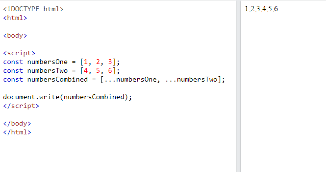
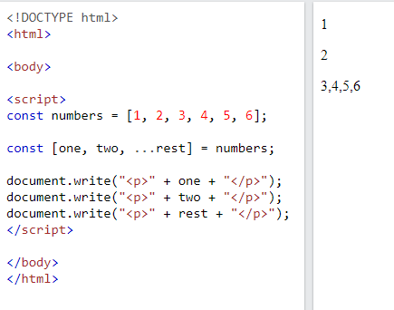

# Javascript ES6

**Content**

1\. let

2\. const

3\. Template Literals

4\. Arrow Functions

5\. Default Parameter Values

6\. For/Of Loop

7\. Promises

8\. Modules

8.1 Export

8.2 Import

9\. Async /await keywords

9.1 Async

9.2 Await

10\. Spread / rest operator

11\. References

# Javascript ES6

-   ECMAScript 2015 was the second major revision to JavaScript.
-   ECMAScript 2015 is also known as ES6 and ECMAScript 6.

# 1. let

-   The let keyword allows you to declare a variable with block scope.

**Example**

var x = 10;  
// Here x is 10  
{  
let x = 2;  
// Here x is 2  
}  
// Here x is 10

-   Read more about let [clickhere](https://www.w3schools.com/js/js_let.asp).

# 2. const

-   The const keyword allows you to declare a constant (a JavaScript variable with a constant value).
-   Constants are similar to let variables, except that the value cannot be changed.

**Example**

var x = 10;  
// Here x is 10  
{  
const x = 2;  
// Here x is 2  
}  
// Here x is 10

-   Read more about const [clickhere](https://www.w3schools.com/js/js_const.asp).

# 3. Template Literals

**Multiline Strings**

-   **Template literals** allows multiline strings:

**Example**

let text =  
\`The quick  
brown fox  
jumps over  
the lazy dog\`;

-   To know more information about template literals [clickhere](https://www.w3schools.com/js/js_string_templates.asp)

# 4. Arrow Functions

-   Arrow functions allows a short syntax for writing function expressions.
-   You don't need the function keyword, the return keyword, and the **curly brackets**.

**Example**

// ES5  
var x = function(x, y) {  
return x \* y;  
}

// ES6  
const x = (x, y) =\> x \* y;

-   Arrow functions do not have their own this. They are not well suited for defining **object methods**.
-   Arrow functions are not hoisted. They must be defined **before** they are used.
-   Using const is safer than using var, because a function expression is always a constant value.
-   You can only omit the return keyword and the curly brackets if the function is a single statement. Because of this, it might be a good habit to always keep them:

**Example**

const x = (x, y) =\> { return x \* y };

-   Learn more about Arrow Functions [clickhere](https://www.w3schools.com/js/js_arrow_function.asp).

# 5. Default Parameter Values

-   ES6 allows function parameters to have default values.

**Example**

function myFunction(x, y = 10) {  
// y is 10 if not passed or undefined  
return x + y;  
}  
myFunction(5); // will return 15

# 6. For/Of Loop

-   The JavaScript for/of statement loops through the values of an iterable objects.
-   for/of lets you loop over data structures that are iterable such as Arrays, Strings, Maps, NodeLists, and more.
-   The for/of loop has the following syntax:

**for (variable of iterable) {  
// code block to be executed  
}**

-   **variable** - For every iteration the value of the next property is assigned to the variable. *Variable* can be declared with const, let, or var.
-   *iterable* - An object that has iterable properties.

**Looping over an Array**

**Example**

const cars = ["BMW", "Volvo", "Mini"];  
let text = "";

for (let x of cars) {  
text += x + " ";  
}

**Looping over a String**

**Example**

let language = "JavaScript";  
let text = "";

for (let x of language) {  
text += x + " ";  
}

# 7. Promises

-   A Promise is a JavaScript object that links "Producing Code" and "Consuming Code".
-   "Producing Code" can take some time and "Consuming Code" must wait for the result.

**Promise Syntax**

const myPromise = new Promise(function(myResolve, myReject) {  
// "Producing Code" (May take some time)

myResolve(); // when successful  
myReject(); // when error  
});

// "Consuming Code" (Must wait for a fulfilled Promise).  
myPromise.then(  
function(value) { /\* code if successful \*/ },  
function(error) { /\* code if some error \*/ }  
);

**Example Using a Promise**

const myPromise = new Promise(function(myResolve, myReject) {  
setTimeout(function() { myResolve("I love You !!"); }, 3000);  
});

myPromise.then(function(value) {  
document.getElementById("demo").innerHTML = value;  
});

-   Learn more about Promises [clickhere](https://www.w3schools.com/js/js_promise.asp).

# 8. Modules

-   JavaScript modules allow you to break up your code into separate files.
-   This makes it easier to maintain the code-base.
-   JavaScript modules rely on the import and export statements.

# 8.1 Export

-   You can export a function or variable from any file.
-   Let us create a file named person.js, and fill it with the things we want to export.
-   There are two types of exports: Named and Default.

**8.1.1 Named Exports**

-   You can create named exports two ways. In-line individually, or all at once at the bottom.

**In-line individually**

person.js

export const name = "Jesse";  
export const age = 40;

**All at once at the bottom**

person.js

const name = "Jesse";  
const age = 40;

export {name, age};

**8.1.2 Default Exports**

-   Let us create another file, named message.js, and use it for demonstrating default export.
-   You can only have one default export in a file.

**Example**

message.js

const message = () =\> {  
const name = "Jesse";  
const age = 40;  
return name + ' is ' + age + 'years old.';  
};

export default message;

# 8.2 Import

-   You can import modules into a file in two ways, based on if they are named exports or default exports.
-   Named exports are constructed using curly braces. Default exports are not.

**Import from named exports**

-   Import named exports from the file person.js:

    import { name, age } from "./person.js";

**Import from default exports**

-   Import a default export from the file message.js:

import message from "./message.js";

**Note**

-   Modules only work with the HTTP(s) protocol.
-   A web-page opened via the file:// protocol cannot use import / export.

# 9. Async /await keywords

-   *"async and await make promises easier to write"*
-   **async** makes a function return a Promise
-   **await** makes a function wait for a Promise

# 9.1 Async

-   The keyword async before a function makes the function return a promise:

**Example**

async function myFunction() {  
return "Hello";  
}

# 9.2 Await

-   The keyword await before a function makes the function wait for a promise:

**Example-1**

let value = await promise;

-   The await keyword can only be used inside an async function.

**Example-2**

async function myDisplay() {  
let myPromise = new Promise(function(resolve, reject) {  
resolve("I love You !!");  
});  
document.getElementById("demo").innerHTML = await myPromise;  
}

myDisplay();

-   The two arguments (resolve and reject) are pre-defined by JavaScript.
-   We will not create them, but call one of them when the executor function is ready.
-   Very often we will not need a reject function.

# 10. Spread / rest operator

-   The JavaScript spread operator (...) allows us to quickly copy all or part of an existing array or object into another array or object.

**Example-1**

-   The spread operator is often used in combination with destructuring.

**Example-2**

-   Assign the first and second items from numbers to variables and put the rest in an array:

# 11. References

1.  https://www.w3schools.com/js/js_es6.asp
2.  https://www.w3schools.com/js/js_async.asp
3.  https://www.w3schools.com/REACT/react_es6_spread.asp
