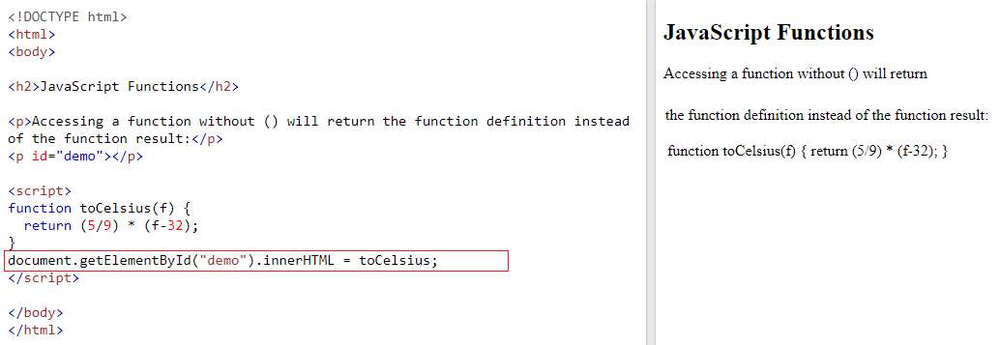

## JS Functions

**Contents**

## 1. JS Functions

-   A JavaScript function is a block of code designed to perform a particular task.
-   A JavaScript function is executed when "something" invokes it (calls it).

## 1.1 Why Functions needed?

You can reuse code: Define the code once, and use it many times.

You can use the same code many times with different arguments, to produce different results.

## 1.2 JS Function Declaration

-   A JavaScript function is defined with the function keyword, followed by a **name**, followed by parentheses **()**.
-   Function names can contain letters, digits, underscores, and dollar signs (same rules as variables).
-   The parentheses may include parameter names separated by commas:  
    **(parameter1, parameter2, ...)**
-   The code to be executed, by the function, is placed inside curly brackets: **{}**

**Syntax**

function function*name*(*parameter1, parameter2, parameter3*)

{  
// *code to be executed*  
}

-   Function **parameters** are listed inside the parentheses () in the function definition.
-   Function **arguments** are the **values** received by the function when it is invoked.
-   Inside the function, the arguments (the parameters) behave as local variables.
-   Semicolons are used to separate executable JavaScript statements.  
    Since a function **declaration** is not an executable statement, it is not common to end it with a semicolon.
-   A Function is much the same as a Procedure or a Subroutine, in other programming languages.
-   Declared functions are not executed immediately. They are "saved for later use", and will be executed later, when they are invoked (called upon).

**Example**

function myFunction(a, b)

{  
return a \* b;  
}

## 1.3 Function Invocation

The code inside the function will execute when "something" **invokes** (calls) the function:

-   When an event occurs (when a user clicks a button)
-   When it is invoked (called) from JavaScript code
-   Automatically (self invoked)

## 1.4 Function Return

-   When JavaScript reaches a return statement, the function will stop executing.
-   If the function was invoked from a statement, JavaScript will "return" to execute the code after the invoking statement.
-   Functions often compute a **return value**. The return value is "returned" back to the "caller":

**Example**

-   Calculate the product of two numbers, and return the result

**Example**

let x = myFunction(4, 3); // Function is called, return value will

end up in x  
function myFunction(a, b)

{  
return a \* b; // Function returns the product of a and b  
}

**Output**

The result in x will be:

12

## 1.5 Accessing a Function without () Operator

-   Accessing a function without () will return the function object instead of the function result.

**Example**

## 1.6 Functions Expressions

-   A JavaScript function can also be defined using an **expression**.
-   A function expression can be stored in a variable:

**Example-1**

const x = function (a, b) {return a \* b};

-   After a function expression has been stored in a variable, the variable can be used as a function:

**Example-2**

const x = function (a, b) {return a \* b};  
let z = x(4, 3);

-   The function above is actually an **anonymous function** (a function without a name).
-   Functions stored in variables do not need function names. They are always invoked (called) using the variable name.

**Note:**

-   The function above ends with a semicolon because it is a part of an executable statement.

## 1.7 Local Variables

-   Variables declared within a JavaScript function, become **LOCAL** to the function.
-   Local variables can only be accessed from within the function.

### Example

// code here can NOT use carName

function myFunction()

{  
let carName = "Volvo";  
// code here CAN use carName  
}

// code here can NOT use carName

-   Since local variables are only recognized inside their functions, variables with the same name can be used in different functions.
-   Local variables are created when a function starts, and deleted when the function is completed.

## References

1.  https://www.w3schools.com/js/js_functions.asp
