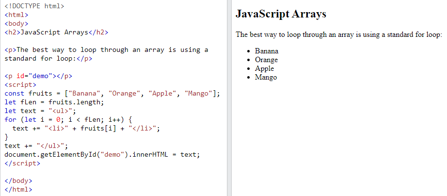
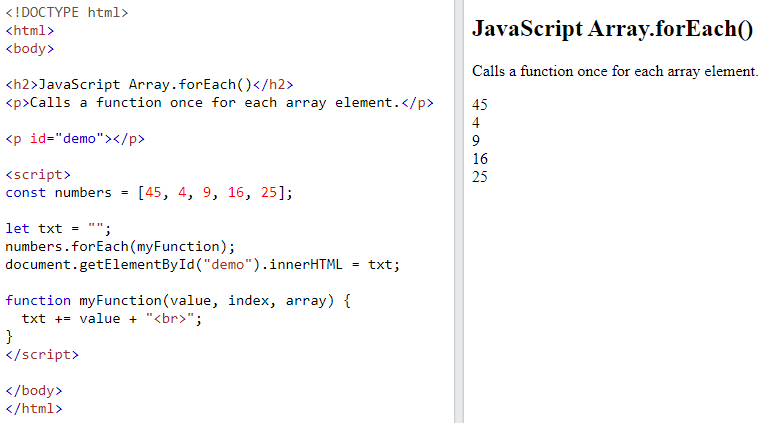
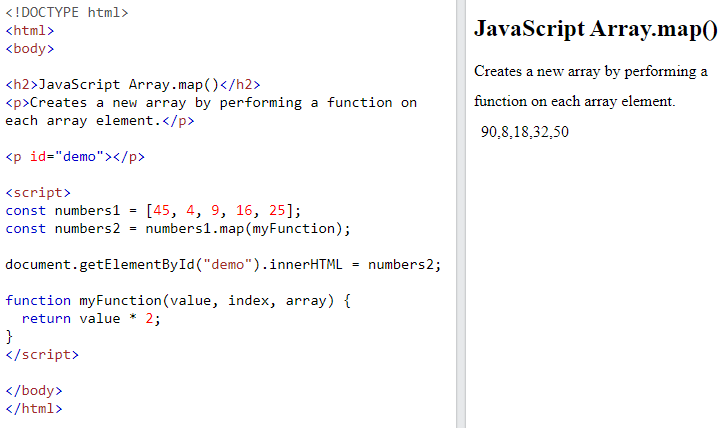
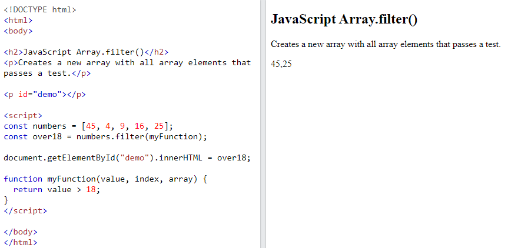
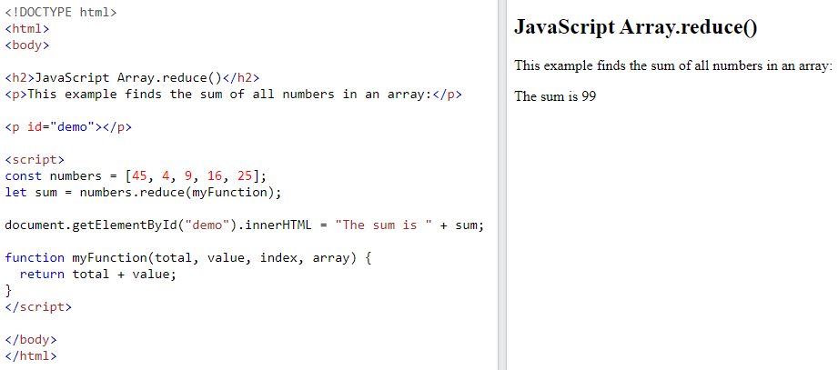

## JS Arrays

**Contents**

**1. JS Arrays**

1.1 Why Use Arrays?

1.2 Creating an Array

1.3 Using the JavaScript Keyword new

1.4 Accessing Array Elements

1.5 Changing an Array Element

1.6 Access the Full Array

**2. JS Arrays are Objects**

2.1 Array Elements Can Be Objects

2.2 The Difference between Arrays and Objects

2.3 When to Use Arrays. When to use Objects.

**3. JS Array Properties**

3.1 The length Property

**4. JS Array Iteration**

4.1 JS Array for()

4.2 JS Array forEach()

4.3 JS Array map()

4.4 JS Array filter()

4.5 JS Array reduce()

**3. JS Array Methods**

**4. JS Sort**

**5. References**

## 1. JavaScript Arrays

-   An array is a special variable, which can hold more than one value.

## 1.1 Why Use Arrays?

-   If you have a list of items (a list of car names, for example), storing the cars in single variables could look like this:

let car1 = "Saab";  
let car2 = "Volvo";  
let car3 = "BMW";

**However, what if you want to loop through the cars and find a specific one? And what if you had not 3 cars, but 300?**

-   The solution is an **array!**
-   An array can hold many values under a single name, and you can access the values by referring to an index number.

## 1.2 Creating an Array

-   Using an array literal is the easiest way to create a JavaScript Array.

**Syntax:**

const *array_name* = [*item1*, *item2*, ...];

-   It is a common practice to declare arrays with the const keyword.

**Example**

const cars = ["Saab", "Volvo", "BMW"];

-   Spaces and line breaks are not important. A declaration can span multiple lines.

**Example**

const cars = [  
"Saab",  
"Volvo",  
"BMW"  
];

-   You can also create an array, and then provide the elements.

**Example**

const cars = [];  
cars[0]= "Saab";  
cars[1]= "Volvo";  
cars[2]= "BMW";

## 1.3 Using the JavaScript Keyword new

-   The following example also creates an Array, and assigns values to it:

**Example**

const cars = new Array("Saab", "Volvo", "BMW");

-   The two examples above do exactly the same.
-   There is no need to use new Array().
-   For simplicity, readability and execution speed, use the array literal method.

## 1.4 Accessing Array Elements

-   Accessing an array element by referring to the **index number**.

**Example**

const cars = ["Saab", "Volvo", "BMW"];  
let car = cars[0];

**Note:**

-   Array indexes start with 0.
-   [0] is the first element.
-   [1] is the second element.

## 1.5 Changing an Array Element

-   This statement changes the value of the first element in cars:

**Example**

const cars = ["Saab", "Volvo", "BMW"];  
cars[0] = "Opel";

## 1.6 Access the Full Array

-   With JavaScript, the full array can be accessed by referring to the array name:

**Example**

const cars = ["Saab", "Volvo", "BMW"];  
document.getElementById("demo").innerHTML = cars;

## 2. JS Arrays are Objects

-   Arrays are a special type of objects.
-   Arrays use **numbers** to access its "elements".

    **Array:** const person = ["John", "Doe", 46];

-   In this example, person[0] returns John:
-   Objects use **names** to access its "members".

    **Object:** const person = {firstName:"John", lastName:"Doe", age:46};

-   In this example, person.firstName returns John:

## 2.1 Array Elements Can Be Objects

-   JavaScript variables can be objects. Arrays are special kinds of objects.
-   Because of this, you can have variables of different types in the same Array.
-   You can have objects in an Array. You can have functions in an Array. You can have arrays in an Array:

**Example:**

myArray[0] = Date.now;  
myArray[1] = myFunction;  
myArray[2] = myCars;

## 2.2 The Difference between Arrays and Objects

-   In JavaScript, **arrays** use **numbered indexes**.
-   In JavaScript, **objects** use **named indexes**.

## 2.3 When to Use Arrays. When to use Objects.

-   You should use **objects** when you want the element names to be **strings (text)**.
-   You should use **arrays** when you want the element names to be **numbers**.

## 3. JS Array Properties

-   The real strength of JavaScript arrays are the built-in array properties

## 3.1 The length Property

-   The length property of an array returns the length of an array (the number of array elements).

**Example:**

const fruits = ["Banana", "Orange", "Apple", "Mango"];  
let length = fruits.length;

**Output:** 4

**Note:** The length property is always one more than the highest array index.

# 4. JS Array Iteration

## 4.1 JS Array for()

-   Array iteration methods operate on every array item.
-   One way to loop through an array, is using a **for loop:**

**Example**

****

## 4.2 JS Array forEach()

-   The forEach() method calls a function (a callback function) once for each array element.

E**xampl**e

Note that the function takes 3 arguments:

-   The item value
-   The item index
-   The array itself

## 4.3 JS Array map()

-   The map() method creates a new array by performing a function on each array element.
-   The map() method does not execute the function for array elements without values.
-   The map() method does not change the original array.
-   This example multiplies each array value by 2:

**Example**

## 

## 4.4 JS Array filter()

-   The filter() method creates a new array with array elements that passes a **test.**
-   Example creates a new array from elements with a value larger than 18:

**Example**

## 

## 4.5 JS Array reduce()

-   The reduce() method runs a function on each array element to produce (reduce it to) a single value.
-   The reduce() method works from left-to-right in the array.
-   The reduce() method does not reduce the original array.

**Example:** finds the sum of all numbers in an array:

**Note:** The function takes 4 arguments:

-   The total (the initial value / previously returned value)
-   The item value
-   The item index
-   The array itself

# 5. JavaScript Array Methods

## Popping and Pushing

When you work with arrays, it is easy to remove elements and add new elements.

This is what popping and pushing is:

Popping items **out** of an array, or pushing items **into** an array.

## JavaScript Array pop()

The pop() method removes the last element from an array:

### Example

const fruits = ["Banana", "Orange", "Apple", "Mango"];  
fruits.pop();

The pop() method returns the value that was "popped out":

### Example

const fruits = ["Banana", "Orange", "Apple", "Mango"];  
let fruit = fruits.pop();

## JavaScript Array push()

The push() method adds a new element to an array (at the end):

### Example

const fruits = ["Banana", "Orange", "Apple", "Mango"];  
fruits.push("Kiwi");

The push() method returns the new array length:

### Example

const fruits = ["Banana", "Orange", "Apple", "Mango"];  
let length = fruits.push("Kiwi");

## JavaScript Array delete()

### Warning !

Array elements can be deleted using the JavaScript operator delete.

Using delete leaves undefined holes in the array.

Use pop() or shift() instead.

### Example

const fruits = ["Banana", "Orange", "Apple", "Mango"];  
delete fruits[0];

## Merging (Concatenating) Arrays

The concat() method creates a new array by merging (concatenating) existing arrays:

### Example (Merging Two Arrays)

const myGirls = ["Cecilie", "Lone"];  
const myBoys = ["Emil", "Tobias", "Linus"];

const myChildren = myGirls.concat(myBoys);

# The concat() method does not change the existing arrays. It always returns a new array.

## Splicing and Slicing Arrays

The splice() method adds new items to an array.

The slice() method slices out a piece of an array.

## JavaScript Array splice()

The splice() method can be used to add new items to an array:

### Example

const fruits = ["Banana", "Orange", "Apple", "Mango"];  
fruits.splice(2, 0, "Lemon", "Kiwi");

The first parameter (2) defines the position **where** new elements should be **added** (spliced in).

The second parameter (0) defines **how many** elements should be **removed**.

The rest of the parameters ("Lemon" , "Kiwi") define the new elements to be **added**.

The splice() method returns an array with the deleted items:

### Example

const fruits = ["Banana", "Orange", "Apple", "Mango"];  
fruits.splice(2, 2, "Lemon", "Kiwi");

## Using splice() to Remove Elements

With clever parameter setting, you can use splice() to remove elements without leaving "holes" in the array:

### Example

const fruits = ["Banana", "Orange", "Apple", "Mango"];  
fruits.splice(0, 1);

The first parameter (0) defines the position where new elements should be **added** (spliced in).

The second parameter (1) defines **how many** elements should be **removed**.

The rest of the parameters are omitted. No new elements will be added.

## JavaScript Array slice()

The slice() method slices out a piece of an array into a new array.

This example slices out a part of an array starting from array element 1 ("Orange"):

### Example

const fruits = ["Banana", "Orange", "Lemon", "Apple", "Mango"];  
const citrus = fruits.slice(1);

## Note

The slice() method creates a new array.

The slice() method does not remove any elements from the source array.

This example slices out a part of an array starting from array element 3 ("Apple"):

### Example

const fruits = ["Banana", "Orange", "Lemon", "Apple", "Mango"];  
const citrus = fruits.slice(3);

The slice() method can take two arguments like slice(1, 3).

The method then selects elements from the start argument, and up to (but not including) the end argument.

### Example

const fruits = ["Banana", "Orange", "Lemon", "Apple", "Mango"];  
const citrus = fruits.slice(1, 3);

If the end argument is omitted, like in the first examples, the slice() method slices out the rest of the array.

### Example

const fruits = ["Banana", "Orange", "Lemon", "Apple", "Mango"];  
const citrus = fruits.slice(2);

## Automatic toString()

JavaScript automatically converts an array to a comma separated string when a primitive value is expected.

This is always the case when you try to output an array.

These two examples will produce the same result:

### Example

const fruits = ["Banana", "Orange", "Apple", "Mango"];  
document.getElementById("demo").innerHTML = fruits.toString();

### Example

const fruits = ["Banana", "Orange", "Apple", "Mango"];  
document.getElementById("demo").innerHTML = fruits;

## Note

All JavaScript objects have a toString() method.

## Finding Max and Min Values in an Array

There are no built-in functions for finding the highest or lowest value in a JavaScript array.

# JavaScript Sorting Arrays

## Sorting an Array

The sort() method sorts an array alphabetically:

### Example

const fruits = ["Banana", "Orange", "Apple", "Mango"];  
fruits.sort();

## Reversing an Array

The reverse() method reverses the elements in an array.

You can use it to sort an array in descending order:

### Example

const fruits = ["Banana", "Orange", "Apple", "Mango"];  
fruits.sort();  
fruits.reverse();

https://www.w3schools.com/js/js_arrays.asp
