## Linux/Unix File Commands Using Git Bash

## What is Linux/Unix?

## What is Git?

-   [**Git**](https://phoenixnap.com/kb/what-is-git) is a version control system.

## What is Git Bash?

-   **Git Bash** is a Microsoft Windows application with a Git command-line interface.

## What is Bash?

-   Bash is an acronym for Bourne Again Shell, which is a GNU Project shell.
-   A shell is used to interface with an operating system by executing commands, and Bash is the default shell used on Linux and macOS.

## How to Install and Set Up Git Bash?

# Linux File Command Using Git Bash

-   **File Command** is used to determine the file type.
-   It does not care about the extension used for file.
-   File management commands that will help you create and manage your files on your system.

The following are the top Linux commands:

# 1. pwd Command

-   **pwd**, short for the [print working directory](https://www.tecmint.com/pwd-command-examples/), is a command that prints out the current working directory in a hierarchical order, beginning with the topmost root directory ( / ).

    **Syntax:** pwd

    **Output:**

**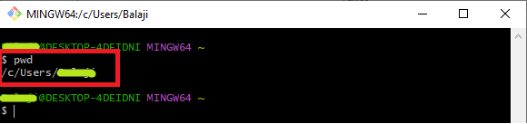**

# 2. mkdir Command

-   To create a new directory use the **mkdir** ( **make directory**) command

**Syntax:** mkdir directory_name

**Output:**

**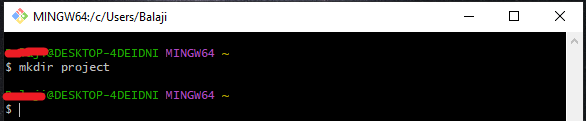**

# 3. cd Command

-   To change or navigate directories, use the [cd command](https://www.tecmint.com/cd-command-in-linux/) which is short for change directory.

**Syntax: cd directory_name**

**Output:**

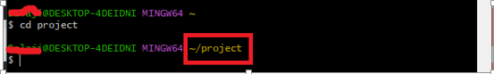

-   To go a directory up append two dots or periods in the end.

**Syntax:** cd ..

**Output:**

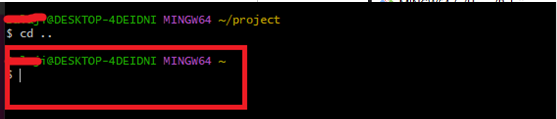

-   To go back to the home directory run the cd command without any arguments.

**Syntax:** cd

**Output:**

**NOTE**: To navigate into a subdirectory or a directory within your current directory, don’t use a forward slash ( / ) simply type in the name of the directory.

# 4. Touch Command

-   The [touch command](https://www.tecmint.com/8-pratical-examples-of-linux-touch-command/) is used for creating simple files on a Linux system.

    **Syntax:** touch file_name

**Output:**

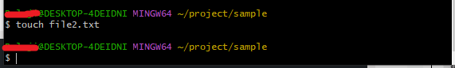

# 5. ls Command

-   The ls command is a command used for listing existing files or folders in a directory.

**Syntax:** ls

**Output:**

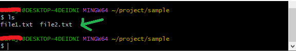

-   To list more information append the -lh flag as shown. The -l option stands for long listing and prints out additional information such as file permissions, user, group, file size, and date of creation. The -h flag prints out the file or directory size in a human-readable format.

**Syntax:** ls –lh

**Output:**

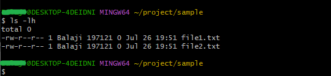

# 6. cat Command

-   To view the contents of a file, use the [cat command](https://www.tecmint.com/13-basic-cat-command-examples-in-linux/) as follows:

**Syntax:** cat file_name

**Output:**

**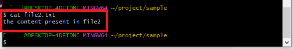**

# 7. cp Command

-   The cp command, short for copy.
-   Copies a file from one file location to another.
-   Unlike the move command, the **cp** command retains the original file in its current location and makes a duplicate copy in a different directory.

**Syntax:** cp file_name destination_path

**Output:**

**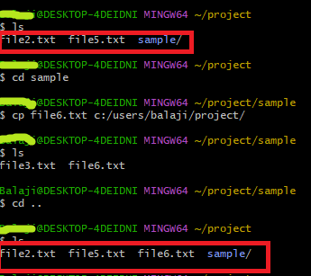**

# 8. rmdir Command

-   The **rmdir** command deletes an empty directory.

**Syntax:** rmdir directory_name

**Output:**

****

-   If you try to remove a non-empty directory, you will get an error message as shown.

**Output:**

**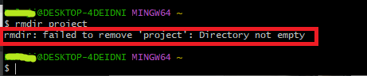**

# 9. find Commands

-   Sometimes, you may want to search the location of a particular file. You can easily do this using either the [**find**](https://www.tecmint.com/35-practical-examples-of-linux-find-command/) or **locate** commands.
-   The [find command](https://www.tecmint.com/find-files-quickly-in-linux-terminal/) searches for a file in a particular location and takes two arguments: the search path or directory and the file to be searched.

**Syntax:** find path -name filename

**Output:**

****

# 10. locate Commands

-   The **locate** command searches using a database of all the possible files and directories in the system
-   The **locate** command, just like the **find** command, plays the same role of searching files but only takes one argument as shown.

**Syntax:** locate filename

**Output:**

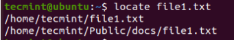

**NOTE**: The **locate** command is much faster than the **find** command. However, the **find** command is much more powerful and works in situations where **locate** does not produce the desired results.

# References:

<https://www.tecmint.com/linux-file-management-commands/>

https://www.javatpoint.com/linux-commands
