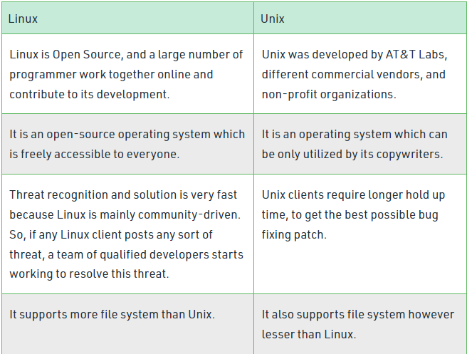
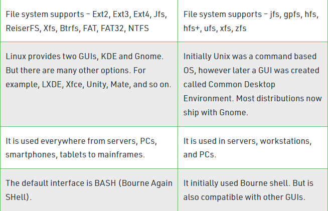
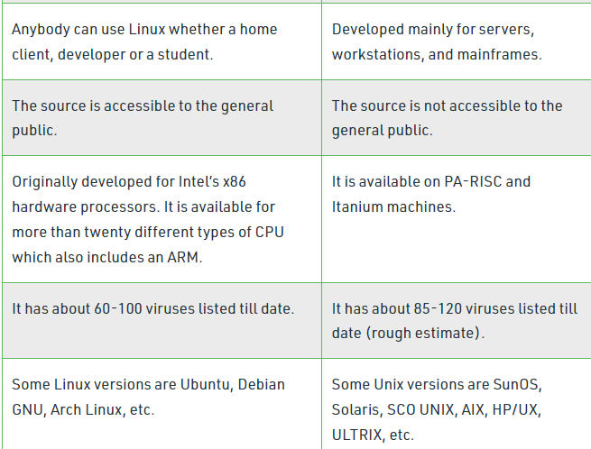

## Linux

-   Linux is an open source multi-tasking, multi-user operating system.
-   It was developed by Linus Torvalds in 1991.
-   Linux OS is widely used in desktops, mobiles, mainframes etc.

## Unix

-   Unix is multi-tasking, multi-user operating system but is not free to use and is not open source.
-   It was developed in 1969 by Ken Thompson team at AT&T Bell Labs.
-   It is widely used on servers, workstations etc.

## Structure of Linux and Unix

## Difference between Linux and Unix

