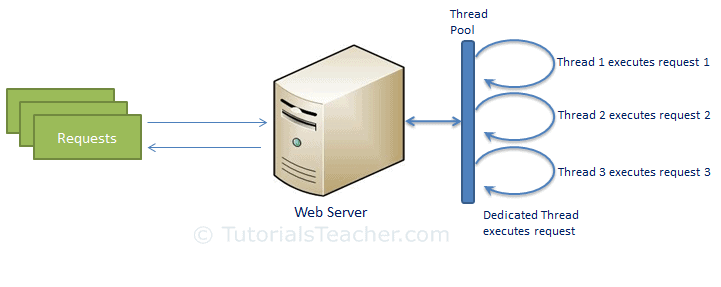
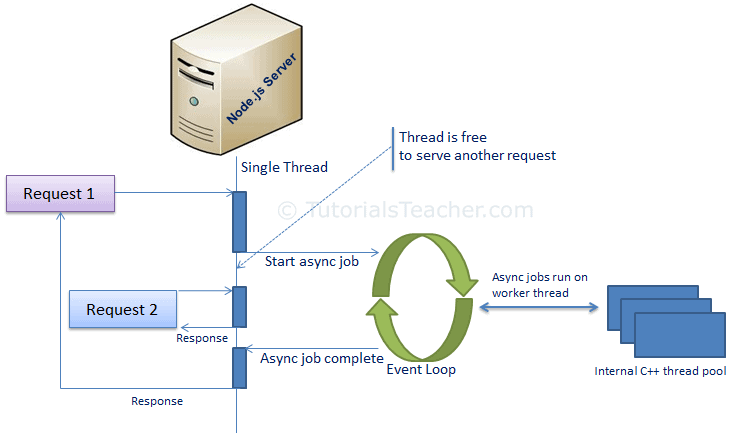

# Contents

1.  What is Node.js?

2.  Advantages of Node.js

3.  Process Model

    1.  Traditional Web Server Model

    2.  Node.js Process Model

# What is Node.js?

-   Node.js is an open-source server side runtime environment built on Chrome's V8 JavaScript engine.

-   It provides an event driven, non-blocking (asynchronous) I/O and cross-platform runtime environment for building highly scalable server-side application using JavaScript.

-   Node.js can be used to build different types of applications such as command line application, web application, real-time chat application, REST API server etc.

-   However, it is mainly used to build network programs like web servers, similar to PHP, Java, or ASP.NET.

-   Node.js was written and introduced by Ryan Dahl in 2009. Visit [Wikipedia](https://en.wikipedia.org/wiki/Node.js) to know the history of Node.js.

-   Node.js official web site: [https://nodejs.org](https://nodejs.org/)

-   Node.js on github: <https://github.com/nodejs/node>

-   Node.js community conference [http://nodeconf.com](http://nodeconf.com/)

# Advantages of Node.js

1.  Node.js is an open-source framework under MIT license. (MIT license is a free software license originating at the Massachusetts Institute of Technology (MIT).)

2.  Uses JavaScript to build entire server side application.

3.  Lightweight framework that includes bare minimum modules. Other modules can be included as per the need of an application.

4.  Asynchronous by default. So it performs faster than other frameworks.

5.  Cross-platform framework that runs on Windows, MAC or Linux

# Node.js Process Model

Let’s undergithubstand the Node.js process model and understand why we should use Node.js.

## 3.1. Traditional Web Server Model

-   In the traditional web server model, each request is handled by a dedicated thread from the thread pool.

-   If no thread is available in the thread pool at any point of time then the request waits till the next available thread.

-   Dedicated thread executes a particular request and does not return to thread pool until it completes the execution and returns a response.

Traditional Web Server Model

## Node.js Process Model

-   Node.js processes user requests differently when compared to a traditional web server model.

-   Node.js runs in a single process and the application code runs in a single thread and thereby needs less resources than other platforms.

-   All the user requests to your web application will be handled by a single thread and all the I/O work or long running job is performed asynchronously for a particular request.

-   So, this single thread doesn't have to wait for the request to complete and is free to handle the next request.

-   When asynchronous I/O work completes then it processes the request further and sends the response.

-   An event loop is constantly watching for the events to be raised for an asynchronous job and executing callback function when the job completes.

-   Internally, Node.js uses libev for the event loop which in turn uses internal C++ thread pool to provide asynchronous I/O.

-   The following figure illustrates asynchronous web server model using Node.js.

Node.js Process Model

-   Node.js process model increases the performance and scalability with a few caveats.

    

-   Node.js is not fit for an application which performs CPU-intensive operations like image processing or other heavy computation work because it takes time to process a request and thereby blocks the single thread.
